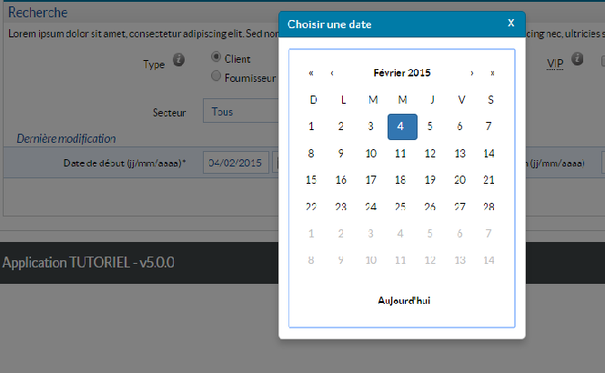
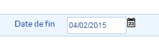

# Le composant calendrier

Manuel d'utilisation du calendrier Hornet.

## Description
Le composant calendrier, aussi appelé `DatePickerField`, associe une zone de saisie de date avec un calendrier. Le calendrier est accessible en cliquant sur une icône située à droite du champ de saisie.

Champ de saisie avec un calendrier affiché:



Le calendrier s'affiche alors en surimpression de la page HTML sans perturber le rendu.

Champ de saisie avec un calendrier caché:



L'assemblage fait par ce composant a pour but :

- de standardiser les libellés en français par défaut,
- de formater les dates et les zones de saisie selon les conventions françaises par défaut,
- d’ajouter des boutons et événements pour réinitialiser ou fermer la boite de dialogue.
- de gérer le composant lorsque le code HTML est généré sur le serveur (saisie seule) ou par le navigateur (saisie et sélection dans le calendrier)

La calendrier utilisé s'appuie sur le composant `'rc-calendar'` disponible sous [GitHub](https://github.com/yiminghe/learning-react/tree/master/example/rc-calendar).

## Utilisation

Le composant calendrier est utilisable dans un formulaire.

```javascript
var HornetDatePickerField = require('hornet-js-components/src/calendar/date-picker-field');

 var form = newforms.Form.extend({
        startDate: HornetDatePickerField({
            label: "Date de début",
            title: "Sélection d'une date de début",
            required: true,
            inputFormats: ["%d/%m/%Y", "%d-%m-%Y"],
            errorMessages: {
                required: "Le champ « Date de début » est obligatoire. Veuillez saisir ce champ.",
                invalid: "Le format du champ « Date de début » est incorrect."
            }
        }),
         [....]
```

Descriptif des attributs du composant HornetDatePickerField :

| attribut | description | valeur par défaut |
| -------- | ----------- | ----------------- |
| label | Libellé du champ de saisie de date |  |
| title | Libellé utilisé comme texte alternatif à l'image du bouton d'ouverture de calendrier  |  |
| required | Indique si la saisie du champ est obligatoire pour valider le formulaire | false |
| inputFormats | Liste de formats de saisie de date au formats newforms (ex. \["%d/%m/%Y","%d-%m-%Y"\] ) | valeur de calendar.dateFormat dans messages.json |
| defaultYear | Année à utiliser lorsque le format de saisie n'inclut pas l'année | Année de la date du jour |
| errorMessages | Messages d'erreur de validation du champ :  - "required : message" pour le cas où le champ est obligatoire et qu'il n'a pas été saisi.  - "invalid: message" pour le cas où la saisie ne respecte pas le format spécifié |  |
[Calendrier - attributs]