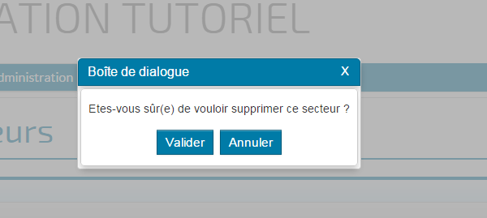

# Le composant Alert

## Description

Le composant Alert affiche un message avec une demande de confirmation par l'utilisateur (boutons `valider` et `annuler`).



HornetAlert reprend le comportement et donc les principes de HornetModal.

## Utilisation

Nous retrouvons donc les attributs: isVisible, onClickClose, onClickOutsideDialog et className.

Importer le composant:

```javascript
var HornetAlert = require('hornet-js-components/src/dialog/alert');
```

Dans l'exemple suivant, la popup affiche un formulaire et ses boutons.
 
```javascript
   <HornetAlert message={intlMessages.confirmationSuppression} isVisible={this.state.isOpenAlertDelete}
                     onClickOk={this._supprimer} onClickCancel={this._closeMessageSupprimer} onClickClose={this._closeMessageSupprimer}
    />
```

Les attributs ajoutés ou modifiés par rapport à HornetAlert:

| attribut | obligatoire | description |
| -------- | ----------- | ----------- |
| onClickClose | | Passer la méthode à appeler lorsque l'utilisateur clique sur la croix (en haut à droite) ou sur le bouton `Annuler`  |
| onClickOk| | Passer la méthode à appeler  lorsque l'utilisateur clique sur le bouton `Valider`|
| message| X | Message affiché dans la popup
[HornetAlert - exemple]

