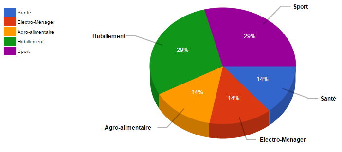

# Le composant Graphique Camembert

## Description

Le composant affiche un camembert avec un effet de perspective. En fonction des données les secteurs du camembert sont ajustés.
Le composant affiche également une légende des couleurs ainsi qu'une légende sur les secteurs.



## Utilisation

| attibut   | description                                                                     |
| --------- | ------------------------------------------------------------------------------- |
| data      | Données du graphique (tableau d'objets avec les attibuts label, value et color) |
| messages  | Message du graphique (title et description)                                     |
[HornetChartDonut - attributs]


Le composant doit être initialisé avec des données comme suit :

```javascript
var datas = [
    {label: "Agro-alimentaire", value: "16", color: "#3366CC"},
    {label: "Electro-ménager", value: "16", color: "#DC3912"},
    {label: "Habillement", value: "29", color: "#FF9900"},
    {label: "Santé", value: "16", color: "#109618"},
    {label: "Sport", value: "20", color: "#990099"}
]
```

et ex messages : 

```javascript
var messages = {
    "title": "Répartition des secteurs sous forme d'un graphique",
    "description": "Représentation graphique de la répartition des secteurs"
}
```

```javascript
var HornetChartDonut = require('hornet-js-components/src/chart/chart-donut');
//
```

Il est rendu comme ceci :

```javascript
//render
<HornetChartDonut data={datas} messages={messages}/>
```


