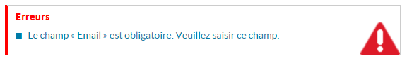

# Le composant Notification

## Description

Le composant permet d'afficher des messages d'erreurs ou d'informations.



## Utilisation

Le Composant Notification sert à afficher les messages d'erreurs provenant du Store `NotificationStore`.

| attibut     | description                                                        | valeur par défaut                     |
| ----------- | ------------------------------------------------------------------ | ------------------------------------- |
| isModal     | la notification est elle de type modale                            |                                       |
| errorsTitle | titre de la section des erreurs                                    | this.i18n("notification.errorsTitle") |
| infosTitle  | titre de la section des informations                               | this.i18n("notification.infosTitle")  |
[HornetNotification - attributs]

```javascript
var HornetNotification = require('hornet-js-components/src/notification/notification');

React.createClass({
	...
	render: function () {
	    ...
	    return (
	        <div>
	            <HornetNotification/>
	        </div>
	    )
	}
	...
}
```
