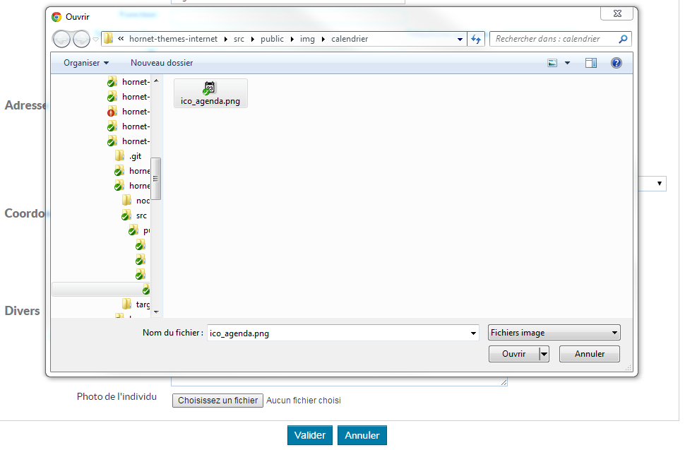

# Le composant Upload

Ce composant permet de télécharger un fichier vers le serveur et d'afficher ce fichier dans la page rendue sur le navigateur soit sous forme d'une image soit sous la forme d'un lien vers ce fichier dans le cas où il ne s'agit pas d'une image.

## Description 

Le composant `Upload` d'un fichier, est utilisé dans un formulaire. 
Lorsque le formulaire est en édition, il permet de sélectionner un fichier à partir d'une champ input de type `file` et lors de la validation du formulaire le fichier est envoyé sur le serveur Node.
Si un fichier est présent à l'initialisation du formulaire, mode consultation ou édition , le composant affiche le fichier.

Champ de sélection d'un fichier (Formulaire en édition):



## Utilisation

### Définir un champ upload dans le formulaire
Cas d'un upload de fichier.
Le composant est utilisable dans un formulaire. Le champ à définir doit posséder un attribut: `fileRoute`.
Cette route est utilisé pour afficher l'image (utilisation d'un balise IMG) ou bien un lien vers le fichier.

```javascript
 var form = forms.Form.extend({
     fichier: FileField(
        {
            required: false,
            label: intlMessages.fields.photo.selection,
            helpText: intlMessages.fields.photo.help,
            fileRoute:'/partenaires/photo/',
            fileTitle: intlMessages.fields.photo.altImage,
            accept: ['png', 'jpg'] /* Paramètre à définir dans le cas d'une image uniquement, à retirer sinon */
        }

    }),
     [....]
    new form(configForm)
```

#### Remarque
Si le MimeType du fichier est une image le rendu sera de type `` sinon le rendu sera de type `<a>`. 

### Envoie des données vers le serveur

Le fichier doit être envoyé en "multipart" vers le serveur Node.

Exemple dans le service d'envoie des données:

```javascript
 // On est sur le navigateur, on va encoder le POST en multipart et transférer le corps en JSON et l'image dans un "part" séparé
request.field('content', JSON.stringify(sendPart));
if (sendPart.photo) {
    request.attach('photo', sendPart.photo, sendPart.photo.name);
}
```

### Récupération du fichier côté serveur Node lors de la validation du formulaire

Le module npm [multer](https://www.npmjs.com/package/multer) prend en charge le fichier uploadé.

Lors de la validation du formulaire, le fichier sélectionné par l'utilisateur est accessible dans un tableau appelé `files` et placé dans l'objet `request` par `multer`.

```javascript
//récupère un input photo:
 var maPhoto = request.files['photo']
```


### Définition de la route qui envoie le fichier vers le navigateur

Le composant crée une balise IMG en pointant vers une route que vous devez définir. L'id est passé par défaut par le composant

```javascript
 match('/photo/:id', (context, id) => {
            logger.info('routes partenaires Récupération PHOTO ROUTER DATA', id);
            return {
                actions: [
                    new FichePartenairesAction.LirePhoto().withPayload({
                        idPhoto: id
                    }),
                ]
            }
        });
```

L'action doit écrire dans le résultat de sortie un objet de type `Image` pour indiquer au router-data de fournir une image au navigateur.

```javascript
import Image = require('hornet-js-core/src/data/file');
export class LirePhoto extends Action<ActionsChainData> {
    execute(resolve, reject) {
        var photo = new Image();
        photo.buffer = res.body.buffer; 
        photo.id ='id de la photo';
        photo.name ='maPhoto';
        photo.mimeType ='mimeType de l image';
        this.actionChainData.result = photo;
    }
}
```

