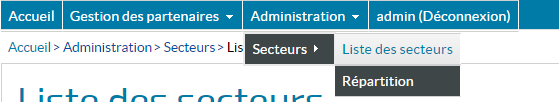
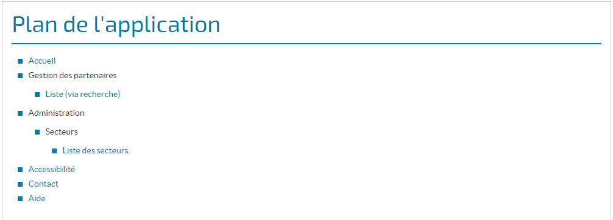

# Les composants de navigation

Ce chapitre décrit les composants de navigation de l'application:

 - le menu
 - le fil d'Ariane
 - le plan du site

Des balises représentant ces éléments génèrent le code html à partir d'un store qui contient les données de navigation.

## Principe : un store pour les composants de navigation

Pour tous ces composants, il est nécessaire de fournir le Store dit de navigation.
Ce `store` fournit aux composants de navigation la méthode `getConfigMenu` renvoyant la configuration des éléments de navigation, issue du fichier navigation.json.


## Configuration des éléments au format JSON
Des attributs décrivent chaque élément de navigation :

 - `text` : le libellé de l'élément, ou de préférence la clé de message internationalisé correspondant au libellé
 - `url` : route de l'élément de navigation. Ne pas renseigner par exemple pour un élément de menu ayant des sous-menus.
 - `visibleDansMenu` true/false : indique si l'élément doit apparaître dans le menu
 - `visibleDansPlan` true/false : indique si l'élément doit apparaître dans le plan de l'application
 - `submenu` : tableau contenant les éléments fils
 - `rolesAutorises` : tableau de nom de rôles. L'utilisateur doit avoir au moins un rôle du tableau pour que l'élément soit visible.

Exemple de fichier de configuration JSON avec deux éléments de menu, dont un contenant un sous-menu :
 
```json
{
  "menu": [
    {
      "text": "navigation.welcome",
      "url": "/accueil",
      "visibleDansMenu": true,
      "visibleDansPlan": true
    },
    {
      "text": "navigation.partenaire.gestionDesPartenaires",
      "visibleDansMenu": true,
      "rolesAutorises": [
        "AppliTuto_USER",
        "AppliTuto_ADMIN"
      ],
      "submenu": [
        {
          "text": "navigation.partenaire.listeViaRecherche",
          "title": "navigation.partenaire.listeViaRecherche",
          "url": "/partenaires",
          "visibleDansMenu": true,
          "visibleDansPlan": true,
          "rolesAutorises": [
            "AppliTuto_USER",
            "AppliTuto_ADMIN"
          ],
        }
    }
}
```

## Menu

### Principes

Le composant `Menu` parse le flux JSON retourné par la méthode `getConfigMenu` du store `Navigation`.

Il génère des balises `ul` et `li` qui seront affichées ou cachées selon des sélecteurs CSS.

Note : si une entrée est masquée car l'utilisateur connecté n'a pas les droits suffisants, toutes ses sous-entrées sont automatiquement masquées.

#### Eléments complémentaires

Des éléments de menu non configurés par le store de navigation peuvent être ajoutés grâce au composant menu-infos-complementaires. Dans l'application tutoriel, c'est l'élément de menu de déconnexion qui est ajouté de cette façon à la fin du menu.

### Aperçu



### Utilisation

```xml
    <HornetMenu store={NavigationStore}>
        <MenuInfosComplementaires>
            <div className="info">
                <MenuLink item={this._getMenuItemAuth()} dataPassThru={true}/>
            </div>
        </MenuInfosComplementaires>
    </HornetMenu>
```

Descriptif des attributs du menu :

| attribut                | description                                                                                    |
| ----------------------- | ---------------------------------------------------------------------------------------------- |
| store                   | Classe du "store" contenant la configuration de la navigation                                  |
[HornetMenu - attributs]

## Plan de l'application

### Principe

Le composant `plan de l'application` parse le flux JSON retourné par la méthode `getConfigMenu` du store `Navigation`.

Il génère le code HTML décrivant les pages de l'application.

Note: Si une entrée est masquée, car l'utilisateur actuel n'a pas les droits suffisants, toutes ses sous-entrées sont automatiquement masquées.

### Aperçu



### Utilisation

```xml
    <HornetPlan store={NavigationStore}/>
```

Descriptif des attributs du plan :

| attribut                | description                                                             |
| ----------------------- | ----------------------------------------------------------------------- |
| store                   | Classe du "store" contenant la configuration de la navigation           |
[HornetPlan - attributs]

## File d'Ariane

### Principes

Le composant `fil d'ariane` écoute le store `PageInformation` pour mettre à jour son affichage selon la page courante. Il se base sur le store de navigation pour déterminer la place de la page courante dans la hiérarchie des éléments de navigation.

### Aperçu


### Utilisation

```xml
     <HornetBreadCrumb store={NavigationStore}/>
```

Descriptif des attributs du fil d'Ariane :

| attribut                | description                                                                  |
| ----------------------- | ---------------------------------------------------------------------------- |
| store                   | Classe du "store" contenant la configuration de la navigation                |
[Fil d'Ariane - attributs]
