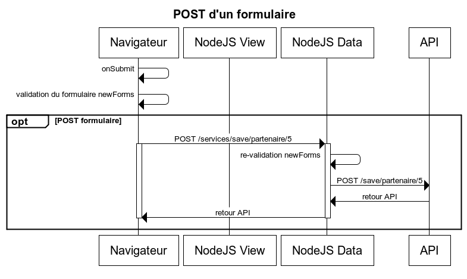

# Intégration de services REST

## Les routes et les actions

Selon le pattern flux, les actions dispatchent des évènements sur les stores dont les vues sont à l'écoute.

Les routes peuvent être de 2 types : les routes **vues** et les routes **data**.

Ainsi les routes **vues** sont réprésentatives de la navigation et rendent des composants React, sur le navigateur, ou retournent une page HTML, sur le serveur NodeJS.
Les routes **data** sont utilisées pour les appels de services et retournent des données json (ou flux binaires, type pdf).

La double validation se fait au niveau des routes **data** avant l'appel du service.




Exemple de déclaration des routes :

```javascript
export class ContactRoutes implements IRoutes.IRoutesBuilder {
    buildViewRoutes(match:IRoutes.MatchViewFn) {
        match('/', () => {
            return {
                composant: contactPage
            }
        });
    }
    buildDataRoutes(match:IRoutes.MatchDataFn){
        match('/envoyer', (context) => {
            var formData = context.req.body;
            return {
                actions: [
                     new fvaNS.FormValidationAction()
                      .withApplicationForm(<fvaNS.NewsFormValidation> ContactForm({data: formData},
                        context.actionContext.i18n('contactPage.form')))
                      .dispatchIfFormNotValid('CONTACT_RECEIVE_FORM_DATA');
                    ,new actionsContact.Send().withPayload(formData)
                ]
            };
        }, "post");
    }
}
```

## Action

```javascript
///<reference path='../../../node_modules/hornet-js-ts-typings/definition.d.ts'/>
"use strict";
import utils = require('hornet-js-utils');
import Action = require('hornet-js-core/src/actions/action');
import ActionsChainData = require('hornet-js-core/src/routes/actions-chain-data');
import ContactApi = require('src/services/gen/gen-cnt-api');
var logger = utils.getLogger('applitutoriel.src.actions.gen.cnt-actions');
var WError = utils.werror;

/**
 * Appel le service distant pour réaliser l'envoi de la demande de contact.
 */
export class Send extends Action<ActionsChainData> {
    execute(resolve, reject) {
        logger.debug("Demande de contact :", this.payload);
        if (this.payload) {
            new ContactApi().send(this.payload).then((data:ActionsChainData) => {
                logger.debug("Nettoyage des informations de contact");
                this.actionContext.dispatch('CONTACT_SENT');
                this.actionContext.dispatch('EMIT_INFO_NOTIFICATION', {
                    id: "CONTACT_SENT",
                    text: "Le message a bien été envoyé"
                });
                resolve(data);
            }, (error) => {
                reject(new WError(error, 'Erreur dans l\'action de demande de contact'));
            });
        } else {
            reject(new WError("Aucune donnée fourni pour l'appel au service distant"));
        }
    }
}
```

## API de service

Les appels aux API de services sont encapsulés dans des composants qui utilisent Superagent :

```javascript
///<reference path='../../../node_modules/hornet-js-ts-typings/definition.d.ts'/>
"use strict";
import ServiceApi = require('hornet-js-core/src/services/service-api');
import utils = require('hornet-js-utils');
import ExtendedPromise = require('hornet-js-utils/src/promise-api');
var logger = utils.getLogger('applitutoriel/contact-api');

class ContactApi extends ServiceApi {
    send(data) {
        return new ExtendedPromise((resolve, reject) => {
            var url = this.buildUrl('/contact/envoyer');
            logger.debug("Envoi d'une demande de contact au serveur :", url, data);
            this.request()
                .post(url)
                .send(data)
                .end(this.endFunction(resolve, reject
                    , "Demande de contact transmise"));
        });
    }
}
export = ContactApi;

```

### Les plugins superagent fournis par HornetJS

L'utilisation de **superagent** à travers le ServiceApi (et plus particulièrement la classe **HornetAgent**) permet de profiter de plugins installés automatiquement sur les requêtes.
Voici la liste:

- Plugin 'Csrf': Insère automatiquement le token Csrf dans chaque requête et récupère automatiquement le token fourni en retour par le serveur. Le nouveau token est utilisé dans la requête suivante.

- Plugin 'Mise en cache': S'insère dans le cycle de vie des requêtes afin de récupérer et valoriser le cache quand celui-ci est activé (voir ci-dessous)

- Plugin de 'Redirection vers la page d'accueil': Recherche si le header "x-is-login-page" est présent à "true" dans la réponse. Si c'est le cas alors il redirige le navigateur vers la page de login.

- Plugin de "Gestion du MultiPart": Ajoute une fonction **sendMultiPart** qui ajoute les fichiers à uploader dans un formulaire côté client. Côté serveur cette fonction a le même comportement que la fonction `post()`.

#### Comment avoir acces à i18n dans les services

Il existe deux façons de faire pour instancier un service dans une action.

* new

```javascript
...
new ContactApi().send(this.payload).then((data:ActionsChainData) => {
...
```
 
* getInstance

```javascript
...
this.getInstance(PartenaireFicheApi).charger(this.payload, 'consulter').then((retourApi:ActionsChainData) => {
...
```
 
Cette dernière permet à l'api d'avoir accès à ActionContext et aux méthodes afférantes telles que i18n et formatMsg pour les messages.
 
```javascript
...
reject(new WError(this.actionContext.formatMsg(this.actionContext.i18n('error.message.ER-PA-FPA-09'), {"id": id})));
...
```

#### Comment surcharger le plugin superagent Hornet
 
Il existe la possibilité de surcharger le plugin superagent de Hornet (HornetAgent). Cette fonctionnalité est utile lorsque l'on veut ajouter des paramètres au constructeur de HornetAgent.
Un exemple est fourni dans l'application Tutoriel avec l'utilisateur connecté qui est passé en paramètre du constructeur. Cet utilisateur est transmis dans la requête (url params) à des fins de log coté serveur.
 
##### Exemple de surcharge de la classe HornetAgent fournie par le framework afin d'ajouter les rôles de l'utilisateur dans les requêtes

```javascript
class ApplitutorielAgent extends HornetAgent<HornetSuperAgentRequest> {

    private currentUser:authUtils.UserInformations;

    constructor(user?:authUtils.UserInformations) {
        this.currentUser = user;
        super();
    }

    protected _callSuperAgent(method:string, url:string, callback?:any):HornetSuperAgentRequest {
        var superAgentRequest = super._callSuperAgent(method, url, callback);
        var roles:string = (this.currentUser)? JSON.stringify(this.currentUser.roles) : "";
        logger.trace("Roles ajoutés à la requête : ", roles);
        return superAgentRequest.use(superAgentPlugins.addParam("role", roles));
    }
}

export = ApplitutorielAgent;
```

##### Exemple de surcharge de la classe ServiceApi fournie par le framework afin d'instancier notre propre Agent de requêtage

```javascript
class AppliTutorielServiceApi extends ServiceApi {
    user = null;
    constructor(actionContext?:ActionContext, user?:any) {
        super(actionContext);
        if (user){
            this.user=user;
        }
    }
    request() {
        return new AppliTutorielAgent(this.user);
    }
}
export = AppliTutorielServiceApi;
```

##### exemple d'instanciation de service avec paramètre dans une action

```javascript
...
new PartenaireApi(userHornet).supprimer(partenaire.id).then((retourApi:ActionsChainData) => {
...
```

ou bien
 
```javascript
...
this.getInstance(PartenaireApi, userHornet).supprimer(partenaire.id).then((retourApi:ActionsChainData) => {
...
```

### Utilisation du cache pour les requêtes
Le cache de requêtes est utilisable uniquement pour les méthodes HTTP de type GET. Il sauvegarde des données de la requête en mémoire aussi bien côté serveur que client.
Pour activer le cache sur une requête, il suffit d'appeler la méthode `cache(dureeDeRetentionDuCacheEnSecondes)` sur l'objet Hornet-agent.

```javascript
//Mise en cache pendant 1 heure
 this.request().cache(60*60)
                .get(this.buildUrl(path)) //
                .end(this.endFunction(resolve, reject
                    , 'Récupération des pays'));
```
Ainsi lors des appels successifs à cette API le cache est requêté à la recherche des données. Si elles sont présentes en cache alors c'est celui-ci qui est retourné à l'appelant, sinon l'appel est réellement exécuté.
