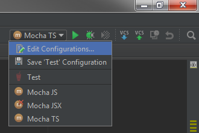
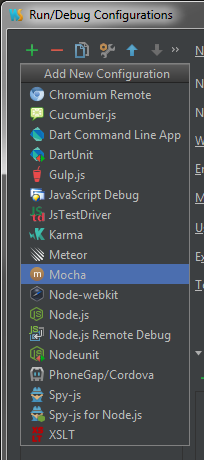
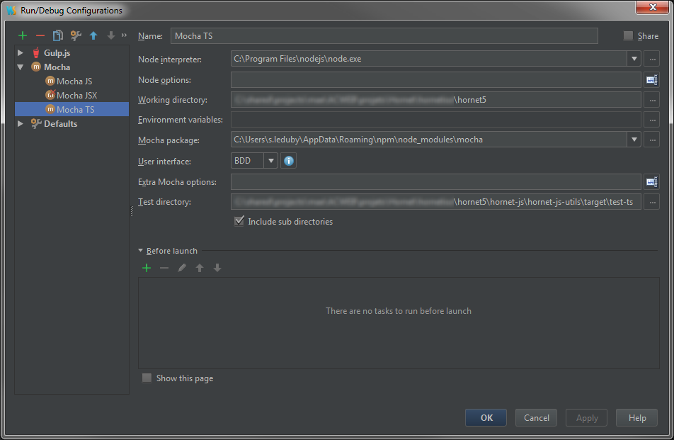

# Tests unitaires

## Outils

* [chai](http://chaijs.com/) : bibliothèque d'assertions pour Node
	* [chai-jquery](https://github.com/chaijs/chai-jquery) : assertions complémentaires sur les objets jQuery pour chai
* [cheerio](https://github.com/cheeriojs/cheerio) : implémentation de jQuery côté serveur permettant de faciliter la manipulation du code HTML dans les tests
* [mocha](http://mochajs.org/) : framework de tests JavaScript
* [sinonJS](http://sinonjs.org/) : framework de bouchonnages de fonctions
* [proxyquire](https://github.com/thlorenz/proxyquire) : framework de bouchonnage des *require* côté NodeJS

## How-To

### Composant JavaScript Simple

Le composant à tester `src/js/Hello.js` suivant :

``` javascript
	module.exports = function(name) {
	    return 'hello ' + name;
	};
```

Le code de test correspondant `test/HelloSpec.js` peut être le suivant :

	var chai = require('chai');
	var expect = chai.expect;
	var hello = require('src/Hello');

	describe('Test JS', function() {
	    it('doit passer', function() {
	        expect(hello('world')).to.be.equal('hello world');
	    });
	});

Ce test fait uniquement appel à l'outil `chai`.

### Composant React

Dans le cadre des tests d'un composant React (syntaxe JSX), les outils `chai-jquery`, `cheerio` et `mocha` sont également utilisés.

Par exemple, dans le cadre du test du composant React simple suivant :

```javascript
	var React = require('react');
	var FormButton = React.createClass({
	    render: function () {
	        return (
	            <button type={this.props.item.type}
						id={this.props.item.id}
						name={this.props.item.name}
						value={this.props.item.value}
						className={this.props.item.className}>
							{this.props.item.label}
				</button>
	        );
	    }
	});
	module.exports = FormButton;
```

Le fichier de test associé pourrait être :

```javascript

	var TestUtils = require('hornet-js-utils/src/test-utils');
	var React = require('react');
	var expect = TestUtils.chai.expect;
	var render = TestUtils.render;
	var Button = require('hornet-js-components/button/button');
	describe('Button', function () {
	    it('doit être configuré avec les informations paramétrées', function () {
	        // Arrange
	        var item = {
	            'type': 'submit',
	            'id': 'form_btnTest',
	            'name': 'btnTest',
	            'value': 'test value',
	            'className': 'hornet-button',
	            'label': 'test label'
	        };
	        // Act
	        var $ = render(() => <Button key={item.id + "_" + item.name} item={item} />),
	            $button = $('button');
	        expect($button).to.have.attr('type', item.type);
	        expect($button).to.have.attr('id', item.id);
	        expect($button).to.have.attr('name', item.name);
	        expect($button).to.have.attr('value', item.value);
	        expect($button).to.have.class(item.className);
	        expect($button).to.have.text(item.label);
	    });
	});
```

#### Tester une fonction d'un composant React

Il est possible de tester une fonction donnée d'un composant React en instanciant la classe associée.

Dans ce cas il est préférable d'utiliser le librairie *sinonJs* afin de bouchonner les méthodes et tester leur appel.

Un fichier de test peut-être:

```javascript
var React = require('react/addons');
var TestUtils = require('hornet-js-utils/src/test-utils');
var expect = TestUtils.chai.expect;
var render = TestUtils.render;
var sinon = TestUtils.sinon;
var proxyquire = require('proxyquire').noCallThru();
var fluxInformationsStoreMock = sinon.stub();
var modalComponentMock = require('test/dialog/generic-react-mock')();
var Spinner = proxyquire('hornet-js-components/src/spinner/spinner', {
    'hornet-js-core/src/stores/flux-informations-store': fluxInformationsStoreMock,
    'src/dialog/modal': modalComponentMock
});
describe('SpinnerReactComponent', function () {
    beforeEach(function () {
        this.context = {
            getStore: sinon.stub().returns(fluxInformationsStoreMock)
        };
        fluxInformationsStoreMock.hasActionsRunning = sinon.stub();
    });
    it("doit récupérer la valeur true du store et propager la visibilité", function () {
        // Arrange
        var instance = new Spinner();
        instance.getStore = this.context.getStore;
        fluxInformationsStoreMock.hasActionsRunning.returns(true);
        instance.setState = sinon.spy();
        // Act
        instance._retrieveStoreValue();
        // Assert
        sinon.assert.calledWith(instance.setState, sinon.match.has("isVisible", true).and(sinon.match.has("lastVisibilitySwitch")));
        expect(fluxInformationsStoreMock.hasActionsRunning).to.be.calledOnce;
    });
});
```

# Couverture de test

## Outils

La couverture de code se base sur les tests unitaires effectués sur les composants JavaScript, TypeScript et JSX (React).

* [istanbul](https://www.npmjs.com/package/istanbul) : Framework de calcul de couverture de code

## How-To

* Se positionner dans le module souhaité, ou dans le module parent pour obtenir la couverture complète.
* Lancer la commande *hb test*

Cette commande peut également être jouée pour tous les modules du framework et produira un rapport pour chaque module.

Cette commande lance les tests développés précédemment et produit un rapport de couverture comme suit :

```
-----------------------------|-----------|-----------|-----------|-----------|
File                         |   % Stmts |% Branches |   % Funcs |   % Lines |
-----------------------------|-----------|-----------|-----------|-----------|
   js/store/                 |     52.17 |         0 |      37.5 |     52.17 |
      NavigationBaseStore.js |        50 |         0 |      37.5 |        50 |
      configMenu.js          |       100 |       100 |       100 |       100 |
   jsx/filariane/            |     85.71 |       100 |     76.92 |     85.71 |
      FilAriane.js           |     81.58 |       100 |      62.5 |     81.58 |
      FilArianeItem.js       |       100 |       100 |       100 |       100 |
   jsx/menu/                 |       100 |       100 |       100 |       100 |
      Menu.js                |       100 |       100 |       100 |       100 |
      MenuItem.js            |       100 |       100 |       100 |       100 |
      MenuLink.js            |       100 |       100 |       100 |       100 |
   jsx/plan/                 |       100 |        75 |       100 |       100 |
      Plan.js                |       100 |        75 |       100 |       100 |
-----------------------------|-----------|-----------|-----------|-----------|
All files                    |     83.93 |      92.5 |     76.47 |     83.93 |
-----------------------------|-----------|-----------|-----------|-----------|
```

**La cible fixée actuellement est de 80% de couverture de branches**

Un rapport au format HTML est accessible sous target/istanbul/reports/**.

# Déboguer

## TypeScript

### Lanceur Mocha

1. Éditez la configuration des lanceurs WebStorm :



1. Ajoutez une configuration de lanceur Mocha :



1. Renseignez les éléments suivants :



  - Name : le nom du lanceur (visible dans la liste de sélection)
  - Node interpreter : exécutable Node
  - Working directory : répertoire du projet
  - Mocha package : script Mocha dans les modules globaux NPM
  - Test directory : répertoire du projet contenant les tests à lancer  

1. Sélectionner le Lanceur et déclencher l'exécution des tests ce fait à l'aide des icones à droite du nom du lanceur.

### Exécution

Dans WebStorm, pour chaque fichier .ts il existe un fichier .js et un fichier .map.
il est possible de placer les points d'arrêt directement dans les fichiers TypeScript.

Soit l'exemple suivant :

```
/
+-- src/
|   +-- fichier.ts     <- fichier à tester/déboguer
|   	+-- fichier.js
|       +-- fichier.map
+-- target/
|		+-- fichier.js     <- fichier compilé
|		+-- fichier.js.map <- fichier de correspondance js/ts
```

Pour deboguer coté client, on se servira des outils de développement intégrés au navigateur. 
