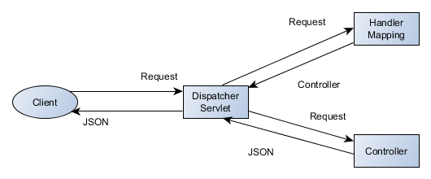
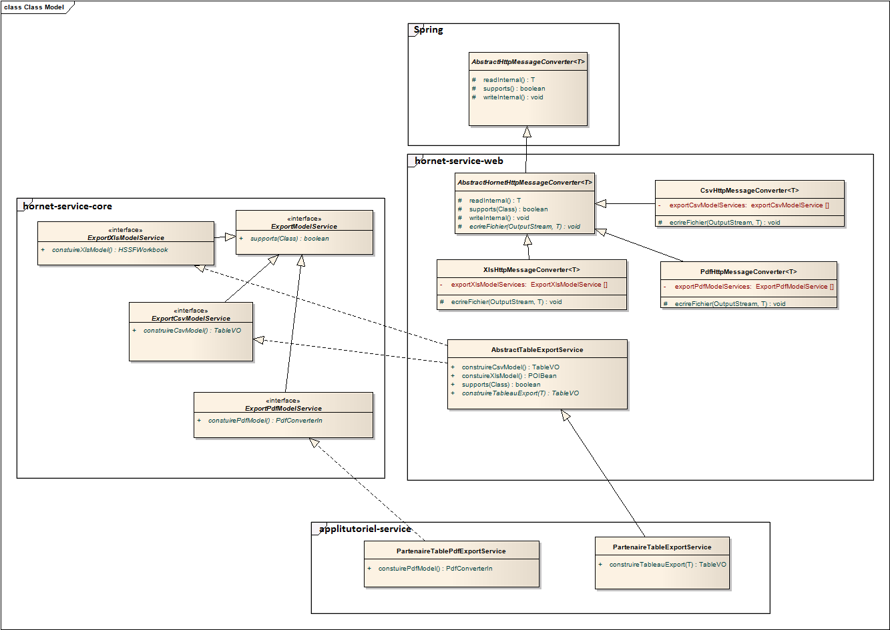

# Principes et fonctionnement de Hornet-Service

## Les principes

Hornet-Service fournit une API REST à l'application client basée sur NodeJS.

Aucune IHM, aucune ressource statique de type image, css, n'est contenue dans Hornet-Service.

## Fonctionnement

Les services REST exposés permettent au client d'accéder aux services métiers et indirectement aux services de données.


# Architecture Hornet-Service

## Architecture applicative

La partie serveur est implémentée pour la plateforme Java 8 et Java Enterprise Edition 1.8.

### Découpage

La partie serveur utilise une architecture en trois couches applicatives (3-Tiers) :


Chaque couche utilise des stéréotypes de classes qui lui sont propres.

Les contraintes structurant cette architecture sont :

1. Limiter la dépendance du code applicatif envers le socle technique, afin de réutiliser le même code dans des contextes d’exécutions différents (tests unitaires, mode bouchonné, …).
1. Avoir un couplage faible entre les composants applicatifs.
1. Permettre la réutilisation des services métiers dans d’autres applications.

#### Couche Web

La couche Web expose des services REST qui sont appelés via des requêtes HTTP.

Le format d'échange en entrée comme en sortie est le format JSON.

#### Couche Business

La couche Business caractérise la logique métier de l’application. Elle se décompose en :

 - Services : Les services se chargent d’effectuer les traitements sur les modèles.
 - BO : Ils représentent le modèle métier de l’application.

#### Couche Données

Cette couche représente l’accès aux données et s’inscrit dans les principes du pattern DAO (Data Access Object). Elle contient les :

 - DAO : Ces objets ont pour seul rôle d’accéder aux données
 - VO : Ils constituent les objets de transfert entre le modèle métier et le modèle persistant. Leur seul objectif est d’accueillir les données.

### Framework

Les frameworks open-source structurant cette architecture sont :

 - Spring-MVC : web-tiers (mapping de requêtes, validation serveur, resultat JSON)
 - Spring : business-tiers : centralisation de la configuration dans un fichier XML, fabrique d’objets et résolutions des dépendances, intégration de différents Framework (dont MyBatis)
 - MyBatis : mapping Objet/Relationnel


## Architecture Spring-MVC

L'architecture de base Spring-MVC est la suivante :


Dans le cadre de l'utilisation faite par Hornet-Service, tous les échanges se font au format JSON.

Ce schéma peut alors être nettement simplifié étant donné que toute la partie "Vue" n'a plus lieu d'être, elle sera en fait implémentée par le client NodeJS, à partir des données renvoyées au format JSON.

Schéma de l'architecture utilisée dans Hornet-Service :




1. La requête arrive sur le conteneur de Servlet et est routée vers le DispatcherServlet de Spring.
2. Le DispatcherServlet appelle le HandlerMapping pour retrouver le contrôleur gérant l'URI demandée
3. Le contrôleur correspondant est appelé
4. Le contrôleur renvoie un flux JSON qui est renvoyé au client

Note : Le `HandlerMapping` est interne à Spring et n'est pas manipulé directement : chaque contrôleur référence, par annotation, la ou les URI qu'il gère.


# Développement

## Préparation de l'environnement de développement

Cette section fait l’objet d’un document à part entière.

## Partie contrôleur

### Implémentation d'un contrôleur

* Créer une classe annotée `@Controller`
* Déclarer si besoin la base de l'URI gérée par ce contrôleur avec l'annotation `@RequestMapping`
* Déclarer des méthodes qui seront exposées en REST :
  * avec une visibilité publique
  * annotées par `@RequestMapping`

#### Configuration d'une méthode exposée en REST

Une méthode exposée en REST peut être configurée de la manière suivante :

- L'URI écoutée : attribut `value` de l'annotation `@RequestMapping`  
  Cette URI peut contenir des paramètres qui seront passés à la méthode.  
  Exemple de valeur : "/{id}"
- La méthode HTTP écoutée : attribut `method` de l'annotation `@RequestMapping`  
  Exemple de valeurs : GET / POST / UPDATE / DELETE
- Les variables attendues en entrées :
  * Avec l'annotation `@PathVariable` : la variable est récupérée de l'URI
  * Avec l'annotation `@RequestBody` : la variable est récupérée du body de la requête HTTP
  * Sans annotation : il s'agit d'une variable qui sera injectée par Spring  
    Exemples de variables pouvant être injectées par Spring : request, response...
- Le statut HTTP retourné, avec l'annotation `@ResponseStatus`  
  Exemple de valeurs : OK (200), CREATED, NO CONTENT, BAD REQUEST...
- Le contenu retourné :
  * avec l'annotation `@ResponseBody` : indique que l'objet retourné doit être placé dans le body de la réponse HTTP. 
   Permet à Spring de déclencher automatiquement la sérialisation en JSON.
  * `void` si la méthode n'a rien à retourner.  
    Dans ce cas il est obligatoire de préciser le statut de retour (`@ResponseStatus`) pour ne pas générer d'erreur Spring.

Exemple :

```java
    @Controller
    @RequestMapping("/partenaires")
    public class PartenaireController {

        @Resource
        private PartenaireService partenaireService;

        @RequestMapping(value = "/{id}", method = RequestMethod.GET)
        public @ResponseBody Partenaire lire(@PathVariable final Long id) {

            final Partenaire partenaire = partenaireService
                    .lirePartenaire(id);
            return partenaire;
        }

        @RequestMapping(value = "", method = RequestMethod.GET)
        public @ResponseBody ITreeNode lister() {

            final ITreeNode tree = partenaireService
                    .listerArborescenceOrganismePartenaire();
            return tree;
        }

            @ResponseStatus(HttpStatus.CREATED)
        @RequestMapping(value = "", method = RequestMethod.POST)
        public @ResponseBody Partenaire ajouter(
                @RequestBody final Partenaire partenaire) {

            final Partenaire ajout = partenaireService
                    .ajouterPartenaire(partenaire);
            return ajout;
        }

        @ResponseStatus(value = HttpStatus.OK)
        @RequestMapping(value = "/{id}", method = RequestMethod.PUT)
        public void modifier(@PathVariable final Long id,
                @RequestBody final Partenaire partenaire) {

            partenaire.setId(id);
            partenaireService.modifierPartenaire(partenaire);
        }

        @ResponseStatus(HttpStatus.NO_CONTENT)
        @RequestMapping(value = "/{id}", method = RequestMethod.DELETE)
        public void supprimer(@PathVariable final Long id) {

            partenaireService.supprimerPartenaire(id);
        }

        @ResponseStatus(value = HttpStatus.OK)
        @RequestMapping(value = "/suppression", method = RequestMethod.POST)
        public void supprimerEnMasse(@RequestBody final List<Long> listeIds) {

            LOG.debug("Demande de supression en masse");
            for (final Long id : listeIds) {
                LOG.debug("Suppression du partenaire d'id {}", id);
                supprimer(id);
            }
        }
    }
```

### Configuration du DispatcherServlet

Le fichier xml de configuration du `DispatcherServlet` doit contenir à minima les lignes suivantes :

- Utilisation du mode annotation :  

```xml
    <mvc:annotation-driven />
```

- Scan des controlleurs déclarés par l'annotation `@Controller` :  

```xml
    <context:component-scan
        base-package="fr.gouv.diplomatie.applitutoriel.web.controller" />
```  

Le package déclaré ici doit être modifié pour correspondre à l'application courante.

Il est possible de déclarer plusieurs packages en les séparant par une virgule.

- Forçage de tous les échanges en mode JSON / UTF-8 :  

```xml
    <bean class="org.springframework.web.servlet.mvc.annotation.AnnotationMethodHandlerAdapter">
    	<property name="messageConverters">
            <list>
                <bean class="org.springframework.http.converter.StringHttpMessageConverter">
                    <property name="supportedMediaTypes">
                        <list>
                            <value>application/json; charset=UTF-8</value>
                        </list>
                    </property>
                </bean>
            </list>
        </property>
    </bean>
```  

  Cela permet d'éviter d'avoir à préciser le format attendu (JSON) et l'encodage attendu (UTF-8), sur chacune des méthodes REST des contrôleurs.

### <a id="gestionnaire_erreur"></a>Utilisation du gestionnaire d'erreur

Lors du traitement d'une requête, si une erreur survient dans le contrôleur, ou dans un des services appelés, et que cette erreur n'est pas gérée alors elle remonte jusqu'au tomcat et génère une trace d'erreur au format HTML.

Ce comportement n'est pas adapté à un client REST qui ne pourra pas utiliser les informations affichées au format HTML.

Le framework dispose d'un intercepteur d'erreur permettant de remonter les erreurs survenues pendant les traitements d'une requête, vers le client REST à travers un DTO approrié, qui sera sérialisé au format JSON.

Ce composant est présent dans le module `hornet-service-web` : `GlobalDefaultExceptionHandler`.
Il gère les exceptions suivant deux types :

  - `BusinessException` et `BusinessListException`
  - `Exception`

Pour activer ce gestionnaire d'erreur dans une application Hornet :


- Vérifier la présence du module _hornet-service-web_ dans les dépendances Maven
- Ajouter le scan du package _hornet.framework.web.controller_ dans la configuration du DispatcherServlet :

```xml
    <context:component-scan
            base-package="fr.gouv.diplomatie.applitutoriel.web.controller,
		          hornet.framework.web.controller" />
```


#### Flux JSON pour BusinessException et BusinessListException

L'exception `BusinessListException` est un conteneur de `BusinessException`, pour permettre de renvoyer une liste de ces dernières avec un seul appel (traitement de masse, validation de plusieurs règles de gestion...).

Le flux renvoyé aura toujours la même structure quel que soit le type, car une `BusinessException` est convertie en `BusinessListException` ne contenant qu'une seule `BusinessException`. 

En retour nous aurons les informations suivantes :

- url : url qui a généré le ou les exception(s).
- Exs : liste des `BusinessException` :
    - code : code de la `BusinessException` (exemple ER-PA-RPA-03)
    - args : le(s) argument(s) pouvant servir à la contruction du message côté client (exemple ['nom', 'prenom'])

  
#### Flux JSON pour Exception

Le flux renvoyé au client contient les informations suivantes :

- name : nom de la classe de l'exception
- code : id unique d'erreur (timestamp)
- message : message de l'exception
- stackTrace : pile d'appels


## Partie Métier

### Services

Les services représentent la logique métier de l’application. Ils doivent être réutilisables au sein de l’application (partage entre domaines fonctionnels), mais également entre applications (au travers d’une couche Web-Service par exemple).

- Les services sont implémentés avec des classes JAVA simples. Ils possèdent obligatoirement une interface JAVA.
- Les services peuvent effectuer des traitements simples ou complexes en réutilisant d’autres services (internes à l’application, ou externe).
- Les services collaborent avec les autres services uniquement via leur interface. C’est Spring qui est chargé de fournir l’implémentation appropriée.
- Les services collaborent avec les DAO uniquement via leur interface. Spring est chargé de fournir l’implémentation appropriée
- Les services sont généralement des singletons. Ils ne doivent donc pas contenir de données membres constituant un état sinon celles-ci conserveront leurs valeurs d’initialisation d’un appel à l’autre (voir exemple).
- Les services sont décrits dans le fichier Spring ```spring-appContext-common-service.xml```

__Exemple de service contenant une donnée membre qui constitue un état :__

```java
    public class MonServiceImpl {
        /** <code> maListeErreurs </code> the maListeErreurs     */
        private List<HistoriqueBO> maListeErreurs;

        /** <code>daoHistorique</code> the daoHistorique     */
        private HistoriqueDAO daoHistorique;

        /** <code>daoPurge</code> the daoPurge     */
        private PurgeDAO daoPurge;

        /**
         * @param id identifiant d'une boite aux lettres
         * @return la liste des historiques
         */
        public List<HistoriqueBO> doTraitement(String id) {
            List <HistoriqueBO> liste = new ArrayList<HistoriqueBO>();
            HistoriqueBO historique = new HistoriqueBO();
            historique.setIdBal(id);
            liste = this.daoHistorique.selectHistoriqueByIdBal(
                                    historique.getHistoriqueVO());
            for (HistoriqueBO histo : liste) {
                if (histo.getHisAction() == null) {
                    //Ajout d’elements à un objet membre d’un singleton
                    this.maListeErreurs.add(histo);
                }
            }
            liste.removeAll(this.maListeErreurs);
            return liste;
        }

        /**
         * @return liste des purges
         */
        public List<Purge> doSomethingElse() {
            // utilisation de la liste du singleton dont le contenu peut être
            // modifié au moment de sa lecture par simple appel à la méthode
            // doTraitement
            for (HistoriqueBO histo : this.maListeErreurs) {
                Purge maPurge = new Purge();
                maPurge.setPurIdbal(histo.getIdBal());
                maPurge.setPurDatepurge(new Date());
                this.daoPurge.insert(maPurge);
            }
            PurgeExample example = new PurgeExample();
            example.setOrderByClause("DATE_PURGE");
            return this.daoPurge.selectByExample(example);
        }
    }
```

__Remarque__ : Pour cette exemple il est conseillé de supprimer la donnée membre `maListeErreurs` du service et de passer cet objet liste en paramètre des fonctions `doTraitement` et `doSomethingElse`.

__Exemple de déclaration de service utilisant un autre service :__

```xml
    <bean id="EntrepriseService" class="hornet.projet.business.service.EntrepriseServiceImpl">
        <constructor-arg ref="EntrepriseDAO" index="0" />
        <constructor-arg ref="ReferenceService" index="1" />
    </bean>

    <bean id="ReferenceService" class="hornet.projet.business.service.ReferenceServiceImpl">
        <constructor-arg ref="ReferenceDAO" index="0"/>
    </bean>
```

### Ambiguïtés sur les instanciations

L’utilisation de l’injection de dépendance par constructeur peut mener à des ambiguïtés.

Prenons un exemple :

```java
    public class UnObjet {
        public UnObjet(String str, int entier) {
            …
        }
    }
```

Avec la configuration Spring suivante :

```xml
    <bean id="UnObjet" class="com.example.UnObjet">
        <constructor-arg value="string1" />
        <constructor-arg value="123" />
    </bean>
```

Les valeurs fournies ici pour les arguments du constructeur ne permettent pas à Spring de les différencier. Chacune pourrait potentiellement représenter un nombre ou une chaîne.

Afin de lever l’ambiguïté, il est possible de spécifier le type des arguments :

```xml
    <bean id="UnObjet" class="com.example.UnObjet">
        <constructor-arg value="string1" type="java.lang.String" />
        <constructor-arg value="123" type="int"/>
    </bean>
```

Une autre solution consiste à renseigner le nom de l’argument associé à la valeur ou à la référence :

```xml
    <bean id="UnObjet" class="com.example.UnObjet">
        <constructor-arg value="string1" name="str" />
        <constructor-arg value="123" name="entier"/>
    </bean>
```

Cette méthode n’est cependant pas fiable car elle fonctionne uniquement si le code source Java est compilé avec le flag `debug` activé. Dans ces conditions, il est tout à fait envisageable que cette configuration soit correcte pour les tests en développement mais provoque une erreur lors du déploiement si le flag `debug` est désactivé pour la génération du war.

Pour rendre la configuration Spring indépendante de la méthode de compilation, l’attribut `index` (commençant à 0) du tag `constructor-arg` est donc à privilégier :

```xml
    <bean id="UnObjet" class="com.example.UnObjet">
        <constructor-arg value="string1" index="0" />
        <constructor-arg value="123" index="1"/>
    </bean>
```

Même dans le cas de l’utilisation d’un seul argument, l’index doit être précisé afin de lever toute ambiguïté sur son utilisation.

Pour plus de détails, se référer à la [documentation en ligne de Spring](http://docs.spring.io/spring/docs/4.0.x/spring-framework-reference/html/beans.html#beans-factory-collaborators) sur ce sujet.


En plus de palier à ce type d’erreurs, l’activation du flag de "debug" pour la compilation des sources permet également de rajouter des informations supplémentaires en cas de dysfonctionnement. Ces éléments permettent de faciliter le diagnostic en cas d’incident.

### Services Spring et scope

Par défaut, un service Spring est un singleton, la valeur par défaut de l’attribut scope étant `singleton` :

```xml
    <bean id="monService" class="hornet.projet.business.service.ReferenceServiceImpl" scope="singleton">
        <constructor-arg ref="ReferenceDAO" index="0"/>
    </bean>
```

Singleton signifie qu’une seule instance (ou bean) sera utilisée pour toutes les références à `monService`.

Les autres valeurs possibles pour scope dans une application web sont :

- prototype : une instance est créée pour chaque référence au bean,
- request : chaque requête http possède sa propre instance du bean,
- session : chaque session  http possède sa propre instance du bean.

Dans la majeure partie des cas, le scope singleton est celui à privilégier, chaque service devant impérativement être "thread safe" (permettre et gérer correctement les accès concurrents réalisés par plusieurs threads).

Dans certains cas, les classes et beans nécessaires au fonctionnement d’un service Spring  ne sont pas thread safe et des nouvelles instances doivent impérativement être  créées à chaque appel.

Un pattern possible est alors :

- Déclarer le bean non « thread safe » en prototype (« request » peut aussi convenir) :

```xml
    <bean id="monBeanNonThreadSafe" class="hornet.projet.business.BeanNonThreadSafeImpl" scope="prototype">
    </bean>
```

- Déclarer le bean de service en y ajoutant la définition `lookup-method`

```xml
    <bean id="monBeanService" class="hornet.projet.business.BeanThreadSafeImpl">
        <look-up name="getBeanNonThreadSafe" bean="monBeanNonThreadSafe">
    </bean>
```

- Déclarer la méthode abstraite dans la classe appelante  

```java
    public class BeanThreadSafeImpl {
        private abstract BeanNonThreadSafe getBeanNonThreadSafe();

        public void travail() {
            getBeanNonThreadSafe().faitQuelqueChose() ;
        }
    }
```

### Business Objets (BO)

- Les BO représentent le modèle métier de l’application.
- Un BO est une classe JAVA simple sans dépendance sur l’architecture technique. Il possède au moins un constructeur par défaut et chaque propriété est accessible via des getter/setter.
- Un BO est constitué de propriétés simples, mais peut aussi étendre ou agréger d’autres BO.
- Un BO peut être construit à partir d’un unique VO (mapping un vers un) ou d’un ensemble de VO provenant éventuellement de sources différentes (mapping un à plusieurs). La conversion entre BO et VO sera toujours effectuée dans la couche service.
- Un BO peut contenir de la logique métier, mais ne doit pas faire appel à la couche service, dao, accéder à d’autres ressources, …


## Partie Données (Intégration)

### Architecture

Le framework MyBatis est composé de deux modules : MyBatis (core) et MyBatis–Spring.

MyBatis–Spring est utilisé afin notamment de bénéficier de la gestion des transactions au sein des services gérés par Spring.

### Création d'un DAO

#### Création de la classe DAO

- Créer une classe qui étend _org.mybatis.spring.support.SqlSessionDaoSupport.SqlSessionDaoSupport_
- Ajouter les méthodes de CRUD (Create / Read / Update / Delete)
- Les accès en base se font via la session fournie par Spring au parent :  

```java
    this.getSqlSession()...
```

- Les requêtes ne sont pas écrites directement dans le DAO mais dans des fichiers de mapping XML. Le DAO accède à ces requêtes via des clés.  

Exemple : `partenaire.selectById`
  
La première partie de la clé (`partenaire`) fait référence au namespace du fichier de mapping.  
La seconde partie de la clé (`selectById`) fait référence à l'id de la requête SQL dans le fichier de maping.

__Exemple de DAO :__

```java
    public class PartenaireDAO extends SqlSessionDaoSupport {

        /**
         * retrieveDataList
         *
         * @return List < Partenaire >
         */
        public List<Partenaire> retrieveDataList() {

            return this.getSqlSession().selectList("partenaire.select");
        }

        /**
         * @param id
         *            Long
         * @return Partenaire partenaire
         */
        public Partenaire selectById(final Long id) {

            final Map<String, String> params = new HashMap<String, String>();
            params.put("id", id.toString());
            return (Partenaire) this.getSqlSession().selectOne("partenaire.selectById", params);
        }

        /**
         * @param partenaire
         *            Partenaire
         */
        public void deletePartenaire(final Partenaire partenaire) {

            this.getSqlSession().delete("partenaire.delete", partenaire);
        }
    }
```


Ce fichier fait appel à trois requêtes de l'espace de nom `partenaire` : `select`, `selectById`, `delete`.

La déclaration de ces requêtes est présentée ci-dessous.


#### Création du fichier de mapping

 - Créer un fichier `[Nom du DAO]_SqlMap.xml` dans les ressources, dans le même package que le DAO précédemment créé. (Exemple : `Partenaire_SqlMap.xml`).
 - Déclarer le `namespace` du `mapper` (Exemple : `partenaire`)
 - Déclarer les mappings entre les colonnes de la table et un BO
 - Déclarer et écrire les différentes requêtes

L'écriture des requêtes est détaillée plus loin dans ce document (paragraphe Développement spécifique MyBatis)

__Exemple de fichier :__

```xml
    <?xml version="1.0" encoding="UTF-8" ?>
    <!DOCTYPE mapper
      PUBLIC "-//mybatis.org//DTD Mapper 3.0//EN"
      "http://mybatis.org/dtd/mybatis-3-mapper.dtd">

    <mapper namespace="partenaire">

        <resultMap type="fr.gouv.diplomatie.applitutoriel.business.bo.Partenaire" id="mapPartenaire">
            <result column="ID_PARTENAIRE" property="id" />
            <result column="PAR_NOM" property="nom" />
            <result column="PAR_PRENOM" property="prenom" />
        </resultMap>

        <sql id="selectPartenaire_fragment">
            SELECT
            ID_PARTENAIRE,
            PAR_NOM,
            PAR_PRENOM
        </sql>

        <select id="select" resultMap="mapPartenaire">
            <include refid="selectPartenaire_fragment" />
            ORDER BY PAR_NOM ASC;
        </select>

        <select id="selectById" resultMap="mapPartenaire">
            <include refid="selectPartenaire_fragment" />
            WHERE ID_PARTENAIRE ={id};
        </select>

        <delete id="delete" parameterType="fr.gouv.diplomatie.applitutoriel.business.bo.Partenaire">
            DELETE FROM PARTENAIRE WHERE ID_PARTENAIRE ={id}
        </delete>
    </mapper>
```

On retrouve dans cet exemple les trois requêtes de l'exemple sur la création d'un DAO : `partenaire.select`, `partenaire.selectById`, `partenaire.delete`.

Les requêtes de select sont mappées sur le BO `Partenaire`.

### Intégration dans Spring

#### Déclaration de la dataSource (non spécifique MyBatis)

- Créer un fichier `spring-appContext-common-datasource.xml` dans le dossier des ressources et ayant cette structure :  

```xml
    <?xml version="1.0" encoding="UTF-8"?>
    <beans xmlns="http://www.springframework.org/schema/beans" xmlns:xsi="http://www.w3.org/2001/XMLSchema-instance"
        xmlns:jee="http://www.springframework.org/schema/jee" xmlns:tx="http://www.springframework.org/schema/tx" xmlns:jdbc="http://www.springframework.org/schema/jdbc"
        xsi:schemaLocation="
        http://www.springframework.org/schema/beans http://www.springframework.org/schema/beans/spring-beans-4.1.xsd
        http://www.springframework.org/schema/tx http://www.springframework.org/schema/tx/spring-tx-4.1.xsd
        http://www.springframework.org/schema/jee http://www.springframework.org/schema/jee/spring-jee-4.1.xsd
        http://www.springframework.org/schema/jdbc http://www.springframework.org/schema/jdbc/spring-jdbc-4.1.xsd">

        <!-- Initialisation de la datasource -->
        <bean id="dataSource" class="org.apache.commons.dbcp.BasicDataSource">
        [...]
        </bean>
    </beans>
```

- Paramétrer la `dataSource` avec les informations de connexions à la base de données.  
  Il est recommandé d'aller lire ces informations dans un fichier de propriétés.

#### Création du fichier de configuration MyBatis

- Créer un fichier `mybatis-config.xml` dans le dossier des ressources et ayant cette structure :  

```xml
    <?xml version="1.0" encoding="UTF-8" ?>
    <!DOCTYPE configuration
      PUBLIC "-//mybatis.org//DTD Config 3.0//EN"
      "http://mybatis.org/dtd/mybatis-3-config.dtd">
    <configuration>
        <settings>
            <setting name="logImpl" value="SLF4J" />
        </settings>
        <mappers>
            <mapper resource="fr/gouv/diplomatie/applitutoriel/integration/dao/maps/Exemple_SqlMap.xml" />
        </mappers>
    </configuration>
```


#### Déclaration des objets spécifiques MyBatis

- Créer un fichier `spring-appContext-common-dao.xml` dans le dossier des ressources et ayant cette structure :  

```xml
    <?xml version="1.0" encoding="UTF-8"?>
    <beans xmlns="http://www.springframework.org/schema/beans" xmlns:xsi="http://www.w3.org/2001/XMLSchema-instance"
        xmlns:ehcache="http://ehcache-spring-annotations.googlecode.com/svn/schema/ehcache-spring" xmlns:mybatis="http://mybatis.org/schema/mybatis-spring"
        xsi:schemaLocation="http://www.springframework.org/schema/beans http://www.springframework.org/schema/beans/spring-beans-4.1.xsd
                            http://ehcache-spring-annotations.googlecode.com/svn/schema/ehcache-spring
                            http://ehcache-spring-annotations.googlecode.com/svn/schema/ehcache-spring/ehcache-spring-1.1.xsd
                            http://mybatis.org/schema/mybatis-spring http://mybatis.org/schema/mybatis-spring.xsd">


        <bean id="sqlSessionFactory" class="org.mybatis.spring.SqlSessionFactoryBean">
            <property name="dataSource" ref="dataSource" />
            <property name="configLocation" value="classpath:mybatis-config.xml"/>
        </bean>

        <!-- Liste des DAOs -->
        <bean id="exempleDAO" class="fr.gouv.diplomatie.applitutoriel.integration.dao.ExempleDAO">
            <property name="sqlSessionFactory" ref="sqlSessionFactory" />
        </bean>

    </beans>
```

- Le bean `sqlSessionFactory` permet l'intégration des DAOs avec Spring. Ce bean sera injecté à chacun des DAOs (voir bean `exempleDAO`). Il leur fournira une session pour exécuter les requêtes.

#### Import des fichiers Spring créés dans le contexte applicatif

- Ajouter l'import des fichiers de conf Spring créés précédemment dans le fichier de conf Spring parent.

```xml
    <import resource="classpath:/spring-appContext-common-datasource.xml"/>
    <import resource="classpath:/spring-appContext-common-dao.xml"/>
```

### Développement spécifique MyBatis

Les fichiers de mapping XML MyBatis doivent être écrits en suivant les règles suivantes :

- Écrire du SQL standard tant que c’est possible (i.e. : éviter les appels de fonction ou procédures stockées spécifiques au SGBD), afin d’améliorer la portabilité et ainsi permettre l’utilisation de HSQLDB pour les tests unitaires.
- Les requêtes avec jointure doivent utiliser la syntaxe `(LEFT OUTER) JOIN … ON` et non la forme `FROM A,B`
- On pourra mapper les jointures sur un graphe d’objet BO uniquement si l’isolation par les VO n’est pas nécessaire (gain de temps).
- Si une requête utilise du SQL spécifique SGBD, ajouter à son id un suffixe correspondant au nom du sgbd :  

```xml
    <insert id="insertProduct-ORACLE" parameterClass="com.domain.Product">
        ...
    </insert>
```

#### Ajout d'une requête

##### Select avec jointure

__Règle__ : Si une requête de sélection comporte des jointures, elle doit figurer dans le fichier `SqlMap.xml` correspondant à la table principale de la requête.

__Règle__ : Les données renvoyées par une requête de jointure peuvent être mappées sur un VO spécifique à cette jointure, ou directement un BO.

On pourra soit utiliser les alias « as » SQL pour le mapping des colonnes sur les propriétés de la classe ou définir un `ResultMap`. L’intérêt du `ResultMap` est d’être réutilisable et pouvoir gérer les graphes d’objets.

Exemple de mapping sur un VO spécifique :

- Ajouter dans le fichier `person_SqlMap.xml` :  

```xml
    <select id="getPersonWithRole" parameterType=”int” resultType="hornet.projet.integration.vo.PersonWithRole">
    SELECT 	PER_ID as id,
        PER_FIRST_NAME as firstName,
        PER_LAST_NAME as lastName,
        PER_BIRTH_DATE as birthDate,
        PER_WEIGHT_KG as weightInKilograms,
        PER_HEIGHT_M as heightInMeters,
        ROL_NAME as roleName
    FROM PERSON
    JOIN ROLE on PERSON.ROL_ID = ROLE.ROL_ID
    WHERE PER_ID ={value}
    </select>
```
- Créer une classe java `hornet.projet.integration.vo.PersonWithRole` avec les propriétés nécessaires.

##### Insert / Update / Delete

__Règle__ : Les données à mettre à jour doivent être modélisées par une classe Java, dont le nom est suffisamment explicite. La mise à jour portant sur une table à la fois, on pourra réutiliser la classe VO appropriée.

Chaque paramètre de requête `#{param}` correspond au nom d’une propriété Javabean.

__Exemple :__  

```xml
    <insert id="insertPerson" parameterType="projet.integration.vo.Person">
    INSERT INTO
        PERSON (PER_ID, PER_FIRST_NAME, PER_LAST_NAME,
            PER_BIRTH_DATE, PER_WEIGHT_KG, PER_HEIGHT_M)
        VALUES (#{id},{firstName},{lastName},
           {birthDate},#{weightInKilograms},{heightInMeters})
    </insert>

    <update id="updatePerson" parameterType="projet.integration.vo.Person">
    UPDATE PERSON
        SET PER_FIRST_NAME ={firstName},
        PER_LAST_NAME ={lastName}, PER_BIRTH_DATE ={birthDate},
        PER_WEIGHT_KG ={weightInKilograms},
        PER_HEIGHT_M ={heightInMeters}
    WHERE PER_ID ={id}
    </update>

    <delete id="deletePersonById" parameterType="projet.integration.vo.Person">
    DELETE PERSON
    WHERE PER_ID ={id}
    </delete>
```

##### Récupération de la PK après insertion

La clé primaire peut être récupérée suite à une insertion grâce à l'attribut MyBatis `useGeneratedKeys` à `true`.

On indiquera également la colonne associée (`keyColumn`) ainsi que l'attribut associé dans le VO de retour (`keyProperty`).

```xml
    <insert id="insert" parameterType="projet.integration.vo.Person"
        useGeneratedKeys="true" keyProperty="id" keyColumn="PER_ID" >
        ...
    </insert>
```

##### Construction dynamique de requête SQL

Une requête dynamique peut être réalisée grâce au tag `<if>`, la condition sera écrite dans l'attribut `test`.

__Exemple :__

```xml
    <select id="selectByCriteres" resultMap="mapPartenaireCriteres">
		SELECT
		DISTINCT PARTENAIRE.ID_PARTENAIRE, PAR_IS_CLIENT, PAR_IS_VIP, PAR_NOM, PAR_PRENOM,
		PAR_PRO_COURRIEL, PAR_ORGANISME, PAR_FONCTION, PAR_DATE_CREATION, PAR_DATE_MODIFICATION
		FROM PARTENAIRE
		<if test="idSecteur != null">
			<if test="idSecteur != 0">
				INNER JOIN PRODUIT_PARTENAIRE ON PRODUIT_PARTENAIRE.ID_PARTENAIRE = PARTENAIRE.ID_PARTENAIRE
				INNER JOIN PRODUIT ON PRODUIT.ID_PRODUIT = PRODUIT_PARTENAIRE.ID_PRODUIT AND PRODUIT.ID_SECTEUR ={idSecteur}
			</if>
		</if>
		<where>
			<if test="partenaire.isClient != null and partenaire.isClient != ''" >
				AND PAR_IS_CLIENT ={partenaire.isClient}
			</if>
			<if test="partenaire.isVIP" >
				AND PAR_IS_VIP = 1
			</if>
			<if test="startDate != null and startDate != ''" >
				AND DATEDIFF('dd', PAR_DATE_MODIFICATION,{startDate}) &lt;= 0
			</if>
		</where>
	</select>
```

#### N+1 selects

Le Problème des N+1 selects apparaît lorsqu’on souhaite charger un graphe d’objet. Par exemple quand on charge une liste de N objets avec 1 requête puis pour chaque objet, on effectue une nouvelle requête pour charger un objet lié. Pour résoudre ce problème on utilisera une jointure et un mapping approprié (`ResultMap`).

On pourra directement réutiliser le graphe d’objet des BO.

- Relation 1-1  
Le but est de Mapper sur un objet contenant une référence à un autre objet.
- Relation 1-N ou M-N  
Le but est de Mapper sur un objet contenant une collection, on utilise pour cela un ResultMap.

__Exemple de relation :__

```xml
	<resultMap type="fr.gouv.diplomatie.applitutoriel.business.bo.Ville" id="mapVille">
		<result column="ID_VILLE" property="id" />
		<result column="VIL_LIBELLE" property="libelle" />
		<association column="ID_PAYS" property="pays" resultMap="pays.mapPays" />
	</resultMap>

	<select id="select" resultMap="mapVille">
		SELECT ID_VILLE, VIL_LIBELLE
		, PAYS.ID_PAYS AS ID_PAYS, PAY_LIBELLE, PAY_NATIONALITE
		FROM VILLE
		JOIN PAYS ON VILLE.ID_PAYS = PAYS.ID_PAYS
	</select>
```

#### Gestion des batchs updates

##### Principe

Les batchs updates sont des batchs JDBC. Le principe de ces batchs est d’éviter d’exécuter unitairement des ordres SQL de création, modification et suppression, surtout s’ils sont nombreux, afin d’optimiser les temps d’exécution.

Pour ce faire on distingue les ordres de création, de modification et de suppression que l’on stocke dans trois listes différentes.

Puis, on exécute dans un batch JDBC, par groupe, les ordres de création ensuite ceux de modification et enfin ceux de suppression.

Ainsi on réussit à agréger les ordres SQL et à les exécuter par paquets et non unitairement ce qui permet de multiplier par dix le gain d’exécution.

On utilise pour cela la balise `<foreach>`.

##### Exemple

```xml
    <foreach collection="attendingUsrList" item="model"  separator=";">
        UPDATE parties SET attending_user_count ={model.attending_count}
        WHERE  fb_party_id ={model.eid}
    </foreach>
```

### Cache de requêtes

#### Principe

MyBatis permet de charger en mémoire des requêtes dans un cache afin d’éviter de relancer celles-ci si ce n’est pas nécessaire.

On peut ainsi diminuer le temps d’exécution et optimiser l’accès aux données.

Il est préférable d’utiliser ce cache en lecture seule, uniquement sur les données qui sont majoritairement accédées en lecture et dont la fréquence de mise à jour est faible.

Il faut impérativement définir la taille du cache et sa durée de vie pour renouveler les données stockées en mémoires.

En effet, il est important de déterminer quelles sont les requêtes à conserver dans le cache pour estimer la taille de celui-ci.

Il faut noter qu’une requête qui comporte plusieurs clauses dynamiques différentes engendre autant de requêtes à stocker en cache qu’il existe de combinaison possible pour ces clauses.

Ainsi, s’il existe au maximum deux clauses sur la requête, le cache contiendra quatre requêtes, une pour chaque combinaison possible.

Pour optimiser la mémoire du cache plusieurs astuces sont possibles :

- Appliquer des algorithmes supplémentaires pour améliorer la gestion du cache, tel que l’algorithme LRU qui supprime du cache les requêtes les moins utilisées.
- Modifier le code des requêtes de type « select » afin que celles-ci ne retournent que les identifiants. Puis, ajouter un algorithme qui parcourt ce résultat et qui effectue une requête sur les clefs primaires. Ce principe est un peu plus couteux à la première exécution mais il permet de stocker moins de requêtes dans le cache et de stocker tout l’objet.

Enfin, l’utilisation d’un cache n’a pas d’intérêt si celui-ci n’est pas utilisé à plus de 50%.

Exemple d’utilisation :

```xml
    <cache
      eviction="LRU"
      flushInterval="60000"
      size="512"
      readOnly="true"/>
```

### Limiter le nombre de résultats

- Cas Oracle :
    - Les 100 premiers résultats d'une requête non triée :  

```sql
    SELECT *
    FROM `t_client`
    WHERE ROWNUM <= 100
```

   - Les 100 premiers résultats d’une requête triée :  

```sql
    SELECT *
    FROM (SELECT * FROM `t_client` ORDER BY name)
    WHERE ROWNUM <= 100
```

Le compteur `ROWNUM`, initialisé à 1, est définit pour chaque résultat d’une requête. La valeur de celui-ci est attribuée puis incrémenté de 1 à chaque ligne retournée par la requête. Lorsque les données retournées ne sont pas triées avec le mot-clé `ORDER BY` ce principe ne pose pas de problème. Par contre, si on souhaite trier les données et tenir compte de l’ordre alors il est nécessaire d’utiliser une sous-requête. En effet, la valeur de `ROWNUM` est attribuée pour chaque ligne avant le tri final. Ainsi, une fois le résultat ordonné, le critère des 100 premiers ne peut être respecté.


- Cas MS SQL Serveur 2005 :
    - Les 100 premiers résultats :

```sql
SELECT TOP 100 *
FROM t_client
```

- Cas mySQL et postgreSQL :
    - Les 100 premiers résultats :

```sql
SELECT *
FROM `ARCHIVA_ARTIFACT`
LIMIT 100
```

### Pagination de listes

Plusieurs solutions sont possibles pour la pagination. Le choix se fait en fonction des volumes des données et fréquences d’utilisation et de mise à jour.

Les trois variantes les plus communes sont présentées ici.

#### Paginer sur le sgbd

##### Cas Oracle  

Il est possible d’utiliser la fonction analytique `ROW_NUMBER`, pour filtrer le résultat d’une requête sur des intervalles consécutifs.  
Le principe est assez similaire à `ROWNUM`. En effet, la fonction `ROW_NUMBER` est appliquée sur le résultat final de la requête alors que `ROWNUM` est appliqué pendant l’exécution de celle-ci.  
Exemple qui affiche 30 lignes à partir de l'enregistrement 10 :

   - avec ROWNUM :  

```sql
SELECT …
FROM (
    SELECT …, ROWNUM num FROM
        (SELECT … FROM t_client ORDER BY name)
    )
WHERE num BETWEEN 10 and 40
```

   - avec ROW_NUMBER :  

```sql
SELECT …
FROM (
    SELECT …, ROW_NUMBER() OVER (ORDER BY name) num
    FROM t_client
    )
WHERE num BETWEEN 10 and 40
```

>Référence : http://oracle.developpez.com

[http://oracle.developpez.com/faq/?page=3-1#rownum](http://oracle.developpez.com/faq/?page=3-1#rownum)

##### Cas MS SQL Serveur 2005 :  Affiche 30 lignes à partir de l'enregistrement 10 :

```sql
SELECT * FROM (
    SELECT TOP 10 Field1, Field2 FROM (
        SELECT TOP 30 Field1, Field2
        FROM  matable
        ORDER BY monchamp asc
    ) AS tbl1 ORDER BY monchamp desc
) AS tbl2 ORDER BY monchamp asc
```

>Référence : http://oracle.developpez.com

[http://sqlserver.developpez.com/faq/?page=Jeu#Jeu1](http://sqlserver.developpez.com/faq/?page=Jeu#Jeu1)

 Autre approche :

```sql
select * FROM (
    select *, row_number() over(order by mon_champ) as rownum from maTable
	) orderedResults where rownum between 10 and 40
```

##### Cas mySQL :  

Utilisation de l’instruction `LIMIT` < indice de départ dans la liste de résultat >, < nombre de résultat à afficher >

Exemple, à partir de l’élément 10, afficher 30 résultats :

```sql
SELECT *
FROM `ARCHIVA_ARTIFACT`
LIMIT 10 , 30
```

##### Cas postgreSQL

La syntaxe s’approche de celle de MySQL mais attention car elle est inversée :

```sql
SELECT select_list
FROM table_expression
[LIMIT { number | ALL }] [OFFSET number]
```

Sur le même exemple : à partir de l’élément 10, afficher 30 résultats :

```sql
SELECT *
FROM `ARCHIVA_ARTIFACT`
LIMIT 30 OFFSET 10
```

| Avantages | Inconvénients |
| --------- | ------------- |
| Ne retourne que le resultset de la page souhaitée | on exécute la requête à chaque fois (ou du moins à chaque changement de page) |
| | Dépendant SGBD |
[postgreSQL - paginer - avantages-inconvenients]

#### Paginer sur le sgbd (2)

Si une requête est coûteuse en temps d’exécution : utiliser une table partagée par les utilisateurs pour stocker le résultat complet de la requête, ensuite la pagination est faite sur cette table selon l’une des techniques précédentes.

| Avantages | Inconvénients |
| --------- | ------------- |
| on exécute la requête une seule fois | Espace disque plus important, et à priori une table par requête (mais on pourrait ne stocker que les ids du résultat) |
[paginer - sgbd]

#### Paginer sur le serveur

| Avantages | Inconvénients |
| --------- | ------------- |
| on exécute la requête une seule fois | Tout le resultset est en session |
| Indépendant SGBD | Pas de modif concurrente |
[paginer - server]

### Types Java spécifiques

Il est parfois utile d’avoir des types spécifiques dans des BO. Par exemple on peut prendre le cas d’une date stockée en tant que varchar dans la base de données et que l’on souhaite traiter de façon particulière en java.

Considérons que nous avons une classe `DateIncomplete` qui correspond à notre type. Les objets métier de notre application vont contenir des variables de type `DateIncomplete`.

Pour que MyBatis puisse gérer correctement ce type de champs indépendamment de la structure de l’objet `DateIncomplete`, il va falloir créer un handler particulier pour ce type de champs qui va étendre `BaseTypeHandler`.

__Exemple :__

```java
    // ExampleTypeHandler.java
    @MappedTypes(DateIncomplete.class)
        public class ExampleTypeHandler extends BaseTypeHandler<DateIncomplete> {

        @Override
        public void setNonNullParameter(PreparedStatement ps, int i, DateIncomplete parameter, JdbcType jdbcType) throws SQLException {
            ps.setString(i, parameter.getValue());
        }

        @Override
        public String getNullableResult(ResultSet rs, String columnName) throws SQLException {
            return rs.getString(columnName);
        }

        @Override
        public String getNullableResult(ResultSet rs, int columnIndex) throws SQLException {
            return rs.getString(columnIndex);
        }

        @Override
        public String getNullableResult(CallableStatement cs, int columnIndex) throws SQLException {
            return cs.getString(columnIndex);
        }
    }
```

Ensuite il suffit dans la configuration de MyBatis de lui préciser que pour tous les champs de type DateIncomplete il faut utiliser le `DateIncompleteTypeHandler`. Ceci s’effectue dans le fichier `mybatis-config.xml`.

```xml
    <!-- mybatis-config.xml -->
    <typeHandlers>
      <typeHandler handler="org.mybatis.example.ExampleTypeHandler"/>
    </typeHandlers>
```


### Spécificités SQL des différents SGBD

Les fonctionnalités avancées d’SQL n’étant pas normalisées, il est nécessaire parfois d’utiliser les syntaxes spécifiques à chaque système de gestion de base de données.

#### Retour de la première expression rencontrée non nulle

Voici les équivalents à utiliser selon le SGBD cible :

- Cas oracle :  
    Oracle ne dispose pas de fonction `ISNULL()`. Cependant on peut utiliser la fonction `NVL()` qui effectue la même chose.  
    Exemple :  

```sql
SELECT ProductName,UnitPrice*(UnitsInStock+NVL(UnitsOnOrder,0))
FROM Products
```

- Cas MS SQL serveur 2005 :  

```sql
SELECT ProductName,UnitPrice*(UnitsInStock+ISNULL(UnitsOnOrder,0))
FROM Products
```

- Cas mySQL :  
    MySQL a bien une fonction `ISNULL()`, cependant elle fonctionne légèrement différemment de la fonction `ISNULL()` de Miscrosoft. Pour MySQL, on utilisera donc la function `IFNULL()` à la place. Exemple :

```sql
SELECT ProductName,UnitPrice*(UnitsInStock+IFNULL(UnitsOnOrder,0))
FROM Products
```
    ou bien la fonction `COALESCE()` :

```sql
SELECT ProductName,UnitPrice*(UnitsInStock+COALESCE(UnitsOnOrder,0))
FROM Products
```
- Cas postgreSQL :  
    La fonction `ISNULL()` n’existe pas sous PostgreSQL, on utilisera la fonction `COALESCE()` à la place :

```sql
SELECT ProductName,UnitPrice*(UnitsInStock+COALESCE(UnitsOnOrder,0))
FROM Products
```

#### Utilisation des LOBs

Les LOB sont les objets larges (de l’anglais « Large OBject ») soit typiquement des types de données d'environ 4 ko ou plus, bien que certaines bases de données peuvent gérer plus de 32 ko avant que les données deviennent « larges ».

##### Avec PostegreSQL

Pour l’utilisation des LOBs, on veillera à :

- Passer le mode autocommit (activé par défaut) à `false`.
- A ne pas faire de commit, ceci est géré par le `commitOnClose` de la méthode open de `LargeObject`;

Attention, lors de la suppression, le fichier n'est pas supprimé c'est uniquement l'`oid`. Il faut donc supprimer le link. Pour cela, il est possible d'installer un package postgresql qui supprime le link par trigger : `create extension lo`

__Exemple de code d'insertion/update :__

Fichier `sqlMap.xml` (MyBatis) :

```xml
    <update id="updateEmployee" parameterType="com.spring.model.Employee">
        update employee
        <set>
            <if test="fileData.originalFilename != null">filename ={fileData.originalFilename,jdbcType=VARCHAR},</if>
            <if test="fileData.ContentType != null">fileContentType ={fileData.contentType,jdbcType=VARCHAR},</if>
            <if test="fileData.bytes != null">fileData ={fileData.bytes},</if>
        </set>
        where
        empId ={empId}
    </update>
```

__Exemple de code d'récupération/lecture :__

Fichier sqlMap.xml (MyBatis) :

```xml
    <select id="getUploadedFileForEmployee" parameterType="Long"
        resultType="emp">
        select empId,fileName,fileContentType,fileData as
        fileDataBytes
        from
        employee where
        empId=#{empId}
    </select>
```

## Socle technique

### Déclaration des ressources JNDI

JNDI signifie Java Naming and Directory Interface, cette API permet :

- d’accéder à différents services de nommage ou de répertoire de façon uniforme ;
- d'organiser et rechercher des informations ou des objets par nommage (Java Naming and Directory Interface) ;
- de faire des opérations sur des annuaires (Java Naming and Directory Interface)

JNDI est très utilisée dans l'univers des serveurs d'applications Java et fait partie de l'ensemble des APIs Java EE où il permet de lier un nom (par exemple `base/sql/login`) à une information.

Les ressources peuvent être de deux natures différentes :

- Ressource locale

    - `<Resource>` enfant de l'élément `<Context>`
    - name : permet de ranger la ressource dans l'arbre JNDI
    - auth : prend pour valeur « Container » ou « Application » pour désigner qui de Tomcat ou du programmeur doit fournir les accréditations pour accéder à la ressource
    - type : la classe Java qui détermine le reste de la configuration de la ressource

- Ressource globale

    - `<Resource>` enfant de l'élément `<Server>/<GlobalNamingResources>`
    - La configuration se fait comme pour une ressource locale
    - Dans le contexte : <ResourceLink>
    - type : reprise de celui de la ressource globale
    - name : nom JNDI accessible par l'application
    - global : référence au nom utilisé dans la partie globale

Exemple de ressources :

- JDBC Datasource
- JavaMail Session
- Custom Object Factory
- …

Les sources de données sont gérées comme des sources locales et sont à définir dans `META-INF/context.xml`

```xml
    <Context path="/PROJET" reloadable="true">
            ...
    	<Resource name="jdbc/demoGlobal" type="javax.sql.DataSource"  
            auth="Container" username="root" password="root"
            driverClassName="net.sourceforge.jtds.jdbc.Driver"
            url="jdbc:jtds:sqlserver://localhost:1433/DEMO" initialSize="2"
            maxActive="9" maxIdle="4" minIdle="2" maxWait="5000" />
    </Context>
```

Le nœud `Context` contient les caractéristiques suivantes :

- `path` : discriminant dans l'url qui identifie l'application
- `reloadable` : scrutation des répertoires classes et lib pour recharger le contexte dynamiquement en cas de modifications.


### Gestion des erreurs


#### Erreurs techniques

Concerne les erreurs non fonctionnelles, non prévues et souvent irrécupérables du type rupture de communication réseau (Apache, Navigateur Web, Base de de donnée), perte de session, `file not found`, `out of memory`, `null pointer`, et les `RuntimeException` en général.

Le framework génère automatiquement  un rapport d’erreur détaillé dans les logs, et un message simplifié destiné à l’utilisateur incluant un identifiant unique de l’erreur produite (au format timestamp).

###	Erreurs fonctionnelles

Les erreurs fonctionnelles concernent le métier de l’application, elles doivent donc remonter à l’utilisateur avec un niveau de détail élevé.

Il est possible de lever une erreur fonctionnelle soit dans la couche métier, soit web. Pour cela il suffit d’ajouter le code :

```java
    throw new BusinessException("monCodeErreur", new String[]{argument1, argument2, …});
```

Cette exception remonte la pile d’exécution pour être interceptée par la couche web, qui se charge de transmettre un message clair avec le [gestionnaire d'erreurs](#gestionnaire_erreur) pour l’utilisateur.


### Gestion des logs

- Utilisation de Logback.  
  Le code ne doit pas référencer directement Logback mais doit toujours passer par l'interface SLF4J.
- Paramétrage dans `/src/main/resources/logback.xml`

### Package sun.*

####Enlever accent

La méthode du framework `StringUtils.enleverAccent` permet de remplacer la classe `sun.text.Normalizer` du jdk 5 qui est devenu obsolète dans la version 6.

Exemple d’utilisation :

```java
    String chaine = "abàààààcdefghijklmnopqrstuvwxyz0123456789éèêàâ";
    String chaineResultat = "abaaaaacdefghijklmnopqrstuvwxyz0123456789eeeaa";

    String result = StringUtils.enleverAccent(chaine);
```

### Gestion des dépendances

#### Principe

Les dépendances sont gérées par Maven qui s'articule autour de fichiers de configuration `pom.xml`.

Chaque module Maven contient à la racine de son dossier, un fichier `pom.xml`

Un module Maven est identifié par les 3 clés suivantes :

- Son `groupId` : le nom de package / organisation qui maintient le module
- Son `artifactId` : le nom du module au sein du package / organisation
- Sa `version` : le numéro de la version du module

#### Types des modules

Un module maven peut être de différent type :

- `jar` : indique que le module génère un jar, qui pourra lui même être utilisé comme dépendance d'un autre module maven
- `war` : indique que le module génère une application web
- `pom` : indique que le module ne génère pas de livrable. Ce type est souvent utilisé pour déclarer un module __parent__, parent d'autres modules. Il est alors possible d'y factoriser de la configuration, qui s'appliquera à tous les modules fils.

#### Configuration d'un module maven

Les modules Maven, via leur fichier de configuration `pom.xml`, déclarent les dépendances dont ils vont avoir besoin.

Les dépendances sont en fait d'autres modules maven de type `jar`.

Lors du packaging d'une application web (type `war`), Maven va résoudre l'intégralité de l'arbre de dépendances et en déduire tous les jars à embarquer dans le war.

Exemple de déclaration de dépendance dans le `pom.xml` :

```xml
    <dependency>
        <groupId>org.mybatis</groupId>
        <artifactId>mybatis</artifactId>
        <version>3.2.8</version>
    </dependency>
```

##### Réutilisation des dépendances du framework (notion de BOM)

Le framework Hornet déclare et utilise déjà un certain nombre de dépendances.

Si une application utilisant le framework Hornet souhaite également utiliser une de ces dépendances, il est vivement conseillé qu'elle ré-utilise la même version du module. Dans le cas contraire cela risque de créer des incompatibilités et des erreurs au runtime.

Afin de répondre à cette problématique, toutes les dépendances du framework ont été déclarées dans un module de type `pom` qui est importé à la fois par le framework, et à la fois par les applications utilisants le framework.

Par exemple : Logback, qui est utilisé et par le framework et par les applications Web, est déclaré de la sorte dans le BOM :

```xml
    <dependencyManagement>
        <dependency>
            <groupId>ch.qos.logback</groupId>
            <artifactId>logback-classic</artifactId>
            <version>1.1.2</version>
        </dependency>
    </dependencyManagement>
```

La dépendance est déclarée dans l'application Web et dans le framework de la manière suivante :

```xml
    <dependency>
        <groupId>ch.qos.logback</groupId>
        <artifactId>logback-classic</artifactId>
    </dependency>
```

__Note__ : La version n'est plus précisée à ce niveau, ainsi on est sûr d'avoir toujours la même version entre le framework et l'application.


##### Déclaration du parent

Tous les projets utilisant le framework Hornet doivent déclarer un parent de la manière suivante :

```xml
	<parent>
		<groupId>fr.gouv.diplomatie.hornet</groupId>
		<artifactId>hornet-service-parent</artifactId>
		<version>5.0.X</version>
	</parent>
```

Cela permet d'intégrer automatiquement certains paramétrages, notamment BOM présenté ci-dessus, au projet courant.

Le framework hornet propose d'autres pom parents plus spécifiques qui proposent des dépendances pour des applications de ce type.

- Le pom parent de type batch (application batch)
- Le pom parent de type orm (application orientée données)
- Le pom parent de type reports (application orientée rapports)

#### Cache

Maven gère un repo local pour y stocker les modules Maven (aussi appelés `artifacts`) qui ont été installés.

Son emplacement par défaut est situé dans le répertoire de l’utilisateur : `~/.m2/`

### Gestion des exports ###

#### Utilisation côté client ####

Le client accède à une ressource via l'API REST de manière classique.

Il peut indiquer le format de retour souhaité de deux manières :

- Avec le paramètre d'URL `mediaType`
Exemple :
```javascript
superagent.get("http://hornet-app/ressources?mediaType=csv")
```
- Avec la balise du header `Accept`
Exemple :
```javascript
superagent.get("http://hornet-app/ressources") //
    .set("Accept", "text/csv") //
```

Le paramètre d'URL est prioritaire sur le header `Accept`.

Un mapping est fait côté serveur entre la valeur du paramètre `mediaType`et le mime-type :

- `mediaType=xls` : `application/vnd.ms-excel`

- `mediaType=csv` : `text/csv`

- `mediaType=pdf` : `application/pdf`


##### Retour du serveur #####

Si le serveur est en mesure de fournir le format demandé, pour la ressource demandée, il renvoie un code HTTP 200 (OK), la balise `content-type` positionné au mime-type renvoyé, et le contenu du document dans le body.

Dans le cas contraire, un code HTTP 406 (Not Acceptable Response) est renvoyé avec un contenu vide.

##### Négociation de contenu #####

Le client peut "_négocier_" le type de retour, en :

- indiquant plusieurs formats qu'il peut accepter
- en précisant leur priorité

Pour plus de détails, voir [la norme HTTP](http://www.w3.org/Protocols/rfc2616/rfc2616-sec14.html).

Exemple : `Accept:text/html,application/xhtml+xml,application/xml;q=0.9,*/*;q=0.8`

>Article interessant sur le sujet : http://www.newmediacampaigns.com/blog/browser-rest-http-accept-headers

[http://www.newmediacampaigns.com/blog/browser-rest-http-accept-headers](http://www.newmediacampaigns.com/blog/browser-rest-http-accept-headers)

#### Fonctionnement côté serveur ####

##### Compilation Jasper Reports via Maven #####

Le pom parent (hornet-service-parent) fournit un plugin de compilation maven pour Jasper Reports. Il permet de compiler automatiquement les rapports Jasper au format JRXML vers un format binaire (.jasper). L'exécution du plugin se déclenche sur la phase compile (goal jasper). Pour l'ajouter, il suffit de déclarer le plugin dans le pom projet, à l'intérieur de la section build\plugins :

```xml
	<!-- jasperreports-plugin -->
	<plugin>
	    <groupId>com.alexnederlof</groupId>
	    <artifactId>jasperreports-plugin</artifactId>
	</plugin>
```

Par défaut, le plugin utilise le moteur de compilation Jasper 6.2.0. Il va lire les fichiers .jrxml dans le répertoire src/main/resources/jasperreports, et écrit les fichiers .jasper dans le répertoire target/jasper. Les éléments de configuration peuvent être rédéfinis au besoin à la déclaration du plugin :

```xml
	<!-- jasperreports-plugin -->
	<plugin>
	    <groupId>com.alexnederlof</groupId>
	    <artifactId>jasperreports-plugin</artifactId>
	    <configuration>
	        <compiler>net.sf.jasperreports.engine.design.JRJdtCompiler</compiler>
	        <sourceDirectory>src/main/jasperreports</sourceDirectory>
	        <outputDirectory>${project.build.directory}/jasper</outputDirectory>
	        <outputFileExt>.jasper</outputFileExt>
	        <xmlValidation>true</xmlValidation>
	        <verbose>false</verbose>
	        <numberOfThreads>4</numberOfThreads>
	        <additionalProperties>
	        	<net.sf.jasperreports.default.pdf.encoding>UTF-8</net.sf.jasperreports.default.pdf.encoding>
	        </additionalProperties>
	    </configuration>
	    <dependencies>
	    	<!-- changer la version de jasper si nécessaire -->
	    </dependencies>
	</plugin>
```

A la racine sous `<configuration>`, il s'agit de la configuration du plugin proprement dit. L'élément verbose permet notamment d'afficher les détails de la compilation, afin de déboguer les éventuels problèmes. Attention, il existe un bug avec le paramètre xmlValidation=false.

Sous `<additionalProperties>`, ce sont les paramètres du moteur de compilation/exécution Jasper, qu'il est parfois nécessaire de redéfinir. La liste des paramètres disponibles pour la version 6.2.0 est documentée en ligne à [cette adresse] (http://jasperreports.sourceforge.net/config.reference.html)

Remarque : le plugin jasperreports-plugin configure sa propre dépendance vers jasper-reports (afin de forcer la version 6.2.0). Or, cette dépendance est également déclarée dans le bom (hornet-service-bom). Pour éviter les conflits, le numéro de version est le même. Si le projet a besoin de changer la version de jasper au niveau du plugin, il faut faire le nécessaire pour résoudre les conflits (par exemple, mettre la même version partout lorsque c'est possible, et sinon exclure jasper des autres dépendances).


##### Fonctionnement Spring Web-MVC #####

La négociation de contenu de Spring se base sur des objets de type  `HttpMessageConverter`.

Un `HttpMessageConverter` est caractérisé par :

- Les mime-types qu'il supporte
- Les classes qu'il supporte

Spring dispose nativement d'un certains nombre de `HttpMessageConverter`, sachant gérer notamment les formats :

- JSON
- XML
- RSS
- etc...

Pour plus de détails, voir la [documentation complète](http://docs.spring.io/spring-framework/docs/4.1.4.RELEASE/spring-framework-reference/html/mvc.html#mvc-config-enable).

Ces `HttpMessageConverter` gèrent les conversions d'objets en entrées (request) et en sortie (response).

- En entrée :
Lorsqu'une requête arrive, Spring parcourt les différents `HttpMessageConverter` disponibles et retient celui qui gère le format demandé en entrée par la méthode du controleur.
Le `HttpMessageConverter` est alors chargé de désérialiser le contenu de la requête dans l'objet en entrée.

- En sortie :
Lorsqu'une réponse est sur le point d'être envoyée, Spring parcourt les différents `HttpMessageConverter` disponibles et retient celui qui gère le format préféré par le client.
Le `HttpMessageConverter` est alors chargé de sérialiser l'objet de sortie de la méthode du controleur, dans le flux de réponse.


##### Fonctionnement Framework Hornet #####

Côté framework, le mécanisme d'export est basé sur 2 couches :

- Un `AbstractHornetHttpMessageConverter` :
    - Il définit le mime-type accepté
    - Il implémente l'écriture dans le flux de réponse, à partir d'un objet `model` spécifique au mime-type
    - Il délègue la construction du `model` (spécifique à __une__ classe) à des sous services
- Une liste de services _délégués_ à ce convertisseur, qui définissent chacun __une__ classe Java gérée

Pour que Spring confie la sérialisation d'un objet à un `AbstractHornetHttpMessageConverter`, il faut que ce dernier supporte le mime-type demandé, __et__ qu'il dispose d'un délégué gérant la classe à sérialiser.

##### Mise en place dans le Framework Hornet #####

Le framework Hornet ajoute par défaut 3 nouveaux `AbstractHornetHttpMessageConverter` :

- `XlsHttpMessageConverter` :
    - Gère le mime-type `application/vnd.ms-excel`
    - Délègue la création du model aux services de type `ExportXlsModelService`
    - Implémente l'écriture d'un objet POI dans le flux de réponse
- `CsvHttpMessageConverter` :
    - Gère le mime-type `text/csv`
    - Délègue la création du model aux services de type `ExportCsvModelService`
    - Implémente l'écriture d'un objet `TableVO`dans le flux de réponse
- `PdfHttpMessageConverter` :
    - Gère le mime-type `application/pdf`
    - Délègue la création du model aux services de type `ExportPdfModelService`
    - Implémente l'écriture d'un objet JasperReports dans le flux de réponse


#### Utilisation dans l'application ####

##### Ajouter un export natif framework (PDF, XLS ou CSV) #####

Ce paragraphe explique l'utilisation du mécanisme d'export via l'exemple suivant :

Ajout d'un export `xls` de la classe `Partenaire` sur la méthode REST de lecture de `Partenaire`.

###### Ajout du service d'export ######

- Créer une classe `PartenaireXlsExportService` qui implémente `ExportXlsModelService<Partenaire>`.

	Note :
	- En implémentant `ExportXlsModelService`, le service sera automatiquement vu par le `XlsHttpMessageConverter`.
	- Il est possible de mutualiser plusieurs exports dans une seule classe en implémentant plusieurs interfaces.

- Implémenter la méthode `supports` pour répondre `true` lorsqu'on lui donne en paramètre un objet `Partenaire`
- Implémenter la méthode `construireXlsModel` pour renvoyer le model Excel POI valorisé avec les données de `Partenaire` (non détaillé ici, voir la documentation POI)
- Ajouter l'annotation `@Service` pour ajouter le service au contexte Spring

Code du service créé :

```java
@Service
public class PartenaireXlsExportService implements ExportXlsModelService<Partenaire> {

    @Override
    public boolean supports(final Class<?> clazz) {

        return Partenaire.class.isAssignableFrom(clazz);
    }

    @Override
    public HSSFWorkbook construireXlsModel(final Partenaire toExport) {

        final HSSFWorkbook model = new HSSFWorkbook();
        // {...}
        return model;
    }

}
```

###### Configuration du Controleur Web ######

Maintenant que Spring dispose des éléments nécessaires pour exporter un objet `Partenaire` en fichier excel, il ne reste plus qu'à modifier le controleur pour autoriser ce format de sortie.

Code source initial du controleur :

```java
@RestController
@RequestMapping(value = "/partenaires", produces = {MediaType.APPLICATION_JSON_VALUE})
public class PartenaireController {

    private static final Logger LOG = LoggerFactory.getLogger(PartenaireController.class);

    @Resource
    private PartenaireService partenaireService;

    @RequestMapping(value = "/{id}", method = RequestMethod.GET)
    public Partenaire lire(@PathVariable final Long id) {

        final Partenaire partenaire = partenaireService.lirePartenaire(id);
        return partenaire;
    }
}
```

L'annotation de __classe__ `@RequestMapping(..., produces = {MediaType.APPLICATION_JSON_VALUE})` indique que par défaut, toutes les méthodes ne renvoient que du JSON.

Il suffit d'écraser cette annotation pour la méthode `lire`, en ajoutant le type _excel_ :

```java
@RestController
@RequestMapping(value = "/partenaires", produces = {MediaType.APPLICATION_JSON_VALUE})
public class PartenaireController {

    private static final Logger LOG = LoggerFactory.getLogger(PartenaireController.class);

    @Resource
    private PartenaireService partenaireService;

    @RequestMapping(value = "/{id}", method = RequestMethod.GET, produces = {
        MediaType.APPLICATION_JSON_VALUE,
        HornetMediaType.APPLICATION_EXCEL_VALUE})
    public Partenaire lire(@PathVariable final Long id) {

        final Partenaire partenaire = partenaireService.lirePartenaire(id);
        return partenaire;
    }

}
```

##### Ajouter un nouveau format d'export #####

###### Ajout d'un nouveau `AbstractHornetHttpMessageConverter` ######

- Créer une interface qui étend `ExportModelService`
    - déclarer une fonction permettant de créer le model à exporter. L'objet de sortie sera à déterminer en fonction de la librairie utilisée pour l'export (Jasper, POI, autre...)
- Créer une classe qui étend `AbstractHornetHttpMessageConverter`
    - la typer avec l'interface qui vient d'être crée
    - injecter par annotation les services de l'interface associée
    - appeler le constructeur parent avec le mime-type géré
    - implémenter la méthode écrireFichier : écrit le model dans le flux de sortie

__Exemple de code pour l'export XLS :__

- Interface :

```java
public interface ExportXlsModelService<T> extends ExportModelService<T> {

    public HSSFWorkbook construireXlsModel(T toExport);

}

```

- HttpMessageConverter :

```java
@Service
public class XlsHttpMessageConverter<T> extends
            AbstractHornetHttpMessageConverter<T, ExportXlsModelService<T>> {

    @Resource
    private ExportXlsModelService<T>[] exportServices;

    public XlsHttpMessageConverter() {

        super(HornetMediaType.APPLICATION_EXCEL);
    }

    @Override
    protected void ecrireFichier(final T toExport, final OutputStream os) throws IOException,
        HttpMessageNotWritableException {

        final ExportXlsModelService<T> exportService = getServiceExport(toExport);

        final HSSFWorkbook model = exportService.construireXlsModel(toExport);
        model.write(os);
    }

    @Override
    protected ExportXlsModelService<T>[] getServicesExport() {

        return exportServices;
    }

}
```

###### Déclaration du convertisseur auprès de Spring ######

Modifier la classe `WebConfig` :

- Injecter le convertisseur qui vient d'être créé (dans l'exemple `CustomHttpMessageConverter`)
- L'ajouter à la liste des convertisseurs
- Déclarer le nouveau mime-type géré et faire le mapping avec le paramètre d'url `mediaType`

Exemple de code :

```java
@Configuration
@EnableWebMvc
public class WebConfig extends HornetWebConfig {

    @Resource
    private CustomHttpMessageConverter<?> customConverter;

    @Override
    public void configureContentNegotiation(final ContentNegotiationConfigurer configurer) {

        super.configureContentNegotiation(configurer);

        // Ajouter ici les mimeTypes des contenus gérés par l'appli
`       configurer.mediaType("custom", "application/custom");
    }

    @Override
    public void configureMessageConverters(final List<HttpMessageConverter<?>> converters) {

        super.configureMessageConverters(converters);
        converters.add(customConverter);

    }

}
```

#### Export de tableaux ####

Le composant tableau de l'application Javascript se base sur les données d'un objet Java `Table<T>` (exemple `Table<Partenaire>`).

Afin de mutualiser la mise en page des objets `Table<T>`, un service d'export abstrait a été mis en place dans le framework : `AbstractTableExportService`.

##### AbstractTableExportService #####

Ce service abstrait implémente :

- `ExportCsvModelService`
- `ExportXlsModelService`

En effet, ces deux formats de sorties partagent tous deux leur modèle de base : `TableVO`.
En revanche, le format PDF ne peut pas être géré de manière générique pour tous les tableaux, ce service abstrait n'implémente donc pas `ExportPdfModelService``.


##### Exemple d'utilisation #####

```java

@Service
public class PartenaireTableExportService extends AbstractTableExportService<TablePartenaire> {

    private static final Logger LOG = LoggerFactory.getLogger(PartenaireTableExportService.class);

    /**
     * Indique que ce service gère les Table de <Partenaire> : <TablePartenaire>
     */
    @Override
    public Class<TablePartenaire> getSupportedClass() {

        return TablePartenaire.class;
    }

    /**
     * Construit un vo table pour l'export a partir d'une liste de partenaires
     *
     * Utilisé par l'export XLS et CSV
     *
     * @param listePartenaires
     *            Liste de partenaires
     * @return TableVO contenant les donnees de la liste de partenaires
     */
    @Override
    protected TableVO construireTableauExport(final TablePartenaire tablePartenaires) {

        final List<Partenaire> listePartenaires = tablePartenaires.getListe();

        final TableVO table = new TableVO();
        table.setNbColumns(6);

        table.setDate(new Date());
        final List<RowVO> lignes = new ArrayList<RowVO>();
        table.setRows(lignes);
        // Titre des colonnes
        final List<String> titles = new ArrayList<String>();
        titles.add("Nom");
        // {...}

        table.setColumnsTitles(titles);

        if (listePartenaires != null) {
            final Iterator<Partenaire> it = listePartenaires.iterator();

            RowVO row;
            List<ColVO> cols;
            while (it.hasNext()) {
                final Partenaire partenaire = it.next();

                row = new RowVO();
                cols = new ArrayList<ColVO>();

                final ColVO colNom = new ColVO();
                colNom.setValue(partenaire.getNom());
                // {...}
                cols.add(colNom);
                // {...}

                row.setCols(cols);

                table.getRows().add(row);
            }
        }

        return table;
    }

```

Ce service `PartenaireTableExportService` appraitra à la fois dans la liste de services de `CsvHttpMessageConverter` et dans la liste de services de `XlsHttpMessageConverter`.

#### Diagramme de classes ####

Récapitulatif de la structure présentée dans ce chapitre :




## Gestion des tests

### Principes généraux

- Créer un dossier `src/test/java` (et si besoin `src/test/resources`) à partir de la racine du projet.
- Créer une classe de test par classe testée. La classe est suffixée par Test (exemple : `ClientServiceTest.java` pour la classe de test associée à `ClientService.java`).
- Créer une méthode par scénario de test envisagé (toujours prévoir au moins un cas normal et un cas d’erreur)
- En cas de correction d’anomalie, toujours créer un test unitaire reproduisant l’anomalie avant de la corriger.


### Exemple : test de service

```java

    @RunWith(SpringJUnit4ClassRunner.class)
    @ContextConfiguration(locations = {"/spring-appContext-test.xml"})
    public class PartenaireDAOTest {

        /** <code>partenaireDao</code> partenaireDao */
        @Autowired
        private transient PartenaireDAO partenaireDao;

        /**
         * Test de la requete testRetrieveDataList de PartenaireDao
         */
        @Test
        public void testRetrieveDataList() {

            final List<Partenaire> partenaires = this.partenaireDao.retrieveDataList();

            Assert.assertFalse(partenaires.isEmpty());
        }

        /**
         * Test de la requete SelectByCriteres de PartenaireDao
         */
        @Test
        public void testSelectByCritereStartDate() {

            final FormRecherchePartenaire criteres = new FormRecherchePartenaire();
            final Calendar cal = Calendar.getInstance();

            cal.set(2050, 11, 31);
            criteres.setStartDate(cal.getTime());
            List<Partenaire> partenaires = this.partenaireDao.selectByCriteres(criteres);
            Assert.assertTrue(partenaires.isEmpty());

            cal.set(2049, 11, 31);
            criteres.setStartDate(cal.getTime());
            partenaires = this.partenaireDao.selectByCriteres(criteres);
            Assert.assertEquals(1, partenaires.size());
        }

        /**
         * Test de la requete SelectByCriteres de PartenaireDao
         */
        @Test
        public void testSelectByCriteres() {

            final FormRecherchePartenaire criteres = new FormRecherchePartenaire();
            final Calendar cal = Calendar.getInstance();
            criteres.getPartenaire().setIsClient(Boolean.TRUE);
            criteres.setStartDate(cal.getTime());

            final List<Partenaire> partenaires = this.partenaireDao.selectByCriteres(criteres);

            Assert.assertFalse(partenaires.isEmpty());
        }
    }
```

## Performances et bonnes pratiques

### Général

- __Ne jamais oublier le premier principe, aphorisme de Donald Knuth :__

> Premature Optimization is the root of all evil.

[http://fr.wikipedia.org/wiki/Optimisation_de_code](http://fr.wikipedia.org/wiki/Optimisation_de_code)

- __Ne pratiquer a priori que les optimisations peu couteuses en développement et les bonnes pratiques suivantes (qui deviendront des réflexes)__
- Ne pas utiliser les classes `Vector` et `Hashtable` qui utilisent de manière cachée la synchronisation Java. Utiliser `ArrayList`, `HashMap`, `TreeMap`, `HashSet`, …  Si la collection DOIT être partagée entre plusieurs Threads, utiliser `Collection.synchronizedCollection(…)`
- Sauf si vous savez exactement à quoi ça sert, n’utilisez pas le mot clé `synchronized`
- Seuls les calculs de montant doivent se faire en `BigDecimal` (et non `Double` ou `Float` pour éviter les erreurs d’arrondi). Pour les identifiants de base de données, le type `Long` suffit.
- Tirer partie du « Just In Time compiler » de la JVM. Le JIT transforme le code Java appelé fréquemment en code natif.  

```java
    public void maFonction() {
        for(int i=0 ; i<100000 ; i++) {
            //traitement
        }
    }
```

en

```java
    public void maFonction() {
        for(int i=0 ; i<100000 ; i++) {
            maFonctionUnitaire(i) ;
        }
    }

    public void maFonctionUnitaire (int i) {
            //traitement
        }
```

## Couche Service

- La signature (arguments et type de retour) doit être la plus abstraite possible. En particulier, les collections (`ArrayList`, `HashMap`) devront êtres manipulés sous forme de types abstraits `java.util.Collection`, `java.util.List` ou `java.util.Map`, et non en type concret.

## Couche DAO

- Cibler les requêtes optimisées sur les fonctionnalités les plus utilisées… Le N+1 select sera souvent acceptable, et bien moins couteux à développer.
- On peut récupérer les associations 1-1 et 1-N par une seule requête avec jointure et mapper le résultat sur un BO (via plusieurs `resultMap` MyBatis).
- Ne rapporter qu’une collection rattachée à un objet par requête (`left join`). Si un objet possède plusieurs collections, il est plus optimal de récupérer chaque collection séparément.
- Pour les traitements par lots, on pensera à utiliser la pagination lors de la lecture des objets à traiter pour optimiser la mémoire, et les Batchs JDBC (via MyBatis) pour optimiser les écritures.

### Base de données

- Pas de procédure stockée, sauf si problème de performance en exploitation qui impose d’en créer.

###	Horloges et horodatage

Il est fréquent d’avoir à horodater des étapes d’un traitement.

Certaines règles sont importantes à suivre pour éviter les incohérences, vu que les horloges des différents serveurs (application, base de données …) peuvent être légèrement décalées (bien que les serveurs de production soient synchronisés via le protocole NTP).

Les bonnes pratiques sont :

- Le serveur d’application est le serveur de référence pour les horodatages,
- Il ne faut pas utiliser une échelle de temps inférieure à la milliseconde,
- Il faut préférer un ordre d’étape à un ordre chronologique.
