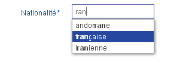

# Le composant d'Auto-Completion

## Principe

Le composant `AutoComplete` (ou composant de complètement automatique) est une aide à la saisie.

Il permet à l'utilisateur de limiter la quantité d'informations qu'il saisit avec son clavier, en se voyant proposer un complément qui pourrait convenir à la chaîne de caractères qu'il a commencé à taper.

Le composant se présente sous la forme d'un champ de saisie texte classique. A chaque saisie d’un caractère par l’utilisateur, une liste de proposition se déploie sous le champ texte. Elle contient les occurrences correspondant à la saisie. Un clic sur une occurrence permet de la sélectionner.

Exemple:



## Accès au composant

Exemple de formulaire utilisant ce composant:

```javascript
var HornetAutoCompleteField = require("hornet-js-components/src/auto-complete/auto-complete-field");

var configurationObj={...};
var form = forms.Form.extend({
  nationalite: HornetAutoCompleteField(configurationObj)
});
```

## Configuration du composant

Le composant se configure par le biais de l'objet "classique" du **field newForms**.

Exemple:

```javascript
var AutoCompleteField = require("hornet-js-components/src/auto-complete/auto-complete-field");

var form = newforms.Form.extend({
    
	champExemple: HornetAutoCompleteField({
	            store: {
	                class: MyStore,
	                functionName: "getMyChoices"
	            },
	            actionClass: require("src/actions/exemple/actions").DoAction,
	            label: intlMessages.fields.exemple.label,
	            required: true,
	            errorMessages: {
	                required: intlMessages.fields.exemple.required
	            },
	            i18n: intlMessages.fields.exemple.autoComplete
	        }),
	        
   ...   
```

Les paramètres suivants sont spécifiques à ce composant:

- **store**

Un objet contenant les attributs suivants:

| Paramètre | Description |
|------- | ----------- |
| class | La classe d'un objet Store. Le composant s'enregistre auprès de ce store afin de récupérer les nouvelles valeurs à présenter à l'utilisateur |
| functionName | Le nom de la fonction à appeler pour récupérer les valeurs à présenter à l'utilisateur. Cette fonction est appelée sans argument et elle doit retourner un tableau d'objets comportant les attributs suivants:<br/>`value`: L'identifiant dans la liste de choix. <br/>`text`: Le libellé à présenter à l'utilisateur

- **actionClass**

Une classe étendant la classe de base: `Action`.

Lorsque l'utilisateur saisie de nouvelles valeurs, le composant instancie et lance cette action avec le `payload` suivant:

| Paramètre | Description |
|------- | ----------- |
| value | La valeur actuellement saisie par l'utilisateur |
| maxElements | Le nombre d'éléments maximum à retourner |

Note: Afin de limiter le nombre d'appels, cette action n'est pas exécutée à chaque frappe clavier mais lorsque l'utilisateur n'a pas modifié sa saisie depuis un certain nombre de millisecondes (500ms par défaut).

Pour respecter le pattern `flux`, l'action doit en retour modifier le `store` utilisé par le composant pour que ce dernier se rafraichisse.

- **i18n**

Un objet contenant le texte à afficher dans la langue courante de l'utilisateur. Cet objet doit contenir les attributs suivants:

| Paramètre | Description |
|------- | ----------- |
| inputWidgetTitle | Le texte à afficher au survol de la souris sur le champ d'input en saisie libre |

## Listing des input générés par le composant

*Note: fieldName =  Nom de la variable correspondant au champ **newForms** (Exemple: voir `champExemple` ci-dessus)*

| Nom | Type | Description |
|------- | ----------- |
| fieldName | hidden | Contient l'id de la valeur sélectionnée dans la liste de choix|
| fieldName + `$text` | text | Le champ de saisie libre|


