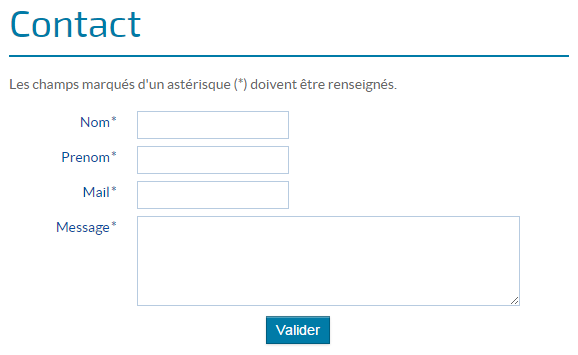
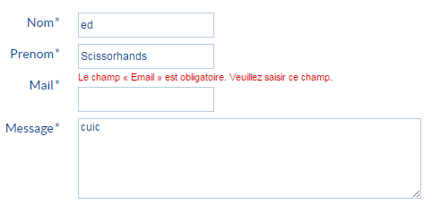
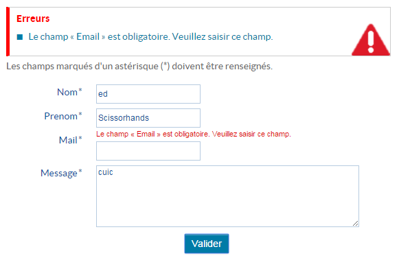
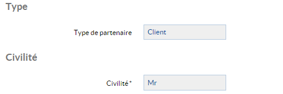
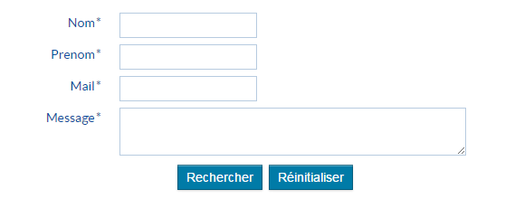
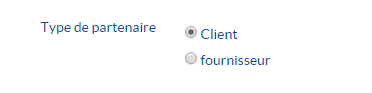

# Les composants formulaires

`HornetForm` est un composant qui permet de créer simplement et de manière homogène des formulaires de saisie en respectant les dispositions d'accessibilité.

Exemple de formulaire simple :



## Présentation du formulaire

Pour préparer un nouveau formulaire sur la base d'un `HornetForm`, on prépare la structure du formulaire et on définit un constructeur héritant du composant `newforms.Form`. Pour chaque champ, on précise son type `newforms` (ci-dessous un exemple avec deux champs de type CharField).

Exemple :

```javascript
import newforms = require("newforms");  
var form = newforms.Form.extend({  
    nom: newforms.CharField({  
        required: true,  
        errorMessages: {required: "Le champ « Nom » est obligatoire."}  
    }),  
    prenom: newforms.CharField({  
        required: true,  
        errorMessages: {required: "Le champ « Prénom » est obligatoire."}  
    }),  
});  
export = form;  
```

Descriptif des attributs du composant formulaire Hornet :

| attribut                | description                                                                                    | valeur par défaut |
| ----------------------- | ---------------------------------------------------------------------------------------------- | ----------------- |
| form                    | Instance de formulaire newforms ou constructeur newforms                                       |                   |
| formConf                | Configuration newforms                                                                         | {}                |
| isModal                 | Indique si le formulaire est inclus dans une fenêtre modale.                                   | false             |
| onSubmit                | Fonction déclenchée lors de la soumission du formulaire                                        | function(){}      |
| buttons                 | Configurations de boutons. Les boutons par défaut seront utilisés si cette propriété est vide. |                   |
| readOnly                | Indique si le formulaire est en lecture seule : dans ce cas aucun champ n'est modifiable.      | false             |
| markRequired            | Lorsqu'égal à false, les libellés des champs obligatoires ne sont pas marqués avec un astérisque | true            |
| isMandatoryFieldsHidden | Lorsque mis à true, le message d'information concernant les champs obligatoires est masqué     | false             |
| subTitle                | Sous-titre éventuel                                                                            | null              |
| text                    | Texte descriptif éventuel                                                                      |                   |
| formClassName           | Nom de la classe CSS à affecter au formulaire.                                                 | "formRecherche"   |
| imgFilePath             | Surcharge de l'url des images (ex. : http://localhost:7777/default), notamment les icônes indiquant la présence d'une infobulle. Il faut que les images se situent au même niveau d'arborescence que celles du thème default et que leurs noms soient identiques (ex. : "/img/tooltip/ico_tooltip.png"). | |

Il existe d'autres types de champs :

```
DateField               RegexField                ComboField
DateTimeField           SlugField                 IntegerField
TimeField               URLField                  DecimalField
BooleanField            ChoiceField               FloatField
NullBooleanField        FilePathField             FileField
CharField               MultipleChoiceField       ImageField
EmailField              TypedMultipleChoiceField  MultiValueField
GenericIPAddressField   TypedChoiceField          SplitDateTimeField
IPAddressField
```

Chaque type de champ a sa propre validation. Par exemple, le champ Email valide le contenu avec une expression régulière, et le champ CharField valide le contenu avec deux attributs `maxLength` et `minLength`.

[La liste complète de chaque type de champ avec sa description.](http://newforms.readthedocs.org/en/latest/fields.html#built-in-field-types)

## Le formulaire React

Pour utiliser `HornetForm` dans la page `React`, il faut l'écrire dans la méthode `render`.

Exemple :

```javascript
var utils = require("hornet-js-utils");
var React = require("react");
var logger = utils.getLogger("monappli.views.exemple");
var HornetComponentMixin = require("hornet-js-core/src/mixins/react-mixins");
var newforms = require("newforms"),
var HornetFormForm = require("hornet-js-components/src/form/form");
var HornetGridForm = require("hornet-js-components/src/form/grid-form");
var Row = GridForm.Row;
var Field = GridForm.Field;

var ExampleForm = newforms.Form.extend({
    nom: newforms.CharField({
        required: true,
        errorMessages: {required: "Le champ « Nom » est obligatoire. Veuillez saisir ce champ."}
    }),
    prenom: newforms.CharField({
        required: true,
        errorMessages: {required: "Le champ « Prénom » est obligatoire. Veuillez saisir ce champ."}
    }),
    errorCssClass: "error",
    requiredCssClass: "required",
    validCssClass: "valid"
});

var ExamplePage = React.createClass({
    mixins: [HornetComponentMixin],
    render: function () {
        logger.info("render - form");
        
        var formConf = {
            data:{"nom":"test"}   
        }
        
        return (
            <div>
                <h2>Exemple</h2>
                <HornetFormForm
                    form={ExampleForm}
                    formConf={formConf}
                    id="exampleForm"
                    onSubmit={this.onSubmit}>
                    <Row>
                        <Field name="nom" />
                        <Field name="prenom" />
                    </Row>
                </Form>
            </div>
        );
    },
    
    onSubmit: function () {
        logger.info("Submit du formulaire");
        
    },
});

module.exports = ExamplePage;
```

## Configuration du formulaire

Dans l'exemple d'utilisation du composant `HornetForm` ci-dessus, on passe en guise de props une configuration `formConf` :

```
var formConf = {
    data:{
        "nom":"test",
        "dateDebut": ""
    }   
}
```

Dans cet exemple, on initialise les valeurs par défaut des champs du formulaire. 

Si l'on souhaite manipuler un `datePicker` sans valeur par défaut, il est **impératif** de lui attribuer une valeur par défaut à **chaine vide**. 

## Transmission du formulaire au composant HornetForm

Sur le même principe que le composant `RenderForm` fourni par `newForms`, HornetForm est capable de prendre de deux manières le formulaire en entrée :

Par une instance : dans ce cas la propriété `form` est directement une version instanciée d'un formulaire newforms. Aucune modification n'est alors apportée sur l'instance.

Par une classe (cas de l'exemple ci-dessus) : dans ce cas la propriété `form` est un constructeur newforms et le formulaire est instancié en lui passant le contenu de la propriété `formConf` et en alimentant les attributs suivants :

- `onChange` afin de rendre automatiquement le composant à chaque modification du formulaire
- `validation` : "manual", afin que la validation soit effectuée uniquement lors de la soumission du formulaire, et pas à chaque modification de champ
- `controlled` : "true", afin que les modifications de valeur de champ réalisées "programmatiquement" génèrent bien un rendu du champ

La transmission par classe est préférée car elle permet de ne re-rendre que le formulaire plutôt que toute la page à chaque modification d'un champ.

## Validation

Le Texte renseigné dans `errorMessages` s'affichera lorsque la condition sur le champ n'est pas remplie.

Exemple avec une adresse mail non valide et un formulaire en validation `auto` : le message apparaît à la saisie du champ.



Lors de la soumission du formulaire, une autre validation est faite et affiche un cartouche de messages correspondant aux erreurs produites.

Exemple avec un formulaire en validation `auto` ou `manual` : 



Par défaut, la propriété `validation` du formulaire est `manual` :  le contrôle de surface de chacun des champs n'est effectué que lors de la validation du formulaire via le bouton `valider`.

Si l'on souhaite valider les champs à la saisie, la configuration se fait en deux temps :

- lors de l'instanciation du formulaire, il faut passer la propriété `willValidate` du form à `true`
- il faut valoriser la propriété `validation` du formulaire à `auto`. La propriété `validation` peut également prendre en paramètre un objet :
 
```javascript
validation: {
    on: "blur change",
    onChangeDelay: 369
}
```

## Evènements

Lorsque l'utilisateur clique sur le bouton valider, la fonction passée dans la propriété `onSubmit` est appelée. Cette fonction est appelée avec l'instance du formulaire `newforms` en paramètre.

Afin de protéger contre la double validation de formulaires, cette fonction n'est pas forcément appelée à chaque action de l'utilisateur. Le mixin `HornetComponentMixin` est utilisé (fonction `debounce`) afin d'effectuer cette protection.

## Formulaire en lecture seule

Un formulaire Hornet peut être utilisé pour présenter des données en lecture seule. C'est le cas par exemple pour la consulation de fiche partenaire dans l'application tutoriel.  

Dans ce cas la propriété readOnly du formulaire doit être valorisée à `true`.  

De plus, le rendu en lecture seule des champs de type bouton radio, liste déroulante, ou auto-complétion peut être modifié de façon à afficher uniquement la valeur sélectionnée sous la forme d'un libellé simple. Pour cela, la propriété `custom` du champ doit être alimentée de la façon suivante :

```javascript
 custom: {
     useReadOnlyWidget: true
 },     
```

Exemple de rendu en lecture seule :

* `Type` : en modification, il s'agit d'un choix entre deux boutons radio
* `Civilite` : en modification, il s'agit d'une liste déroulante



## Champs de formulaire en lecture seule

Lorsqu'un formulaire n'est pas en lecture seule, il est tout de même possible de mettre uniquement certains champs ou groupes de champs en lecture seule. 

Pour cela, la propriété `readOnly` de l'élément de formulaire (composant `Field`) doit être valorisée à `true`. Il est possible de valoriser cette propriété sur un groupe de champs (composants `tabs`, `tab`, `FieldSet` ou `Row`). Dans ce cas tous les champs du groupe sont en lecture seule.

Règle de transmission de la propriété `readOnly` :

* `parent.readOnly` == true : les enfants sont aussi en lecture seule, quelle que soit la valeur éventuelle de leur propriété readOnly
* `parent.readOnly` == false ou indéfini : les enfants sont par défaut en modification, mais peuvent être en lecture seule si leur propriété `readOnly` est explicitement définie à true.

Lorsqu'un champ est en lecture seule, toute validation est désactivée sur ce champ.

En cas de modification dynamique de la propriété `readOnly` d'un champ avant soumission du formulaire :

* passage en lecture seule :
  * la validation est désactivée pour le champ
  * la valeur initiale du champ est rétablie
* passage en modification :
  * la validation est rétablie pour le champ
	
**Important :** les champs dont la propriété `readOnly` est susceptible d'être modifiée dynamiquement doivent avoir leur propriété `controlled` valorisée à `true`, ou le formulaire auquel ils appartiennent doit avoir cette propriété `controlled` valorisée à `true`. Sinon lors du passage en lecture seule, le rendu à l'écran ne sera pas correctement rafraîchi.

Exemples :

Champ en lecture seule, ou modifiable, selon un état :

```javascript
<Row>
	<Field name="pays"/>
	{/* Modification dynamique de la propriété readOnly selon la sélection du pays */}
	<Field name="ville" readOnly={this.state.villeReadOnly}/>
</Row>	
```

Groupe de champs en lecture seule :

```javascript
<FieldSet name={this.state.i18n.form.sectionCoordAssistance} readOnly={this._editContactOnly()}>
	<Row>
		<Field name="assistNom"/>
		<Field name="assistPrenom"/>
	</Row>
	<Row>
		<Field groupClass="pure-u-1-2" name="assistTel"/>
	</Row>
	<Row>
		<Field labelClass="pure-u-1-4" name="assistCourriel"/>
	</Row>
</FieldSet>
```

## Boutons

Les formulaires du framework Hornet sont préconfigurés avec deux boutons par défaut : `Valider` et `Annuler`. Il est possible de définir ses propres boutons grâce à la propriété `buttons` de `HornetForm`.



Exemple de configuration ave un seul bouton `Valider` :

```javascript
getDefaultButtons() {
    return [{
        "type": "submit",
        "id": "envoi",
        "name": "action:envoi",
        "value": "Valider",
        "className": "hornet-button",
        "label": this.i18n("form.valid"),
        "title": this.state.i18n.form.validTitle
    }];

}
```

## Style CSS

Par défaut les formulaires Hornet ont la classe CSS `formRecherche`. Celle-ci est utilisée dans le thème et peut donc être complétée. La classe CSS d'un formulaire peut également être personnalisée grâce à la propriété `formClassName`.

## Formulaire dans une fenêtre modale

Lorsqu'un formulaire Hornet est destiné à être affiché dans une fenêtre modale, la propriété `isModal` doit avoir la valeur `true`, pour permettre un affichage correct des notifications éventuellement générées lors de la validation.

## Message d'information sur les champs obligatoires

Par défaut le message "Les champs marqués d'un astérisque (\*) doivent être renseignés." est affiché en début de formulaire (clé de message internationalisé : `form.fillField`). Il est possible de masquer ce message en assignant la valeur `true` à la propriété `isMandatoryFieldsHidden` d'un formulaire Hornet.

Ce message est aussi masqué lorsque les champs obligatoires ne sont pas marqués avec un astérisque (propriété `markRequired` valorisée à `true` sur le formulaire).

## Marquage des champs obligatoires

Par défaut les libellés des champs obligatoires sont marqués avec un astérisque (\*). Il est possible de ne pas afficher cet astérique en valorisant la propriété `markRequired` du formulaire à `false`.

## Préfixe et/ou d'un suffixe sur un champ

Il peut être nécessaire d'ajouter un préfixe et/ou un suffixe à certains champs de formulaire, par exemple pour indiquer la civilité ou l'unité de saisie. Il suffit pour cela de valoriser la propriété `prefix` et/ou la propriété `suffix` sur le champ.

**A noter** : les classes CSS des blocs préfixe et suffixe générés sont respectivement `field-prefix` et `field-suffix`.

Exemples :

 - Chaîne de caractère ajoutée en préfixe :

```xml
<Field prefix="M." name="nom"/>
```

 - Chaîne de caractère ajoutée en suffixe :

```xml
<Field name="taille" suffix="cm"/>
```

 - Bloc ajouté en préfixe :

```xml
<Field prefix={<strong>M.</strong>} name="nom"/>
```

 - Bloc ajouté en suffixe :

```xml
<Field name="taille" suffix={<strong>cm</strong>} />
```

## Boutons radio

Le type de composant newforms utilisé pour des boutons radio est `ChoiceField`. Exemple avec le champ "Type" de la fiche partenaire dans l'application tutoriel :

```javascript
isClient: newforms.ChoiceField({
    custom: {
        useReadOnlyWidget: true
    },
    required: false,
    widget: newforms.RadioSelect,
    label: intlMessages.fields.isClient.label,
    choices: [[true, intlMessages.fields.isClient.clientLabel], [false, intlMessages.fields.isClient.fournisseurLabel]]
}),
```

Rendu :


