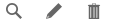

# Le composant Icône

## Description 

Le composant `HornetIcone` produit un élément de type `img` dans un lien.



## Utilisation

Il doit être initialisé avec une structure javascript comme suit :

```javascript
var props = {
    url:"/urldestination",
    alt: "text alternatif image",
    title: "titre",
    src: "#",
    classLink: "classLien",
    idImg: "idImg",
    classImg: "classImage",
    idLink: "idImg",
    target: string,
    onClick: function() {console.log("onClick")};
};
```

| attribut   | description                                         |
| ---------- | --------------------------------------------------- |
| url        | lien de destination sur clic                        |
| alt        | test alternatif en cas de non chargement de l'image |
| title      | titre du composant                                  |
| src        | url de l'image à afficher                           |
| classLink  | style appliqué sur le lien                          |
| idImg      | id de l'élément 'img'                               |
| classImg   | style appliqué sur l'élément 'img'                  |
| idLink     | id de l'élément 'a'                                 |
| target     | target de l'élément 'a'                             |
| onClick    | fonction exécutée sur le click de l'élément 'a'     |
[HornetIcon - attributs]

```xml
import HornetIcon = require("hornet-js-components/src/icon/icon");

<HornetIcon url={props.url} alt={props.alt}
  title={props.title} src={props.src} />
```
