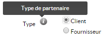

# Le composant Infobulle

## Description

Le composant `HornetToolTip` affiche une icône d'information qui laisse apparaitre une infobulle au survol du pointeur et produit un élément `span`  contenant un élément `img`.



## Utilisation

| attribut   | description                                         | valeur par défaut                                |
| ---------- | --------------------------------------------------- | ------------------------------------------------ |
| src        | url de l'image à afficher                           | this.genUrlTheme("/img/tooltip/ico_tooltip.png") |
| icoToolTip | url de l'image dans le théme                        | /img/tooltip/ico_tooltip.png                     |
| alt        | propriété alt de l'image                            |                                                  |
| idImg      | id de l'élément 'img'                               |                                                  |
| classImg   | style appliqué sur l'élément 'img'                  | imgTooltip                                       |
| idSpan     | id de l'élément 'span'                              |                                                  |
| classSpan  | style appliqué sur l'élément 'span'                 | tooltip                                          |

```xml
import ToolTip = require("hornet-js-components/src/tool-tip/tool-tip");

<HornetToolTip alt="Texte infobulle" />
```

Le composant infobulle peut être activé sur un champ de formulaire lorsque la balise `tooltip` est renseignée.Le positionnement de l'infobulle est en haut de l'icône 'i' placé à coté du champ.

Le dispatcher doit être positionné afin d'avoir accès à la méthode de récupération de l'url du thème.

```xml
<Field name="Test" tooltip="Texte infobulle" />
```
