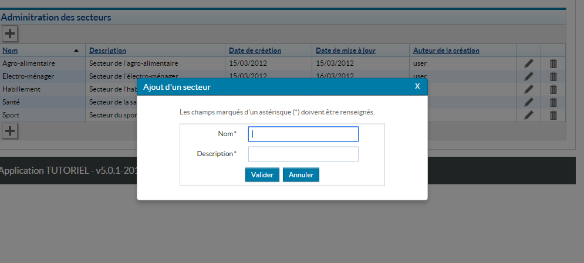

# Le composant Modale

Le composant `HornetModal` affiche un contenu `HTML` dans une `popup`.

Dans cet exemple un formulaire et ses boutons sont affichés :



Le composant `HornetModal` doit contenir les éléments à afficher. Il possède plusieurs attributs qui déterminent son affichage ou son comportement.

La page qui utilise ce composant a la charge d'afficher ou non la popup grâce à l'attribut `isVisible`.

Par exemple, la page fournit une méthode à `Modal` par l'attribut `onClickClose`. Cette méthode aura la charge de fermer ou non la boîte de dialogue.

## Utilisation

Dans l'exemple suivant, la popup affiche un formulaire et ses boutons : 

```javascript
import HornetModal = require("hornet-js-components/src/dialog/modal");

<HornetModal  isVisible={this.state.isModalOpen} onClickClose={this._onClose} >
	<div style={styleFormDlx}>
		<HornetForm
			form={this.state.form}
			labelSuffix=""
			title='Test HornetForm into modal'
			boutons={this.getDefaultButtons()}
			onSubmit={this._onSubmitEdition}>
				<Row>
					<Field name="nom" labelClass={"pure-u-1-3"}/>
				</Row>
				<Row>
					<Field name="desc" labelClass={"pure-u-1-3"}/>
				</Row>
		</HornetForm>
	</div>
</HornetModal>
```

La méthode ci-dessous est passée au composant `Modal` et appelée lorsque l'utilisateur clique sur la croix.

Le `state` de la page est alors mis à jour, provoquant un render et la fermeture de la dialogue.

```javascript
_onClose: function (e) {       
    this.setState({
        isModalOpen : false
    });
},
```

Les attributs proposés par le composant:

| attribut | obligatoire | description |
| -------- | ----------- | ----------- |
| isVisible | X | Détermine si la boîte de dialogue est à afficher ou non |
| title |  |Titre de la boîte de dialogue |
| onClickClose |   | Passer la méthode à appeler lorsque l'utilisateur clique sur la croix (en haut à droite)  |
| className| | Nom de la classe |
| hideTitleBar | | Détermine si le titre boîte de dialogue est affiché ou non |
| hideCloseBar | | Détermine si le bandeau bas contentant le bouton de fermeture de la boîte de dialogue est affiché ou non |
| closeLabel | |  Titre du bouton de fermeture |
| closeSymbole | | Contenu du bouton de fermeture |
| underlayClass| | Nom de la classe appliquée à la div de contenu |
| initialFocus | | Noeud du DOM ou sélecteur CSS de l'élément portant le focus à l'ouverture |
| alert |  | Détermine la nature de la boîte de dialogue (role) |
| underlayClickExits |  | Détermine si le click à l'extèrieur ferme la boîte de dialogue ou non |
| escapeKeyExits |  | Détermine si la touche 'Echap' ferme la boîte de dialogue ou non |
| verticallyCenter |  | Détermine si la boîte de dialogue est centrée verticalement |
| focusDialog |  | Détermine si la boîte de dialogue peut avoir le Focus |
| manageFocus |  | Détermine si la boîte de dialogue gère le focus de ses éléments |
| onShow | | Passer la méthode à appeler à l'affichage du composant |
        
Si l'attribut `underlayClickExits`, n'est pas valorisé à `true` **la popup est modale**.

Pour la rendre NON modal, passer `underlayClickExits` à `true` et une méthode à `onClickClose` qui va modifier le state de la page et la valeur de l'attribut `isVisible` de `HornetDialog`.

Par défaut, la popup s'affiche au milieu de l'écran, il est possible de modifier sa position en passant une classe. La position sera toujours relative au coin haut/gauche de l'écran.
