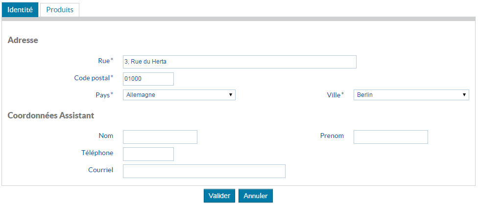

# Les composants Onglet

## Description

Tous les éléments d’onglet `HornetTabs` et  `HornetTab` sont chargés dans la page, l’affichage sous forme d’onglet est ensuite réalisé si le JavaScript est activé. Un composant d’onglet consiste en une liste de liens qui ciblent des éléments de contenu.



## Utilisation

| attribut         | description                                         | valeur par défaut                                |
| ---------------- | --------------------------------------------------- | ------------------------------------------------ |
| tabId            | préfixe des id's de chaque onglet                   | tab                                              |
| panelId          | préfixe des id's de chaque div contenant l'onglet   | panel                                            |
| selectedTabIndex | index de l'onglet à afficher                        | 0                                                |
| title            | titre de l'onglet                                   |                                                  |

Dans notre exemple, le formulaire est inclus dans le premier des deux onglets.

```javascript
var HornetTabs = require("hornet-js-components/src/tab/tabs");
var HornetTab = require("hornet-js-components/src/tab/tab");

<HornetTabs selectedTabIndex={0}>
    <HornetTab title="Identité" >
        <HornetForm
            form={this.state.form}
            titre={titre}
            labelSuffix=""
            formClassName=""
            action ={this.state.urlAction}
            boutons={this.state.buttons}
            onSubmit={this._onSubmit}
            readOnly={this.state.readOnly}>
            <FieldSet name="Adresse">
                <Row>
                    <Field labelClass={"pure-u-1-4"} fieldClass={"pure-u-1-2"} name="proAdrRue"/>
                </Row>
                <Row>
                    <Field spans="2" name="proAdrCP"/>
                </Row>
                <Row>
                    <Field  name="pays" />
                    <Field  name="ville" />
                </Row>
            </FieldSet>
            <FieldSet name="Coordonnées Assistant">
                <Row>
                    <Field  name="assistNom"/>
                    <Field  name="assistPrenom"/>
                </Row>
                <Row>
                    <Field spans="2" name="assistTel"/>
                </Row>
                <Row>
                    <Field labelClass={"pure-u-1-4"} fieldClass={"pure-u-1-2"} name="assistCourriel"/>
                </Row>
            </FieldSet>
        </HornetForm>
   	</HornetTab>
    <HornetTab titre="Produits">
        <h5>Liste des produits</h5>
    </HornetTab>
</HornetTabs>   
```
