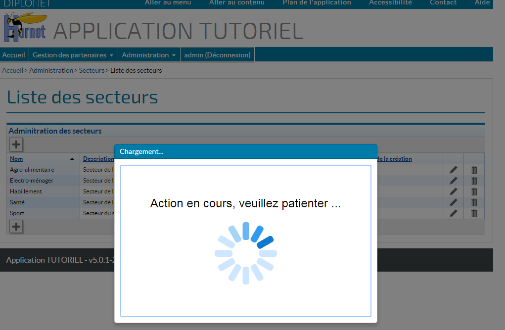

# Le composant Spinner

## Principe

Le composant `HornetSpinner` (ou composant d'affichage de chargement en cours) est une indication visuelle qu'une action est en cours et que l'utilisateur doit patienter.

En s'affichant en premier plan, il empêche toute autre action de l'utilisateur.



### Principe technique

Ce composant utilise le store `flux-informations-store` afin de savoir quand des actions sont en cours.

Ce store est alimenté automatiquement par des évènements :

- Au début et à la fin de chaque action (géré automatiquement par le framework hornet)
- Au début et à la fin du chargement de routes en lazy loading (géré automatiquement par le framework hornet)

*Note: Il est envisageable d'utiliser ce store pour d'autres besoins de monitoring.*

## Accès au composant

Le composant React est accessible par un require: 

```xml
var HornetSpinner = require("hornet-js-component/src/spinner/spinner");
```

Il doit être inclus **une seule fois** dans la fonction de rendu de la page principale (HornetApp.jsx par défaut).

## Configuration du composant

Le composant se configure à travers des propriétés et des composants React fils.

**Les propriétés:**

| Paramètre | Description | Obligatoire | Valeur par défaut |
|---------- | ----------- |------------ | ----------------- |
| scheduleDelayInMs | Le temps (en millisecondes) entre le moment où le composant est prévenu d'une action en cours et le temps où il va réellement vérifier s'il doit s'afficher. Cette configuration permet d'éviter de faire clignoter le composant quand des actions s'enchainent rapidement.<br/> | Non | 300 |
| minimalShowTimeInMs | Le temps minimal (en millisecondes) durant lequel le composant doit rester affiché. Cette configuration permet de maintenir un temps d'affichage correct à l'utilisateur tout en permettant un temps de reaction rapide grâce au paramètre précédent. | Non | 500 |
| loadingTitle | Titre du panel | Non | Chargement... |
| loadingText | Message à afficher | Non | Action en cours, veuillez patienter ... |
| imageLoadingUrl | Url de l'image à afficher | Non | this.genUrlTheme("/img/spinner/ajax_loader_blue_128.gif") |

**Les composants fils :**

Ils permettent de personnaliser le contenu modal du spinner.

**Exemple d'utilisation :**

```xml
<HornetSpinner scheduleDelayInMs={250} minimalShowTimeInMs={500}>
   <h1>
       "Chargement en cours"
   </h1>
   
</HornetSpinner>
```
ou tout simplement

```xml
<HornetSpinner />
```
 