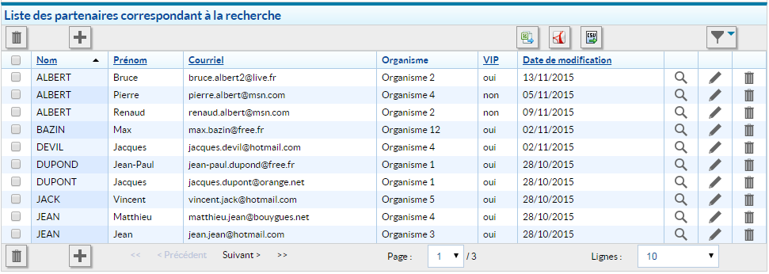
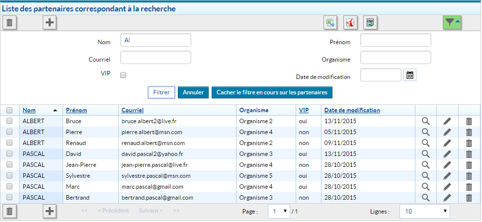
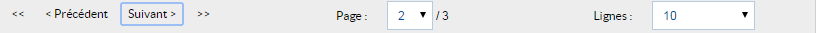

# Composant Tableau

## Description

Génération d'un tableau HTML (valide W3C) avec des données. 



## Architecture

### Composants

Le composant `Table` est constitué de sous-composants:

- `table` : composant global de gestion du tableau
- `table-caption` : gestion de la légende du tableau (balise HTML caption)
- `table-content` : contient le corps du tableau
- `table-filters` : crée autant de champs (champs texte, champs date, cases à cocher...) qu'il y a de colonnes afin de pouvoir filtrer la recherche effectuée préalablement
- `table-header-column` : gestion des entêtes du tableau
- `table-header-mass` : gestion de l'action de masse dans l'entête du tableau
- `table-header` : composant regroupant les différents types d'entêtes
- `table-row` : représentation d'une ligne dans le tableau
- `table-rows` : composant composite gérant toutes les lignes du tableau
- `table-title` : composant de titre du tableau
- `table-tools-action-add` : action d'ajout d'élément au tableau
- `table-tools-action-export-button` : gestion des exports spécifiques du tableau : CSV, XLS, PDF
- `table-tools-action-export` : gestion des exports du tableau
- `table-tools-action-filter` : gestion de l'icône de filtre du tableau
- `table-tools-action-mass` : bouton d'action de suppression en masse des élements du tableau
- `table-tools-action-pagination` : permet la génération des boutons `premier`, `précédent`, `suivant`, `dernier` afin de naviguer au sein du tableau. Il va également générer un champ texte modifiable indiquant la page courante. Enfin, il créé une liste déroulante proposant le nombre de lignes à afficher par page.
- `table-tools-bottom` : permet la création des actions/actions de masse en dessous du tableau
- `table-tools-top` : permet la génération des actions/actions de masse au dessus du tableau

### Action `TableActions`

La classe `TableActions` dispose de 6 actions : 

- `SaveState`: sauvegarde de l'état du tableau
- `ResetTableStore`: réinitialisation du TableStore
- `SavePagination`: Sauvegarde de la pagination du tableau
- `SaveSelectedItems`: Sauvegarde des élements selectionnés
- `SaveTableFilters`: Sauvegarde des filtres du tableau
- `SortData`: Tri tableau côté client via la définition de la propriété dispatchSortingEvent

### Store `TableStore`

Le store `TableStore` dispose de deux handlers :

- `RECEIVE_UPDATE_DATA` : met à jour les données du store pour un tableau spécifique 
- `RESET_TABLE_DATA` : réinitialise le store complet pour un tableau spécifique

## Utilisation

Le tableau produit un élément HTML de type `table`. Il doit être initialisé comme suit :

```xml
var HornetTable = require("hornet-js-components/src/table/table");

<HornetTable
    config={tableConfig}
    isVisible={true}
/>
```

**Les propriétés du composant tableau Hornet :**

| Paramètre | Description | Obligatoire | Valeur par défaut |
|------- | ----------- |----------- | ----------------- |
| config | Un objet JSON de configuration | Oui | |
| isVisible | Indique si le tableau doit être affiché | Non | true |
| toggleFilters | Surcharge la fonction chargée de masquer/afficher les filtres | Non | |
| activateFilters | Surcharge la fonction chargée de colorier le bouton togglefiltre| Non | |
| openDeleteAlert | Surcharge la fonction chargée d'afficher la boîte de dialogue de confirmation de suppression | Non | |
| onChangePaginationData | Surcharge la fonction déclenchée lors d'une mise à jour de la pagination | Non | |
| onChangeSortData | Surcharge la fonction déclenchée lors d'une mise à jour du tri de colonne | Non | |
| onChangeSelectedItems | Surcharge la fonction déclenchée lors de la sélection de lignes via les cases à cocher d'action de masse | Non |  |

L'objet de configuration se présente comme suit:

```javascript
var tableConfig = {
    name: appName,
    columns: {
        nom: {
            title: intlTab.colonnes.nom,
            sort: "text",
            filter: {
                type: "text"
            }
        },
        prenom: {
            title: intlTab.colonnes.prenom,
            sort: "text",
            filter: {
                type: "text"
            }
        },
        proCourriel: {
            title: intlTab.colonnes.courriel,
            sort: "text",
            filter: {
                type: "text"
            }
        },
        organisme: {
            title: intlTab.colonnes.organisme,
            filter: {
                type: "text"
            }
        },
        labelIsVIP: {
            title: intlTab.colonnes.labelIsVIP,
            sort: {
                by: "VIP",
                type: "text"
            },
            filter: {
                type: "checkbox"
            }
        },
        dateModif: {
            title: intlTab.colonnes.dateModif,
            render: this._getDateFormatee,
            sort: "timestamp",
            filter: {
                type: "date",
                errorValidation: intlTab.colonnes.dateModifInvalid
            }
        },
        consulter: {
            title: "",
            render: this.getIconeConsulter,
            custom: true
        },
        modifier: {
            title: "",
            render: this.getIconeModifier,
            hide: true,
            custom: true
        },
        supprimer: {
            title: "",
            render: this.getIconeSupprimer,
            hide: true,
            custom: true
        }
    },
    messages: {
        tableTitle: intlTab.tableTitle,
        emptyResult: intlTab.emptyResult,
        deleteAllConfirmation: intlTab.deleteAllConfirmation,
        deleteAllActionTitle: intlTab.deleteAllActionTitle,
        deleteAllTitle: intlTab.deleteAllActionTitle,
        captionText: intlTab.captionText,
        addTitle: intlTab.addTitle,
        filterValid: intlTab.filterValid,
        filterValidTitle: intlTab.filterValidTitle,
        filterCancel: intlTab.filterCancel,
        filterCancelTitle: intlTab.filterCancelTitle,
        hideFiltering: intlTab.hideFiltering,
        hideFilteringTitle: intlTab.hideFilteringTitle,
        hideFilter: intlTab.hideFilter,
        hideFilterTitle: intlTab.hideFilterTitle,
        showFilter: intlTab.showFilter,
        showFiltering: intlTab.showFiltering,
        selectedAllTitle: intlTab.selectedAllTitle,
        deselectedAllTitle: intlTab.deselectedAllTitle,
        exportTitle: intlTab.exportTitle
    },
    store: RecherchePartenaireStore,
    options: {
        itemsPerPage: 10,
        hasFilter: true,
        clientSideSorting: false,
        hasExportButtons: true,
        hasAddButton: false,
        hasDelAllButton: false,
        defaultSort: {
            key: "nom",
            dir: "ASC",
            type: "text"
        }
    },
    routes: {
        search: this.genUrl("/partenaires/rechercher"),
        add: this.genUrl("/partenaires/creer"),
        export: this.genUrl("services/partenaires/export"),
        deleteAll: this.genUrl("/partenaires/supprimer/0")
    },
    pageSizeSelect : [
        {value: 10, textKey: "10"},
        {value: 50, textKey: "50"},
        {value: 100, textKey: "100"},
        {value: -1, textKey: "displayAll"}
    ],
    imgFilePath: "http://localhost:7777/default"
};
```

| Attribut | Description | Obligatoire |
| ------- | ----------- | ------- |
| name | Clé technique du Tableau. Elle est (entre autre) utilisée en guise de clé de tableau pour mettre en session les données du formulaire de recherche ainsi que pour les données de pagination  | X |
| columns | Objet permettant la description de chacune des colonnes | X |
| messages | Déclaration des différents messages du tableau (titre, message sans résultats...) | |
| dispatchEvent | Evènement utilisé lors du tri côté client | |
| store | Store métier utilisé pour récupérer chaque ligne du tableau | X |
| options | Définit les fonctionnalités à afficher dans le tableau | X |
| pageSizeSelect | Tableau de choix de taille de page proposés | |
| actions | Actions liées au tableau | |
| routes | Définit les routes liées aux options permettant de générer les actions | X |
| imgFilePath | Surcharge de l'url des images (ex: http://localhost:7777/default). Il faut que les images se situent au même niveau d'arborescence que celles du thème default et que leurs noms soient identiques (ex: "/img/tableau/ico_ajouter.png"). | |

### Description des colonnes

La déclaration d'une colonne se fait de la manière suivante:

```javascript
/* nom => clé de colonne - elle doit concorder avec une clé de colonne des items retournés par le service */
    dateModif: {
        title: "Date de modification", // Titre que portera la colonne
        sort: "timestamp", // Tri sur la colonne - valeurs possibles: text/timestamp
        filter: {
            type: "date" // Filtre associé à la colonne - le type peut prendre les valeurs suivantes: text/date/checkbox
            errorValidation: intlTab.colonnes.dateModifInvalid
        },
        render: this.customRender // si la propriété 'render' est valorisée, il est alors possible d'avoir un rendu personnalisé pour les cellules de la colonne        
        hide: true, //permet de masquer la colonne, ex : action avec droits spécifique
        custom: true // permet d'attribuer un élément custom css sur la cellule du tableau : hornet-datatable-cell-custom et hornet-datatable-cell-custom-[column-key]
    },
```

L'objet `columns` décrit dans l'objet de configuration du composant `Table` permet de détailler l'ensemble des colonnes du tableau, ainsi que leurs spécificités quant aux tris, filtres, etc...

Pour une colonne donnée, la configuration est la suivante:

| attribut | description | obligatoire |
| ------- | ----------- | ------- |
| title | Label visible à l'écran | |
| sort | Définit le type de la colonne à trier.<br/> Valeurs autorisées : "text", "timestamp" | |
| filter | Définit le champ à générer pour les filtres à appliquer. Un type doit être spécifié afin de déterminer quel champ (select, input... sera généré).<br/> Les types autorisés sont: "text", "checkbox", "date" | |
| render | Dans le cas où l'on souhaite avoir un rendu particulier (ex: génération d'un icône d'action unitaire : afficher/supprimer/éditer) une méthode spécifique peut être utilisée | |
| hide | Permet de cacher des colonnes, ex : affichage de colonne en fonction des droits | |
| custom | Positionne des éléments css sur les cellules du tableau permettant de mettre des styles spécifiques aux éléments : hornet-datatable-cell-custom et hornet-datatable-cell-custom-[column-key]  | |

### Messages

Tous les messages du tableau sont définis par défaut. Cependant, il est recommandé de les surcharger afin de le rendre le plus accessible possible. 

| attribut | description |
| ------- | ----------- | 
| tableTitle | Titre du tableau |
| emptyResult | Message affiché lorsque le tableau n'a pas de résultat présent et qu'il est visible  |
| deleteAllConfirmation | Message de la popin avant suppression en masse des éléments du tableau |
| deleteAllActionTitle | Title de l'icone d'action de suppression de masse  |
| deleteAllTitle | Title de la popin de tableau  |
| captionText | Texte du caption du tableau |
| addTitle | Titre du boutton d'action ajout du tableau |
| filterValid | Libellé du bouton de validation des filtres |
| filterValidTitle | Titre du bouton de validation des filtres |
| filterCancel | Libellé du bouton d'annulation des filtres |
| filterCancelTitle | Titre du bouton d'annulation des filtres |
| hideFiltering | Libellé du bouton permettant de cacher les filtres du tableau |
| hideFilter | Libellé du bouton permettant de cacher les filtres du tableau désactivé |
| hideFilteringTitle | Titre du bouton permettant de cacher les filtres du tableau |
| hideFilterTitle | Titre de l'icon d'action de filtre |
| showFilter | Titre du bouton d'action de filtre désactivé |
| showFiltering | Titre du bouton d'action de filtre activé |
| selectedAllTitle | Titre de la checkbox de sélection multiple |
| deselectedAllTitle | Titre de la checkbox de désélection multiple |
| exportTitle | Titre des boutons d'actions d'export, le message est formatté avec l'expression {format} |
| exportExcelTitle | Libellé du format Excel |
| exportPdfTitle | Libellé du format PDF |
| exportCsvTitle | Libellé du format CSV |
| firstPage | Message de redirection vers la première page de l'élément de pagination |
| prevPage | Message de redirection vers la page précédente de l'élément de pagination |
| nextPage | Message de redirection vers la page suivante de l'élément de pagination |
| lastPage | Message de redirection vers la dernière page de l'élément de pagination |
| 10 | Texte du choix d'affichage de 10 éléments par page |
| 50 | Texte du choix d'affichage de 50 éléments par page |
| 100 | Texte du choix d'affichage de 100 éléments par page |
| displayAll | Texte du choix d'affichage de tous les éléments d'un tableau |

### Store

Le store défini dans le paramétrage du composant `HornetTable` est le store métier de la page affichée. Le fait de transmettre le store métier au composant `HornetTable` permet à la page d'être complètement indépendante.

La seule contrainte est que les stores doivent implémenter des méthodes d'interfaces afin de renvoyer les éléments au composant `HornetTable`.

Les méthodes d'interfaces prennent en paramètre `key` qui permet dans un même store de gérer plusieurs résultats pour différents tableaux. Celle-ci correspond au nom du tableau.

```javascript
import ITableStore = require("hornet-js-components/src/table/store/table-store-interface");

class RecherchePartenaireStore extends BaseStore implements ITableStore{

    static storeName:string = "SecteurStore";

    private secteurs:Array<any>;

    constructor(dispatcher) {
        super(dispatcher);
        this.initialize();
    }
    
 	getAllResults(key:string):any {
        logger.debug("Récupération des partenaires.");
        return this.results;
    }

    getFilters(key:string):any {
        logger.debug("Récupération des filters.");
        return this.filters;
    }

    getCriterias(key:string):any {
        logger.debug("Récupération des criteres.");
        return this.criterias;
    }
...
}
```

### Options

Les fonctionnalités du composant `HornetTable` doivent être déclarées dans l'objet `options` :

| attribut | type | description | Défaut |
| -------- | ---- | ----------- | ------ |
| itemsPerPage | entier | définit le nombres de lignes par défaut à afficher dans le tableau. Si cette option n'est pas déclarée, on affiche toutes les lignes | 10 |
| hasFilter | booleen | Permet d'activer les filtres. Il faut également qu'au moins une des colonnes ait la propriété nécessaire | false |
| clientSideSorting | booleen | tri des données uniquement côté client, pas d'aller retour avec le serveur | false |
| hasExportButtons | booleen | Permet d'afficher tous les boutons d'export Excel, PDF et CSV | false |
| hasExcelExportButton | booleen | Permet d'afficher le bouton d'export Excel | false |
| hasPdfExportButton | booleen | Permet d'afficher le bouton d'export PDF | false |
| hasCsvExportButton | booleen | Permet d'afficher le bouton d'export CSV | false |
| hasAddButton | booleen | Permet d'afficher le bouton d'ajout | false |
| hasDelAllButton | booleen | Permet d'afficher le bouton de suppression de masse | false |
| selectedKey | chaîne | Nom de la propriété servant à référencer les lignes sélectionnées | "id" |
| defaultSort | Object Sort | tri par défaut du tableau, il s'agit d'un object de type sort, ex : {key: "Nom", dir: "ASC", type:"text"} |  | 

Note : clientSideSorting est utilisé en collaboration avec la définition dispatchEvent.

### dispatchEvent

La configuration dispatchEvent permet de spécifier le handler du store qui recevra les informations de filtre de type clientSideSorting.

Configuration tableau : 

```javascript
dispatchEvent: {
    sortingEvent: "SORT_DATA_SECTEURS"
}      
```

Configuration du store : 

```javascript
"SORT_DATA_SECTEURS": function (secteurs) {
    logger.info("SORT_DATA_SECTEURS nbTotal", (secteurs) ? secteurs.length : "");
    logger.trace("SORT_DATA_SECTEURS liste", (secteurs) ? secteurs : "");
    this.updateData(secteurs);
}
```

### Routes

Les routes déclenchant les actions du composant `HornetTable` doivent être déclarées dans l'objet `routes`:

| route | description |
| ----- | ----------- |
| search | route permettant d'effectuer la recherche |
| deleteAll | route permettant la suppression massive |
| add | route permettant l'ajout |
| export | route permettant de générer les exports |

```javascript
 routes: {
    search: this.genUrl("/partenaires/rechercher"),
    add: this.genUrl("/partenaires/creer"),
    export: this.genUrl("services/partenaires/export"),
    deleteAll: this.genUrl("/partenaires/supprimer/0")
 }
```

### Action d'Ajout (Add)

La configuration de l'action d'ajout passe par deux type de configurations :

- l'ajout par action
- l'ajout par routes

Ex 1 : par action

```javascript
actions: {
    add: this._ajouterSecteur
}    
```

Ex 2 : 

```javascript
routes: {
    add: this.genUrl("/partenaires/creer")
}    
```

### Filtres



### Tri

#### Description des types de tri possibles

Si la propriété `clientSideSorting` est valorisée à `true` dans les options de la configuration du composant `Table`, le tri se fait alors côté client (dans le javascript de l'application).

En revanche, si la propriété `clientSideSorting` est valorisée à `false`, c'est le service permettant de récupérer les éléments du tableau qui est rappelé pour effectuer les tris.

A noter également que le tri sur une colonne ayant un render "custom" est impossible.

#### Description d'une colonne triable

Si dans la configuration d'une colonne, la propriété `sort` est valorisée telle que:

| attribut | description | obligatoire |
| ------- | ----------- | ------- |
| type | Type de tri à effectuer. Valeurs acceptées: text, timestamp | X |

Alors, la colonne est triable. Dans le cas contraire, aucune action n'est possible sur le clic de l'entête de colonne.

Dans le cas où le tri est effectif pour une colonne donnée, un clic sur cette même colonne déclenche les événements suivants:

- Pictogramme à droite du libellé de la colonne 
- L'attribut `aria-sort` est ajouté dans la balise `th` et valorisé à `ascending`
- Le `title` de la balise `th` devient 'Trier par {nom de la colonne} dans l'ordre croissant'
- Une classe est ajoutée à toutes les lignes de cette colonne afin de les mettre en évidence

Un nouveau clic sur cette même colonne déclenche les événements suivants:

- Pictogramme à droite du libellé de la colonne 
- L'attribut `aria-sort` est ajouté dans la balise `th` et valorisé à `descending`
- Le `title` de la balise `th` devient 'Trier par {nom de la colonne} dans l'ordre décroissant'
- Une classe est ajoutée à toutes les lignes de cette colonne afin de les mettre en évidence

### Colonnes

Afin de pouvoir afficher des données dans le tableau, il faut que les clés des colonnes déclarées dans la configuration du tableau concordent avec les clés des items à afficher.

Exemple de la configuration du tableau, les colonnes sont définies ainsi:

```javascript
columns: {
    nom: {
        titre: 'Nom',
        sort: 'text',
        filter: {
            type: 'text'
        }
    },
    prenom: {
        titre: 'Prénom',
        sort: 'text',
        filter: {
            type: 'text'
        }
    }
},
```

Les clés `nom` et `prenom` doivent alors concorder avec les clés des items renvoyés par la méthode `getAllResults` du store métier:

```javascript
{
    {
        "nom":"ALBERT",
        "prenom":"Renaud"
    },
    {
        "nom":"DUPONT",
        "prenom":"Jean"
    }
}
```

Si toutefois, un rendu personnalisé est souhaité, il faut valoriser la propriété `render` lors de la définition de la colonne tel que:

```javascript
columns: {
    nom: {
        render: this.customRender
    }
}
```

Dans cet exemple, la méthode `customRender` est fournie, ce qui signifie que le rendu des cellules de cette colonne sera personnalisé. La méthode `customRender` devra alors être définie comme telle dans le composant de la page:

```javascript
/**
* Méthode de rendu personnalisé
* @param String value: valeur par défaut de la cellule
* @param Object item: Objet contenant toutes les informations de la ligne
**/
customRender: function (value, item) {
    var self = this;
    return (<span>{item.nom + ' ' + item.prenom}</span>);
},
```

Ex concret : 

```javascript
consulter: {
    title: "",
    render: this.getIconeConsulter,
    custom: true
},

....
                                
getIconeConsulter: function (value, item) {
    return (
        <Icon url={this.state.appConfig.routes.view + "/" + item.id}
              src={this.genUrlTheme("/img/tableau/ico_consulter.png")}
              alt={ this._formatIconLabel(this.state.i18n.tableau.iconConsulter, item)}
              title={ this._formatIconLabel(this.state.i18n.tableau.iconConsulter, item)}
              onClick={this._onClickTable.bind(this)}
        />
    );
},
```

### Pagination

Un clic sur les boutons de pagination fera réagir un évènement `onClick`. Un changement de page courante, ou un changement de nombre d'occurrences par page entraînera un rafraîchissement de la zone Tableau avec les éléments correspondants.



La pagination est composée de trois éléments:

- Les boutons de navigation, au nombre de 4: `Premier`, `Précédent`, `Suivant`, `Dernier`.  
- La page courante correspondant à un champ texte indiquant la page courante des éléments affichés dans le tableau
- Le nombre de lignes par page matérialisé par une liste déroulante

#### Boutons de navigation

Les 4 boutons de navigation permettent de naviguer au sein des différentes pages du tableau. Un bouton pourra être inactif dans certains cas.

Exemple:

- Si on est sur la première page, les boutons `premier` et `précédent` seront désactivés.
- Si on est sur la dernière page, les boutons `suivant` et `dernier` seront désactivés.

#### Page courante

Ce champ texte  contient la page courante sur laquelle se trouvent les éléments du tableau. Par défaut, la page courante est la page `1`.

Il est également indiqué à côté du tableau le nombre total de pages sur lesquelles sont réparties les éléments du tableau.

#### Nombre de lignes par page

Cette liste déroulante indique le nombre d'éléments à afficher par page. 

La valeur par défaut peut être déclarée dans la configuration du composant `Table` via la propriété : `itemsPerPage`. Si cette propriété facultative n'est pas renseignée, la valeur par défaut sera `10`.

La liste propose par défaut les tailles de page "10", "50", "100", ou "Afficher tout". Il est possible de proposer d'autres choix en alimentant la propriété `pageSizeSelect` dans la configuration du tableau, et en ajoutant éventuellement les libellés supplémentaires dans le bloc de messages.

Description des éléments du tableau `pageSizeSelect`:

| attribut | type | Description |
| -------- | ---- | ----------- |
| value | entier | nombre de lignes de tableau par page |
| textKey | chaîne de caractères | clé du texte du choix : doit être présente dans l'objet `messages` du tableau, ou dans la partie `table` des messages de l'application. |

Dans l'exemple suivant, les choix proposés sont affichés en toutes lettres, et le choix de 20 lignes par page est ajouté par rapport au composant par défaut. Le choix de 100 lignes par page n'est pas proposé, et le texte par défaut du choix permettant de tout afficher est conservé. 

```javascript
var tableConfig = {
    ...
    messages: {
        ...
        10: "Dix"
        20: "Vingt",
        50: "Cinquante",
    },
    pageSizeSelect : [
        {value: 10, textKey: "10"},
        {value: 20, textKey: "20"},
        {value: 50, textKey: "50"},
        {value: -1, textKey: "displayAll"}
    ]
};

```

### Exports

Le tableau présente 3 boutons permettant de faire des exports dans les formats :

- Excel
- CSV
- PDF

#### Fonctionnement

Ces boutons sont des liens qui pointent vers l'URL correspondant à la route de recherche du tableau.
Ils ajoutent simplement un paramètre dans l'URL : `mediaType=xxx` (xls / csv / pdf).

Ce paramètre est intercepté par le routeur.

En fonction de sa valeur, le routeur va valoriser l'attribut `requestMimeType` de l'objet `ActionsChainData` (objet transmis d'action en action).

#### Configuration de l'action de recherche

Lors du clic sur le bouton, l'action de recherche va être déclenchée côté serveur.
Cette action va recevoir en entrée l'objet `ActionsChainData` avec le type de contenu demandé.

Cette action de recherche va ensuite :

- faire appel au serveur de Services, via un `ServiceApi`, en lui transmettant cette information de type de contenu.
- enregistrer le retour du `ServiceApi` dans un attribut générique (`ActionsChainData.result`) à toutes les chaines d'actions, au format `Stream`, qui sera alors rendu tel quel au client

Exemple de code :

```javascript

export class Rechercher extends Action {
    promise(actionsChainData:PartenairesActionsChainData):ActionExtendedPromise {

        return new ActionExtendedPromise((resolve, reject) => {

            if (actionsChainData.criteresRecherche) {
                var criteres = toCriteresRecherche(actionsChainData.criteresRecherche.formData, actionsChainData.criteresRecherche.paginationData);
                partenaireApi.rechercher(criteres, actionsChainData.requestMimeType).then(function success(retourApi:RetourServiceApi) {

                    // Si on est dans le cas d'une redirection ou d'un rendu de composant
                    if (MediaType.isRedirect(actionsChainData.requestMimeType)
                        || MediaType.isRenderNeeded(actionsChainData.requestMimeType)) {
                        // On ne touche pas au champ result
                        actionsChainData.reponseRechercheRest = retourApi.body;
                    } else {
                        // On valorise le champ result qui sera envoyé telquel au client
                        actionsChainData.result = retourApi.body;
                        actionsChainData.responseMimeType = retourApi.responseMimeType;
                    }

                    resolve(actionsChainData);
                }, function error(data) {
                    reject(new WError(data, "Erreur dans l'action de Rechercher pour partenaire"));
                });
            } else {
                resolve(actionsChainData);
            }
        });
    }
}
```

#### Configuration du `ServiceApi`

Le `ServiceApi` doit envoyer le type de contenu demandé au Services Java en valorisant la variable `accept` du header via la méthode `set(...)`.

En fonction du type de retour attendu, la lecture se fera soit au format JSON, soit au format `Stream`.
Ce point est délégué à la méthode `MediaType.fromMime(reqMimeType).readFromSuperAgent(...)`.

Exemple de code :

```javascript
class PartenaireApi extends ServiceApi {
    rechercher(criteres, reqMimeType) {
        return new ExtendedPromise((resolve, reject) => {
            logger.info("APPEL API PARTENAIRES : ", criteres);

            var superAgentReq = this.request()
                .post(this.buildUrl(urlRechercher)) //
                .send(criteres) //
                .set("Accept", reqMimeType); //

            MediaType.fromMime(reqMimeType).readFromSuperAgent(this, superAgentReq, resolve, reject,
                "Erreur dans le retour du service de recherche partenaire", "Recherche partenaires ok");

        });
    }
}

```