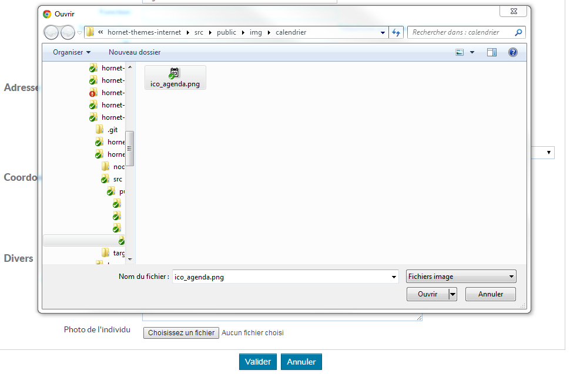

# Le composant Upload

Ce composant permet de télécharger un fichier vers le serveur et d'afficher ce fichier dans la page rendue sur le navigateur soit sous forme d'une image soit sous la forme d'un lien vers ce fichier dans le cas où il ne s'agit pas d'une image.

## Description 

Le composant `HornetUpload` d'un fichier, est utilisé dans un formulaire. 

Lorsque le formulaire est en édition, il permet de sélectionner un fichier à partir d'un champ input de type `file` et lors de la validation du formulaire le fichier est envoyé sur le serveur Node.

Si un fichier est présent à l'initialisation du formulaire, mode `consultation` ou `édition`, le composant affiche le fichier.

Champ de sélection d'un fichier (Formulaire en édition):



## Utilisation

Les attributs utilisables sont ceux définis pour le type `FileField` de newforms (cf. documentation newforms : http://newforms.readthedocs.org/en/v0.12.1/fields_api.html#file-fields). Le composant Hornet ajoute cependant des attributs spécifiques :

| attribut                | description                                                                                    |
| ----------------------- | ---------------------------------------------------------------------------------------------- |
| fileRoute               | Définit l'url d'accès au fichier en lecture seule |
| fileTitle               | Définit le texte alternatif en cas d'échec d'affichage d'un fichier de type image |
| widgetAttrs.accept      | Définit les types de fichiers acceptés (attribut `accept` de la balise html `input` générée) |
| widgetAttrs.maxSize     | Taille maximum du fichier en octets |
[HornetUploadFileField - attributs]

### Définir un champ upload dans le formulaire

Le composant est utilisable dans un formulaire. Le champ à définir doit posséder un attribut: `fileRoute`.
Cette route est utilisée pour afficher l'image (utilisation d'un balise IMG) ou bien un lien vers le fichier.

```javascript
 var form = forms.Form.extend({
        photo: HornetUploadFileField(
            {
                required: false,
                label: intlMessages.fields.photo.selection,
                helpText: intlMessages.fields.photo.help,
                /*Définir l'url d"accès à l'image affiché en lecture seule*/
                fileRoute: "partenaires/photo/",
                fileTitle: intlMessages.fields.photo.altImage,
                widgetAttrs :{
                    accept: [".png", ".jpg", ".gif", ".bmp"],
                    maxSize: "1000000"
                },
                errorMessages: {
                    invalid: intlMessages.fields.photo.fileType,
                    maxSize: intlMessages.fields.photo.maxSize
                }
            }
        )

    }),
     [....]
    new form(configForm)
```

**Remarque** : Si le MimeType du fichier est une image le rendu sera de type `` sinon le rendu sera de type `<a>`.

### Types de fichier acceptés

L'attribut `widgetAttrs.accept` permet de restreindre les types de fichiers acceptés. Ceux-ci sont alors filtrés dans la boîte de dialogue de sélection de fichier, mais aussi lors de la validation du formulaire. La valeur de l'attribut doit être un tableau d'extensions commençant par un point.

**Remarque** : en HTML 5 il est possible de fournir également des types MIME dans l'attribut accept, tel que `image/*` ou `image/png,image/gif`. Ceci n'est pas supporté par le composant Hornet.   

### Envoi des données vers le serveur

Le fichier doit être envoyé en `multipart` vers le serveur Node.

Exemple dans le service d'envoi des données:

```javascript
 // On est sur le navigateur, on va encoder le POST en multipart et transférer le corps en JSON et l'image dans un "part" séparé
request.field("content", JSON.stringify(sendPart));
if (sendPart.photo && sendPart.photo instanceof File) {
    request.attach("photo", sendPart.photo, sendPart.photo.name);
}
```

**Remarque** : attention à bien vérifier que l'objet récupéré est une instance de `File`. En effet il est de type `File` seulement quand un fichier a été uploadé dans le formulaire et transmis dans la requête.
Si ce n'est pas un fichier, on peut l'ignorer (cela signifie que la donnée n'a pas été modifiée). De plus, si on essaye quand même de l'attacher dans la requête alors que ce n'est pas un fichier, firefox plante.

### Récupération du fichier côté serveur Node lors de la validation du formulaire

Le module npm [multer](https://www.npmjs.com/package/multer) prend en charge le fichier uploadé.

Lors de la validation du formulaire, le fichier sélectionné par l'utilisateur est accessible dans un tableau appelé `files` et placé dans l'objet `request` par `multer`.

```javascript
//récupère un input photo:
var maPhoto = request.files['photo']
```

### Définition de la route qui envoie le fichier vers le navigateur

Le composant crée une balise IMG en pointant vers une route que vous devez définir. L'id est passé par défaut par le composant

```javascript
 match("/photo/:id", (context, id) => {
            logger.info("routes partenaires Récupération PHOTO ROUTER DATA", id);
            return {
                actions: [
                    new FichePartenairesAction.LirePhoto().withPayload({
                        idPhoto: id
                    }),
                ]
            }
        });
```

L'action doit écrire dans le résultat de sortie un objet de type `Image` pour indiquer au router-data de fournir une image au navigateur.

```javascript
import Image = require("hornet-js-core/src/data/file");
export class LirePhoto extends Action<ActionsChainData> {
    execute(resolve, reject) {
        var photo = new Image();
        photo.buffer = res.body.buffer; 
        photo.id = "id de la photo";
        photo.name = "maPhoto";
        photo.mimeType = "mimeType de l'image";
        this.actionChainData.result = photo;
    }
}
```