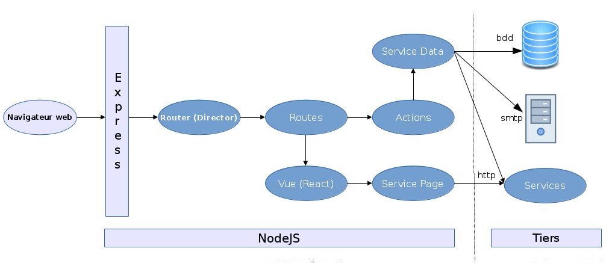
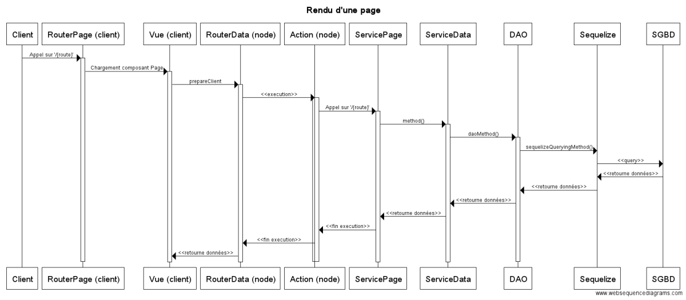
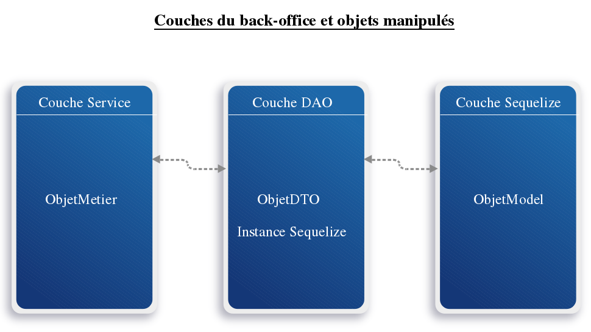

# Architecture

La version lite de `hornet.js` concerne les petites applications.

* `Hornet.js` est utilisé pour les applications demandant une forte sollicitation
* `hornet.js-lite` s'oriente vers les plus petites applications : faible volumétrie, peu d'utilisateur, ..

Cette dernière offre en terme d'architecture technique un cadre de développement complet et rapide sous javascript.
Tandis que `hornet.js` possède une partie service REST en JAVA.

Pour ce faire `hornet-js-lite` permet de se connecter à une base de données postgresql grâce à l'ORM javascript `Sequelize`.

## Schéma d'architecture

## Diagramme de séquence

Ci-dessous sont présentés les schémas généraux de déroulements des échanges dans le pattern implémenté dans Hornet lite en mode SPA (navigateur web) et rendu serveur (serveur NodeJS).

### Suite des actions pour le rendu côté client

## Le pattern Service - DAO

Les applications hornet-js-lite reposent sur le pattern service DAO.

Ce pattern consiste à considérer les services comme des points d'entrées qui vont accéder aux données en base grâce aux DAO.

Les DAO requêtent les données grâce à l'ORM Sequelize. C'est l'ORM qui est en charge de faire transiter les requêtes des DAO vers la base, puis de rapporter les résultats de la base vers les DAO. Ceux-ci sont alors transmis aux services.

