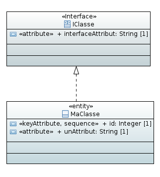

# Exemple de génération d'interface



Exemple des fichiers générés avec ce modèle ( génération non JPA):

## Script de création de la base

Dans le script de création de la base de données, le champ de l'interface sera généré de la façon suivante : 

L'attribut est présent dans la classe qui implémente l'interface 

createTablesPostgres.sql:

```sql
CREATE TABLE ma_classe(
	interface_attribut text NOT NULL,
	id integer NOT NULL,
	un_attribut text NOT NULL
);
```


## Interface attributes

i-classe-attributes.ts:

```javascript
export interface IClasseAttributes {
    interfaceAttribut?: string
}
```

ma-classe-attributes.ts:

```javascript
import { IClasseAttributes } from "src/models/attributes/i-classe-attributes";

export interface MaClasseAttributes extends IClasseAttributes{
    id?: number;
    unAttribut?: string;
}
```

## DTO

l'attribut de l'interface se trouve dans le DTO de la classe `MaClasse`.

ma-classe-dto.ts:

```javascript
import Alias from "hornet-js-bean/src/decorators/Alias";
import Bean from "hornet-js-bean/src/decorators/Bean";
import Map from "hornet-js-bean/src/decorators/Map";

@Bean
export class MaClasseDTO {
    
    @Map()
    interfaceAttribut: string;
    
    @Map()
    id: number;
    
    @Map()
    unAttribut: string;
}
```

## Classes métier

i-classe-metier.ts:

```javascript
import Bean from "hornet-js-bean/src/decorators/Bean";
import Map from "hornet-js-bean/src/decorators/Map";

@Bean
export class IClasseMetier {
    
    @Map()
    interfaceAttribut: string;
    
}
```

partenaire-metier.ts:
```javascript
import Bean from "hornet-js-bean/src/decorators/Bean";
import Map from "hornet-js-bean/src/decorators/Map";

import { IClasseMetier } from "src/models/metier/i-classe-metier";

@Bean
export class MaClasseMetier implements IClasseMetier
{
    
    @Map()
    interfaceAttribut: string;
    
    @Map()
    id: number;
    
    @Map()
    unAttribut: string;
    
}
```


