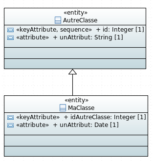

# Exemple de génération de généralisation



Exemple des fichiers générés avec ce modèle ( génération non JPA):

## Script de création de la base

Dans le script de création de la base de données la relation sera générée de la façon suivante:

Un identifiant vers la classe `AutreClass` est créé dans la table de `MaClasse`.

createTablesPostgres.sql:

```sql
CREATE TABLE ma_classe(
	id integer NOT NULL,
	id_autre_classe integer NOT NULL,
	un_attribut timestamp NOT NULL
);

CREATE TABLE autre_classe(
	id integer NOT NULL,
	un_attribut text NOT NULL
);

ALTER TABLE ONLY ma_classe
    ADD CONSTRAINT ma_classe_autre_classe_ids_fkey
    FOREIGN KEY (id) REFERENCES autre_classe(id);
```

## Sequelize Models

Dans le modèle de la classe `MaClasse` la relation est générée de la façon suivante:

ma-classe-model.ts : 

```javascript
import Sequelize = require("sequelize");

export const MaClasseModel: Sequelize.DefineAttributes = {
    id: {
        type: Sequelize.INTEGER,
        field: "id",
        allowNull: false,
        references: {
            model: "AutreClasseModel",
            key: "id",
        },
    },
    ...
};
```

## Model DAO

Dans le model DAO la relation est génrée de la façon suivante:

model-dao.ts:
```javascript
    private initMaClasseEntity(): void {
        SequelizeUtils.initRelationBelongsTo({
            fromEntity: this.maClasseEntity,
            toEntity: this.autreClasseEntity,
            alias: "id",
            foreignKey: "id"});
    }
```

## Interface attributes

ma-classe-attributes.ts:

```javascript
import { AutreClasseAttributes } from "src/models/attributes/autre-classe-attributes";

export interface MaClasseAttributes extends AutreClasseAttributes {
    
    idAutreClasse?: number;
    unAttribut?: string;

}
```

## DTO

Le DTO de `MaClasse` étend le DTO de `AutreClasse` (il possédera donc tous ses champs).
Il possédera également un attribut de type `AutreClasseDTO`.

ma-classe-dto.ts:

```javascript
import Alias from "hornet-js-bean/src/decorators/Alias";
import Bean from "hornet-js-bean/src/decorators/Bean";
import Map from "hornet-js-bean/src/decorators/Map";

import { AutreClasseDTO } from "src/models/dto/autre-classe-dto";

@Bean
export class MaClasseDTO extends AutreClasseDTO{
    
    @Map(AutreClasseDTO)
    autreClasse: AutreClasseDTO;
    
    @Map()
    idAutreClasse: number;
    
    @Map()
    unAttribut: Date;
}
```

## Classes métier

ma-classe-metier.ts:

```javascript
import Bean from "hornet-js-bean/src/decorators/Bean";
import Map from "hornet-js-bean/src/decorators/Map";

import { AutreClasseMetier } from "src/models/metier/autre-classe-metier";

@Bean
export class MaClasseMetier extends AutreClasseMetier{
    
    @Map()
    idAutreClasse: number;
    
    @Map()
    unAttribut: Date;
    
}
```
