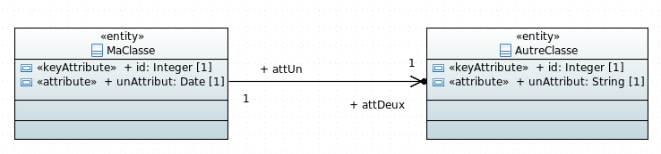
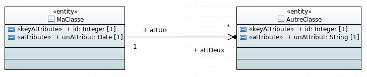
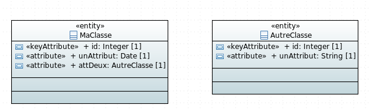
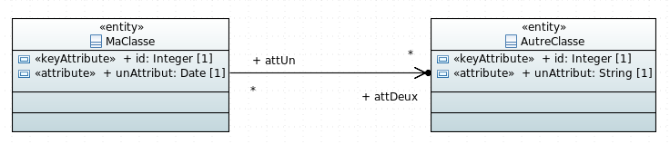

# Exemple de génération d'association

## One To One



### Script de création de la base

Dans le script de création de la base de données la relation sera générées de la façon suivante:

Le nom de l'attribut présent dans la table de `MaClasse` est composé a partir du nom de l'identifiant de la table `AutreClasse` et du nom de la propriété présent sur la branche.

createTableSequelize.sql:

```sql
CREATE TABLE ma_classe(
	id integer NOT NULL,
	un_attribut timestamp NOT NULL,
	id_att_deux integer NOT NULL
);

ALTER TABLE ONLY ma_classe
    ADD CONSTRAINT ma_classe_att_deux_ids_fkey
    FOREIGN KEY (id_att_deux) REFERENCES autre_classe(id);
```

### Sequelize Models

ma-classe-model.ts:

```javascript
import Sequelize = require("sequelize");

export const MaClasseModel: Sequelize.DefineAttributes = {
    id: {
        type: Sequelize.INTEGER,
        field: "id",
        allowNull: false,
        primaryKey: true,
    },
    unAttribut: {
        type: Sequelize.DATE,
        field: "un_attribut",
        allowNull: false,
    },
    idAttDeux: {
        type: Sequelize.INTEGER,
        field: "id_att_deux",
        allowNull: false,
        references: {
            model: "AutreClasseModel",
            key: "id",
        },
    },
};
```

### Model DAO

Dans le model DAO la rélation est générée de la façon suivante:

model-dao.ts:

```javascript
    private initMaClasseEntity(): void {
        SequelizeUtils.initRelationBelongsTo({
            fromEntity: this.maClasseEntity,
            toEntity: this.autreClasseEntity,
            alias: "attDeux",
            foreignKey: "id_att_deux"});
    }
```

### Interface attributes

ma-classe-attributes.ts:

```javascript
import { AutreClasseAttributes } from "src/models/attributes/autre-classe-attributes";

export interface MaClasseAttributes {
    
    id?: number;
    unAttribut?: string;
    idAttDeux?: number;

    attDeux: AutreClasseAttributes;
    getAttDeux(): Promise<AutreClasseAttributes>;
    
}
```

### DTO

Dans le DTO il sera possible de passer soit l'id de la classe `AutreClasse` soit directement un objet `AutreClasseDTO`.

ma-classe-dto.ts:

```javascript
import Alias from "hornet-js-bean/src/decorators/Alias";
import Bean from "hornet-js-bean/src/decorators/Bean";
import Map from "hornet-js-bean/src/decorators/Map";

import { AutreClasseDTO } from "src/models/dto/autre-classe-dto";

@Bean
export class MaClasseDTO {
    
    @Map()
    id: number;
    
    @Map()
    unAttribut: Date;
    
    @Map()
    @Alias("idAttDeux", "attDeux.id")
    idAttDeux: number;
    
    @Map(AutreClasseDTO)
    attDeux: AutreClasseDTO;
}
```

### Classes métier

ma-classe-metier.ts: 

```javascript
import Bean from "hornet-js-bean/src/decorators/Bean";
import Map from "hornet-js-bean/src/decorators/Map";

import { AutreClasseMetier } from "src/models/metier/autre-classe-metier";

@Bean
export class MaClasseMetier {
    
    @Map()
    id: number;
    
    @Map()
    unAttribut: Date;
    
    @Map(AutreClasseMetier)
    attDeux: AutreClasseMetier;
    
}
```

## One To Many



### Script de création de la base

Dans le script de création de la base de données la relation sera générées de la façon suivante:

Un attribut est généré dans la table `AutreClasse`. Son nom est composé du nom de l'i de la classe `MaClasse` et du nom de la propriété present sur le lien entre les deux classes.

createTablesPostgres.sql:

```sql
CREATE TABLE autre_classe(
	id integer NOT NULL,
	un_attribut text NOT NULL,
	id_ma_classe_att_deux integer 
);

ALTER TABLE ONLY autre_classe
    ADD CONSTRAINT autre_classe_ma_classe_att_deux_ids_fkey
    FOREIGN KEY (id_ma_classe_att_deux) REFERENCES ma_classe(id);
```
### Sequelize Models

autre-classe-model.ts:

```javascript
import Sequelize = require("sequelize");

export const AutreClasseModel: Sequelize.DefineAttributes = {
    id: {
        type: Sequelize.INTEGER,
        field: "id",
        allowNull: false,
        primaryKey: true,
    },
    unAttribut: {
        type: Sequelize.STRING,
        field: "un_attribut",
        allowNull: false,
    },
    idMaClasseAttDeux: {
        type: Sequelize.INTEGER,
        field: "id_ma_classe_att_deux",
        references: {
            model: "MaClasseModel",
            key: "id",
        },
    },
};
```

### Model DAO

model-dao.ts:

```javascript
    private initMaClasseEntity(): void {
        SequelizeUtils.initRelationHasMany({
            fromEntity: this.maClasseEntity,
            toEntity: this.autreClasseEntity,
            alias: "attDeux", foreignKey: "id_ma_classe_att_deux"});
    }
    
    private initAutreClasseEntity(): void {
        SequelizeUtils.initRelationBelongsTo({
            fromEntity: this.autreClasseEntity,
            toEntity: this.maClasseEntity,
            alias: "maClasseAttDeux",
            foreignKey: "id_ma_classe_att_deux"});
    }
```

### Interface attributes

ma-classe-attributes.ts:

```javascript
import { AutreClasseAttributes } from "src/models/attributes/autre-classe-attributes";

export interface MaClasseAttributes {
    
    id?: number;
    unAttribut?: string;

    attDeux: Array<AutreClasseAttributes>;
    getAttDeux(): Promise<Array<AutreClasseAttributes>>;
    
}
```

autre-classe-attributes.ts:

```javascript
import { MaClasseAttributes } from "src/models/attributes/ma-classe-attributes";

export interface AutreClasseAttributes {
    
    id?: number;
    unAttribut?: string;

    idMaClasseAttDeux?: number;
    maClasseAttDeux?: MaClasseAttributes;
    getMaClasseAttDeux(): Promise<MaClasseAttributes>;
}
```

### DTO

ma-classe-dto.ts:

```javascript
import Alias from "hornet-js-bean/src/decorators/Alias";
import Bean from "hornet-js-bean/src/decorators/Bean";
import Map from "hornet-js-bean/src/decorators/Map";

import { AutreClasseDTO } from "src/models/dto/autre-classe-dto";

@Bean
export class MaClasseDTO {
    
    @Map()
    id: number;
    
    @Map()
    unAttribut: Date;
    
    @Map(AutreClasseDTO)
    attDeux: Array<AutreClasseDTO>;
}
```

autre-classe-dto.ts:

```javascript
import Alias from "hornet-js-bean/src/decorators/Alias";
import Bean from "hornet-js-bean/src/decorators/Bean";
import Map from "hornet-js-bean/src/decorators/Map";

import { MaClasseDTO } from "src/models/dto/ma-classe-dto";

@Bean
export class AutreClasseDTO {
    
    @Map()
    id: number;
    
    @Map()
    unAttribut: string;
    
    @Map()
    @Alias("idMaClasseAttDeux", "maClasseAttDeux.id")
    idMaClasseAttDeux: number;
    
    @Map(MaClasseDTO)
    maClasseAttDeux: MaClasseDTO;
}
```

### Classes métier

ma-classe-metier.ts:

```javascript
import Bean from "hornet-js-bean/src/decorators/Bean";
import Map from "hornet-js-bean/src/decorators/Map";

import { AutreClasseMetier } from "src/models/metier/autre-classe-metier";

@Bean
export class MaClasseMetier {
    
    @Map()
    id: number;
    
    @Map()
    unAttribut: Date;
    
    @Map(AutreClasseMetier)
    attDeux: Array<AutreClasseMetier>;
    
}
```

autre-classe-metier.ts:

```javascript
import Bean from "hornet-js-bean/src/decorators/Bean";
import Map from "hornet-js-bean/src/decorators/Map";

import { MaClasseMetier } from "src/models/metier/ma-classe-metier";

@Bean
export class AutreClasseMetier {
    
    @Map()
    id: number;
    
    @Map()
    unAttribut: string;
    
    @Map(MaClasseMetier)
    maClasseAttDeux: MaClasseMetier;
    
}
```

## Many To One


Ou



### Script de création de la base

Dans le script de création de la base de données la relation est générée de la façon suivante:

createTablePostgres.sql:

```sql
CREATE TABLE ma_classe(
	id integer NOT NULL,
	un_attribut timestamp NOT NULL,
	id_att_deux integer NOT NULL
);
ALTER TABLE ONLY ma_classe
    ADD CONSTRAINT ma_classe_att_deux_ids_fkey
    FOREIGN KEY (id_att_deux) REFERENCES autre_classe(id);
```

### Sequelize Models

ma-classe-model.ts:

```javascript
import Sequelize = require("sequelize");

export const MaClasseModel: Sequelize.DefineAttributes = {
    id: {
        type: Sequelize.INTEGER,
        field: "id",
        allowNull: false,
        primaryKey: true,
    },
    unAttribut: {
        type: Sequelize.DATE,
        field: "un_attribut",
        allowNull: false,
    },
    idAttDeux: {
        type: Sequelize.INTEGER,
        field: "id_att_deux",
        allowNull: false,
        references: {
            model: "AutreClasseModel",
            key: "id",
        },
    },
};
```

### Model DAO

Dans le model DAO la relation est générée de la façon suivante:

model-dao.ts:

```javascript
    private initMaClasseEntity(): void {
        SequelizeUtils.initRelationBelongsTo({
            fromEntity: this.maClasseEntity,
            toEntity: this.autreClasseEntity,
            alias: "attDeux",
            foreignKey: "id_att_deux"});
    }
```

### Interface attributes

ma-classe-attributes.ts:

```javascript
import { AutreClasseAttributes } from "src/models/attributes/autre-classe-attributes";

export interface MaClasseAttributes {
    
    id?: number;
    unAttribut?: string;
    idAttDeux?: number;

    attDeux: AutreClasseAttributes;
    getAttDeux(): Promise<AutreClasseAttributes>;
    
}
```

### DTO

ma-classe-dto.ts:

```javascript
import Alias from "hornet-js-bean/src/decorators/Alias";
import Bean from "hornet-js-bean/src/decorators/Bean";
import Map from "hornet-js-bean/src/decorators/Map";

import { AutreClasseDTO } from "src/models/dto/autre-classe-dto";

@Bean
export class MaClasseDTO {
    
    @Map()
    id: number;
    
    @Map()
    unAttribut: Date;
    
    @Map()
    @Alias("idAttDeux", "attDeux.id")
    idAttDeux: number;
    
    @Map(AutreClasseDTO)
    attDeux: AutreClasseDTO;
}
```

### Classes métier

ma-classe-metier.ts:

```javascript
import Bean from "hornet-js-bean/src/decorators/Bean";
import Map from "hornet-js-bean/src/decorators/Map";

import { AutreClasseMetier } from "src/models/metier/autre-classe-metier";

@Bean
export class MaClasseMetier {
    
    @Map()
    id: number;
    
    @Map()
    unAttribut: Date;
    
    @Map(AutreClasseMetier)
    attDeux: AutreClasseMetier;
    
}
```

## Many To Many



### Script de création de la base

Dans le script de création de la base de données la relation sera générée de la façon suivante:

createTablePostgres.sql:

```sql
CREATE TABLE ma_classe_att_deux(
	id_att_deux integer NOT NULL,
	id_ma_classe integer NOT NULL
);

ALTER TABLE ONLY ma_classe_att_deux
    ADD CONSTRAINT ma_classe_att_deux_ma_classe_ids_fkey
    FOREIGN KEY (id_ma_classe) REFERENCES ma_classe(id);
    
ALTER TABLE ONLY ma_classe_att_deux
    ADD CONSTRAINT ma_classe_att_deux_autre_classe_ids_fkey
    FOREIGN KEY (id_att_deux) REFERENCES autre_classe(id);
    
ALTER TABLE ONLY ma_classe_att_deux
    ADD CONSTRAINT ma_classe_att_deux_pkey PRIMARY KEY(id_ma_classe, id_att_deux);
```

### Sequelize Models

Dans le model de `MaClasse` la relaton sera générée de la façon suivante:

ma-classe-model.ts:

```javascript
export const MaClasseAttDeuxModel: Sequelize.DefineAttributes={
    idAutreClasse:{
        type: Sequelize.INTEGER,
        field: "id_att_deux",
        allowNull: false,
        primaryKey: true,
        references: {
            model: "AutreClasseModel",
            key: "id",
        },
    },
    idMaClasse:{
        type: Sequelize.INTEGER,
        field: "id_ma_classe",
        allowNull: false,
        primaryKey: true,
        references: {
            model: "MaClasseModel",
            key: "id",
        },
    },
};
```

### Model DAO

Dans le model DAO la relaton sera générée de la façon suivante:

model-dao.ts:

```javascript
    private initMaClasseEntity(): void {
        SequelizeUtils.initRelationBelongsToMany({
            fromEntity: this.maClasseEntity,
            toEntity: this.autreClasseEntity,
            alias: "attDeux",
            foreignKey: "id_ma_classe",
            throughTable: this.maClasseAttDeuxEntity});
    }
    
    private initAutreClasseEntity(): void {
    }
    
    public initMaClasseAttDeuxEntity(): void {
        SequelizeUtils.initRelationBelongsTo({
            fromEntity: this.maClasseAttDeuxEntity,
            toEntity: this.maClasseEntity,
            alias: "maClasse",
            foreignKey: "id_ma_classe"});
        SequelizeUtils.initRelationBelongsTo({
            fromEntity: this.maClasseAttDeuxEntity,
            toEntity: this.autreClasseEntity,
            alias: "attDeux",
            foreignKey: "id_att_deux"});
    }
```

### Interface attributes

ma-classe-attributes.ts:

```javascript
import { AutreClasseAttributes } from "src/models/attributes/autre-classe-attributes";

export interface MaClasseAttributes {
    
    id?: number;
    unAttribut?: string;

    attDeux: Array<AutreClasseAttributes>;
    getAttDeux(): Promise<Array<AutreClasseAttributes>>;
    
}
```

autre-classe-attributes.ts:

```javascript
import { MaClasseAttributes } from "src/models/attributes/ma-classe-attributes";

export interface AutreClasseAttributes {
    
    id?: number;
    unAttribut?: string;

    attUn: Array<MaClasseAttributes>;
    getAttUn(): Promise<Array<MaClasseAttributes>>;
}
```

### DTO

ma-classe-dto.ts:

```javascript
import Alias from "hornet-js-bean/src/decorators/Alias";
import Bean from "hornet-js-bean/src/decorators/Bean";
import Map from "hornet-js-bean/src/decorators/Map";

import { AutreClasseDTO } from "src/models/dto/autre-classe-dto";

@Bean
export class MaClasseDTO {
    
    @Map()
    id: number;
    
    @Map()
    unAttribut: Date;
    
    @Map(AutreClasseDTO)
    attDeux: Array<AutreClasseDTO>;
}


export class MaClasseAttDeuxDTO{
	
	@Map()
	idMaClasse: number;
	
	@Map(MaClasseDTO)
	maClasse: MaClasseDTO;
	
	@Map()
	idAutreClasse: number;
	
	@Map(AutreClasseDTO)
	autreClasse: AutreClasseDTO;
}
```

autre-classe-dto.ts:

```javascript
import Alias from "hornet-js-bean/src/decorators/Alias";
import Bean from "hornet-js-bean/src/decorators/Bean";
import Map from "hornet-js-bean/src/decorators/Map";

import { MaClasseDTO } from "src/models/dto/ma-classe-dto";

@Bean
export class AutreClasseDTO {
    
    @Map()
    id: number;
    
    @Map()
    unAttribut: string;
    
    @Map(MaClasseDTO)
    attUn: Array<MaClasseDTO>;
}
```

### Classes métier

ma-classe-metier.ts:

```javascript
import Bean from "hornet-js-bean/src/decorators/Bean";
import Map from "hornet-js-bean/src/decorators/Map";

import { AutreClasseMetier } from "src/models/metier/autre-classe-metier";

@Bean
export class MaClasseMetier {
    
    @Map()
    id: number;
    
    @Map()
    unAttribut: Date;
    
    @Map(AutreClasseMetier)
    attDeux: Array<AutreClasseMetier>;
    
}
```

autre-classe-metier.ts:

```javascript
import Bean from "hornet-js-bean/src/decorators/Bean";
import Map from "hornet-js-bean/src/decorators/Map";

import { MaClasseMetier } from "src/models/metier/ma-classe-metier";

@Bean
export class AutreClasseMetier {
    
    @Map()
    id: number;
    
    @Map()
    unAttribut: string;
    
    @Map(MaClasseMetier)
    attUn: Array<MaClasseMetier>;
    
}
```


La génération sans lien a quelque différences:

model-dao.ts:

```javascript
    private initAutreClasseEntity(): void {
        SequelizeUtils.initRelationBelongsToMany({
            fromEntity: this.autreClasseEntity,
            toEntity: this.maClasseEntity,
            alias: "attDeux",
            foreignKey: "id_autre_classe",
            throughTable: this.autreClasseAttDeuxEntity});
    }
```

autre-classe-attributes.ts:

```javascript
export interface AutreClasseAttributes {
    
    id?: number;
    unAttribut?: string;

}
```

autre-classe-dto.ts:

```javascript
import Alias from "hornet-js-bean/src/decorators/Alias";
import Bean from "hornet-js-bean/src/decorators/Bean";
import Map from "hornet-js-bean/src/decorators/Map";


@Bean
export class AutreClasseDTO {
    
    @Map()
    id: number;
    
    @Map()
    unAttribut: string;
}
```

autre-classe-metier.ts:

```javascript
import Bean from "hornet-js-bean/src/decorators/Bean";
import Map from "hornet-js-bean/src/decorators/Map";


@Bean
export class AutreClasseMetier {
    
    @Map()
    id: number;
    
    @Map()
    unAttribut: string;
    
}
```