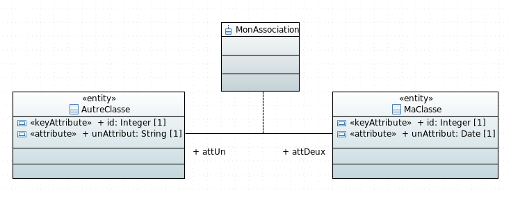

# Exemple de génération de table d'association




## Script de création de la base

Une table d'association est créée. Les noms de ses attributs sont ceux présents sur la branche reliant les deux entités précédé de l'identifiant de la classe liée a cet attribut.

createTablePostgres.sql:

```sql
CREATE TABLE ma_classe(
	id integer NOT NULL,
	un_attribut timestamp NOT NULL
);

ALTER TABLE ONLY ma_classe
	ADD CONSTRAINT ma_classe_pkey PRIMARY KEY (id);


CREATE TABLE autre_classe(
	id integer NOT NULL,
	un_attribut text NOT NULL
);

ALTER TABLE ONLY autre_classe
	ADD CONSTRAINT autre_classe_pkey PRIMARY KEY (id);


CREATE TABLE mon_association(
	id_att_deux integer NOT NULL,
	id_att_un integer NOT NULL
);

ALTER TABLE ONLY mon_association
	ADD CONSTRAINT mon_association_att_deux_ids_fkey
	FOREIGN KEY (id_att_deux) REFERENCES ma_classe(id);

ALTER TABLE ONLY mon_association
	ADD CONSTRAINT mon_association_att_un_ids_fkey
	FOREIGN KEY (id_att_un) REFERENCES autre_classe(id);

ALTER TABLE ONLY mon_association
	ADD CONSTRAINT mon_association_pkey PRIMARY KEY (id_att_deux, id_att_un);
```

## Sequelize Models

mon-association-model.ts:

```javascript
import Sequelize = require("sequelize");

export const MonAssociationModel: Sequelize.DefineAttributes = {
    idAttDeux: {
        type: Sequelize.INTEGER,
        field: "id_att_deux",
        allowNull: false,
        primaryKey: true,
        references: {
            model: "MaClasseModel",
            key: "id",
        },
    },
    idAttUn: {
        type: Sequelize.INTEGER,
        field: "id_att_un",
        allowNull: false,
        primaryKey: true,
        references: {
            model: "AutreClasseModel",
            key: "id",
        },
    },
};
```

## Model DAO

```javascript
    private initMaClasseEntity(): void {
        SequelizeUtils.initRelationBelongsToMany({
            fromEntity: this.maClasseEntity,
            toEntity: this.autreClasseEntity,
            alias: "attUn",
            foreignKey: "id_att_deux",
            throughTable: this.monAssociationEntity,
            otherKey: "id_autre_classe"});
    }
    
    private initAutreClasseEntity(): void {
        SequelizeUtils.initRelationBelongsToMany({
            fromEntity: this.autreClasseEntity,
            toEntity: this.maClasseEntity,
            alias: "attDeux",
            foreignKey: "id_att_un",
            throughTable: this.monAssociationEntity,
            otherKey: "id_ma_classe"});
    }
    
    public initMonAssociationEntity(): void {
        SequelizeUtils.initRelationBelongsTo({
            fromEntity: this.monAssociationEntity,
            toEntity: this.maClasseEntity,
            alias: "attDeux",
            foreignKey: "id_att_deux"});
        SequelizeUtils.initRelationBelongsTo({
            fromEntity: this.monAssociationEntity,
            toEntity: this.autreClasseEntity,
            alias: "attUn",
            foreignKey: "id_att_un"});
    }
```

## Interface attributes

ma-classe-attributes.ts:

```javascript
import { MonAssociationAttributes } from "src/models/attributes/mon-association-attributes";

export interface MaClasseAttributes {
    
    id?: number;
    unAttribut?: string;

    attUn : Array<MonAssociationAttributes>;
    getMonAssociation(): Promise<Array<MonAssociationAttributes>>;
    
}
```

autre-classe-attributes.ts:

```javascript
import { MonAssociationAttributes } from "src/models/attributes/mon-association-attributes";

export interface AutreClasseAttributes {
    
    id?: number;
    unAttribut?: string;

    attDeux : Array<MonAssociationAttributes>;
    getMonAssociation(): Promise<Array<MonAssociationAttributes>>;
    
}
```

mon-association-attributes.ts:

```javascript
import { MaClasseAttributes } from "src/models/attributes/ma-classe-attributes";
import { AutreClasseAttributes } from "src/models/attributes/autre-classe-attributes";

export interface MonAssociationAttributes {
    
    idAttDeux: number;
    attDeux: MaClasseAttributes;
    getAttDeux(): Promise<MaClasseAttributes>;
    
    idAttUn: number;
    attUn: AutreClasseAttributes;
    getAttUn(): Promise<AutreClasseAttributes>;
}
```

## DTO

ma-classe-dto.ts:

```javascript
import Alias from "hornet-js-bean/src/decorators/Alias";
import Bean from "hornet-js-bean/src/decorators/Bean";
import Map from "hornet-js-bean/src/decorators/Map";

import { MonAssociationDTO } from "src/models/dto/mon-association-dto";

@Bean
export class MaClasseDTO {
    
    @Map()
    id: number;
    
    @Map()
    unAttribut: Date;
    
    @Map(MonAssociationDTO)
    monAssociation: Array<MonAssociationDTO>;
}

```

autre-classe-dto.ts:

```javascript
import Alias from "hornet-js-bean/src/decorators/Alias";
import Bean from "hornet-js-bean/src/decorators/Bean";
import Map from "hornet-js-bean/src/decorators/Map";

import { MonAssociationDTO } from "src/models/dto/mon-association-dto";

@Bean
export class AutreClasseDTO {
    
    @Map()
    id: number;
    
    @Map()
    unAttribut: string;
    
    @Map(MonAssociationDTO)
    monAssociation: Array<MonAssociationDTO>;
}
```

mon-association-dto.ts:

```javascript
import Alias from "hornet-js-bean/src/decorators/Alias";
import Bean from "hornet-js-bean/src/decorators/Bean";
import Map from "hornet-js-bean/src/decorators/Map";

import { MaClasseDTO } from "src/models/dto/ma-classe-dto";
import { AutreClasseDTO } from "src/models/dto/autre-classe-dto";

@Bean
export class MonAssociationDTO {
    
    @Map()
    @Alias("idAttDeux", "attDeux.id")
    idAttDeux: number;
    
    @Map()
    attDeux: MaClasseDTO;
    
    @Map()
    @Alias("idAttUn", "attUn.id")
    idAttUn: number;
    
    @Map()
    attUn: AutreClasseDTO;
}
```

## Classes métier

ma-classe-metier.ts:

```javascript
import Bean from "hornet-js-bean/src/decorators/Bean";
import Map from "hornet-js-bean/src/decorators/Map";

import { MonAssociationMetier } from "src/models/metier/mon-association-metier";

@Bean
export class MaClasseMetier {
    
    @Map()
    id: number;
    
    @Map()
    unAttribut: Date;
    
    @Map(MonAssociationMetier)
    monAssociation: Array<MonAssociationMetier>;
    
}
```

autre-classe-metier.ts:

```javascript
import Bean from "hornet-js-bean/src/decorators/Bean";
import Map from "hornet-js-bean/src/decorators/Map";

import { MonAssociationMetier } from "src/models/metier/mon-association-metier";

@Bean
export class AutreClasseMetier {
    
    @Map()
    id: number;
    
    @Map()
    unAttribut: string;
    
    @Map(MonAssociationMetier)
    monAssociation: Array<MonAssociationMetier>;
    
}
```

mon-association-metier.ts:

```javascript
import Bean from "hornet-js-bean/src/decorators/Bean";
import Map from "hornet-js-bean/src/decorators/Map";

import { MaClasseMetier } from "src/models/metier/ma-classe-metier";
import { AutreClasseMetier } from "src/models/metier/autre-classe-metier";

@Bean
export class MonAssociationMetier{
    
    @Map(MaClasseMetier)
    attDeux: MaClasseMetier;
    
    @Map(AutreClasseMetier)
    attUn: AutreClasseMetier;
}
```


