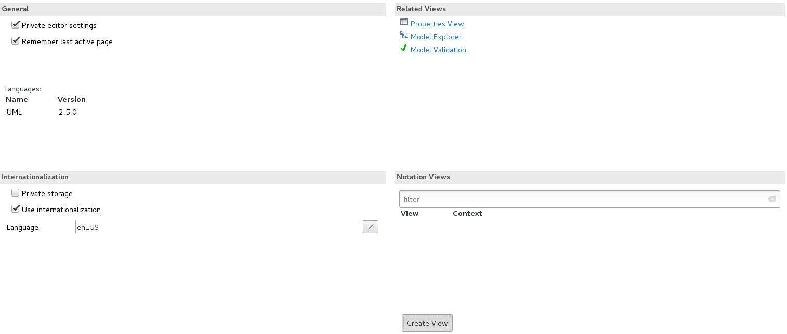
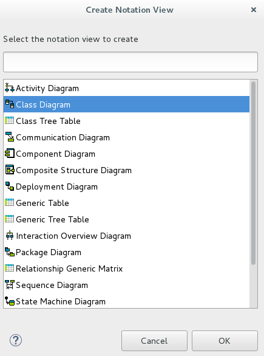
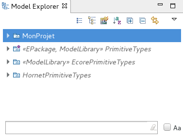
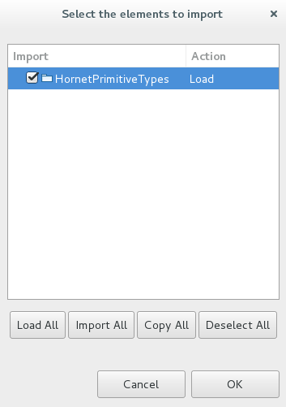
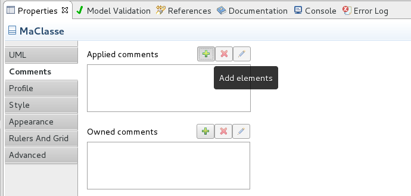
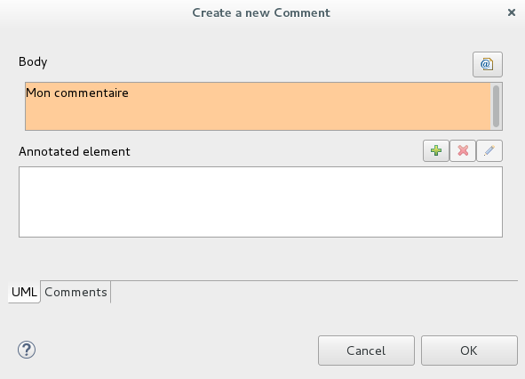
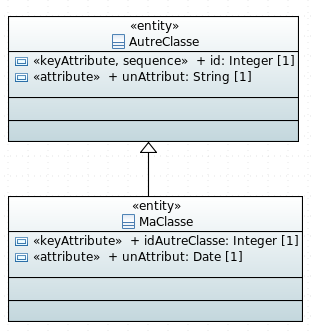
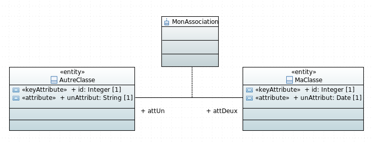

# Modélisation et générateur de code Hornet lite avec Papyrus

## Création d'un nouveau projet

### Récupération de Papyrus

Si vous n'avez pas déjà papyrus d'installer, Papyrus peut être récupéré sur ftp://forge.ftp.dsinet.diplomatie.gouv.fr/Hornet/hornet-5.1.0/Papyrus/

Ensuite, récupérez les plugins dans le dossier plugins du ftp et collez les dans le dossier plugins du Papyrus récupéré.

Si Papyrus est déjà installé, il suffit de récupérer les plugins comme indiqué ci dessus pour les mettre à jour(pensez à supprimer les anciens plugins).

### Création du projet

Utilisez le template Yeoman `generator-hornet-js-lite` pour générer un nouveau projet Hornet JS Lite

### Création du modèle

Ouvrir le projet avec Papyrus (ayant les plugins de génération).

Attention: il sera peut être nécessaire d'ajouter un fichier .project pour pouvoir ouvrir le projet sous eclipse (si le projet a été généré avec Yeoman):

```xml
<?xml version="1.0" encoding="UTF-8"?>
<projectDescription>
	<name>nom-projet</name>
	<comment></comment>
	<projects>
	</projects>
	<buildSpec>
	</buildSpec>
	<natures>
	</natures>
</projectDescription>
```


Click droit sur le projet -> New-> Papyrus Model


Cliquez sur next.


Choisissez le nom de votre modele puis cliquer sur next.


Choisissez le nom de votre element racine puis cliquez sur Browse Registered Profile.


Choisissez le profile `Profile Hornet Generateur` puis cliquez sur OK.


`Attention cette étape n'est pas obligatoire`
Cochez le type `Class Diagram` si vous souhaitez avoir uniquement un seul diagramme de classe, sinon ne cochez pas cette case.

Cliquez sur Finish.

`Si vous avez coché la case Class Diagram passer directement au point 1.3`.

`Si vous n'avez pas coché la case Class Diagram` vous arriverez sur la fenêtre suivante:



Cliquez sur le bouton `Create View` en bas au milieu de la fenêtre.


Choissez le profil que vous venez de créer.



Choisissez `Class Diagram` puis appuyer sur OK.


Entrez le nom de votre vue puis cliquer sur OK.

### Ajout des librairies

Ajoutez la librairie Hornet.
Pour cela, sélectionnez votre diagramme dans le Model Explorer, clic droit -> import -> import registered package.



Choisissez le Hornet Type Library


sélectionnez HornetPrimitiveTypes puis cliquez sur OK.



## Exemple de création d'un modèle

Exemple de création d'un modèle d'application simple.
Le tutoriel permettra de générer une application contenant des partenaires, des assistants et des secteurs :


### Création des classes

#### Création de la table secteur

##### création de la table

Pour commencer, créez la classe `Secteur`.
Pour cela, il faut créer une nouvelle classe en glissant/déposant une classe depuis la vue Palette à droite de l'écran.


##### renommer la table

Une fois la classe créée, il est possible de modifier ses propriétés depuis la vue `Properties` qui se trouve en bas de l'écran. Pour ouvrir la vue de la nouvelle classe, cliquer sur celle-ci.


Renommez la classe en `Secteur`.

##### ajout d'un stéréotype

Chaque classe nécessite d'avoir un stéréotype qui permettra d'apporter des informations nécessaires à la génération de celle-ci.

Pour cela, il faut se rendre dans l'onglet `Profile` de la vue `Properties`


Cliquez sur le plus en haut a droite pour ajouter un profil.


Selectionnez le profil `entity` en double cliquant sur le nom ou en cliquant dessus puis en cliquant sur la flèche vers la droite.
Une fois le profil choisi cliquer sur OK.


Les attributs du profil sont disponibles.
Pour changer la valeur d'un attribut du stéréotype, cliquez dessus.

##### ajout d'attributs

Ajoutez des attributs à la classe `Secteur`.

Pour cela, il faut cliquer sur la classe. Un menu contextuel va s'ouvrir. Cliquez sur l'icone indiqué pour ajouter un attribut:


Une fois l'attribut créé, cliquez dessus pour voir ses propriétés:


renommez l'attribut en `id`, il s'agira de l'identifiant de la classe.

Pour changer le type de l'attribut, cliquez sur le bouton `...` situé à droite de la propriété `Type`


Sélectionnez Integer parmis les types `HornetPrimitiveTypes`.

Pour les attributs, il est possible de choisir un type parmis les `HornetPrimitiveTypes` ou les types créés dans votre modèle.


Une fois le type choisit, ajouter un stéréotype `keyAttribute` à votre attribut.
Ce stéréotype permet de définir que cet attribut sera l'identifiant de la classe `Secteur`.

Une classe possédant un stéréotype `entity` doit obligatoiremment avoir un identifiant pour la génération.

Ensuite, créer de la même façon un autre attribut `nom` qui aura pour type `String` et comme stéréotype `attribute`.
Tout attribut n'étant pas un identifiant devra posséder le stéréotype `attribut` pour la génération de code.


## Ajouter un commentaire

Les commentaires seront présents dans les classe métiers générées.



Pour ajouter un commentaire, allez dans l'onglet `comments` de la vue `Properties`.
Cliquez sur le plus en haut a droite du champs `Applied comments`.



Ecrivez votre commentaire puis cliquer sur OK.

#### Création des tables partenaire et assistant

De la même façon que pour la table `Secteur`, créez une table `Partenaire` avec les champs suivants:


Il est possible de créer des classes ayant le stéréotype `valueObject`.
Ces classes représentent des ensembles de champs qui seront ajoutés à la classe les possédant. Ces classes n'ont pas d'existance propre. Elles ne seront présentent que dans les entités les possédant.

Pour cela, créez une nouvelle classe `Assistant`:


Puis, dans la classe Partenaire, ajouter des champs de type `Assistant`
Un champs `assistantPrincipal` et un champs `assistantSecondaire`.


##### Indiquer qu'un champ est nullable

Pour indiquer que la valeur d'un champs peut être mise à `null`, il faut changer sa multiplicité dans l'onglet `Properties` et la mettre à 0..1 (pour un champ null ou de multiplicité 1):


Exemple de script de création de base généré avec ce modèle pour la table partenaire:

```sql
CREATE TABLE partenaire(
	id integer NOT NULL,
	nom text NOT NULL,
	prenom text NOT NULL,
	assistant_principal_nom text NOT NULL,
	assistant_principal_prenom text NOT NULL,
	assistant_secondaire_nom text ,
	assistant_secondaire_prenom text
);
```

#### Création d'un association entre deux tables

Créez un lien entre la table `Secteur` et la table `Partenaire`.
Pour cela, allez dans la vue `Palette` et sélectionnez `Association (directed)`


Ensuite, créez le lien de la table `Partenaire` vers la table `Secteur`


Il est possible de changer le nom des variables de l'association en cliquant sur celle-ci et en modifiant les données dans la vue `Properties`


### Validation du modèle

A tout moment, il est possible d'appeler une validation du modèle.
Pour cela, faites un clic droit sur le model dans la vue `Model Explorer` -> `Hornet Generation` et sélectionnez `Valider le modèle`.

Pour la génération en JPA il faudra sélectionner `valider le modèle(Java)`.

Dans la vue `Console` vous pourrez voir si des erreurs ont été faites dans le modèle, sinon le modèle sera validé.


### Lancement de la génération


Une fois votre diagramme de classe terminé, faites un clic droit sur le model dans la vue `Model Explorer `-> `Hornet Generation`.

Six options sont disponibles:

- Valider le modèle: indique si le modèle est valide. S'il ne l'est pas, affiche les erreurs.
- Generate All Hornet Code: génère tous les fichiers pour Hornet Lite(cf liste ci dessous)
- Generate Database Script: génère uniquement le script de création de la base de données
- Generate Class: Metier: génère les classes metiers
- Generate JPA Entities: génère les entités JPA
- Valider le modèle (Java): comme `valider le modèle` mais avec une validation des stéréotypes liés à la génération JPA.

Le code sera généré dans un dossier src-gen dans votre projet.

La commande `Generate All Hornet Code` permet de générer les fichiers suivants:

- le script de création et le script d'update de la base de donnée (src-gen/database)
- le modelDAO qui décrit les relations entre les entités de la base (src-gen/dao)
- les modeles des classes (src-gen/models/models)
- les interfaces d'attributs des classe (src-gen/models/attributs)
- les DTO des classes (src-gen/models/dto)
- les classes metier des classes (src-gen/models/metier)

Au lancement de la génération, il vous sera proposé de généré les imports en utilisant `src` ou `src-gen`


Si vous souhaitez utiliser les fichiers générés directement depuis le dossier généré `src-gen` choisissez `No`. Sinon, choisissez `Yes`.

`Cancel` annulera le lancement de la génération.

### exemple de fichiers générés (génération non JPA)


Avec ce modèle, le script de base de données sera généré de la manière suivante:

```sql

CREATE TABLE secteur(
	id integer NOT NULL,
	nom text NOT NULL
);

ALTER TABLE ONLY secteur
	ADD CONSTRAINT secteur_pkey PRIMARY KEY (id);


CREATE TABLE partenaire(
	id integer NOT NULL,
	nom text NOT NULL,
	prenom text NOT NULL,
	assistant_principal_nom text NOT NULL,
	assistant_principal_prenom text NOT NULL,
	assistant_secondaire_nom text ,
	assistant_secondaire_prenom text ,
	id_attribution integer 
);

ALTER TABLE ONLY partenaire
	ADD CONSTRAINT partenaire_pkey PRIMARY KEY (id);


ALTER TABLE ONLY partenaire
    ADD CONSTRAINT partenaire_attribution_ids_fkey
    FOREIGN KEY (id_attribution) REFERENCES secteur(id);
```

la classe métier `partenaire` sera générée de la façon suivante:

```javascript
import Bean from "hornet-js-bean/src/decorators/Bean";
import Map from "hornet-js-bean/src/decorators/Map";

import { SecteurMetier } from "src-gen/models/metier/secteur-metier";
import { AssistantMetier } from "src-gen/models/metier/assistant-metier";

@Bean
export class PartenaireMetier {
    
    @Map()
    id: number;
    
    @Map()
    nom: string;
    
    @Map()
    prenom: string;
    
    @Map(AssistantMetier)
    assistantPrincipal: AssistantMetier;
    
    @Map(AssistantMetier)
    assistantSecondaire: AssistantMetier;
    
    @Map(SecteurMetier)
    attribution: SecteurMetier;
    
}
```

## Les différents stéréotypes

Chaque classe ou attribut du modèle doit avoir un stéréotype associé.
Les stéréotypes apportent des précisions pour la génération de code.

#### Le stéréotype domain

Le stéréotype domain peut être assigné au package qui contient les classes
Il possède un attribut schema qui détermine le schema des tables présentes dans le package.
Cet attribut schéma n'est pas encore implémenté pour la génération JPA.

#### Le stéréotype application

Le stéréotype application peut être assigné au model (dans la vue Model Explorer).

Pour la génération JPA:

| attibut   | description                                                        | type | Valeur par défaut |
| --------- | ------------------------------------------------------------------ | ---- |-------------------|
| rootPackage | Indique le package de base des classes générées                  | String | fr.gouv.dimplomatie |

#### Les stéréotypes de classe

Les stéréotypes de classe proposés par le profil sont les suivants:

- entity: représente une entité majeure du métier qui regroupe des attributs.

Un exemple d'entity est présent dans le tutoriel ci-dessus (classe `Partenaire` ou `Secteur`)

- valueObject: représente une entité de second rang qui n'a d'existence dans le système que parce qu'elle est liée à une entité. Un valueObject ne sera donc généré que s'il est présent en tant que champs dans une classe.

Un exemple de valueObject est présent dans le tutoriel ci-dessus (classe `Assistant`)

- nomenclature: définit un ensemble de couple code / libellé servant à caractériser des entités. Attention il ne s'agit pas d'un référentiel, pour cela utiliser le stéréotype entity.
Les classes possédant le stéréotype `nomenclature` ne doivent posséder que des attributs avec le stéréotype `CodeLibelleNomenclature`. il s'agira des valeurs possibles de l'enuméré. Cette table est généré avec deux champs, code et libéllé.

Exemple de nomenclature:


sera générée de la façon suivante (génération javascript):

script sql : 

```sql
CREATE TABLE genre(
	code integer NOT NULL,
	libelle text
);

ALTER TABLE ONLY genre
	ADD CONSTRAINT genre_pkey PRIMARY KEY (code);
```

classe métier:

```javascript
export enum Genre{
	madame = 0,
	monsieur = 1
}
```

##### Les attributs du stéréotype entity

| attibut   | description                                                        | type | Valeur par défaut |
| --------- | ------------------------------------------------------------------ | ---- |-------------------|
| generated | Indique si la classe doit être générée ou non                      | boolean | true |
| tableName | Nom de la table dans la base de données                            | string | null (valeur générée: nom de la table en Snake case) |


Attributs pour la génération JPA:

| attibut   | description                                                        | type | Valeur par défaut |
| --------- | ------------------------------------------------------------------ | ---- |-------------------|
| lombokGetter | Indique si l'annotation getter de lombok doit etre générée       | boolean | false |
| lombokSetter | Indique si l'annotation setter de lombok doit etre générée       | boolean | false |
| lombokNoArgsConstructor| Indique si l'annotation NoArgsConstructor de lombok doit etre générée| boolean | true |
| lombokAllArgsConstructor| Indique si l'annotation AllArgsConstructor de lombok doit etre générée| boolean | true |
| lombokToString| Indique si l'annotation ToString de lombok doit etre générée| boolean | false |
| lombokEqualsAndHashCode| Indique si l'annotation EqualsAndHashCode de lombok doit etre générée| boolean | false |
| fetchType | Mode de chargement de la donnée | FetchType | EAGER |
| schema | Nom du schema dans lequel se trouvera la table | string | null (schema public) |

##### Les attributs du stéréotype valueObject

| attibut   | description                                                        | type | Valeur par défaut |
| --------- | ------------------------------------------------------------------ | ---- |-------------------|
| generated | Indique si la classe doit être générée ou non                      | boolean | true |

##### Les attributs du stéréotype nomenclature

| attibut   | description                                                        | type | Valeur par défaut |
| --------- | ------------------------------------------------------------------ | ---- |-------------------|
| generated | Indique si la classe doit être générée ou non                      | boolean | true |
| tableName | Nom de la table dans la base de données                            | string | null (valeur générée: nom de la table en Snake case) |

#### Les stéréotypes de classe d'association

Le stéréotype `AssociationClass` est disponible pour les classes d'associations (ne pas l'ajouter à une classe basique (class)).
Pour le moment il ne dispose pas d'attributs.

#### Les stéréotypes d'attributs

- attribute: attribut de la classe.
- keyAttribute: identifiant de la classe.

Un attribut devra avoir au moins un des deux attributs attribute ou keyAttribute.

- sequence: sequence liée a un attributs. Elle ne seront appliquées que pour les attributs de type KeyAttribute.
- CodeLibelleNomenclature: couple code / libellé d'une nomenclature.
- naturalOrder : pour la génération JPA, il définit si le champs sera présent dans la méthode de comparaison compareTo de la classe
- pour la génération JPA, les stéréotypes de type de champs qui permettent d'ajouter des précisions sur le champs

##### Les attributs du stéréotype attribute et KeyAttribute

| attibut   | description                                                        | type | Valeur par défaut |
| --------- | ------------------------------------------------------------------ | ---- |-------------------|
| length | Longueur du champ (l'attribut hasLength doit etre mis a true pour que celle-ci soit pris en compte)| Integer | 0 |
| ColumnName | Nom de la colonne en base de donnée | String | null (valeur générée: nom du champs en Snake case ( + préfixes éventuellement)) |
| hasLength | Indique si l'attribut length est valué | boolean | false |

Attributs pour la génération JPA:

| attibut   | description                                                        | type | Valeur par défaut |
| --------- | ------------------------------------------------------------------ | ---- |-------------------|
| lombokDisplayWith | Indique si le champs doit etre présent dans l'annotation ToString de lombok | boolean | false |
| fetchType | Mode de chargement de la donnée | FetchType | EAGER |
| shouldBeNull | Indique si l'annotation [Null](http://beanvalidation.org/2.0/spec/#builtinconstraints-null) de Java Bean Validation doit etre générée | boolean | false |

##### Les attributs du stéréotype sequence

| attibut   | description                                                        | type | Valeur par défaut |
| --------- | ------------------------------------------------------------------ | ---- |-------------------|
| startWith | Valeur de départ                                                   | Integer | 1 |
| incrementBy | Le pas de l'increment                                            | Integer | 1 |
| minValue | Valeur minimum                                                      | Integer | 0 |
| maxValue | Valeur maximum                                                      | Integer | 0 |
| cache | Spécifie comment les numéros de séquence doivent être préalloués et stockés en mémoire pour un accès plus rapide, par défaut on préalloue 1 nombre.| Integer | 1 |                               
| cycle | Si on atteint maxValue ou minValue, on autorise le générateur à boucler | boolean | false |
| hasMaxValue | Indique si le champs possède une valeur maximum                  | boolean | false |
| hasMinValue |  Indique si le champs possède une valeur minimum                 | boolean | false |

##### Les attributs du stéréotype CodeLibelleNomenclature

| attibut   | description                                                        | type | Valeur par défaut |
| --------- | ------------------------------------------------------------------ | ---- |-------------------|
| code | Valeur                                                                  | Integer | 0 |
| libelle | Libéllé lié a la valeur                                              | Integer | 0 |

##### Les stéréotypes liés au type du champs

Il ne seront utilisés que pour la génération JPA.
Ils permettent principalement de générer des annotations de [Java bean Validation](http://beanvalidation.org/2.0/spec/)

###### stringTyped

Stéréotype pour les champs de type String.

| attibut   | description                                                        | type | Valeur par défaut |
| --------- | ------------------------------------------------------------------ | ---- |-------------------|
| canBeEmpty | Indique si le la chaine peut etre vide. Si false, une annotation [NotEmpty](http://beanvalidation.org/2.0/spec/#builtinconstraints-notempty) de Java Bean Validation sera générée| boolean | false |
| pattern | Pattern que doit respecté la chaine de caractère (annotation [Pattern](http://beanvalidation.org/2.0/spec/#builtinconstraints-pattern) de Java Bean Validation) | String | null |
| sizeMin | Taille minimal de la chaine de caractère (l'attribut hasSizeMin doit être mis a true pour que celle ci soit pris en compte)| Integer | 0 |
| hasSizeMin | Indique si l'attribut sizeMin est pris en compte | boolean | false |

###### booleanTyped

Stéréotype pour les champs de type boolean.

| attibut   | description                                                        | type | Valeur par défaut |
| --------- | ------------------------------------------------------------------ | ---- |-------------------|
| alwaysTrue | Indique si le champs doit etre obligatoirement à true ( annotation [AssertTrue](http://beanvalidation.org/2.0/spec/#builtinconstraints-asserttrue) de Java Bean Validation)| boolean | false |
| alwaysFalse | Indique si le champs doit etre obligatoirement à false ( annotation [AssertFalse](http://beanvalidation.org/2.0/spec/#builtinconstraints-assertfalse) de Java Bean Validation)| bollean | false |

###### dateTyped

Stéréotype pour les champs de type date.

| attibut   | description                                                        | type | Valeur par défaut |
| --------- | ------------------------------------------------------------------ | ---- |-------------------|
| future | Indique si la date est forcement une date dans le futur (annotation [Future](http://beanvalidation.org/2.0/spec/#builtinconstraints-future) de Java Bean Validation) | boolean | false |
| past | Indique si la date est forcement une date du passé (annotation [Past](http://beanvalidation.org/2.0/spec/#builtinconstraints-past) de Java Bean Validation)| boolean | false |
| futureOrPresent | Indique si la date est forcement une date dans le futur ou présente (annotation [FutureOrPresent](http://beanvalidation.org/2.0/spec/#builtinconstraints-futureorpresent) de Java Bean Validation)| boolean | false |
| pastOrpresent | Indique si la date est forcement une date du passé ou du présent (annotation [PastOrPresent](http://beanvalidation.org/2.0/spec/#builtinconstraints-pastorpresent) de Java Bean Validation)| boolean | false |

###### numericTyped

Stéréotype pour les champs de type numérique.

| attibut   | description                                                        | type | Valeur par défaut |
| --------- | ------------------------------------------------------------------ | ---- |-------------------|
|min | Valeur minimale du champ (hasMin doit etre a true pour que l'attribut soit pris en compte) ( annotation [Min](http://beanvalidation.org/2.0/spec/#builtinconstraints-min) de Java Bean Validation)  | Integer | 0 |
|max | Valeur maximale du champ (hasMax doit etre a true pour que l'attribut soit pris en compte) ( annotation [Max](http://beanvalidation.org/2.0/spec/#builtinconstraints-max) de Java Bean Validation)| Integer | 0 |
|negative | Indique si la valeur doit etre négative ( annotation [Negative](http://beanvalidation.org/2.0/spec/#builtinconstraints-negative) de Java Bean Validation)| boolean | false |
|negativeOrZero| Indique si la valeur doit etre négative ou 0 ( annotation [NegativeorZero](http://beanvalidation.org/2.0/spec/#builtinconstraints-negativeorzero) de Java Bean Validation)| boolean | false |
|positive| Indique si la valeur doit etre positive  ( annotation [Positive](http://beanvalidation.org/2.0/spec/#builtinconstraints-positive) de Java Bean Validation)| boolean | false |
| positiveOrZero |Indique si la valeur doit etre positive ou zéro ( annotation [PositiveOrZero](http://beanvalidation.org/2.0/spec/#builtinconstraints-positiveorzero) de Java Bean Validation)| boolean | false |
|digits| indique si l'annotation [Digits](http://beanvalidation.org/2.0/spec/#builtinconstraints-digits) de Java Bean Validation doit être générée| boolean | false |
|digitsInteger | Nombre maximum de chiffres pour le partie entière accepté  | Integer | 0 |
|digitsFraction| Nombre maximum de chiffres pour le partie décimale accepté | Integer | 0 |
|decimalMin | Decimale minimum (hasDecimalMin doit etre a true pour que l'attribut soit pris en compte) (annotation [DecimalMin](http://beanvalidation.org/2.0/spec/#builtinconstraints-decimalmin) de Java Bean Validation)| Real | 0.0 |
|decimalMax| Decimale maximum (hasDecimalMax doit etre a true pour que l'attribut soit pris en compte) (annotation [DecimalMax](http://beanvalidation.org/2.0/spec/#builtinconstraints-decimalmax) de Java Bean Validation)| Real | 0.0 |
|hasMin | Indique si l'attribut min est valué | boolean | false |
|hasMax|Indique si l'attribut max est valué | boolean | false |
|hasDecimalMin| Indique si l'attribut decimalMin est valué | boolean | false |
|hasDecimalMax|Indique si l'attribut decimalMax est valué | boolean | false |

###### collection

Stéréotype pour les champs multivalués.

| attibut   | description                                                        | type | Valeur par défaut |
| --------- | ------------------------------------------------------------------ | ---- |-------------------|
| sizeMin | Taille minimale de la collection  (HasSizeMin doit etre a true pour que celle ci soit pris en compte) (annotation [Size](http://beanvalidation.org/2.0/spec/#builtinconstraints-size) de Java Bean Validation)| Integer | 0 |
| sizeMax |Taille maximale de la collection (HasSizeMax doit etre a true pour que celle ci soit pris en compte)| Integer | 0 |
| hasSizeMin | Indique si sizeMin est pris en comtpe | boolean | false |
| hasSizeMax | Indique si sizeMax est pris en comtpe | boolean | false |

## Les features UML prises en compte dans le générateur

### Les interfaces


### Les généralisations

`Attention`: pour les généralisations, les deux classes ne doivent pas avoir d'attributs ayant le même nom.



### Les associations

Les tables peuvent être associées a d'autres tables.

Dans le cas suivants, un attributs nommé `autreclasse` sera présent dans `maClasse` il est possible de renommer ce champs.

Toutes les multiplicités sont disponibles.


### Les tables d'associations

Il est possible de créer des tables d'association entre deux classes ou plus.

Il faut au moins une entité reliée a la table d'association.



Pour créer une table d'association a plus de deux membres, il faudra tout d'abord en créer une entre deux classes, puis, ajouter une branche d'association entre les autres classes et l'association précedemment créée.

## Les attributs

### Les attributs primitifs

Les types primitifs proposés par le générateur sont les suivants:

- Boolean
- Integer
- BigInteger
- Real
- Double
- Float
- Date
- String
- ByteArray

Il est possible de créer son propre type primitif en lui ajoutant le stéréotype `hornetType` et en complétant les informations liées à ce stéréotype.

Toutes les multiplicités sont disponibles.

### Les attributs non primitifs

Il est possible d'avoir un attribut dont le type est une autres classe du modèle ( stéréotype entity, valueObject ou nomenclature).

Toutes les multiplicités sont disponibles.


## Logs de génération

Pour voir les logs de génération, il faudra ouvrir la vue console.

Si celle-ci n'est pas déja ouverte, allez dans `Window` -> `Show view` -> `Other...` -> `Console`

