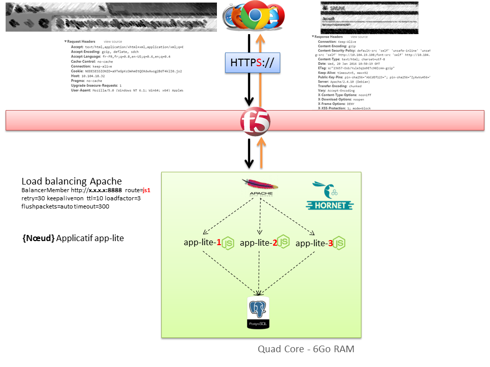

# Infrastructure

L'infrastructure Hornet.js repose sur les points suivant :

- OS : [Debian](https://www.debian.org)
- Serveur Web : [Apache Httpd](https://httpd.apache.org/)
- Serveur d'application : [Nodejs](https://nodejs.org)
- Base de données : [PostgreSQL](https://www.postgresql.org)

