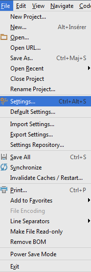
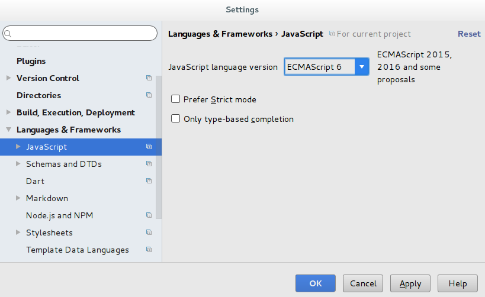
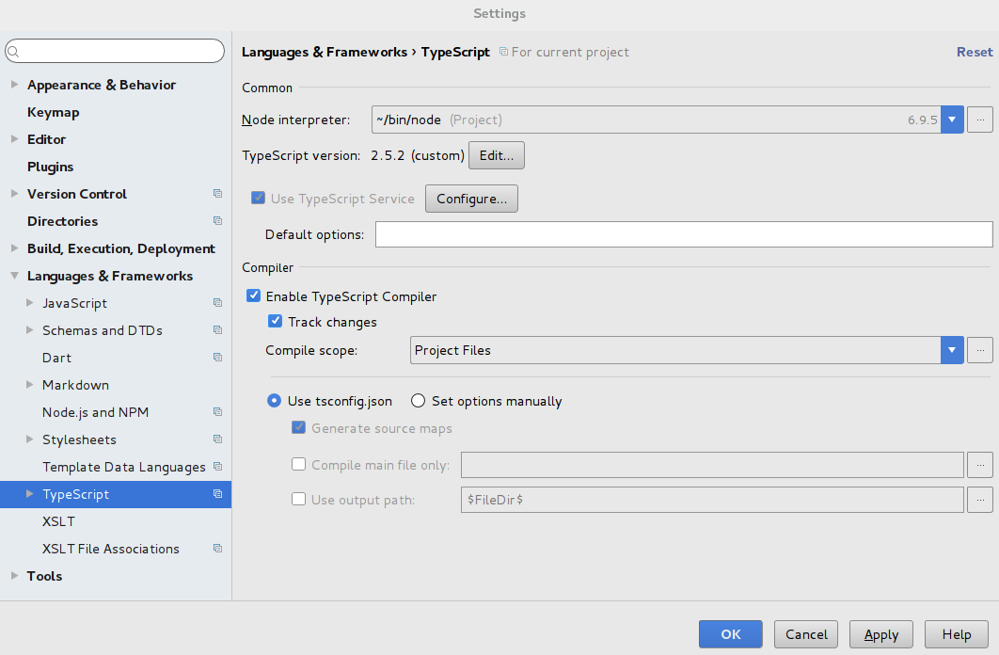
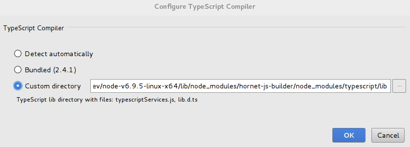
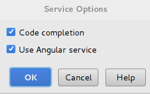
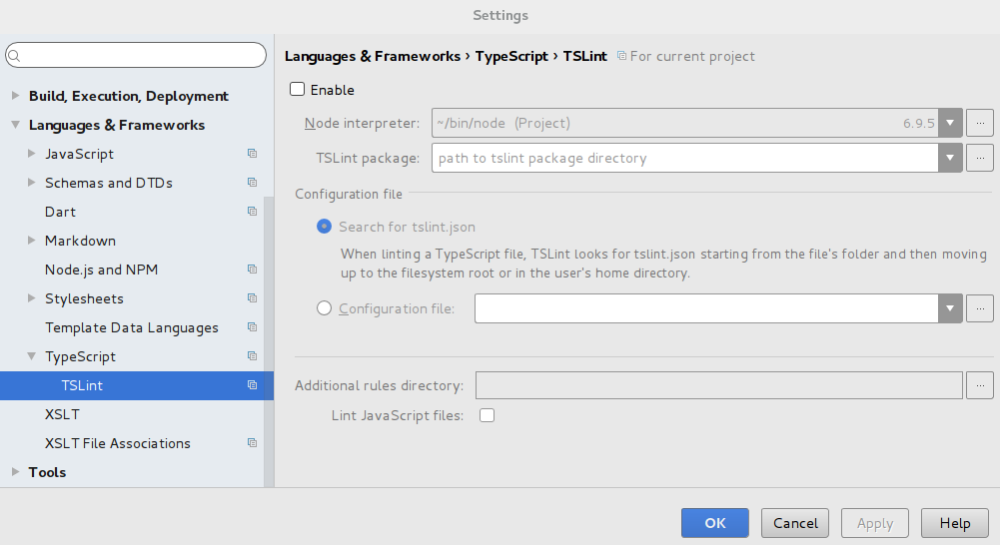
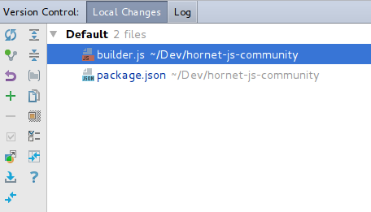

# WebStorm

## Installation

La version de Webstorm supportée par Hornet est la `2017.2.5`.

- Récupérer le binaire correspondant au système d’exploitation de développement depuis le site de webstorm

[https://www.jetbrains.com/webstorm/download/](https://www.jetbrains.com/webstorm/download/previous.html)

- Exécuter l’installation en gardant les options par défaut.

## Version JavaScript

Dans WebStorm :

- Accéder au menu `Settings`



- Accéder au menu `Languages & Framework` puis au menu `JavaScript`

- Sélectionner la valeur `ECMAScript 6` dans la liste `JavaScript language version`.



## TypeScript

### Configuration WebStorm

- Accéder au menu `Settings`


- Accéder au menu `Languages & Framework` puis au menu `Typescript`.



- Sélectionner les options :
    - Use TypeScript Service
    - Track changes
    - Use tsconfig.json
    - Generate source maps

- Choisir la version Typescript en cliquant sur `Edit...`.

Sélectionner `Custom directory` puis choisir le lien.

Afin d'être cohérent avec le builder Hornet.js, il est préférable de pointer vers la version typescript embarquée dans ses node_modules.

hornet-js-builder est installé en global.

Récupérer le prefix npm pour localiser l'installation de hornet-js-builder global.

``` sh
npm config ls -l | grep prefix
```

Exemple de résultat:

``` shell
prefix = "/usr"
```

L'installation globale doit etre : `/usr/lib/node_modules/`

Exemple :

```
/usr/lib/node_modules/hornet-js-builder/node_modules/typescript/lib
```

puis cliquer sur OK.



configuration TypeScript Service :



### Installation custom typescript

Par défaut, Webstorm fournit une version de typescript qui évolue avec chaque version du produit.
Il est possible d'installer une version spécifique pour son projet.

Installer `typescript` en version `2.5.2` en global.

``` shell
npm install -g typescript@2.5.2
```

Récupérer le prefix npm pour localiser l'installation de typescript global.

``` sh
npm config ls -l | grep prefix
```

Exemple de résultat:

``` shell
prefix = "/usr"
```

L'installation globale doit etre : `/usr/lib/node_modules/`

L'installation de typescript est alors : `/usr/lib/node_modules/typescript/lib`

## Formatage code

Créer un fichier xml avec le contenu suivant:

```xml

<code_scheme name="HORNET">
  <TypeScriptCodeStyleSettings>
    <option name="FORCE_SEMICOLON_STYLE" value="true" />
    <option name="SPACE_AFTER_TYPE_COLON" value="true" />
    <option name="FORCE_QUOTE_STYlE" value="true" />
    <option name="SPACE_BEFORE_FUNCTION_LEFT_PARENTH" value="false" />
    <option name="SPACES_WITHIN_IMPORTS" value="true" />
    <option name="ENFORCE_TRAILING_COMMA" value="Remove" />
    <option name="IMPORT_SORT_MODULE_NAME" value="true" />
  </TypeScriptCodeStyleSettings>
  <XML>
    <option name="XML_LEGACY_SETTINGS_IMPORTED" value="true" />
  </XML>
</code_scheme>

```

Appliquer le formattage de la manière suivante:

    Dans WebStorm : Settings > Editor > Code Style > TypeScript
    Cliquer sur le bouton « Manage » puis « Import » vers « Project »
    Choisir le scheme « Project » et valider


## Qualimétrie

Configurer les élements suivants dans les settings Webstorm (TypeScript/TSLint):

 Note :
 Pour les projets, il faut s'appuyer sur les règles du présent dans le builder hornet.



## Accès référentiel code

### SVN

Accéder au menu `VCS` puis au menu `Checkout from Version Control` et enfin `Subversion`.

Choisir ensuite l'url du projet à récupérer, cliquer sur `checkout`.

Choisir la destination du projet.

### GIT

Accéder au menu `VCS` puis au menu `Checkout from Version Control` et enfin `Git`.

Choisir ensuite l'url du projet à récupérer, cliquer sur `clone`.

### Webstorm Version Control

Webstorm possède une interface de gestion des changements.

Elle permet de gérer les fichiers modifiés.

On y retrouve l'arborescence des projets telle qu'elle est définie dans le workspace.



Il est possible de répartir les fichiers modifiés en différentes listes, les changelists.

Cela permet de pouvoir commiter uniquement une liste de fichiers souhaités.

Pour changer un fichier de changelist, il suffit de faire un clic droit sur celui-ci dans version control -> `move to another changelist`
puis de choisir la changelist de destination.