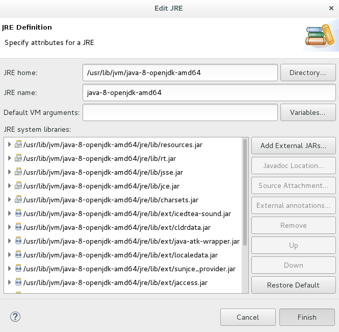
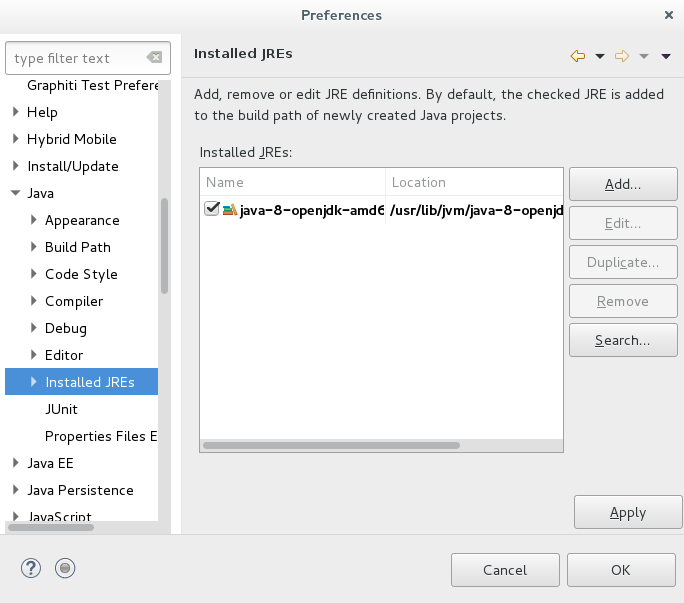
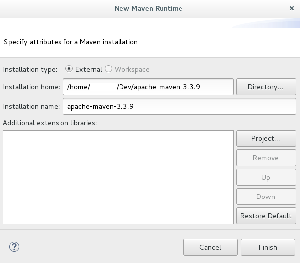
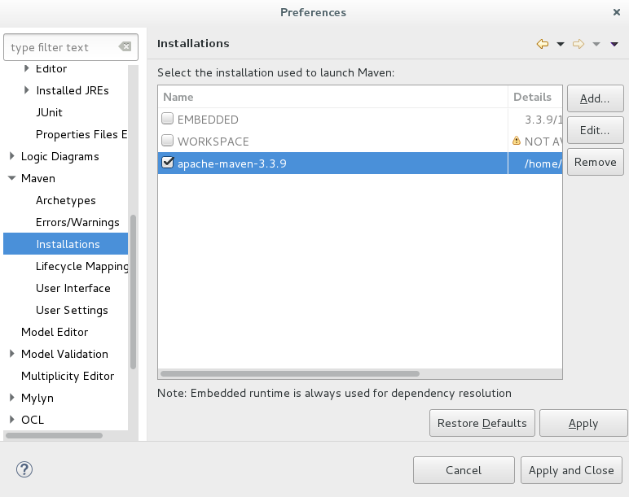
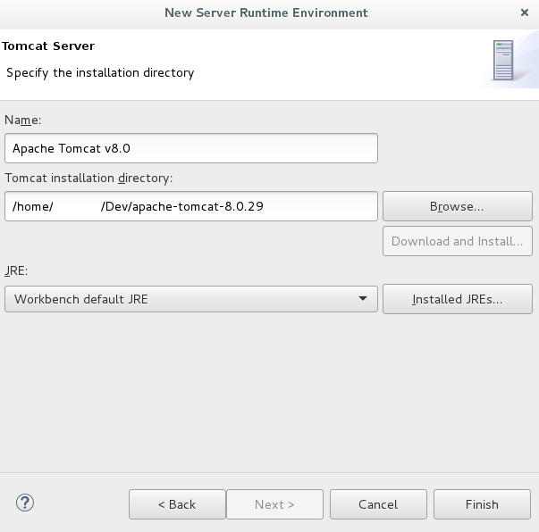
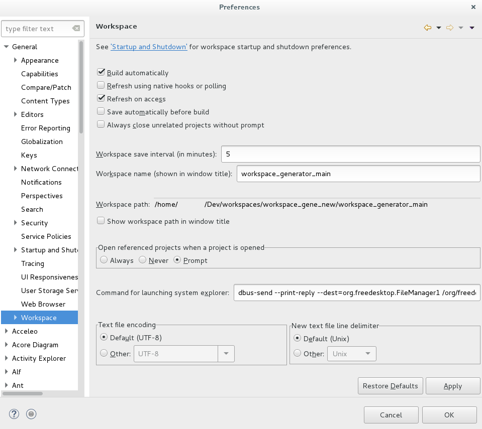
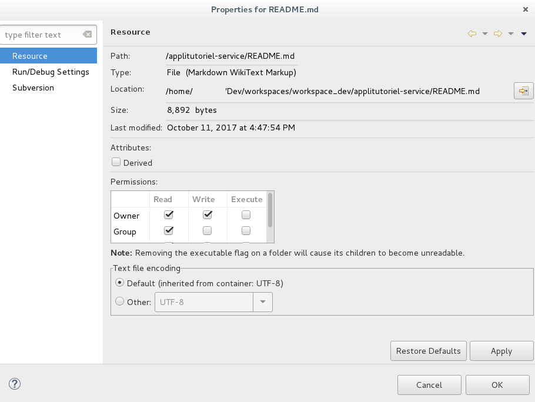
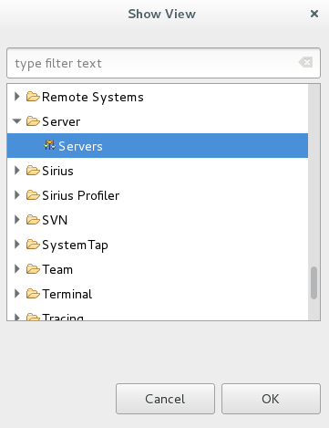
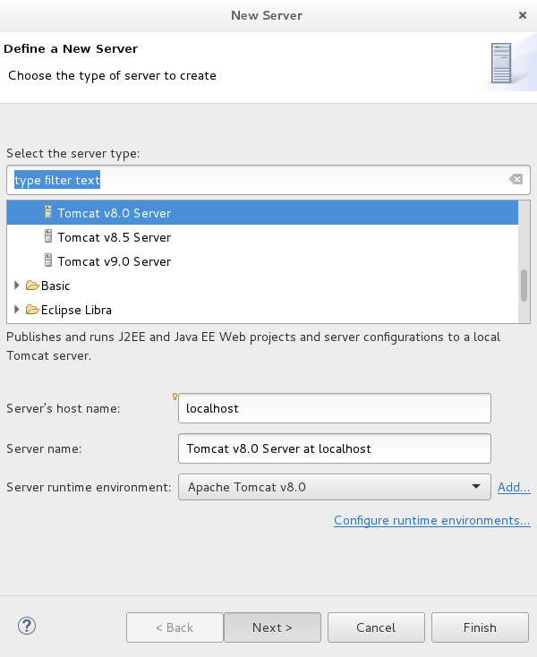
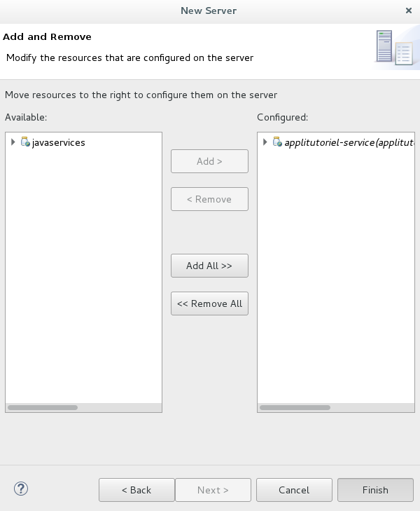

# Poste dev java

Ce document a pour but de décrire les opérations à effectuer pour installer et configurer un environnement de développement pour `hornet-Service` version `5.x.x` et supérieur.

## Composition de l’environnement ##

L’environnement d’exécution Hornet est composé des éléments suivants :

- `Java 8`
- `Tomcat 8.5.x`

La gestion des dépendances et la construction des livrables est assurée par `Maven 3.3.9`.

L’environnement de développement intégré (IDE) retenu est `Eclipse Neon`.

L’application `Graphviz` (version `2.30.1`) est également utilisée pour la phase de génération des documentations Java, particulièrement pour l’intégration de modèles UML.

## Configuration de l'environnement d'exécution ##

### Java Development Kit 8 ###

La version de Java supportée par Hornet est la `8` en version `OpenJDK`. Pour l'environnement windows, il faut utiliser la version Oracle, mais il ne s'agit pas de la version utilisée en production.

De préférence, il est conseillé de développer dans un environnement linux avec `OpenJDK`.

- Récupérer le binaire correspondant au système d’exploitation de développement depuis le site d'oracle 

```shell
apt-get install openjdk-8-jdk
```

- Exécuter l’installation en gardant les options par défaut.

### Apache Tomcat 8.5.X ###

La version de Tomcat supportée par Hornet est la `8.5.X`

- Télécharger la version `8.5.X` depuis le site :

[https://tomcat.apache.org/download-80.cgi](https://tomcat.apache.org/download-80.cgi#8.0.47)
  
- Dézipper le contenu du fichier dans le répertoire de votre choix.

ou bien en ligne de commande : 

```shell
apt-get install tomcat8
```

## Configuration de l'environnement de développement ##

### Apache Maven 3.3.9 ###

La version de Maven supportée par Hornet est la `3.3.9`.

- Télécharger la version `3.3.9` depuis le site :

[http://apache.mirrors.ovh.net/ftp.apache.org/dist/maven/maven-3/3.3.9/binaries/](http://apache.mirrors.ovh.net/ftp.apache.org/dist/maven/maven-3/3.3.9/binaries/)

- Dézipper le contenu du fichier dans le répertoire de votre choix.

**Note** : 

La version **minimale** pour compiler le framework est la `3.2.2` (contient une correction d'un bug bloquant).
La version embarqué par `Eclipse Neon` ne fonctionne donc pas.

### IDE Eclipse ###

#### Installation ####

- Depuis le site eclipse :

[http://www.eclipse.org/downloads/packages/eclipse-ide-java-ee-developers/neon3](http://www.eclipse.org/downloads/packages/eclipse-ide-java-ee-developers/neon3)

- Extraire le fichier dans le répertoire de votre choix.

#### Exécution ####

Il est possible de modifier le fichier `eclipse.ini`.

Exemple de configuration :

```
    -startup
    plugins/org.eclipse.equinox.launcher_1.3.201.v20161025-1711.jar
    --launcher.library
    plugins/org.eclipse.equinox.launcher.gtk.linux.x86_64_1.1.401.v20161122-1740
    -product
    org.eclipse.epp.package.jee.product
    --launcher.defaultAction
    openFile
    -showsplash
    org.eclipse.platform
    --launcher.XXMaxPermSize
    256m
    -vm
    /usr/lib/jvm/java-8-openjdk-amd64/bin/java
    --launcher.defaultAction
    openFile
    --launcher.appendVmargs
    -vmargs
    -Dosgi.requiredJavaVersion=1.8
    -XX:+UseG1GC
    -XX:+UseStringDeduplication
    -Dosgi.requiredJavaVersion=1.8
    -Xms256m
    -Xmx1024m
    -Dfile.encoding=UTF-8
```

**Note :**

- L’argument `-vm` doit absolument être avant l’option `-vmargs`
- Les clés/valeurs doivent être sur deux lignes pour l’argument `-vm`.
- L’argument `-Dfile.encoding` est ajouté après `-vmargs`.


#### Configuration JDK ####

- Choisir le `menu Window > Preferences puis sélectionner Java > Installed JREs`
- Cliquer sur `Add`
- Choisir Standard VM puis `Next`
- Renseigner le champ `JRE home` en sélectionnant le répertoire d’installation du JDK :



- Cliquer sur `Finish` et cocher la case jdk1.8 :



- Valider en cliquant sur `OK`

#### Configuration Maven ####

- Choisir le menu `Window > Preferences puis sélectionner Maven > Installations`
- Cliquer sur `Add`
- Renseigner le champ _Installation home_ en sélectionnant le répertoire d'installation de Maven 3.3.9 :



- Cliquer sur `Finish` et cocher la case `apache-maven-3.3.9` :



- Valider en cliquant sur `OK`

#### Environnement d'exécution Tomcat ####

Les projets Web à partir d’Hornet 5, comme l’AppliTutoriel, référencent un environnement d’exécution `Tomcat 8.5.X` permettant de lancer un serveur de test depuis Eclipse.

Pour le configurer :

- Choisir le menu `Window > Preferences puis sélectionner Server > Runtime Environnements`
- Cliquer sur `Add`
- Choisir `Apache Tomcat 8.0` puis `Next`
- Choisir le nom par défaut `Apache Tomcat v8.5`, renseigner le champ Tomcat installation directory  en sélectionnant le répertoire d’installation de Tomcat puis choisir la JRE.



- Valider en cliquant sur **OK**

#### Encoding (et format de fin de ligne) ####

	Important : Il existe deux paramètres intervenant dans l'encodage d'un fichier. Le premier, pour les formats le permettant tels que ceux dérivant du XML, est indiqué en début de document et est visible par l'utilisateur lors de son édition. Le second se paramètre dans l'éditeur utilisé et n'est pas visible directement.

Eclipse permet de spécifier le format d'un fichier : sous Windows, vérifier que l'encodage défini pour le workspace est bien `UTF-8` dans la fenêtre `Window > Preferences`, puis `rubrique General > Workspace`, option `Text File Encoding`.

De la même manière, pour forcer le format de fin de ligne en mode `Unix`, sur le même écran, vérifier l’option `New text file line delimiter`, à positionner sur `Unix`.



Il est également possible d'éditer ce paramètre pour un fichier spécifique ou un dossier en ouvrant la boîte de dialogue des propriétés de ce fichier.



Remarques :
- L'`ISO-8859-15` n'apparait pas dans cette liste. Il est cependant sélectionné automatiquement si Eclipse l'a détecté dans une balise du document, par exemple avec l’entête suivant pour les fichiers HTML :

```xml
    <meta http-equiv="Content-Type" content="text/html; charset=ISO-8859-15">
```

- Les fichiers properties sont systématiquement écrits en `ISO-8859-1`. C’est une norme définie par Java. Les caractères spéciaux doivent alors être échappés en utilisant une notation de la forme « \uXXXX ».

Il est fortement conseillé d'utiliser Eclipse pour éditer des pages web contenant des caractères spéciaux en `UTF-8`, et pas des éditeurs comme le bloc-notes qui ne proposent pas assez d'options d'encodage. Des informations différentes entre l'encodage du fichier et l'encodage indiqué dans une balise risquent d'aboutir à des caractères spéciaux corrompus.

### Qualimétrie Hornet ###

Afin d’améliorer la qualité du code en termes de présentation et de respect des bonnes pratiques, en particulier des normes de développement Java, trois plugins complémentaires sont utilisés pour le développement Hornet :

- `PMD`
- `FindBugs`
- `Checkstyle`

Ces outils sont à installer via les updates sites eclipse. 

Les règles ne sont pas encore établies, prendre par défaut celles proposées par l'application sonar. 

[http://www.sonarsource.com/](http://www.sonarsource.com/)

### Ajout d'un serveur Tomcat

Pour ajouter un serveur Tomcat pour le développement:

- Afficher la vue Servers en sélectionnant dans le menu `Window > Show view > Other …` puis `Server > Servers` :



- `Valider`
- Faire un clic droit dans cette nouvelle vue puis choisir `New > Server`.

- Choisir `Tomcat v8.5 Server`, renseigner un nom et choisir Apache Tomcat v8.0 dans le champ Server Runtime Environnement :



- Cliquer sur `Next` et choisir les projets à ajouter sur ce serveur de développement :



- Cliquer sur `Finish` le serveur de test créé apparaît alors dans la vue Server.


- Le serveur de test créé peut maintenant être lancé depuis Eclipse.
