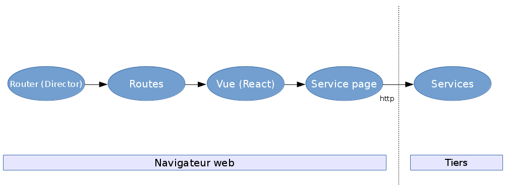
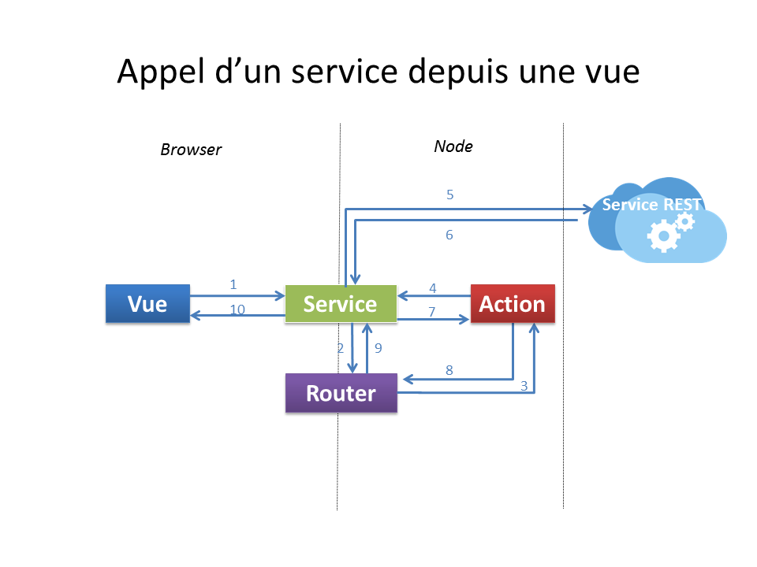
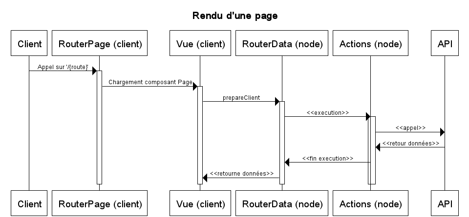

# Architecture frontend

## Principes & définitions

### Node.js

> **Node.js** est une plateforme logicielle libre et événementielle en JavaScript orientée vers les applications réseau qui doivent pouvoir monter en charge. Elle utilise la machine virtuelle V8 et implémente sous licence MIT les spécifications CommonJS. Node.js contient une bibliothèque de serveur HTTP intégrée, ce qui rend possible de faire tourner un serveur web sans avoir besoin d'un logiciel externe comme Apache ou Lighttpd, et permettant de mieux contrôler la façon dont le serveur web fonctionne.

[http://fr.wikipedia.org/wiki/Node.js](http://fr.wikipedia.org/wiki/Node.js)

### JavaScript

> **JavaScript** est un langage de programmation de scripts principalement employé dans les pages web interactives mais aussi pour les serveurs. C’est un langage orienté objet à prototype, c’est-à-dire que les bases du langage et ses principales interfaces sont fournies par des objets qui ne sont pas des instances de classes, mais qui sont chacun équipés de constructeurs permettant de créer leurs propriétés, et notamment une propriété de prototypage qui permet d’en créer des objets héritiers personnalisés. En outre, les fonctions sont des objets de première classe.
>
> Le langage a été créé en 1995 par Brendan Eich (Brendan Eich étant membre du conseil d'administration de la fondation Mozilla à cette époque) pour le compte de Netscape Communications Corporation. Le langage, actuellement à la version 1.8.2, est une implémentation de la 3e version de la norme ECMA-262 qui intègre également des éléments inspirés du langage Python. La version 1.8.5 du langage est prévue pour intégrer la 5e version du standard ECMA.

[http://fr.wikipedia.org/wiki/JavaScript](http://fr.wikipedia.org/wiki/JavaScript)

#### Fonctions de retour (callback functions)

Une `callback` (fonction de retour) est une fonction dont la particularité est d'être transmise en paramètre d'une autre fonction qui se chargera de l'appeler. Ce mécanisme permet notamment de rendre configurable un traitement par injection d'un comportement variable, ou de déclencher un traitement ultérieurement.

En JavaScript, le passage de fonction en paramètre se fait en donnant simplement son nom sans ajouter les parenthèses.

Exemple d'utilisation de fonction JavaScript reçu en paramètre d'une autre :

``` javascript
function job(callback) {
    // ... code du comportement de la fonction 'job'
    callback(); // appel de la fonction transmise
}
function next() {
    // ...
}
function main() {
    // passage de la fonction next en paramètre de l'appel de la fonction job
    job(next);
}
```


#### Promise

La notion de `promise` permet une autre forme d'écriture des appels de fonction avec callback. En effet, l'imbrication de fonction de retour peut rendre le code difficile à lire, soit on alourdit le code en déclarant les fonctions directement les unes dans les autres, soit on perd de vue l'enchaînement des traitements (callback hell). L'écriture sous forme de `promise` permet d'améliorer cela :

``` javascript
promise
    .then(function(result) {
        // ... Premier traitement si OK
    })
    .then(function(result) {
        // ... Second traitement si toujours OK
    })
    .fail(function(err) {
        // ... Traitement si erreur
    }
```


### TypeScript

> **TypeScript** est un langage de programmation libre et open-source développé par Microsoft qui a pour but d'améliorer et de sécuriser la production de code JavaScript. C'est un sur-ensemble de JavaScript (c'est-à-dire que tout code JavaScript correct peut être utilisé avec TypeScript). Le code TypeScript est transcompilé en JavaScript, pouvant ainsi être interprété par n'importe quel navigateur web ou moteur JavaScript. Il a été cocréé par Anders Hejlsberg, principal inventeur de C#.
>
> TypeScript permet un typage statique optionnel des variables et des fonctions, la création de classes et d'interfaces, l'import de modules, tout en conservant l'approche non-contraignante de JavaScript. Il supporte la spécification ECMAScript 6.

[http://fr.wikipedia.org/wiki/TypeScript](http://fr.wikipedia.org/wiki/TypeScript)

Exemples de fichiers TypeScript (simplifiés) :

* `ServiceApi.ts` :

``` typescript
class ServiceApi {
    request() {
        return superagent;
    }

    buildUrl(path) {
        return host + name + path;
    }
}
export = ServiceApi;
```

* `ContactApi.ts` :  

``` typescript
import ServiceApi = require("hornet-js-core/src/services/ServiceApi");

class ContactApi extends ServiceApi {
    send(data) {
        // ... implémentate de la méthode
    }
}
export = ContactApi;
```

### JSON

> **JSON** (JavaScript Object Notation) est un format de données textuelles dérivé de la notation des objets du langage JavaScript. Il permet de représenter de l’information structurée comme le permet XML par exemple. Créé par Douglas Crockford entre 2002 et 2005, il est décrit par la RFC 7159 de l’IETF.

[http://fr.wikipedia.org/wiki/JavaScript_Object_Notation](http://fr.wikipedia.org/wiki/JavaScript_Object_Notation)

Exemple de donnée au format JSON :

``` JSON
{
  "prop_A" : {
    "prop_A1" : "valeur",
    "prop_A2" : 10
  },
  "prop_B" : [
    "valeur B1",
    "valeur B2",
    "valeur B3"
  ],
  "prop_C" : [
    {
      "prop_Ca1" : "valeur",
      "prop_Ca2" : "valeur"
    },
    {
      "prop_Cb1" : "valeur",
      "prop_Cb2" : "valeur"
    }
  ]
}
```

### HTML 5

> **HTML5** (HyperText Markup Language 5) est la dernière révision majeure d'HTML (format de données conçu pour représenter les pages web). Cette version a été finalisée le 28 octobre 2014. HTML5 spécifie deux syntaxes d'un modèle abstrait défini en termes de DOM : HTML5 et XHTML5. Le langage comprend également une couche application avec de nombreuses API, ainsi qu'un algorithme afin de pouvoir traiter les documents à la syntaxe non conforme. Le travail a été repris par le W3C en mars 2007 après avoir été lancé par le WHATWG. Les deux organisations travaillent en parallèle sur le même document afin de maintenir une version unique de la technologie. Le W3C vise la clôture des ajouts de fonctionnalités le 22 mai 2011 et une finalisation de la spécification en 2014, et encourage les développeurs Web à utiliser HTML 5 dès maintenant.

[http://fr.wikipedia.org/wiki/HTML5](http://fr.wikipedia.org/wiki/HTML5)

#### History

> L'objet **DOM** `window` fournit un accès à l'historique du navigateur via l'objet history. Il expose un ensemble de méthodes et de propriétés qui permettent d'avancer et de reculer dans l'historique de l'utilisateur ainsi que -- à partir d'HTML5 -- manipuler le contenu de l'ensemble de l'historique.

[https://developer.mozilla.org/fr/docs/Web/Guide/DOM/Manipuler_historique_du_navigateur](https://developer.mozilla.org/fr/docs/Web/Guide/DOM/Manipuler_historique_du_navigateur)

Hornet utilise la manipulation de l'historique du navigateur. Cela permet :

* de conserver un historique de navigation (fonction back)
* de copier et sauvegarder des liens directs vers une page de l'application

### Architecture REST

> **REST** (REpresentational State Transfer) est un style d’architecture pour les systèmes hypermédia distribués, créé par Roy Fielding en 2000 dans le chapitre 5 de sa thèse de doctorat1.
>
> REST n’est pas un protocole (tel que HTTP) ou un format. Ce style d'architecture est particulièrement bien adapté au World Wide Web mais n'en est pas dépendant. Les contraintes, telles que définies par Roy Fielding, peuvent s'appliquer à d'autres protocoles d'application que HTTP.

[http://fr.wikipedia.org/wiki/Representational_State_Transfer](http://fr.wikipedia.org/wiki/Representational_State_Transfer)

L'implémentation des services REST dans le cadre d'un module applicatif de service d'Hornet s'appuie sur le protocole http (notamment sur les verbes et les codes de réponses).

Exemples de « signatures » http de services REST d'un module applicatif Hornet Service :

| Verbe  | URL         | Description |
| ------ | ----------- | ----------- |
| GET    | /clients    | Charge la liste des clients |
| GET    | /clients/1  | Charge le détail du client ayant l'identifiant '1' |
| POST   | /clients    | Créé un client |
| PUT    | /clients/1  | Mise à jour complète d'un client |
| PATCH  | /clients/1  | Mise à jour partielle d'un client |
| DELETE | /clients/1  | Supprime le client ayant l'identifiant '1' |


### Séparation des rôles

Les pages web sont composées de trois parties :

* La partie sémantique en html ou xhtml (le fond),
* La partie présentation avec des styles CSS (la forme),
* La partie interactive, dynamique et événementielle avec du JavaScript (la forme).

Ces trois couches utilisées pour les pages web sont détaillées dans les paragraphes suivants.

#### Partie sémantique

Cette partie est implémentée sous forme de document HTML ou XML conformément aux normes w3c et en respectant les règles d’accessibilité.

Aucun élément de présentation ne doit être présent dans ces documents (hormis les liens d’identification et de  classes CSS pour la présentation).

Les éléments HTML doivent être utilisés conformément à leur usage prévu par le w3c, par exemple :

* Les « tables » HTML doivent être utilisées essentiellement pour présenter des données sous forme de tableaux, et non pour structurer l’affichage.

#### Partie Présentation

La partie présentation est réalisée via les styles CSS et les éléments HTML de type groupement (div, p, span …).

La partie présentation fait aussi appel à la composition. Les briques utilisées par le framework permettent de composer les écrans à partir de composants plus fins.

Le framework fournit les briques de bases, ainsi que des templates d'écran type via l'`applitutoriel`


#### Partie Interactive

La partie interactive est réalisée en JavaScript/TypeScript.


## Architecture du framework

### Fonctionnement

1. Rendu Serveur :  
  * L’utilisateur accède à la première page par un appel serveur, le serveur génère une vue de l'application (sans les data).
  * L'utilisateur peut commencer à utiliser l'application
2. Single Page Application (SPA) :  
  * Lorsque tous les élements JavaScript sont bien reçus, le client bascule automatiquement en mode SPA.
  * Dans le mode SPA, tout se passe principalement dans le navigateur client (action/mise à jour de l'état de l'écran). Il n’y a alors plus de chargement complet de page (excepté via l'utilisation du `F5` du clavier). Seules les interactions avec le serveur nécessitent des échanges via des flux de type `AJAX` .  
  * Ce mode permet une grande interactivité et réactivité des applications web vis à vis de l'utilisateur final.

Les paragraphes suivants présentent de façon plus détaillée les caractéristiques essentielles de la solution.

#### Fonctionnement détaillé

Dans le mode SPA, seuls les éléments impactés par un changement de fonction sont modifiés à l’aide de traitements JavaScript, les autres parties, comme l’entête ou le menu, restent inchangées).

Dans ce mode, les traitements sont majoritairement exécutés dans le navigateur client en JavaScript. Les appels aux serveurs servent à interagir avec les données stockées sur le serveur distant (création, consultation, modification, suppression). Ces échanges sont réalisés à l’aide d’appels Ajax.

Cinématique de rendu serveur / SPA :

1. L’utilisateur demande la première page de l'application.
2. L’application retourne un document HTML complet (entête, menu, corps, bas de page). Le mode SPA s’initialise dans le navigateur par l'exécution automatique de JavaScript (initialisation du court-circuit des clics...).
3. En mode SPA, les liens vers les autres écrans (navigation) sont court-circuités et remplacés par des navigations internes avec du code JavaScript. L'accès aux données se fait par la déclaration de routes dites **Data**
  * L’utilisateur demande à accéder à la page suivante en cliquant sur le lien hypertexte correspondant. Le clic ayant été détourné par le mode SPA, le code JavaScript émet un changement de route interne.<br>
  * L’utilisateur demande à accéder à des données, c'est une route *Data* qui est sollicitée. Ce qui soumet un appel AJAX pour récupérer un flux JSON. On met à jour le DataSource ou l'état du composant page, ce qui provoque le rafraîchissement de certains composants de la page grâce à l'utilisation de `Vues`.

Chaque fragment HTML, correspondant aux éléments de page, est conçu sous forme de composant pour être indépendant de son conteneur.

### Architecture technique

L'architecture de Hornet s'appuie principalement sur les éléments suivants :

* Un module applicatif de services en technologie Java : `hornet-services`
* Un module applicatif de présentation en technologie JavaScript/TypeScript : `hornet-js`


### Hornet-services

Le module applicatif de services a pour fonction d'exposer sous forme d'API `REST` les données et services métier de l'application.

Ce module est développé en technologie Java et déployé dans le conteneur de servlet Tomcat.


Les principaux composants techniques intervenant dans le module applicatif de services sont :

* Java Virtual Machine 8
* Conteneur de Servlet Tomcat 8
* Injection de dépendances avec Spring 4
* Exposition des services REST avec Spring MVC 4
* Accès à la base de données avec myBatis 3

### Hornet-js

Le module applicatif de présentation a pour fonction de fournir l'IHM de l'application.

Ce module est développé en technologie JavaScript/TypeScript et s'exécute grâce à Node.js.

Les principaux composants techniques intervenant dans le module applicatif de présentation sont :

* `Node.js` : plateforme logicielle d'exécution du code JavaScript côté serveur
* `Express` : bibliothèque de base pour l'écriture d'applications web sur Node.js
* `Director` : composant de gestion du routage des urls sur le serveur
* `React` : bibliothèque de création d'IHM html selon une logique orientée composants
* `Superagent` : composant JavaScript pour l'exécution d'appels http
* `Webpack` : outil de création de paquetages (JavaScript, CSS, ...) pour les navigateurs web
* `Gulp` : outil pour la création de tâches de développement

#### Navigateur web




Dans Node.js les interactions proviennent de requêtes http. Celles-ci sont prises en charge par le framework `Express` avant d'intégrer le déroulement du pattern Hornet.

#### Pattern d’architecture Hornet

Ces schémas d’architecture correspondent à l'implémentation du pattern `Hornet`. Celui-ci ce présente comme suit :



Ci-dessous les composants qui vont permettre de remplir les différentes responsabilités définies dans le pattern Hornet.

##### Actions

Les actions portent les traitements de l’application. Leur réalisation est à la charge du développeur de l’application.

Les services externes sont appelés depuis les actions afin d’effectuer les traitements demandés par l’utilisateur. Les retours des services externes sont transmis aux `stores` par le biais du mécanisme de propagation via le  `dispatcher`.


Chaque **action** doit être une fonction retournant une `Promise` effectuant l’action à proprement parler (au sens métier). Ce fonctionnement est nécessaire afin de permettre au `routeur` :

* de savoir quand effectuer le rendu de la page côté serveur.
* de pouvoir désactiver les actions lors du premier affichage de la page côté client pour éviter un double appel des API externes (serveur puis client).

##### Routeur

Ce composant est le point central de la navigation. Il permet de gérer de manière identique la navigation au sein de l’application que ce soit côté client (avec ou sans JavaScript) ou côté serveur.

Ce composant est configuré à partir d’un ensemble de « routes » qui viennent faire le lien entre une URL et les actions du pattern (dans son implémentation isomorphe).

Le routeur d'Hornet s'appuie sur le composant [Director](https://github.com/flatiron/director).

Les particularités :

* Transmission des données `POST` par une méthode spécifique afin de ne pas modifier l’url du navigateur
* Utilisation du mode « historique » html5 (mode `pushState` à la place de la notation `!#`) afin d’uniformiser les urls entre la partie client et serveur.

##### Vues

Les vues sont les composants servant à produire le code html affiché à l'utilisateur.

Les composants de cette brique utilisent le moteur de rendu [React](http://facebook.github.io/react/) :

* Un rendu des composants à partir d’un template
* Une gestion des évènements permettant un binding unidirectionnel (vue -> modèle).

Dans Hornet, les composants graphiques sont implémentés avec la librairie React.

#### Diagrammes de séquence

Ci-dessous sont présentés les schémas généraux de déroulements des échanges dans le pattern Hornet en mode SPA (navigateur web) et rendu serveur (serveur NodeJS).

##### Rendu côté serveur


##### Rendu côté client


