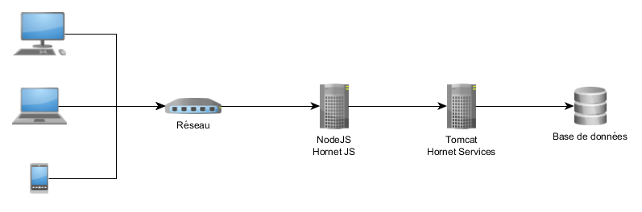
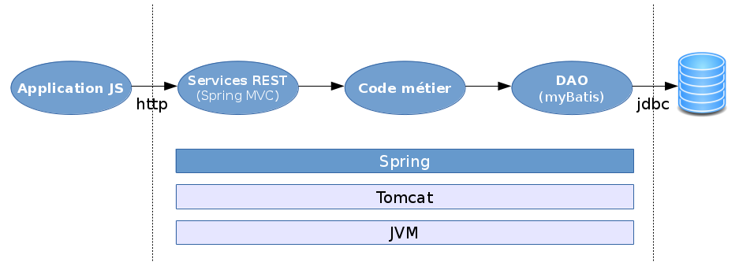
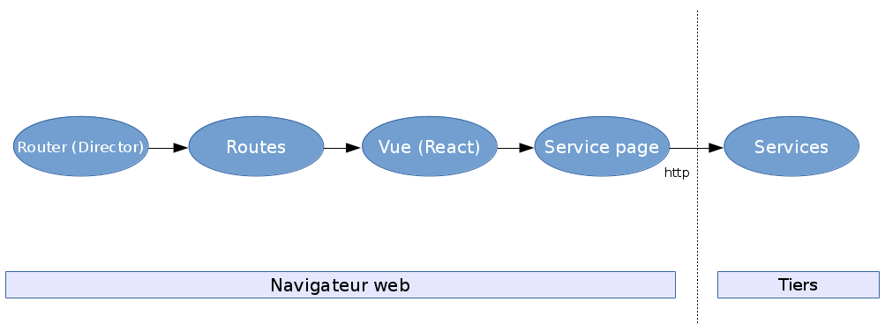
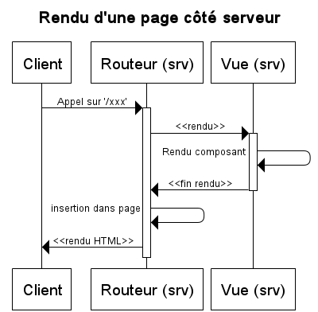

# Architecture frontend
## Architecture du framework

### Fonctionnement

1. Rendu Serveur :  
  * L’utilisateur accède à la première page par un appel serveur, le serveur génère une vue de l'application (sans les data).
  * L'utilisateur peut commencer à utiliser l'application
2. Single Page Application (SPA) :  
  * Lorsque tous les élements JavaScript sont bien reçus, le client bascule automatiquement en mode SPA.
  * Dans le mode SPA, tout se passe principalement dans le navigateur client (action/mise à jour de l'état de l'écran). Il n’y a alors plus de chargement complet de page (excepté via l'utilisation du `F5` du clavier). Seules les interactions avec le serveur nécessitent des échanges via des flux de type `AJAX` .  
  * Ce mode permet une grande interactivité et réactivité des applications web vis à vis de l'utilisateur final.

Les paragraphes suivants présentent de façon plus détaillée les caractéristiques essentielles de la solution.

#### Fonctionnement détaillé

Dans le mode SPA, seuls les éléments impactés par un changement de fonction sont modifiés à l’aide de traitements JavaScript, les autres parties, comme l’entête ou le menu, restent inchangées).

Dans ce mode, les traitements sont majoritairement exécutés dans le navigateur client en JavaScript. Les appels aux serveurs servent à interagir avec les données stockées sur le serveur distant (création, consultation, modification, suppression). Ces échanges sont réalisés à l’aide d’appels Ajax.

Cinématique de rendu serveur / SPA :

1. L’utilisateur demande la première page de l'application.
2. L’application retourne un document HTML complet (entête, menu, corps, bas de page). Le mode SPA s’initialise dans le navigateur par l'exécution automatique de JavaScript (initialisation du court-circuit des clics...).
3. En mode SPA, les liens vers les autres écrans (navigation) sont court-circuités et remplacés par des navigations internes avec du code JavaScript. L'accès aux données se fait par la déclaration de routes dites **Data**
  * L’utilisateur demande à accéder à la page suivante en cliquant sur le lien hypertexte correspondant. Le clic ayant été détourné par le mode SPA, le code JavaScript émet un changement de route interne. 
  * L’utilisateur demande à accéder à des données, c'est une route *Data* qui est sollicitée. Ce qui soumet un appel AJAX pour récupérer un flux JSON. On met à jour le DataSource ou l'état du composant page, ce qui provoque le rafraîchissement de certains composants de la page grâce à l'utilisation de `Vues`.

Chaque fragment HTML, correspondant aux éléments de page, est conçu sous forme de composant pour être indépendant de son conteneur.

### Architecture technique

L'architecture de Hornet s'appuie principalement sur les éléments suivants :

* Un module applicatif de services en technologie Java : `hornet-services`
* Un module applicatif de présentation en technologie JavaScript/TypeScript : `hornet-js`

### Hornet-services

Le module applicatif de services a pour fonction d'exposer sous forme d'API `REST` les données et services métier de l'application.

Ce module est développé en technologie Java et déployé dans le conteneur de servlet Tomcat.

Les principaux composants techniques intervenant dans le module applicatif de services sont :

* Java Virtual Machine 8
* Conteneur de Servlet Tomcat 8
* Injection de dépendances avec Spring 4
* Exposition des services REST avec Spring MVC 4
* Accès à la base de données avec myBatis 3

### Hornet-js

Le module applicatif de présentation a pour fonction de fournir l'IHM de l'application.

Ce module est développé en technologie JavaScript/TypeScript et s'exécute grâce à Node.js.

Les principaux composants techniques intervenant dans le module applicatif de présentation sont :

* `Node.js` : plateforme logicielle d'exécution du code JavaScript côté serveur
* `Express` : bibliothèque de base pour l'écriture d'applications web sur Node.js
* `Director` : composant de gestion du routage des urls sur le serveur
* `React` : bibliothèque de création d'IHM html selon une logique orientée composants
* `Superagent` : composant JavaScript pour l'exécution d'appels http
* `Webpack` : outil de création de paquetages (JavaScript, CSS, ...) pour les navigateurs web
* `Gulp` : outil pour la création de tâches de développement

#### Navigateur web

Dans Node.js les interactions proviennent de requêtes http. Celles-ci sont prises en charge par le framework `Express` avant d'intégrer le déroulement du pattern Hornet.

#### Pattern d’architecture Hornet

Ces schémas d’architecture correspondent à l'implémentation du pattern `Hornet`. Celui-ci ce présente comme suit :

Ci-dessous les composants qui vont permettre de remplir les différentes responsabilités définies dans le pattern Hornet.

##### Actions

Les actions portent les traitements de l’application. Leur réalisation est à la charge du développeur de l’application.

Les services externes sont appelés depuis les actions afin d’effectuer les traitements demandés par l’utilisateur. Les retours des services externes sont transmis aux `stores` par le biais du mécanisme de propagation via le  `dispatcher`.

Chaque **action** doit être une fonction retournant une `Promise` effectuant l’action à proprement parler (au sens métier). Ce fonctionnement est nécessaire afin de permettre au `routeur` :

* de savoir quand effectuer le rendu de la page côté serveur.
* de pouvoir désactiver les actions lors du premier affichage de la page côté client pour éviter un double appel des API externes (serveur puis client).

##### Routeur

Ce composant est le point central de la navigation. Il permet de gérer de manière identique la navigation au sein de l’application que ce soit côté client (avec ou sans JavaScript) ou côté serveur.

Ce composant est configuré à partir d’un ensemble de « routes » qui viennent faire le lien entre une URL et les actions du pattern (dans son implémentation isomorphe).

Le routeur d'Hornet s'appuie sur le composant [Director](https://github.com/flatiron/director).

Les particularités :

* Transmission des données `POST` par une méthode spécifique afin de ne pas modifier l’url du navigateur
* Utilisation du mode « historique » html5 (mode `pushState` à la place de la notation `!#`) afin d’uniformiser les urls entre la partie client et serveur.

##### Vues

Les vues sont les composants servant à produire le code html affiché à l'utilisateur.

Les composants de cette brique utilisent le moteur de rendu [React](http://facebook.github.io/react/) :

* Un rendu des composants à partir d’un template
* Une gestion des évènements permettant un binding unidirectionnel (vue -> modèle).

Dans Hornet, les composants graphiques sont implémentés avec la librairie React.

#### Diagrammes de séquence

Ci-dessous sont présentés les schémas généraux de déroulements des échanges dans le pattern Hornet en mode SPA (navigateur web) et rendu serveur (serveur NodeJS).

##### Rendu côté serveur

##### Rendu côté client

