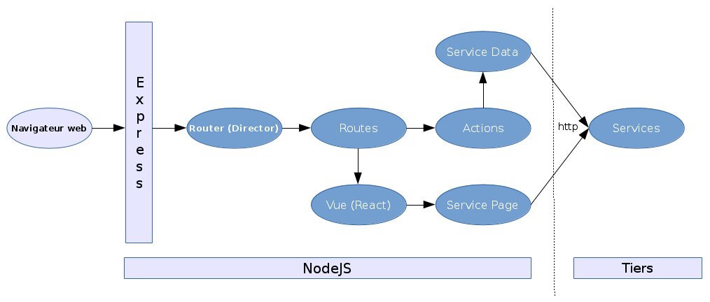
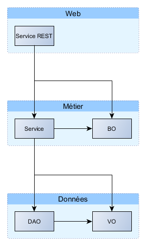
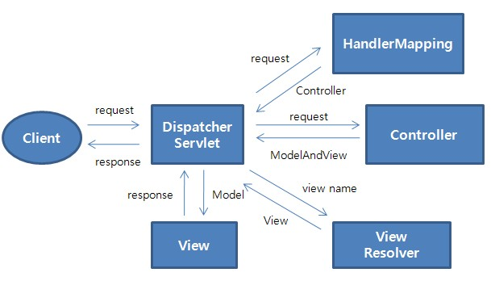

# Architecture Backend

## Schéma d'architecture

## Architecture applicative

La partie serveur est implémentée pour la plateforme Java 8 et Java Enterprise Edition 1.8.

### Découpage

La partie serveur utilise une architecture en trois couches applicatives (3-Tiers) :

Chaque couche utilise des stéréotypes de classes qui lui sont propres.

Les contraintes structurant cette architecture sont :

1. Limiter la dépendance du code applicatif envers le socle technique, afin de réutiliser le même code dans des contextes d’exécutions différents (tests unitaires, mode bouchonné, …).
1. Avoir un couplage faible entre les composants applicatifs.
1. Permettre la réutilisation des services métiers dans d’autres applications.

#### Couche Web

La couche Web expose des services REST qui sont appelés via des requêtes HTTP.

Le format d'échange en entrée comme en sortie est le format JSON.

#### Couche Business

La couche Business caractérise la logique métier de l’application. Elle se décompose en :

 - Services : Les services se chargent d’effectuer les traitements sur les modèles.
 - BO : Ils représentent le modèle métier de l’application.

#### Couche Données

Cette couche représente l’accès aux données et s’inscrit dans les principes du pattern DAO (Data Access Object). Elle contient les :

 - DAO : Ces objets ont pour seul rôle d’accéder aux données
 - VO : Ils constituent les objets de transfert entre le modèle métier et le modèle persistant. Leur seul objectif est d’accueillir les données.

### Framework

Les frameworks open-source structurant cette architecture sont :

 - Spring-MVC : web-tiers (mapping de requêtes, validation serveur, resultat JSON)
 - Spring : business-tiers : centralisation de la configuration dans un fichier XML, fabrique d’objets et résolutions des dépendances, intégration de différents Framework (dont MyBatis)
 - MyBatis : mapping Objet/Relationnel

## Architecture Spring-MVC

L'architecture de base Spring-MVC est la suivante :

Dans le cadre de l'utilisation faite par Hornet-Service, tous les échanges se font au format JSON.

Ce schéma peut alors être nettement simplifié étant donné que toute la partie "Vue" n'a plus lieu d'être, elle sera en fait implémentée par le client NodeJS, à partir des données renvoyées au format JSON.

Schéma de l'architecture utilisée dans Hornet-Service :

1. La requête arrive sur le conteneur de Servlet et est routée vers le DispatcherServlet de Spring.
2. Le DispatcherServlet appelle le HandlerMapping pour retrouver le contrôleur gérant l'URI demandée
3. Le contrôleur correspondant est appelé
4. Le contrôleur renvoie un flux JSON qui est renvoyé au client

Note : Le `HandlerMapping` est interne à Spring et n'est pas manipulé directement : chaque contrôleur référence, par annotation, la ou les URI qu'il gère.
