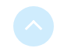

# Le composant TopButton

## Description

Le composant `TopButton` sert à revenir en haut de la page.
Il s'affiche lorsque le header de la page n'est plus visible.
Il s'affiche au dessus du footer.



Attributs du composant :

| Attibut   | Description                                                        | Obligatoire | Valeur par défaut | Type |
| --------- | ------------------------------------------------------------------ | --------- | ------------------- | -----|
| className | Classes css du bouton|   | | string |
| footer    | Identifiant de la balise du footer || "footer-container" | string |
| header    | Identifiant de la balise du header | | "header-container" |string |
| id        | Identifiant unique du bouton |  | |string |
| name      | Nom du bouton | | |string |
| title     | Titre du bouton | |  |string |


## Live coding

`Attention pour le live coding : garder l'identifiant "top-button-exemple" pour le TopButton. Celui-ci s'affichera avec une flèche rouge`

```javascript showroom
return(
    <main id="page">
        <TopButton id="top-button-exemple"/>
    </main>
);
```