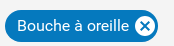

# Le composant Chips

## Description

Le composant produit un élément de type chips.



## Utilisation

Il doit être initialisé avec une structure comme suit :

```javascript

<Chips id="chips-test-1" text="Bouche à oreille"/>

```

| Attribut   | Description                                                       | Obligatoire | Valeur par défaut | Type |
| ---------- | ------------------------------------------------------------------|-------------|------------------ |------|
|  id        | identifiant unique du composant                                   |    X        | &nbsp;            | string      |
| text       | libellé du composant                                              |    X        | &nbsp;             | string      |
| title      | title du composant                                                | &nbsp;      | &nbsp;            | string      |
| readOnly   | lecture seule ?                                                   | &nbsp;      | &nbsp;            | boolean     |
| disabled   | disabled ?                                                        | &nbsp;      | &nbsp;            | boolean     |
| classNames | Liste de class CSS                                                | &nbsp;      | &nbsp;            | ClassDictionary |
| handleClickReset   | Méthode appelée lors du click sur le bouton reset         | &nbsp;      | &nbsp;            |   Function  |
| handleClick     | Méthode appelée lors du click sur le composant chips         | &nbsp;      | &nbsp;            | Function     |
| withInitials      | Affichage d'un icone en prefixe de la chips avec la première lettre du mot                     | &nbsp;      | &nbsp;            | boolean     |
[Chips - attributs]

Exemple d'utilisation:

```javascript

import { Chips } from "hornet-js-react-components/src/widget/button/chips";

<Chips id="chips-test-1" text="Bouche à oreille"/>
```


## Accessibilité


## Live coding

```javascript showroom

  return <Chips id="chips-test-1" text="Bouche à oreille"/>

```
