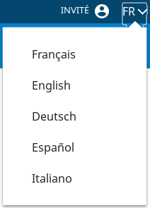

# Le composant ChangeLanguage

## Description

Le composant affiche un menu déroulant qui permet de changer la langue du site.



## Fonctionnement

1. Langue par défaut

Pour configurer la langue par défaut, il suffit de remplir simplement dans le fichier de config **default.json**

```json
{
    "localeI18n": {
        "locale": "en-EN",
        "lang": "en"
    }
}
```

2. Ajout d'une langue

Pour ajouter de nouvelles langues, il faut pour cela rajouter un fichier json  dans le dossier *resources*  (applitutoriel-module/applitutoriel-js-common/src/resources) et doit respecter 2 points.

* La règle de nommage suivante :
```
messages-(bigramme du pays)-(bigramme du pays en majuscule).json
```
Exemple : messages-en-EN.json

* Avoir un attribut contenant le label de la langue qui sera utilisé pour  dans le fichier Json créé :

```json
{
  "labelLanguage": "English"
}
 ```

## Utilisation

|        Attribut       | Description                                                      | Obligatoire | Valeur par défaut | Type     |
| --------------------- | -----------------------------------------------------------------|-------------|-------------------| ---------|
| id                    | Identifiant du composant                                         | &nbsp;      | &nbsp;            | string   |
| isOpen                | Boolean permettant de savoir si la liste deroulante est affiché  | &nbsp;      | false             | boolean  |
| handleChangeLanguage  | Fonction appelée pour changer la langue                          | &nbsp;      | &nbsp;            | (locale: string) => void|
| switchTitle           | Titre du composant                                               | &nbsp;      | &nbsp;            | string   |
| position              | Détermine la position de la flèche                               | &nbsp;      | Position.BOTTOMLEFT |Position|

Pour information, la liste des langues est créée automatiquement en analysant le dossier **resources** . Cette dernière est stockée dans utils **appSharedProps** sous la variable **listLanguage**
Le format json de la liste est :

```json
{
    "listLanguage": [
        {"langShort": "en", "langLabel": "English"},
        {"langShort": "fr", "langLabel": "Français"}
    ]
} 
```


Utilisation :

```javascript
import { ChangeLanguage } from "hornet-js-react-components/src/widget/language/change-language";

<ChangeLanguage handleChangeLanguage={"méthode appelée à la sélection d'une langue"}/>

```

Exemple d'utilisation :

```javascript
import { ChangeLanguage } from "hornet-js-react-components/src/widget/language/change-language";


<ChangeLanguage handleChangeLanguage={this.handleChangeLanguage}/>

```

La méthode appelée pour changer la langue:

```javascript
 private handleChangeLanguage(i18nLocale:string) {

        this.service.changeLanguage({"hornetI18n": i18nLocale}).then((retourApi) => {
            logger.trace("Retour API PartenaireApi.rechercher :", retourApi.body);
            Utils.setCls("hornet.internationalization", retourApi.body);
            this.forceUpdate();

        });
    }
```

## Live coding

```javascript showroom

	return (
	    <div id="cl-exemple">
	        <ChangeLanguage handleChangeLanguage={() => {console.log("onChangeLanguageMethod"}}/>
	    </div>
    );
```