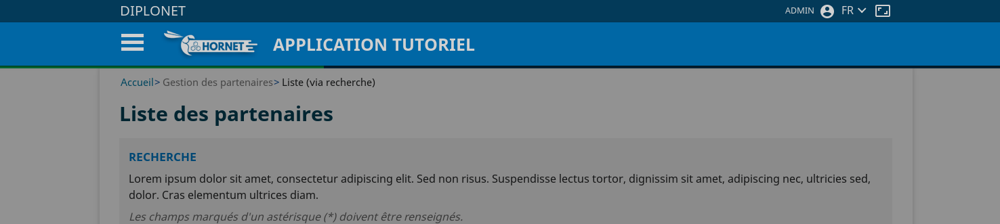

# Le composant Spinner

## Description

Le composant `Spinner` (ou composant d'affichage de chargement en cours) est une indication visuelle mentionnant qu'une action est en cours et que l'utilisateur doit patienter.

Il empêche toute autre action de l'utilisateur.
Sur l'image suivante, il est présenté comme une barre de chargement verte en dessous du header:



## Utilisation

utilisation de base du spinner:

```xml

import { Spinner } from "hornet-js-react-components/src/widget/spinner/spinner";

<Spinner/>

```

## Configuration

Les attributs du composant `Spinner` sont les suivants:

| Paramètre | Description | Obligatoire | Valeur par défaut |
|---------- | ----------- |------------ | ----------------- |
| imageLoadingUrl | Url de l'image à afficher | Non |  |
| loadingTitle | Titre du panel | Non | Chargement... |
| loadingText | Message à afficher | Non | Action en cours, veuillez patienter ... |
| minimalShowTimeInMs | Le temps minimal (en millisecondes) durant lequel le composant doit rester affiché. Cette configuration permet de maintenir un temps d'affichage correct à l'utilisateur tout en permettant un temps de reaction rapide grâce au paramètre précédent. | Non | 500 |
| isVisible | Détermine si le composant est visible ou non | Non | false |


**Exemple d'utilisation :**

```javascript
<Spinner minimalShowTimeInMs={250} loadingTitle="chargement en cours" isVisible={true}/>
```

## Créer un Spinner

Il est possible de créer des spinners personnalisés pour les composants.

```javascript

import {SpinnerComponent, SpinnerProps} from "src/widget/spinner/spinner-component";
export class NewSpinner <T extends SpinnerProps>  extends SpinnerComponent<T> {
    ...
}

```

## Live coding

`Attention: pour voir le spinner, il faut passer l'attribut isVisible à "true" `

```javascript showroom

return (
    <Spinner minimalShowTimeInMs={500} isVisible={false}/>
 );
```