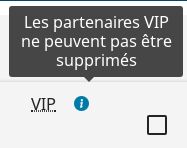

# Le composant ToolTip

## Description

Le composant `ToolTip` affiche une icône d'information qui laisse apparaître une infobulle au survol du pointeur.



## Utilisation

| Attribut   | Description                                         | Obligatoire | Valeur par défaut                                | Type |
| ---------- | --------------------------------------------------- | ------------| ------------------------------------------------ |------|
| alt        | Propriété alt de l'image                            | Oui         |                                                  |string|
| classImg   | Style appliqué sur l'élément 'img'                  |             | "tooltip-image"                                  |string|
| classSpan  | Style appliqué sur l'élément 'span'                 |             | "tooltip"                                        |string|
| icoToolTip | Url de l'image dans le théme                        |             | "/img/tooltip/tooltip.svg"                       |string|
| idImg      | Id de l'élément 'img'                               |             |                                                  |string|
| idSpan     | Id de l'élément 'span'                              | Oui         |                                                  |string|
| src        | Url de l'image à afficher                           |             | ToolTip.genUrlTheme("/img/tooltip/ico_tooltip.png") |string|

```javascript

import ToolTip = require("hornet-js-components/src/tool-tip/tool-tip");

<ToolTip idSpan="exemple-tooltip" alt="Texte infobulle" />

```

Le composant infobulle peut être activé sur un champ de formulaire lorsque la balise `tooltip` est renseignée.Le positionnement de l'infobulle est en haut de l'icône 'i' placé à coté du champ.

```javascript

<Field name="Test" tooltip="Texte infobulle" />

```

## Live coding

```javascript showroom

    return (
        <ToolTip idSpan="exemple-tooltip" alt="Texte infobulle" />
    );
```