# Le composant Table

## Description

Génération d'un tableau HTML (valide W3C) accessible offrant des possibilités d'édition et de contrôle des données affichées.

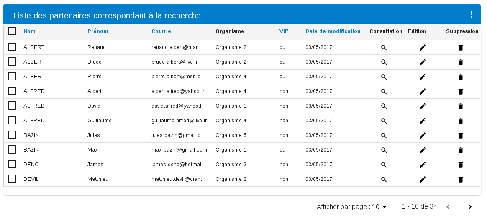

## Architecture

Le composant `Table` est constitué de sous-composants:

- `Table` : composant global de gestion du tableau
  - `Header` : Bandeau haut du tableau permettant l'affichage du titre ainsi que les actions
     - `MenuActions` : Conteneur des actions
         - `ActionButton`: Action de masse/unitaire
  - `Content`: Contenu du tableau
     - `Columns`: Groupement des colonnes du tableau
          - `Column`: Colonne par défaut: permet la gestion des labels classiques
          - `CheckColumn`: colonne de type checkBox
          - `YesNoColumn`: Colonne de type oui/non
          - `DateColumn`: Colonne de date
          - `ActionColumn`: Colonne de type action
          - `EditionActionColumn`: Colonne de type édition : permet d'éditer les cellules du tableau
  - `Footer`: Footer du tableau
    - `Pager`: Composant permettant la pagination du tableau


## Utilisation

Le tableau produit un élément HTML de type `table` intégrant éventuellement des boutons d'action, ainsi qu'une pagination , le tout inclus dans un conteneur de type `div`.

Pour un tableau de deux colonnes avec un bouton d'ajout, le rendu est le suivant :

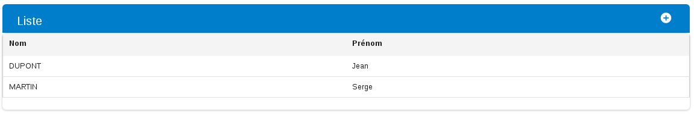

Il doit être initialisé comme suit :

### Import des composants

Par souci de simplicité on ne reprécisera pas ici les imports de base nécessaires (React, HornetPage, etc.). Les imports spécifiques au tableau sont les suivants :

```javascript

/* Composant table englobant */
import { Table } from "hornet-js-react-components/src/widget/table/table";

import { Header } from "hornet-js-react-components/src/widget/table/header";

import { MenuActions } from "hornet-js-react-components/src/widget/table/menu-actions";
import{ActionButton, TypeAction} from "hornet-js-react-components/src/widget/table/action-button";
import { EditionActionColumn } from "hornet-js-react-components/src/widget/table/column/edition-action-column"

/* Composant Content */
import { Content } from "hornet-js-react-components/src/widget/table/content";

/*  Colonne du tableau */
import { Columns, Column } from "hornet-js-react-components/src/widget/table/column";

```

### Déclaration du rendu

```javascript
        return (
            <div>
                {/* Composant tableau Hornet */}
                <Table id="liste">
                  <Header title={"Liste"}>
                    <MenuActions>
                      <ActionButton title={"Ajout"}
                          srcImg={Picto.white.ajouter}
                          action={this.ajouterSecteur} priority={true}/>
                    </MenuActions>
                  </Header>
                  <Content dataSource={this.dataSource}>
                      <Columns>
                          <Column keyColumn="nom" title={intlMessages.nom} sortable={false}/>
                          <Column keyColumn="prenom" title={intlMessages.prenom} sortable={false}/>
                      </Columns>
                  </Content>
                </Table>
            </div>
        );
```

### Alimentation des données

Les données du tableau sont transmises par le biais d'un dataSource. Il doit être déclaré dans le constructeur du composant Page. Puis lorsque ce composant Page est monté, via la méthode prepareClient, il faut effectuer un `fetch` sur ce même dataSource

Exemple :

```javascript


private dataSource : DataSource<any>;

constructor(props?, context?) {
    super(props, context);
    this.dataSource = new DataSource<SecteurMetier>(new DataSourceConfigPage(this, this.getService().lister), {});
}

/**
  * Alimente le tableau
  * @override
  */
private prepareClient(): void {
  this.dataSource.fetch(true);
}

render(){
    return (
        <div>
            <Table id="liste-secteurs">
                <Header title={"Secteurs"}>
                    <MenuActions>
                        <ActionButton title={"add"}
                                      srcImg={Picto.white.ajouter}
                                      action={this.ajouterSecteur} priority={true}/>
                    </MenuActions>
                </Header>
                <Content dataSource={this.dataSource} onSubmit={this.submitLineForm} schema={schemaEditionTable} notifId="notif2">
                    <Columns>
                        <Column keyColumn="nom" title={"nom"} sortable={false}/>
                        <Column keyColumn="desc" title={"description"} sortable={false}/>
                        <DateColumn keyColumn="dateCreat" title={"Date de création"} sortable={false}/>
                        <DateColumn keyColumn="dateMajEnreg" title={"Date de mise à jour"} sortable={false}/>
                        <Column keyColumn="auteurCreat" title={"Auteur de la création"} sortable={false}/>
                        <ActionColumn keyColumn="id" title={"Modification"}
                                      srcImg={Picto.black.editer}
                                      action={this.editItem.bind(this)}/>
                        <ActionColumn keyColumn="id"
                                      title={"Suppression"}
                                      srcImg={Picto.black.supprimer}
                                      action={this.supprimer.bind(this)}
                        />
                        <EditionActionColumn keyColumn="id"
                                      titleEdit={"Editer"}
                                      titleSave={"Enregistrer"}
                                      titleCancel={"Annuler"}
                        />

                    </Columns>
                </Content>
            </Table>
      </div>
    );
}

...

```

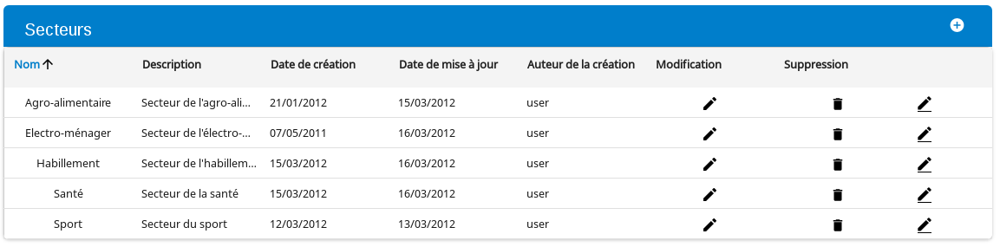

## Détail des composants/sous-composants Table

### Détail du composant `Table`

propriétés du composant `Table`

| Attribut  | Description              | Obligatoire | Valeur par défaut         | Type    |
|-----------| ------------------------ | ----------- |-------------------------- |-------- |
| id        | Identifiant du tableau   | Oui         | &nbsp;                    | string  |
| className | Classe CSS personnalisée | &nbsp;      | "hornet-datatable-header" | string  |
| isVisible | Tableau visible ou non   | &nbsp;      | true                      | boolean |
| width     | Largeur du tableau       | &nbsp;      | &nbsp;                    | number  |

#### Surcharge de style par ligne

Il est possible d'appliquer un style personnalisé pour chaque ligne de tableau Hornet en fournissant une fonction adéquate via la propriété `customRowsClass` du composant `Content`.

Cette fonction doit renvoyer la ou les classes CSS à appliquer à la ligne correspondant à l'élément indiqué. L'objet retourné doit être une instance de ClassDictionary, associant un booléen à un ou plusieurs noms de classes CSS.

Exemple de mise en oeuvre : une couleur différente est appliquée en fonction du rôle de l'utilisateur.

Styles CSS personnalisés :

```CSS
.green-background-row td, .green-background-row td.hornet-datatable-sorted {
    background-color: #54c08b ;
}

.red-background-row td, .red-background-row td.hornet-datatable-sorted  {
    background-color: #f5716e ;
}

.yellow-background-row td, .yellow-background-row td.hornet-datatable-sorted  {
    background-color: #dbf163 ;
}
```

Fonction de personnalisation des classes CSS par ligne :

```javascript

    /**
     * Renvoie la classe CSS à appliquer selon le rôle de l'utilisateur indiqué
     * @param user utilisateur, correspondant à une ligne de tableau
     * @return la classe CSS à appliquer
     */
    private customRowsClass(user:any):ClassDictionary {
       return {
           "green-background-row": (secteur.nom == "Habillement"),
           "red-background-row": (secteur.nom == "Santé"),
           "yellow-background-row": (secteur.nom == "Sport")
       }
    }

```


Rendu obtenu :

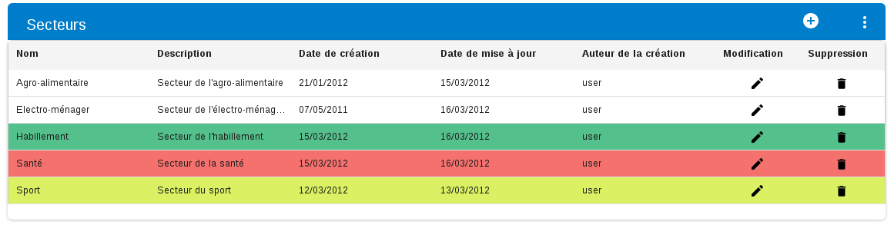

### Détail du composant `Header`

Ce composant permet d'afficher le titre et de configurer les actions dans le bandeau haut du tableau.

Imports nécessaires:

```javascript
import { ActionButton } from "hornet-js-react-components/src/widget/table/action-button";
import { Header } from "hornet-js-react-components/src/widget/table/header";
import { MenuActions } from "hornet-js-react-components/src/widget/table/menu-actions";
```

Exemple de header:

```javascript

<Header title={"Secteurs"} libelleNombreTotalItem={"( Nombre d'item {count} )"}>
    <MenuActions>
        <ActionButton title={this.i18n("administration.secteurs.table.addTitle")}
                      srcImg={Picto.white.ajouter}
                      action={this.ajouterSecteur} priority={true}/>
    </MenuActions>
</Header>

```

Rendu obtenu :


propriétés du composant `Header`

| Attribut  | Description                        | Obligatoire  | Valeur par défaut | Type   |
|---------- | ---------------------------------- | -----------  | ----------------- | ------ |
| id        | L'id du header                     | &nbsp;       | &nbsp;            | string |
| parentId  | L'id du tableau                    | &nbsp;       | &nbsp;            | string |
| title     | Le texte afficher dans le bandeau  | Oui          | &nbsp;            | string |
| libelleNombreTotalItem |  Info sur le nombre total d'item affiché dans le bandeau (ex: (33 résultat(s)) | &nbsp; | &nbsp; |string |
| showIconInfo  | Affichage du bouton d'accessibilité   | &nbsp; | &nbsp; |boolean |
| hideMenuactions   | Affichage du bouton d'accessibilité et du menu action  | &nbsp; | &nbsp; |boolean |
| toggleColumns  | Affichage de l'action permettant de masquer/afficher les colonnes | &nbsp; | &nbsp; |boolean |
| columns | Informations de colonnes             | &nbsp;       | &nbsp;            | any    |
| items     | Elements du table                  | &nbsp;       | &nbsp;            | array[any] |
| selectedItems | Elements sélectionnés du Table | &nbsp;       | &nbsp;            | array[number] |
| tableState | tableState                        | &nbsp;       | &nbsp;            | TableState |
| contentState | content state                   | &nbsp;       | &nbsp;            | ContentState |
| dataSourcesList | liste des PaginateDataSource de tous les <Content.tsx> du composant table, s'ils exitent | &nbsp; | &nbsp; | array[PaginateDataSource<any>] |

#### `ToggleColumnsButton`
le composant `ToggleColumnsButton` permet de masquer/afficher les colonnes du tableau

| Attribut      | Description                                                | Obligatoire | Valeur par défaut | Type  |
|---------------| ---------------------------------------------------------- |------------ |------------------ | ----- |
| columns       | Colonnes présentes dans le toggle                          | &nbsp;      | &nbsp;            | any   |
| hiddenColumns | Permet de déterminer les colonnes masquées par défaut      | &nbsp;      | &nbsp;            | any   |
| onChange      | Méthode permettant de récupérer l'état des colonnes        | &nbsp;      | &nbsp;            | (any) => void |
| selectAllItem | Méthode permettant d'afficher l'option de sélection global | &nbsp;      | true              | boolean |


#### `MenuActions`
Le composant `MenuActions` englobe toutes les actions du header, il ne sera donc présent qu'une fois dans celui-ci.
Il est composé d'`ActionButton`.


```javascript
<MenuActions>
    <ActionButton typeAction={TypeAction.ACTION_UNITAIRE}
                  title={"consultation"}
                  label={"consultation"}
                  srcImg={Picto.black.consulter}
                  url={"/partenaires/consulter/:id"}
    />
    <ActionButton typeAction={TypeAction.ACTION_MASSE}
                  priority={true}
                  label={"suppression"}
                  srcImg={Picto.white.supprimer}
                  action={this.supprimerEnMasse}
                  title={"Supprimer en masse"}
                  messageAlert={"Etes-vous sûr(e) de vouloir supprimer ce(s) partenaire(s) ?"}
                  titleAlert={"Suppression des partenaires"}
    />
</MenuActions>
```

#### `ActionButton`

Les `ActionButton` peuvent être de type unitaire ou de masse, cette propriété est définie dans la props `typeAction`.
Les actions de masses peuvent s'effectuer si un ou plusieurs objets du contenu ont été sélectionnés.
Les actions unitaires ne seront disponibles que si un objet du contenu a été sélectionné.

Une action peut être prioritaire ou non. Les actions prioritaires seront affichées directement dans le header, les autres seront affichés dans un menu.

Exemple:

```javascript

import { Picto } from "hornet-js-react-components/src/widget/table/content";

<Header title={"Secteurs"}>
        <MenuActions>
            <ActionButton title={"ajouter"}
                          srcImg={Picto.white.ajouter}
                          action={this.ajouterSecteur} priority={true}/>
            <ActionButton title={"autre"}
                          srcImg={Picto.black.editer}
                          label={"Autre label"}
                          action={this.test} priority={false}/>
        </MenuActions>
</Header>
```

rendu :

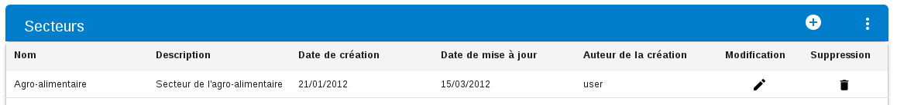

Avec le menu ouvert :

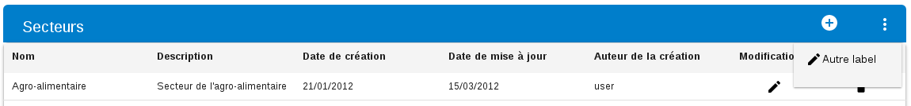

propriétés du composant `ActionButton`

| Attribut       | Description                                | Obligatoire | Valeur par défaut | Type |
|----------------| ------------------------------------------ | ----------- | ----------------- | ---- |
| action         | Action appelée lors du click sur le bouton | &nbsp;      | &nbsp;            | Function |
| classNameImg   | Classe css de la balise img                | &nbsp;      | &nbsp;            | string |
| messageAlert   | Message affiché dans l'alerte              | &nbsp;      | &nbsp;            | string |
| priority       | Action prioritaire ou non                  | &nbsp;      | &nbsp;            | boolean |
| showAlert      | fonction d'affichage de l'alerte           | &nbsp;      | &nbsp;            | Function |
| srcImg         | Url de l'image                             | &nbsp;      | &nbsp;            | string |
| titleAlert     | Message affiché dans le titre de l'alerte  | &nbsp;      | &nbsp;            | string |
| typeAction     |  URL de l'action serveur d'export          | &nbsp;      | &nbsp;            | TypeAction |
| displayedWithoutResult | Détermine si l'action sera affichée que lorsqu'il y a des data dans le tableau. | &nbsp; | false | boolean |
| visible        | Définit si le bouton est visible ou non    | &nbsp;      | &nbsp;            | boolean |
| selectedItems  | items sélectionnés                         | &nbsp;      | &nbsp;            | any |
| items          | Items présents                             | &nbsp;      | &nbsp;            | array[any] |
| onKeyDown      | Fonction appelée lors d'un appui sur une touche du clavier | &nbsp; | &nbsp; | any |

Les boutons sont des liens (balise `a`) possédant une image et un label (balise `span`).

S'il n'y a pas de colonnes de type `CheckColumn` dans le tableau, les actions de masse ne sont pas disponibles.

### Détail du composant `Content`

Le composant Content possède les propriétés de l'interface [HornetComponentDatasourceProps](/hornetshowroom/composant/page/hornet-js/composants/proprietes-hornet-component)

propriétés du composant `Content` :

| Attribut         | Description                                         | Obligatoire | Valeur par défaut | Type       |
|----------------- | --------------------------------------------------- | ----------- | ----------------- |----------- |
| id               | Identifiant du content                              | &nbsp;      | &nbsp;            | string     |
| idForm           | Identifiant du formulaire, obligatoire pour les fonctionnalités de submit | &nbsp; | &nbsp; |string|
| customRowsClass  | Fonction pour modifier le css des lignes du tableau | &nbsp;      | &nbsp;            | Function   |
| contentState     | Gestion des events emit du content State            | &nbsp;      | &nbsp;            | ContentState |
| dataSource       | Data source qui alimente le tableau                 | &nbsp;      | &nbsp;            | DataSource |
| headerFixed      | Determine si le header du tableau doit etre fixe    | &nbsp;      | &nbsp;            | boolean    |
| hideSpinner      | Flag permettant de forcer la suppression du spinner | &nbsp;      | &nbsp;            | boolean    |
| loadingMessage   | Attribut permettant de surcharger le message par défaut du spinner du tableau | &nbsp;| &nbsp; | JSX.Element ou String |
| notifId          | L'id du composant "Notification" auquel seront ratachées les notifications. si non present , Les notifications s'affichent au dessus du tableau | &nbsp; | &nbsp; | string |
| onSubmit         | Fonction déclenchée lors de la soumission du formulaire | &nbsp;   | &nbsp;           | (data: any, item: any) => void |
| schema           | Schéma Json de validation de saisie                 | &nbsp;       | &nbsp;           | Valideurs customisés |
| title            | Titre du tableau (utilisé pour le caption lié à l'accessibilité | &nbsp; | &nbsp;     | string     |
| width            | Largeur du tableau                                  | &nbsp;       | &nbsp;           | number     |
| headerHidden     | Permet de masquer les entêtes de colonne            | &nbsp;       | &nbsp;           | boolean    |
| hiddenColumns    | Détermine si des colonnes sont cachées par défaut   | &nbsp;       | &nbsp;           | any        |
| withoutForm      | Détermine si il y a un formulaire ou non            | &nbsp;       | &nbsp;           | boolean    |
| isContentVisible | Détermine si le content est visible ou non          | &nbsp;       | &nbsp;           | boolean    |
| summary          | Sommaire du tableau                                 | &nbsp;       | &nbsp;           | string     |
| name             | Nom du composant                                    | &nbsp;       | &nbsp;           | string     |


L'affichage du `Content` génère un tableau HTML avec la balise `table`....

Un `Loader` et une `Alert` sont associés au tableau. Le `Loader` s'affiche lors du chargement des données du tableau.

#### Les différents types de colonnes


Un composant `Column` est affiché a l'aide de deux composants:
un composant étendant `AbstractHeaderCell` (retourné par la méthode `getHeaderCell`) qui représente l'affichage de l'entête de la colonne et un composant étendant `AbstractBodyCell`(retourné par la méthode `getBodyCell`) qui représente l'affichage d'une cellule de la colonne à l'intérieur du tableau.

Les colonnes triables (propriété `sortable`) ont leur nom affiché en bleu dans leur entête (par exemple dans le tableau ci-dessous, seules les colonnes `Organisme`, `Consultation`, `Edition` , `Edition rapide` et `Suppression` ne sont pas triables).

Une flèche s'affiche à côté du nom de la colonne qui est triée:

ordre croissant :

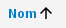

ordre décroissant:

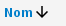

Pour trier la colonne dans l'ordre croissant, il faut cliquer sur le nom de colonne, puis recliquer dessus pour passer en ordre décroissant.


Paramètre d'une colonne :

| Attribut                   | Description                              | Obligatoire | Valeur par défaut  | Type            |
|--------------------------- | ---------------------------------------- | ----------- |------------------- | --------------- |
| `abbr`                     | Texte complet lorsque le titre est un acronyme. La propriété lang devrait être valorisée dans ce cas | &nbsp; | &nbsp; | `string` |
| `alt`                      | Texte alternatif                         | &nbsp;      | &nbsp;             | string          |
| `actionMassEnabled`        | Permettre les actions de masse           | &nbsp;      | &nbsp;             | boolean         |
| `cellCoordinate`           | Coordonnées de la cellule en cours de génération | &nbsp; | &nbsp;          | CellCoordinates |
| `contentState`             | Objet representant l'état du tableau     | &nbsp;      | &nbsp;             | ContentState    |
| `defaultStyle`             | Style de la colonne                      | &nbsp;      | { width": "10em" } | CSSProperties   |
| `editable`                 | Propriétés de d'édition sur la colonne   | &nbsp;      | &nbsp;             | `boolean`       |
| `handleChangeKeyboardMode` | Gestion des touches clavier              | &nbsp;      | &nbsp;             | any             |
| `headerFixed`              | Indique que le header est fixe           | &nbsp;      | &nbsp;             | `boolean`       |
| `hiddenable`               | Par défaut à true - détermine si la colonne est masquable via la fonctionnalité `toggleColumns` | &nbsp; | true | `boolean` |
| `id`                       | Id de la colonne                         | &nbsp;      | &nbsp;             | `string`        |
| `isEditing`                | Propriété permettant de rendre éditable une cellule | &nbsp; | &nbsp;       | `boolean`       |
| `isHeader`                 | Indicateur de generation d'une cellule header | &nbsp; | &nbsp;             | `boolean`       |
| `isSelected`               | Indique si la ligne est sélectionnée     | &nbsp;      | &nbsp;             | `boolean`       |
| `keyboardMode`             | Specifie le mode d'accessibilité au clavier | &nbsp;   | &nbsp;             |  number         |
| `keyColumn`                | Nom de la colonne, correspondant au nom de la propriété contenant la valeur d'une cellule | Oui | &nbsp; | `string` |
| `navigateFct`              | Fonction appelée par les cellules sur la navigation | &nbsp; | &nbsp; | (CellCoordinates, NavigateDirection) => void |
| `nbColumns`                | Nombre de colonne du tableau             | &nbsp;      | &nbsp;             | number          |
| `onSort`                   | Fonction déclenchée lors d'un clic sur une colonne, déclenchant le tri sur celle-ci - | &nbsp; | &nbsp; | (SortData) => void |
| `sortable`                 | Propriétés de tri sur la colonne         | &nbsp;      | false              | `boolean`       |
| `sortByTitle`              | Titre du bouton de tri par colonne. Lorsque vide table.sortByTitle est utilisé par défaut. | &nbsp; | &nbsp; | `string` |
| `sortData`                 | Tri en cours sur le tableau              | &nbsp;      | &nbsp;             | SortData        |
| `style`                    | Style customisé du header                | &nbsp;      | &nbsp;             | `any`           |
| `title`                    | Titre de la colonne                      | &nbsp;      | &nbsp;             | `string`        |
| `titleCell`                | Titre sur les cellules de la colonne     | &nbsp;      | &nbsp;             | `string`        |
| `toggleSelectLines`        |  Fonction déclenchée lors du click sur la checkbox liée aux actions de masse | &nbsp; | &nbsp; |(item: any, all?: boolean) => void |
| `width`                    | Taille en pourcentage de la colonne      | &nbsp;      | &nbsp;             | `number`        |
| `compareMethod`            | Méthode de comparaison destinée au tri de la colonne | &nbsp; | &nbsp;      | `Function`      |
| `orderByLabelUp`           | Label de substitution dans le cas d'un tri custom ascendant | &nbsp; | &nbsp; | `string`      |
| `orderByLabelDown`         | Label de substitution dans le cas d'un tri custom descendant | &nbsp; | &nbsp; | `string`     |

La propriété `compareMethod` est une fonction de tri de la colonne. sa signature est la suivante:
- 1er argument: un objet de type `SortData`
- 2ème argument: un objet "a" correspondant à un item (ligne) du tableau
- 3ème argument: un objet "b" correspondant à un item (ligne) du tableau

exemple de méthode `compareMethod`: 

```javascript

compareMethod(sortData: sortData, a:item, b:item) {
    
    let aValue = a[sortData.key];
    let bValue = b[sortData.key];
    
    if (aValue < bValue) {
        result = (sortData.dir == SortDirection.ASC) ? -1 : 1;
        return false;
    }
    
}
```
##### CheckColumn

Ce type de colonne permet de sélectionner/déselectionner les lignes du tableau.
Pour sélectionner toutes les lignes visibles du tableau, il faut cliquer sur la case à cocher présente dans l'entête de la colonne.
Elle correspond à la première colonne du tableau ci-dessus.

Exemple:

```javascript
<CheckColumn keyColumn="id" title=""/>
```

##### YesNoColumn

Ce type de colonne permet d'afficher un résultat de type `boolean`.
Un boolean à `true` sera affiché à l'aide de la valeur `table.booleanOui` présente dans le fichier de ressource de message
Un boolean à `false` sera afficher à l'aide de la valeur `table.booleanNon`.
Il s'agit de la colonne `VIP` du tableau ci-dessus.

Exemple:

```javascript

<YesNoColumn keyColumn="isVIP" title={"VIP"} sortable={true}/>

```

##### DateColumn

Ce type de colonne permet d'afficher une date selon le format `calendar.dateFormat` défini dans le fichier de ressource.
Il est possible de redéfinir le format de la date en passant la propriété `format` du composant.
Il s'agit de la colonne `Date de modification` du tableau ci-dessus.

Exemple:

```javascript

<DateColumn keyColumn="dateModif" title={"Date de modification"} sortable={true}/>

```

##### ActionColumn

Ce type de colonne permet de définir une action à effectuer sur la ligne du tableau.

Propriétés d'une `ActionColumn`:

| Attribut     | Description                                                 | Obligatoire | Valeur par défaut | Type        |
|------------- | ----------------------------------------------------------- |------------ |------------------ | ----------- |
| action       | Action à déclencher                                         | &nbsp;      | &nbsp;            | Function    |
| alt          | Texte alternatif pour les picto/title des images            | &nbsp;      | &nbsp;            | string      |
| classNameImg | Classe css de l'image                                       | &nbsp;      | &nbsp;            | string      |
| messageAlert |  Message de confirmation a afficher sur l'action            | &nbsp;      | &nbsp;            | string      |
| replaceUndef | Chaîne de replacement des valeurs undefined dans le templating | &nbsp;   | &nbsp;            | string      |
| srcImg       | Icone affiché dans la colonne                               | &nbsp;      | &nbsp;            | string      |
| titleAlert   | Titre du message de confirmation à afficher sur l'action    | &nbsp;      | &nbsp;            | string      |
| url          | Url de l'action à déclencher                                | &nbsp;      | &nbsp;            | string      |
| visible      | Fonction appelée pour rendre visible on non la cellule      | &nbsp;      | &nbsp;            | Function    |
| disabled     | Fonction appelée/booleen pour rendre disabled l'action      | &nbsp;      | &nbsp;            | Function ou boolean |
| hasPopUp     | Pour valoriser l'indicateur aria-has-popup                  | &nbsp;      | &nbsp;            | boolean     |
| label        | Label de la colonne                                         | &nbsp;      | &nbsp;            | string      |


Exemple:

```javascript

<ActionColumn keyColumn="id"
              title={"Consultation"}
              srcImg={Picto.black.consulter}
              url={"/partenaires/consulter/:id"}/>

```

Il s'agit des colonnes `Consultation`, `Edition` et `Suppression` du tableau ci-dessus.

L'affichage d'une action peut se faire à l'aide d'un pictogramme par la propriété `scrImg`.
Des pictogrammes sont disponibles dans `Picto`:

import:

```javascript

import { Picto } from "hornet-js-react-components/src/widget/table/content";

```


Exemple d'une colonne action avec un message d'alerte:

```javascript

<ActionColumn keyColumn="id"
              title={"Suppression"}
              srcImg={Picto.black.supprimer}
              action={this.supprimer}
              messageAlert={"Etes-vous sûr(e) de vouloir supprimer le partenaire ${nom} - ${prenom} ?"}
              titleAlert={"Suppression partenaire"}/>
```

#### EditionActionColumn

Ce type de colonne permet d'éditer les cellules d'une ligne du tableau.

propriétés du composant `EditionActionColumn`

| Attribut     | Description                                                     | Obligatoire | Valeur par défaut | Type        |
|------------- | --------------------------------------------------------------- |------------ |------------------ | ----------- |
| messageAlert | Message affiché dans l'alerte de l'action annuler               | &nbsp;      | &nbsp;            | string      |
| replaceUndef | Chaîne de replacement des valeurs undefined dans le templating  | &nbsp;      | &nbsp;            | string      |
| titleAlert   | Message affiché dans le titre de l'alerte de l'action annuler   | &nbsp;      | &nbsp;            | string      |
| titleCancel  |  Message affiché dans le titre de l'action annuler              | &nbsp;      | &nbsp;            | string      |
| titleEdit    | Message affiché dans le titre de l'action éditer                | &nbsp;      | &nbsp;            | string      |
| titleSave    | Message affiché dans le titre de l'action enregistrer la modification | &nbsp;| &nbsp;            | string      |
| visible      | Fonction appelée pour rendre visible on non les cellules        | &nbsp;      | &nbsp;            | Function    |

Exemple:

```javascript

 <EditionActionColumn keyColumn="id"
                     title={"Edition rapide"}
                     titleEdit={"Editer"}
                     titleSave={"Enregistrer"}
                     titleCancel={"Annuler"}
                     messageAlert={"Etes-vous sûr(e) de vouloir annuler l'action en cours ?"}
                     titleAlert={"Annulation"}

 />
```

rendu:

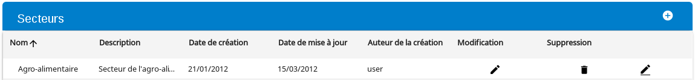

rendu d'une ligne en cours d'édition:

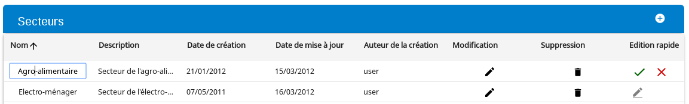

rendu d'une erreur de validation

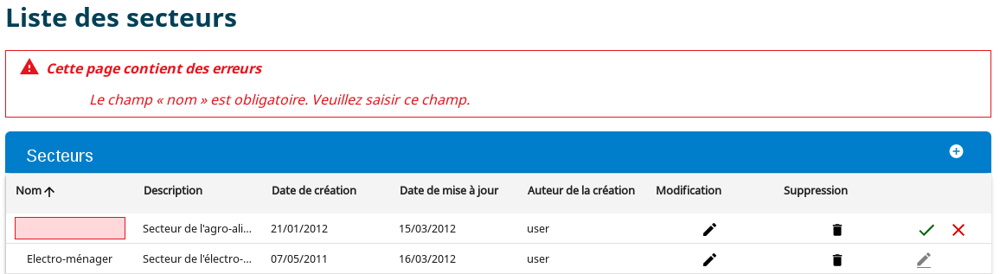

#### Création d'une colonne personnalisée

Il est possible de créer des colonnes personnalisées.
Pour cela, il faudra créer une classe étendant la classe `Column`.
Les colonnes d'entête et de contenu pourront être personnalisés comme dans l'exemple suivant:

```javascript

import { ColumnState } from "hornet-js-react-components/src/widget/table/column";
import { BodyCellProps } from "hornet-js-react-components/src/widget/table/column/cell/body-cell";
import { HeaderCellProps } from "hornet-js-react-components/src/widget/table/column/cell/header-cell";
import { ColumnProps } from "hornet-js-react-components/src/widget/table/column";
import { Column } from "hornet-js-react-components/src/widget/table/column";

export interface NewColumnProps extends ColumnProps {
    ...
}

export interface NewHeaderCellProps extends ColumnProps {
    ...
}

export interface NewBodyCellProps extends ColumnProps {
    ...
}

export class NewColumn<T extends NewColumnProps, S extends ColumnProps> extends Column<T, S> {

    /**
    * Permet de définir le composant de la cellule d'entête de la colonne
    */
    public getHeaderCell(): Class<NewHeaderCell<NewHeaderCellProps, any>> {
        return NewHeaderCell;
    }

    /**
    * Permet de définir le composant d'une cellule du content
    */
    public static getBodyCell(props): Class<NewBodyCell<NewBodyCellProps, any>> {
        return NewBodyCell;
    }
    ...
}

export class NewHeaderCell<P extends NewHeaderCellProps, S> extends AbstractHeaderCell<P, any> {
    renderCell(): JSX.Element {
        //rendu
    }
    ...
}

export class NewBodyCell<P extends NewBodyCellProps, S> extends AbstractBodyCell<P, any> {
    renderCell(): JSX.Element {
        //rendu
    }
    ...
}

```

Attention, pour certains composants il peut être nécessaire d'overrider la méthode `setCellTabIndex` pour retirer le système de focus :

```
    static setCellTabIndex(tableCellRef, value: number, isFocus?: boolean): void {
        if (tableCellRef && tableCellRef.firstChild && (tableCellRef.firstChild as HTMLElement).focus) {
            (tableCellRef.firstChild as HTMLElement).tabIndex = value;
        }
        else {
            tableCellRef.tabIndex = value;

        }
    }
```

### Détail du composant `Footer`

#### Pagination

 Pour ajouter une pagination au tableau, il faut ajouter le composant `Pager` dans le `Footer` du tableau.
 Ce composant utilise un `PaginateDataSource`.

Exemple:

```javascript

constructor(props?: HornetComponentProps, context?: any) {
    super(props, context);
    this.paginateDataSource = new PaginateDataSource<any>(new DataSourceConfigPage(this, this.getService().rechercher), {itemsPerPage: 10}, {});
}

render(){
    return(
     <Table id="liste-partenaires">
        <Header title={"Titre")}>
         ...
        </Header>
        <Content dataSource={this.paginateDataSource}>
            ...
        </Content>
        <Footer>
            <Pager dataSource={this.paginateDataSource} id="maTable-paginate"/>
        </Footer>
    </Table>
   );
}
```

propriétés de la pagination dans `PaginateDataSource`:

| Attribut     | Description                | Obligatoire | Valeur par défaut | Type       |
|------------- | -------------------------- | ----------- |------------------ |----------- |
| itemsPerPage | Nombre d'items par page    | &nbsp;      | &nbsp;            | number     |
| nbPages      | Nombre de page             | &nbsp;      | &nbsp;            | number     |
| pageIndex    | Index de la page actuelle  | &nbsp;      | &nbsp;            | number     |
| totalItems   | Nombre d'items au total    | &nbsp;      | &nbsp;            | number     |


rendu d'un tableau avec une pagination:


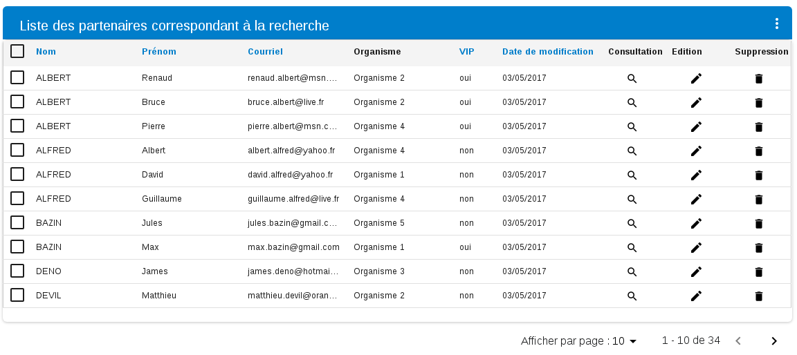


Lorsqu'il n'y a pas de données dans le tableau, la pagination ne s'affiche pas:

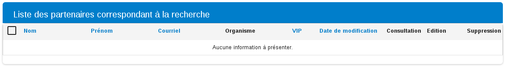


Par défaut, le message affiché dans un tableau vide est celui présent dans `table.emptyResult` du fichier de ressource.


## Live coding

```javascript showroom

var data = new DataSource<any>([
    {
        nom: "Martin",
        prenom: "Alain",
        role: "Administrateur"
    },
    {
        nom: "Blond",
        prenom: "Sylvain",
        role: "Utilisateur"
    },
    {
        nom: "Pignon",
        prenom: "Françoise",
        role: "Superviseur"
    }
]);

    return (
        <Table id="partenaires">
            <Header title={"Partenaires"}>
                <ToggleColumnsButton hiddenColumns={{role: true, nom: false}}/>
                <MenuActions>
                    <ActionButton title={"add"}
                                  srcImg={Picto.white.ajouter}
                                  action={function() {console.log("Action")}} priority={true}/>
                </MenuActions>
            </Header>
            <Content dataSource={data}>
                <Columns>
                    <Column keyColumn="nom" title={"nom"} sortable={false}/>
                    <Column keyColumn="prenom" title={"prénom"} sortable={false}/>
                    <Column keyColumn="role" title={"role"} sortable={false}/>
                    <ActionColumn keyColumn="id" title={"Modification"}
                                  srcImg={Picto.black.editer}
                                  action={function() {console.log("Action")}}/>
                    <ActionColumn keyColumn="id"
                                  title={"Suppression"}
                                  srcImg={Picto.black.supprimer}
                                  action={function() {console.log("Action")}}
                    />
                </Columns>
            </Content>
        </Table>
     );

```