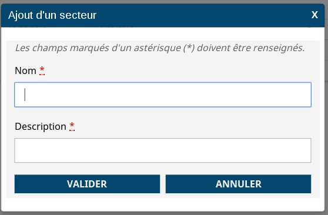

# Le composant Modal

## Description

Le composant `Modal` affiche un contenu `HTML` dans une `popin`.

Dans cet exemple un formulaire et ses boutons sont affichés :



Le composant `Modal` doit contenir les éléments à afficher. Il possède plusieurs attributs qui déterminent son affichage ou son comportement.

La page qui utilise ce composant a la charge d'afficher ou non la popin grâce aux méthodes open() et close() sur la variable liée a la modale.

## Utilisation

Dans l'exemple suivant, la popin affiche un formulaire et ses boutons : 

```javascript

import { Modal } from "hornet-js-react-components/src/widget/dialog/modal";

/*permettra d'appeler les méthode close et open sur la modale*/
private exampleModal: Modal;

/*Affiche la modale*/
this.exampleModal.open();

render(): JSX.Element {
    return(
        <Modal  ref={(modal: Modal) => {
            this.exampleModal = modal;
        }} >
            <div>
                <Form
                    ...
                    onSubmit={this.onSubmit}
                >
                    <Row>
                        <Field label="Nom" ... />
                    </Row>
                    <Row>
                        <Field label="Description" ... />
                    </Row>
                </Form>
            </div>
        </Modal>
    );
}

onSubmit(){
    this.exampleModal.close();
}

```

Les attributs proposés par le composant:

| attribut | obligatoire | description |
| -------- | ----------- | ----------- |
| alert |  | Détermine la nature de la boîte de dialogue (role) |
| className| | Nom de la classe |
| closeLabel | |  Titre du bouton de fermeture |
| closeSymbole | | Contenu du bouton de fermeture |
| escapeKeyExits |  | Détermine si la touche 'Echap' ferme la boîte de dialogue ou non |
| focusDialog |  | Détermine si la boîte de dialogue peut avoir le Focus |
| hideCloseBar | | Détermine si le bandeau bas contentant le bouton de fermeture de la boîte de dialogue est affiché ou non |
| hideTitleBar | | Détermine si le titre boîte de dialogue est affiché ou non |
| initialFocus | | Noeud du DOM ou sélecteur CSS de l'élément portant le focus à l'ouverture |
| isDraggable | | Détermine si la modale est déplaçable ou non |
| isVisible | X | Détermine si la boîte de dialogue est à afficher ou non |
| manageFocus |  | Détermine si la boîte de dialogue gère le focus de ses éléments |
| onClickClose |   | Passer la méthode à appeler lorsque l'utilisateur clique sur la croix (en haut à droite) ou par la touche Escape |
| onShow | | Passer la méthode à appeler à l'affichage du composant |
| title |  | Titre de la boîte de dialogue |
| underlayClass| | Nom de la classe appliquée à la div de contenu |
| underlayClickExits |  | Détermine si le click à l'extèrieur ferme la boîte de dialogue ou non |
| verticallyCenter |  | Détermine si la boîte de dialogue est centrée verticalement |
| withoutOverflow |  | Permet de supprimer l'overflow du contenu de la modal |

Si l'attribut `underlayClickExits`, n'est pas valorisé à `true` **la popin est modale**.

Pour la rendre NON modal, passer `underlayClickExits` à `true` et une méthode à `onClickClose` qui va modifier le state de la page et la valeur de l'attribut `isVisible` de `HornetDialog`.

Par défaut, la popin s'affiche au milieu de l'écran, il est possible de modifier sa position en passant une classe. La position sera toujours relative au coin haut/gauche de l'écran.


La propriété `withoutOverflow` (par défaut à `false`), s'il est valorisé à `true` permet de supprimer la propriété CSS `overflow-y`. 
En effet, lorsque l'on souhaite intégrer un champ `AutocompletField`, il faut valoriser cette propriété à `true` afin que la liste liée à l'autocomplete soit affichée au-dessus de la modal. 
Par ailleurs, il faut également valoriser la propriété `focusDialog`  à `false` pour pouvoir utiliser le scroll de la liste de sélection.

## Live coding

`Attention : mettre l'option isVisible à true pour voir la modale`

```javascript showroom

    return(
        <Modal isVisible={false}>
            <div>
                Contenu
            </div>
        </Modal>
    );
```