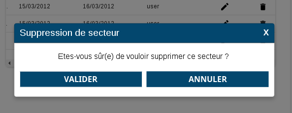

# Le composant Alert

## Description

Le composant `Alert` affiche un message avec une demande de confirmation par l'utilisateur (boutons `valider` et `annuler`).



Alert reprend le comportement et donc les principes du composant Modal.

## Utilisation

Nous retrouvons donc les attributs: `isVisible`, `onClickClose`, `onClickOutsideDialog` et `className`.

Dans l'exemple suivant, la popup affiche un formulaire et ses boutons.
 
```javascript
import { Alert } from "hornet-js-react-components/src/widget/dialog/alert";

/*Définition de la variable liée a l'alerte qui permettra d'appeler close() sur l'alert*/
private alert: Alert;

render(): JSX.Element {
    return (
        <div>
            ...
            <Alert
                message={"Etes-vous sûr(e) de vouloir supprimer ce secteur?"}
                isVisible={this.state.isOpenAlertDelete}
                onClickOk={this._supprimer}
                onClickCancel={this.closeAlert}
                onClickClose={this.closeAlert}
                title={"Suppression de secteur"}
            />
            ...
        </div>
    );
}

/**
 * Méthode déclenchant la fermeture de l'alerte
 */
private closeAlert(): void {
    this.alert.close();
}
```

Les attributs du composant `Alert` :

| attribut | obligatoire | description |
| -------- | ----------- | ----------- |
| message| X | Message affiché dans la popup |
| isVisible| X | Rendre le composant visible |
| onClickOk| | Passer la méthode à appeler lorsque l'utilisateur clique sur le bouton `Valider`|
| onClickCancel | | Passer la méthode à appeler lorsque l'utilisateur clique sur le bouton `Annuler`|
| onClickClose | | Passer la méthode à appeler lorsque l'utilisateur clique sur la croix (en haut à droite) ou sur le bouton `Annuler`  |
| title | | Titre de l'alerte |
| valid | | Fonction de validation |
| cancel | | Fonction appelé lors de l'annulation de la modale |
| validTitle | | Title du bouton de validation |
| cancelTitle | | Title du bouton d'annulation |
| underlayClickExits | | Permet de sortir de l'alerte lors d'un clique en dehors de celle-ci |
| escapeKeyExits | | Permet de spécifier si on peut utiliser la touche "Echappe" pour sortir de l'alerte |


### Alerte sur une action d'un tableau

Les composants `Table` possèdent des colonnes d'action `ActionColumn` qui permettent d'effectuer des actions sur les éléments du tableau.
Il est possible d'afficher une alerte avant d'effectuer cette action.

Exemple:

```
render(): JSX.Element {
    return(
        <div>
             <Table>
                ...
                <Columns>
                    ...
                    <ActionColumn
                        ...
                        messageAlert={"Etes-vous sûr(e) de vouloir supprimer ce secteur?"}
                        titleAlert={"Suppression de secteur"}
                    />
                </Columns>
             </Table>
        </div>
    );
}
```

## Live coding

`Attention : mettre l'option isVisible à true pour voir l'alerte`

```javascript showroom

    /*Définition de la variable liée a l'alerte qui permettra d'appeler close() sur l'alert*/
        private alert: Alert;
        return (
            <div>
                <Alert
                    message={"Etes-vous sûr(e) de vouloir supprimer ce secteur?"}
                    isVisible={false}
                    onClickOk={function() {alert("onClickOk")}}
                    onClickCancel={function() {alert("onClickCancel")}}
                    title={"Suppression de secteur"}
                />
            </div>
        );
}
```