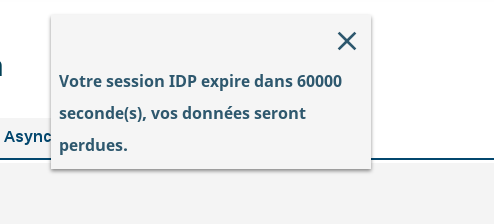

# Le composant SessionIdpExpireNotification

## Description

Le composant permet d'afficher un message à l'utilisateur indiquant la fin imminente de la session IDP.

## Utilisation

Le Composant SessionIdpExpireNotification sert à afficher les messages d'avertissement de fin de session IDP, pour informer à l'utilisateur que ses données seront perdues.

| Attibut             | Description                                                        | Obligatoire | Valeur par défaut                         | Type    |
| ------------------- | ------------------------------------------------------------------ | ------------| ----------------------------------------- |---------|
| notificationMessage | Clé I18N du message à afficher.                                    | &nbsp;      | "notificationIdp.expireMessage"           | string  |
| expireIn            | Temps d'affichage avant la fin de la session (en ms                | &nbsp;      | 60000                                     | number  |
| expireInDate        | Temps avant la fin de la session (en ms)                           | &nbsp;      | 60000                                     | number  |
| reduced             | Etat de réduction du composant                                     | &nbsp;      | false                                     | boolean |

### Inclusion du composant

Voici un exemple d'inclusion du composant avec utilisation de la fin de session idp de l'utilisateur.

```javascript

        {Utils.getCls("hornet.user") && Utils.getCls("hornet.user")["SessionNotOnOrAfter"]?
        <SessionIdpExpireNotification expireIn={60000} expireInDate={Utils.getCls("hornet.user")["SessionNotOnOrAfter"] - new Date(Utils.getCls("currenDate")).getTime()} />
        : null};

```


