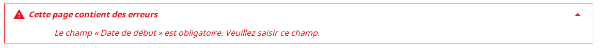
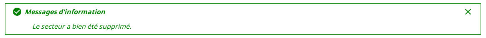
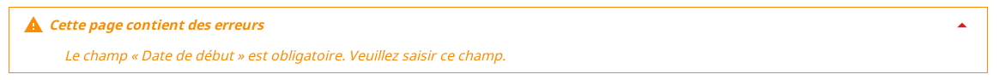
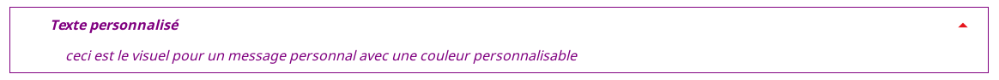
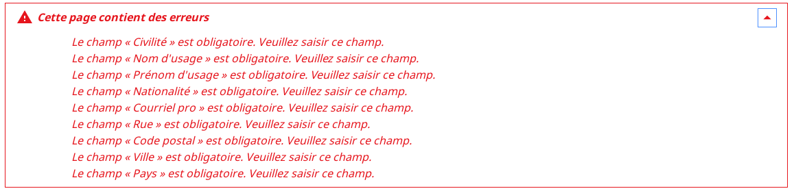

# Le composant Notification

## Description

Le composant permet d'afficher des messages de plusieurs types :
- Type Erreur en rouge



- Type Information en vert



- Type Alerte en orange



- Type Personnalisable ( Par défaut en noir)



## Utilisation

Le Composant Notification sert à afficher les messages d'erreurs.

| Attibut          | Description                                                        | Obligatoire | Valeur par défaut                         | Type    |
| ---------------- | ------------------------------------------------------------------ | ------------| ----------------------------------------- |---------|
| errors           | Messages d'erreur passés à la notification                         | &nbsp;      | &nbsp;                                    | any     |
| errorsTitle      | Titre de la section des erreurs                                    | &nbsp;      | this.i18n("notification.errorsTitle")     | string  |
| exceptions       | Messages d'exceptions passés à la notification                     | &nbsp;      | &nbsp;                                    |Array<BaseError> |
| id               | Identifiant de la notification                                     | Oui         | &nbsp;                                    | string  |
| infos            | Messages d'informations passés à la notification                   | &nbsp;      | &nbsp;                                    | any     |
| infosTitle       | Titre de la section des informations                               | &nbsp;      | this.i18n("notification.infosTitle")      | string  |
| personnals       | Messages personnels passés à la notification                       | &nbsp;      | &nbsp;                                    | any     |
| personnalsTitle  | Titre de la section des messages personnalisable                   | &nbsp;      |this.i18n("notification.personnalsTitle")  | string  |
| warnings         | Warnings passés à la notification                                  | &nbsp;      | &nbsp;                                    | any     |
| warningsTitle    | Titre de la section des warnings                                   | &nbsp;      | this.i18n("notification.warningsTitle")   | string  |
| color            | Permet de déterminer la couleur de bordure et de texte             | &nbsp;      | &nbsp;                                    | string  |
| logo             | url du pictogramme à afficher                                      | &nbsp;      | &nbsp;                                    | string  |

## Création d'une notification

On commence par créer le conteneur des notifications qui peut contenir plein de messages à notifier comme l'exemple si dessous ou il y a 9 notifications de type error


```javascript

import { Notification } from "hornet-js-react-components/src/widget/notification/notification";
import { NotificationManager, Notifications, NotificationType } from "hornet-js-core/src/notification/notification-manager";

/* Notification non personnalisée */
let errors: Notifications = new Notifications();
/* Notification personnalisée */
let personnals: Notifications = new Notifications("#4000FF","lien_vers_un_icone");
```
Puis on crée une notification à ajouter à ce conteneur.
```javascript
let notif = new NotificationType();
notif.id = "123456789";
notif.text = "message à afficher";
errors.addNotification(notif);
```
Enfin il nous reste plus qu'a afficher les notifications. Pour cela, il faut utiliser la fonction `notify` du `NotificationManager` : 
```javascript
/* Patron */
NotificationManager.notify("id", "id du composant", "les erreurs", "les informations","les exceptions","Les alertes","les personnels");
/* Exemple pour afficher des notifications de type informations (en vert) */
NotificationManager.notify(null,null,null,errors,null,null,null);
/* Exemple pour afficher des notifications de type personnelles */
NotificationManager.notify(null,null,null,null,null,null,personnals);
/* Exemple pour afficher des notifications de type personnelles et errors */
NotificationManager.notify(null,null,errors,null,null,null,personnals);

```

## Affichage des notifications

```javascript
import { Notification } from "hornet-js-react-components/src/widget/notification/notification";

...
render() {
    ...
    return (
        <div>
            <Notification/>
        </div>
    );
}
```

## Live coding 

```javascript showroom


let errors = [{ text: "ceci est le visuel pour un message d'erreur"}];
let personnal = [{ text: "ceci est le visuel pour un message personnal avec une couleur personnalisable"}];

 return (
    <div>
        <Notification id="error-notification" errors={errors} />
        <Notification id="personal-notification" personnalsTitle="Texte personnalisé"  color="purple" personnals={personnal}/>
    </div>
);

```