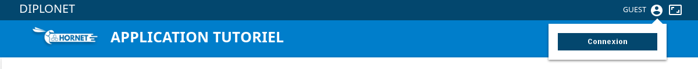
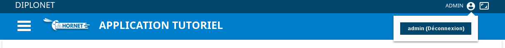

# Le composant User

## Description

Le composant `User` affiche des informations de connexion et intègre un bouton permettant d'être redirigé vers une page de connexion.





## Utilisation

Aucun attribut obligatoire.

Le composant User s'appuie sur des informations dans la configuration :
- url de redirection pour une connexion : `authentication.loginUrl`
- url de redirection pour une déconnexion : `authentication.logoutUrl`
- Information user : User contenu dans le CLS et accessible via `HornetComponent`
- Label par défaut pour utilisateur non connecté : `application.user.guest`


Dans l'exemple suivant, le composant user est défini pour être lié aux informations user du CLS. Permet la connexion et la déconnexion selon les urls définis dans
la configuration de l'application.
 
```javascript
import {User} from "hornet-js-react-components/src/widget/header/user";

<User />;
```

Les attributs du composant `User` :

| Attribut         | Description                                                                       | Obligatoire | Valeur par défaut | Type        |
| ---------------- | --------------------------------------------------------------------------------- | ----------- | ----------------- | ----------- |
| defaultUserLabel | Label affiché par défault lorsque l'utilisateur n'est pas connecté. Par défaut on utilise la ressource `application.user.guest` | &nbsp;  | &nbsp;  |string|
| id               | Identifiant du composant                                                          | &nbsp;      | &nbsp;            | string      |
| loginLabel       | Label du bouton de connexion. Par défaut on utilise la ressource `navigation.connect` | &nbsp;  | &nbsp;            | string      |
| loginUrl         | Url d'accès à la page d'authentification. Par défaut on utilise la propriété `loginUrl` du `default.json` | &nbsp; | Utils.appSharedProps.get("loginUrl") | string |
| logoutLabel      | Label du bouton de déconnexion. Par défaut on utilise la ressource `navigation.disconnect` | &nbsp; | &nbsp;        | string      |
| logoutUrl        | Url d'accès à la page de déconnexion. Par défault on utilise la propriété `logoutUrl` du `default.json` | &nbsp;  | Utils.appSharedProps.get("logoutUrl") | string |
| title            | Titre du composant                                                                | &nbsp;      | &nbsp;            | string      |

## Live coding

`Attention: pour le live coding, le composant User doit avoir un identifiant "user-exemple" `

```javascript showroom

	return (
            <User id="user-exemple" defaultUserLabel="Exemple" loginUrl="#"/>
    );
```