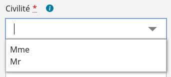

# Les composants AutoComplete

## Le composant AutocompleteField

### Description

Le composant `AutoComplete` (ou composant de complètement automatique) est une aide à la saisie.

Il permet à l'utilisateur de limiter la quantité d'informations selon ce qu'il saisit au clavier, en se voyant proposer un complément qui pourrait convenir à la chaîne de caractères qu'il a commencé à taper.

Le composant se présente sous la forme d'un champ de saisie texte classique.
Une fois le nombre de caractères précisé saisie par l’utilisateur, une liste de proposition se déploie sous le champ texte. Elle contient les occurrences correspondant à la saisie. Un clic sur une occurrence permet de la sélectionner.

Exemple:



### Utilisation

Exemple d'utilisation:

```javascript

import { AutoCompleteField } from "hornet-js-react-components/src/widget/form/auto-complete-field";
import { Form } from "hornet-js-react-components/src/widget/form/form";

private exampleAutocomplete : AutoCompleteField;
private data : DataSource<type>;

this.data = new DataSource<type>(...données...)

render(): JSX.Element {
    var formI18n = this.i18n("form");
    return (
        <div>
            <Form ...>
                <AutoCompleteField
                    dataSource={this.data}
                    name="Civilité"
                    label={"Civilité"}
                    required={true}
                />
            </Form>
        </div>
    );
}
```


Les attributs proposés par le composant:

| attribut |   description | valeur par défaut |
| -------- | ----------- | ----------- |
| autocompleteState | Ecoute l'évenements onFocus sur le compostant | |
| dataSource | Données passée à l'autocomplete | |
| delay | Délai minimal en millisecondes entre deux déclenchements de l'action de chargement de choix | 500 |
| init | Lance un init sur le datasource à l'initialisation du composant | |
| itemSelectedLabel | Message qui s'affiche lors de la selection des items | |
| maxElements | Nombre maximum de choix à proposer | |
| maxHeight | Hauteur maximum de la popin de choix à proposer (en pixels) | |
| minValueLength | Longueur minimale de texte libre permettant la proposition des choix | 3 |
| writable | Autorise la saisie dans le champs du formulaire afin de filter | true/false |
| filterText | Définit la manière dont sont filtrés les résultats affichés en fonction des caractères saisis (FilterTextType.indexOf ou FilterTextType.beginWith ou fonction custom | FilterTextType.indexOf |


Il est préférable pour l'accessibilité, de valoriser l'attribut toolTip du composant avec les informations aidant à la compréhension de l'utilisation du composant
```javascript
    <AutoCompleteField dataSource={this.dataSourceNationalite}
       maxHeight={200}
       name="nationalite"
       label={formI18n.fields.nationalite.label}
       required={true}
       toolTip={this.i18n("form.autoCompleteField.toolTip")}
       labelKey="nationalite"
       valueKey="id"
    />
```

### Accessibilité

- Flèches (haut, bas, droite, gauche): Permettent de se deplacer dans la liste
- Espace / Entrer : sélectionne un élément dans la liste
- Tabulation: Passe à lélement suivant dans la liste
- Home: Sélectionne au début de la liste
- Fin: Se positionne à la fin de la liste

### Dans une modal (popin)

L'intégration d'un autocomplete dans une fenêtre modal impose de rajouter la propriété `withoutOverflow` au composant `Modal` afin que la liste de l'autocomplete puisse s'afficher par-dessus la modal.
Par ailleurs, il faut également valoriser la propriété `focusDialog`  à `false` pour pouvoir utiliser le scroll de la liste de sélection.


## Le composant AutoCompleteMultiField

### Description

Identique à l'auto-complète, il permet à l'utilisateur de sélectionner plusieurs choix.


Les attributs propre Auto-Completion choix Mulitiple:

| attribut |  type  |description |
| -------- | ----------- | ----------- |
| itemSelectedLabel | string | Message qui s'affiche lors de la selection des items |


### Accessibilité

**Identique à l'auto-complète, avec action complémentaire pour le multiple**
- ctrl+A: permet de selectionner tous les choix


### Utilisation

Exemple d'utilisation:

```javascript

import { AutoCompleteMultiField } from "hornet-js-react-components/src/widget/form/auto-complete-field";
import { Form } from "hornet-js-react-components/src/widget/form/form";

private exampleAutocomplete : AutoCompleteField;
private data : DataSource<type>;

this.data = new DataSource<type>(...données...)

render(): JSX.Element {
    var formI18n = this.i18n("form");
    return (
        <div>
            <Form ...>
                <AutoCompleteMultiField
                    dataSource={this.data}
                    name="Civilité"
                    label={"Civilité"}
                    required={true}
                />
            </Form>
        </div>
    );
}
```


### Live coding

```javascript showroom

let listeCivilites = [
    {id: 1, libelle: "Madame"},
    {id: 2, libelle: "Monsieur"}
    {id: 3, libelle: "Mademoiselle"}
];

let dataSourceCivilite = new DataSource<any>(listeCivilites, {value: "id", text: "libelle"}, [new DefaultSort([{key : "text"}])]);
return(
<Form addButtonArea={false}>
	<AutoCompleteField
		dataSource={dataSourceCivilite}
		name="Civilité"
		label={"Civilité"}
		required={true}
	  />
</Form>
);

```
