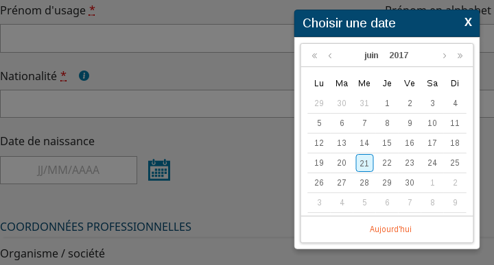
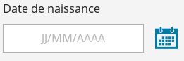
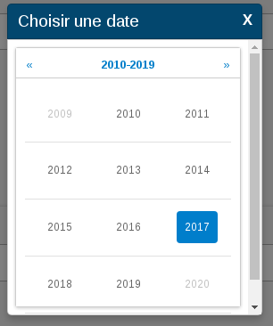
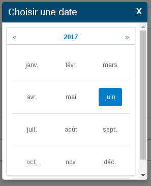

# Le composant CalendarField

Manuel d'utilisation du calendrier Hornet.

## Description

Le composant calendrier, aussi appelé `CalendarField`, associe une zone de saisie de date avec un calendrier et hérite de `InputField`. Le calendrier est accessible en cliquant sur une icône située à droite du champ de saisie.

Champ de saisie avec un calendrier affiché :



Le calendrier s'affiche alors en surimpression de la page HTML sans perturber le rendu.

Champ de saisie avec un calendrier caché :



Le choix de l'année se fait en cliquant sur l'année indiquée au dessus de la grille du calendrier.





L'assemblage fait par ce composant a pour but :

- de standardiser les libellés en français par défaut,
- de formater les dates et les zones de saisie selon les conventions françaises par défaut.

La date saisie dans le champ de saisie sera completé lorsque l'utilisateur quitte le champ.
Par exemple, en ne remplissant qu'un numéro de jour, la date sera completée avec le mois et l'année courrante.
En remplissant le jour et le mois, l'année courrante sera ajoutée.

Le calendrier utilisé s'appuie sur le composant `rc-calendar` disponible sous [GitHub](https://github.com/react-component/calendar).

## Utilisation

Le composant calendrier est utilisable dans un formulaire.

```javascript
import { Form } from "hornet-js-react-components/src/widget/form/form";
import { CalendarField } from "hornet-js-react-components/src/widget/form/calendar-field";

/** Référence vers le composant calendrier : nécessaire pour utiliser la fonction setAttribute(). */

render(): JSX.Element {
    return(
        <div>
            <Form ...>
                <CalendarField
                    label="Calendrier"
                    name="exampleCalendar"
                    title="Calendrier"
                />
            </Form>
        </div>
    );
}
```

Descriptif des attributs du composant CalendarField :

| attribut | description | valeur par défaut |
| -------- | ----------- | ----------------- |
| dateFormats | Liste de formats de saisie de date (ex. \["%d/%m/%Y","%d-%m-%Y"\] ) | valeur de calendar.dateFormat dans messages.json |
| isDatePicker | Affiche ou non l'icone de sélection d'une date  | true |
| label | Libellé du champ de saisie de date |  |
| placeHolder | Texte présent dans le champ de saisie lorsque la date n'est pas renseignée |
| required | Indique si la saisie du champ est obligatoire pour valider le formulaire | false |
| title | Libellé utilisé comme texte alternatif à l'image du bouton d'ouverture de calendrier  |  |
| valideOnForm | Indicateur qui précise que la validation (format) est portée par le formulaire qui contient le composant ou sinon par lui-même | true |
| onValueChange | Fonction appelé à chaque modification du champs input (prend la valeur en paramètre) | |
| onSelect | Fonction appelée à chaque selection dans le Calendar ou sur le reset |  |


## Live coding

```javascript showroom
	/** Référence vers le composant calendrier : nécessaire pour utiliser la fonction setAttribute(). */

    return(
        <CalendarField
		  label="Calendrier"
		  name="exampleCalendar"
		  title="Calendrier"/>
    );
```