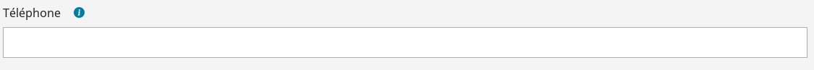

# Le composant InputField

## Description

Champs de saisie d'un formulaire



## Utilisation

```javascript

 import { InputFileField } from "hornet-js-react-components/src/widget/form/input-field";

render(): JSX.Element {
    return(
    <div>
        <Form id="form-example">
            <Row>
                <InputField name="nom" />
            </Row>
        </Form>
    </div>
    );
}

```

Tous les attributs standart HTML peuvent être utilisés

Le composant possède les propriétés des interfaces:

[HornetWrittableProps](/hornetshowroom/composant/page/hornet-js/composants/hornet-component-props)

[HornetClickableProps](/hornetshowroom/composant/page/hornet-js/composants/hornet-component-props)

[HornetBasicFormFieldProps](/hornetshowroom/composant/page/hornet-js/composants/hornet-component-props)

[ReactFocusDOMAttributes](/hornetshowroom/composant/page/hornet-js/composants/hornet-component-props)

Les principaux attributs:

| Attribut                | Description                                                                   | Obligatoire | Valeur par défaut | Type |
| ----------------------- | ------------------------------------------------------------------------------|-------------|-------------------|------|
| id                      | Attribut id dans le DOM                                                       |             |                   |string|
| label                   | Libelle du champ affiché                                                      |             |                   |string|
| name                    | Nom de l'attribut dans le DOM                                                 |             |                   |string|
| required                | Définit si le champ est obligatoire                                           |             |                   |boolean|
| requiredLabel           | Libelle du label affiche lorsqu'on se positionne sur l'astérisque             |             |                   |string|
| maxLength               | Nombre maximum de caractère autorisé à la saisie                              |             |                   |number|
| resettable              | Par défaut à true. Détermine la présence du bouton `reset` dans le champ      |             |                   |boolean|

## Live coding

```javascript showroom
return (
  	<row>
		<InputField name="rue" id="test1" label="Rue" required />
		<InputField name="complrue" label="Complement de rue" />
	    <InputField name="cp" label={"Code postal"} maxLength={5}/>
        <InputField name="exemple" label="Se positionner sur l'astérix" required requiredLabel="je suis le message" />
	</row>
 );
```