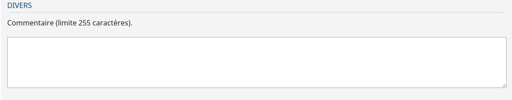

# Le composant TextAreaField

Champs de saisie d'un formulaire

## Description

Le composant `TextAreaField` est zone de saisie dans un formulaire. Il permet une saise muti-ligne d'information



## Utilisation

```javascript

import { TextAreaField } from "hornet-js-react-components/src/widget/form/textarea-field";

render(): JSX.Element {
    return(
    <div>
        <Form id="form-example">
             <Row>
                <TextAreaField
                    name="commentaire"
                    label={"Zone de commentaire"}
                    maxLength={255}
                    rows={4}
                />
            </Row>
        </Form>
    </div>
    );
}

```

Tous les attributs standart HTML peuvent être utilisé

Le composant possède les propriétés des interfaces:

[HornetWrittableProps](/hornetshowroom/composant/page/hornet-js/composants/hornet-component-props)

[HornetClickableProps](/hornetshowroom/composant/page/hornet-js/composants/hornet-component-props)

[HornetBasicFormFieldProps](/hornetshowroom/composant/page/hornet-js/composants/hornet-component-props)

Les principaux attributs:

| Attribut                | Description                                                                   | Obligatoire | Valeur par défaut | Type |
| ----------------------- | ------------------------------------------------------------------------------|-------------|-------------|-------------|
| resettable              | Définit si le champs peut être remis à zéro                                   ||true|boolean|
| displayCharNumber       | Définit si la textarea doit afficher le nombre de caractères entrés           ||true|boolean|
| extendable              | Définit si la textarea se redimensionnera automatiquement                     ||true|boolean|
| maxChar                 | Nombre maximum de caractère autorisé, la saisie sera toujours possible au dela contairement a l'attribut maxLength||true|boolean|
| showAlert               | Définit si l'alerte indiquant que le nombre de caractère est trop élevé s'affichera ||true|boolean|
| alertMessage            | Message de l'alerte indiquant que le nombre de caractère est trop élevé       |||string|
| alertTitle              | Titre de l'alerte indiquant que le nombre de caractère est trop élevé         |||string|
| charLabel               | Label d'affichage du nombre de caractère                                      |||boolean|


## Live coding

```javascript showroom
return  (
    <TextAreaField
        name="Commentaire"
        label={"Commentaire label"}
        labelClass="blocLabelUp"
        maxLength={255}
	    rows={4} />
 );
```