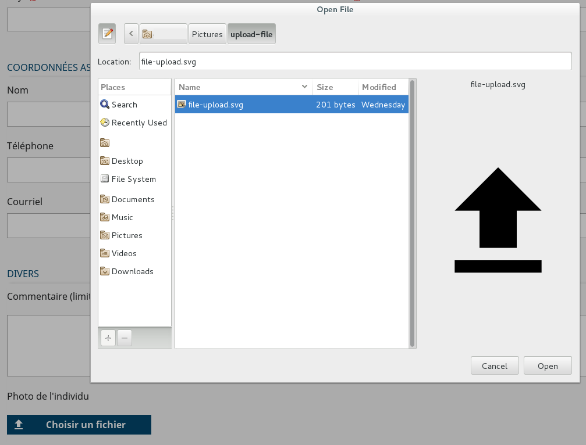

# Le composant UploadFileField

Ce composant permet de télécharger un fichier vers le serveur et d'afficher ce fichier dans la page rendue sur le navigateur selon la méthode donnée au champ.

## Description 

Le composant `UploadFileField`  est utilisé dans un formulaire.

Lorsque le formulaire est en édition, il permet de sélectionner un fichier à partir d'un champ input de type `file` et lors de la validation du formulaire le fichier est envoyé sur le serveur Node.
Pour pouvoir personnalisé le champs, l'input file est caché et représenté par un label.

Si un fichier est présent à l'initialisation du formulaire, mode `consultation` ou `édition`, le composant affiche le fichier.

Champ de sélection d'un fichier (Formulaire en édition):



## Utilisation

Le composant est utilisable dans un formulaire.

```javascript
 import { UploadFileField } from "hornet-js-react-components/src/widget/form/upload-file-field";

render(): JSX.Element {
    return(
    <div>
        <Form>
            <UploadFileField
                name="photo"
                label="Photo"
                renderPreviewFile={this.renderPreviewUploadFile}
                buttonLabel={"Choisir un fichier"}
                fileSelectedLabel={"Un fichier choisit"}
            />
        </Form>
    </div>
    );
}

/**
 * Génère le rendu de l'aperçu correspondant au fichier en consultation
 * @param file fichier sélectionné
 * @returns {*}
 */
private renderPreviewUploadFile(file: UploadedFile): React.ReactElement<any> {
    ...
}
```

Les attributs utilisables sont ceux définis pour le type `AbstractField` ainsi que :

| attribut                | description                                                                                    |
| ----------------------- | ---------------------------------------------------------------------------------------------- |
| buttonLabel             | Texte affiché dans le bouton si aucun fichier n'est sélectionné |
| classNameDelete         | Permet de surcharger le css du bouton de suppression |
| defaultFile             | Fichier sélectionné accessible en consultation |
| fileSelectedLabel       | Texte affiché si un ou plusieurs fichiers sont sélectionnés |
| label                   | Texte accompagnant le bouton ex "Carte d'identité"         |
| name                    | Permet la liaison entre le label et le button : labelfor  |
| renderPreviewFile       | Méthode de rendu du composant en lecture seule |

[UploadFileField - attributs]


### Envoi des données vers le serveur

Le fichier doit être envoyé en `multipart` vers le serveur Node.

Exemple dans le service d'envoi des données:

```javascript
if (sendPart.photo && sendPart.photo instanceof File) {
    request.attach = [];
    request.attach.push({field: "photo", file: sendPart.photo, fileName: sendPart.photo.name});
}
```

**Remarque** : attention à bien vérifier que l'objet récupéré est une instance de `File`. En effet il est de type `File` seulement quand un fichier a été uploadé dans le formulaire et transmis dans la requête.
Si ce n'est pas un fichier, on peut l'ignorer (cela signifie que la donnée n'a pas été modifiée). De plus, si on essaye quand même de l'attacher dans la requête alors que ce n'est pas un fichier, firefox plante.

### Récupération du fichier côté serveur Node

Le module npm [multer](https://www.npmjs.com/package/multer) prend en charge le fichier uploadé.

Lors de la validation du formulaire, le fichier sélectionné par l'utilisateur est accessible dans un tableau appelé `files` et placé dans l'objet `request` par `multer`.

```javascript
if (this.req.files && this.req.files[0] != null) {
    // On replace la photo dans l"objet
    photo={};
    photo.nom = this.req.files[0].originalname;
    photo.mimeType = this.req.files[0].mimetype;
    photo.encoding = this.req.files[0].encoding;
    photo.size = this.req.files[0].size;
    photo.contenu = this.req.files[0].buffer;
}
```

### Envoie du fichier vers le navigateur

Définition de la route qui  envoie le fichier vers le navigateur.

Le composant crée une balise pointant vers une route que vous devez définir. L'id est passé par défaut par le composant
L'action doit écrire dans le résultat de sortie un objet de type `Image` pour indiquer au router-data de fournir une image au navigateur.

```javascript

import Bean from "hornet-js-bean/src/decorators/Bean";
import Map from "hornet-js-bean/src/decorators/Map";
import Alias from "hornet-js-bean/src/decorators/Alias";
@Bean
export class PhotoMetier {
    @Map()
    id: number;
    @Map()
    fileName: string;
    @Map()
    @Alias("mimetype")
    mimeType: string;
    @Map()
    encoding: string;
    @Map()
    size: number;
    @Map()
    @Alias("contenu")
    data: Buffer;
}

import {ResultFile} from "hornet-js-core/src/result/result";

export class LirePhoto extends RouteActionService<{id: number}, Service> {

    execute(): Promise<ResultFile> {
        return this.getService().lirePhoto(this.attributes.id).then((retourApi: PhotoMetier)=> {
            return new ResultFile(retourApi, MediaTypes.fromMime(retourApi.mimeType));
        });
    }
}
```

## Live coding

```javascript showroom

	return (
            <UploadFileField
                name="photo"
                label="Photo"
                buttonLabel={"Choisir un fichier"}
                fileSelectedLabel={"Un fichier choisit"}/>
    );
```