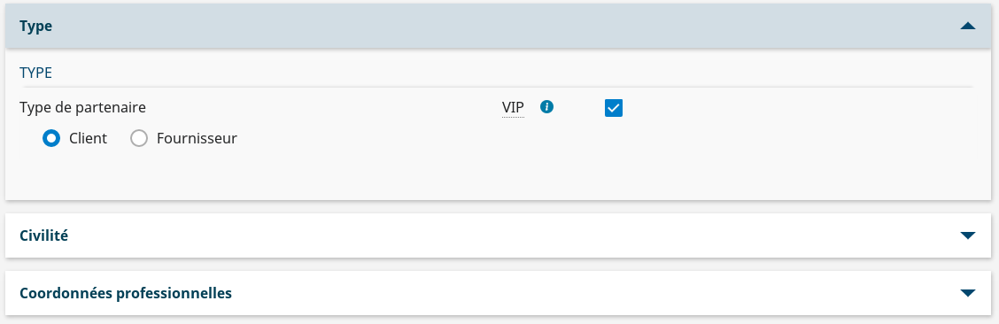

# Les composants de Accordions

## Le composant Accordions

### Description

Le composant `Accordions` est un composant de présentation, permettant d'afficher des blocs de contenu dépliables.

Chacun de ces blocs est rétractable, ce qui permet d'afficher ou non, le contenu du bloc.



### Attributs du composant

Les attributs `Accordions`:

| Attribut |   Description | Obligatoire | Valeur par défaut | Type |
| -------- | ----------- | ----------- |----------- |----------- |
| multiSelectable | Indicateur pour autoriser à avoir plusieurs accordions ouverts ou non | |false |boolean|
| beforeHideAccordion    | Méthode appelée avant la fermeture d'un accordion       |  ||(accordionRef?: Accordion, index?: number) => void|
| afterShowAccordion     | Méthode appelée après l'ouverture d'un accordion       | ||(accordionRef?: Accordion, index?: number) => void|


## Le composant Accordion

Le composant `Accordions` est à voir comme un conteneur, et Accordion comme un élément de celui-ci.

### Attributs du composant

Les attributs `Accordion` :

| Attribut | Description | Obligatoire | Valeur par défaut | Type |
| -------- | ----------- | ----------- | ----------- | ----------- |
| id | Préfixe de l'identifiant de l'accordéon | | | string |
| key | Key de l'accordéon | | | string |
| title | Titre de l'accordion, affiché tout en haut de l'accordion | ||string|
| isOpen | Indicateur pour l'état de l'accordion déplié / rétracté | ||boolean|
| panelIndex | Index pour le panel portant le contenu de l'accordion | ||number|
| handleClickAccordion | Méthode exécutée au click sur l'accordion | ||Function|
| handleFocusAccordion | Méthode exécutée au focus sur l'accordion | ||Function|
| tabIndex | Valeur de tabulation pour la navigation clavier | |-1 | string|
| infoAccordion | Texte mentionnant des informations au sujet de l'accordion | |&nbsp; |string|

### Header personnalisé

Il est possible de mettre un titre autre qu'une chaine de caractères en haut de l'accordion.
Pour cela, il faut rajouter un `AccordionHeader` dans l'accordion.
Si la props `title` est renseignée en même temps, seul l'`AccordionHeader` sera pris en compte.

```javascript
    import { AccordionHeader } from "hornet-js-react-components/src/widget/accordion/accordion-header";

    return (
        <Accordions multiselectable={true}>
            <Accordion isOpen={true}>
                <AccordionHeader>
                    Header personnalisé
                </AccordionHeader>
                <div>
                    contenu de l'accordion
                </div>
            </Accordion>
            <Accordion title="accordion de test 2" isOpen={false}></Accordion>
            <Accordion title="accordion de test 3" isOpen={false}></Accordion>
        </Accordions>
    );

```


### Informations personnalisées

Il est également possible de faire la même chose avec les informations de l'accordion.
Pour cela, il faut rajouter un `AccordionInfo` dans l'accordion.
Si la props `infoAccordion` est renseignée en même temps, seul l'`AccordionInfo` sera pris en compte.

```javascript
    import { AccordionInfo } from "hornet-js-react-components/src/widget/accordion/accordion-info";

    return (
        <Accordions multiselectable={true}>
            <Accordion isOpen={true}>
                <AccordionInfo>
                    Informations personnalisées
                </AccordionInfo>
                <div>
                    contenu de l'accordion
                </div>
            </Accordion>
            <Accordion title="accordion de test 2" isOpen={false}></Accordion>
            <Accordion title="accordion de test 3" isOpen={false}></Accordion>
        </Accordions>
    );

```

### Accessibilité

- Tabulation : naviguer jusqu'à un accordion, ou dans le contenu d'un accordion déplié
- Entrée / Espace : Etendre ou rétracter un accordion

## Live coding

```javascript showroom

    return (
        <Accordions multiSelectable={true}>
            <Accordion title="accordion de test 1" isOpen={true}></Accordion>
            <Accordion title="accordion de test 2" isOpen={false}></Accordion>
            <Accordion title="accordion de test 3" isOpen={false}></Accordion>
        </Accordions>
    );

```
