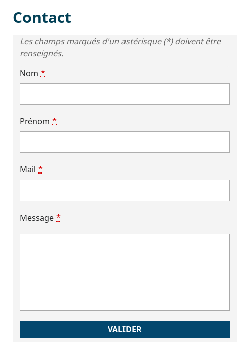
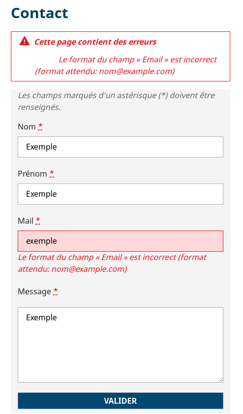
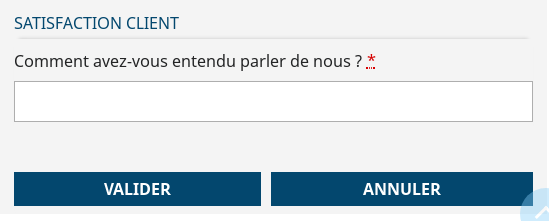
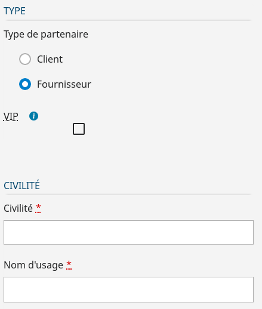
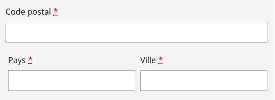

# Les composants de Form

## Description

`Form` est un composant qui permet de créer simplement et de manière homogène des formulaires de saisie en respectant les dispositions d'accessibilité.

Exemple de formulaire simple :



## Présentation du formulaire

Exemple d'un formulaire simple:

```javascript

import { Form } from "hornet-js-react-components/src/widget/form/form";

/**
* schema de validation du formulaire
* il permet de vérifier que les champs respectent les contraintes voulues
*/
import * as schema from "src/chemin.../ma-validation.json";

/**
* Variable du formulaire qui permettra ensuite d'appeler la méthode updateFields() du Form
* cette méthode permet de mettre a jour les données du formulaire
*/
private monForm: Form;

render(): JSX.Element {

    /*On récupère les messages i18n pour le formulaire
    qui sont présents dans le fichier messages.json*/
    var formI18n = this.i18n("form");

    return (
        <div>
            <h2>Contact</h2>
            <Notification id="notif"/>
            <Form id="form-example"
                schema={schema}
                formMessages={formI18n}
                onSubmit={this.onSubmit}
            >
                <InputField
                    name="nom"
                    label={"Nom"}
                />
                ...
                <ButtonsArea>
                    <Button type="submit" id="envoi" name="action:envoi" value="Valider"
                        className="hornet-button" label="Valider" title="Validation du formulaire" />
                </ButtonsArea>
            </Form>
        </div>
    );
}

/* Méthode appelée a la validation du formulaire*/
onSubmit(data: any) {
    ...
}

/**
* Messages passés au formulaire
*/
messages.json:
"form": {
    "fields" : {
        "nom" : {
            "label" : "Nom"
            "required": "Le champ « Nom » est obligatoire. Veuillez saisir ce champ."
        }
        ...
    },
    "validTitle": "Validation de la saisie du formulaire de contact",
    "cancelTitle": "Annulation de la saisie du formulaire de contact"
}

```

Descriptif des attributs du composant formulaire Hornet :

| Attribut                | Description                                                                                    | Obligatoire | Valeur par défaut | Type    |
| ----------------------- | ---------------------------------------------------------------------------------------------- | ------------|------------------ | ------- |
| className               | Nom de la classe CSS à affecter au formulaire.                                                 | &nbsp;      |"formRecherche"    | string  |
| customValidators        | Valideurs customisés : permettent d'implémenter et de chaîner des règles de validation difficiles à mettre en oeuvre simplement avec un schéma json-schema. Ils sont appliqués après la validation basée sur le schéma de validation, donc les données du formulaire ont déjà éventuellement bénéficié de la coercition de types. | &nbsp; | [] | array[ICustomValidation] |
| defaultValues           | Données initiales du formulaire                                                                | &nbsp;       | &nbsp;           | any     |
| formMessages            | Messages spécifiques à ce formulaire : utilisés pour la génération des messages d'erreur de validation | &nbsp; | &nbsp;         | any     |
| hideButtons             | Lorsqu'égal à true, les boutons de validation ne sont pas affichés                             | &nbsp;       | false            | boolean |
| id                      | Identifiant du formulaire                                                                      | Oui          | &nbsp;           | string  |
| imgFilePath             | Surcharge de l'url des images (ex. : http://localhost:7777/internet), notamment les icônes indiquant la présence d'une infobulle. Il faut que les images se situent au même niveau d'arborescence que celles du thème intranet et que leurs noms soient identiques (ex. : "/img/tooltip/ico_tooltip.png"). | &nbsp; | &nbsp; | string |
| isMandatoryFieldsHidden | Lorsque mis à true, le message d'information concernant les champs obligatoires est masqué     | &nbsp;       | false            | boolean |
| markRequired            | Lorsqu'égal à false,les libellés des champs obligatoires ne sont pas marqués avec un astérisque| &nbsp;       | true             | boolean |
| name                    | Nom du formulaire                                                                              | &nbsp;       | &nbsp;           | string  |
| notifId                 |  Identifiant du groupe de notifications auquel seront rattachées les notifications d'erreurs de validation de ce formulaire | &nbsp; | &nbsp; | string |
| onBeforeSubmit          | Fonction déclenchée lors de la soumission du formulaire, avant la validation                   | &nbsp;       | &nbsp;           | (data: any) => void |
| onFormChange            | Fonction déclenchée lors de la modification d'un champ du formulaire                           | &nbsp;       | &nbsp;           | function(){} |
| onSubmit                | Fonction déclenchée lors de la soumission du formulaire, lorsque celui-ci est valide           | &nbsp;       | &nbsp;           | React.FormEventHandler<HTMLElement> |
| schema                  | Schema JSON de validation                                                                      | &nbsp;       | &nbsp;           | any     |
| subTitle                | Sous-titre éventuel                                                                            | &nbsp;       | null             | string  |
| text                    | Texte descriptif éventuel                                                                      | &nbsp;       | &nbsp;           | string  |
| textLang                | Langue du texte descriptif                                                                     | &nbsp;       | &nbsp;           | string  |
| validationOptions       | Options de validation ajv (cf. http://epoberezkin.github.io/ajv/#options)                      | &nbsp;       | DataValidator.DEFAULT_VALIDATION_OPTIONS |ajv.Options |
| omitNull                | Transmettre les informations non renseignées lors de la soumission                             | &nbsp;       | false            |boolean  |

Il existe d'autres types de champs :

```
AutoCompleteField       ButtonsArea               CalendarField
CheckBoxField           InputField                RadiosField
SelectField             TextAreaField             UploadFileField
```

## Mise à jour des données

La méthode updateFields du Form permet de mettre à jour les données de celui-ci.
Attention, les champs ayant une valeur par defaut (`defaultValue`) veront cette valeur écrasée par cette méthode. De même pour les valeurs `currentValue`.

exemple d'utilisation:

```
let data = {
    nom: "nom"
}
this.monForm.updateFields(data);
```

## Validation

Le Texte renseigné dans `errorMessages` s'affichera lorsque la condition sur le champ n'est pas remplie.

Exemple avec une adresse mail non valide, lors de la soumission du formulaire, le message apparaît sur le champs.
Les notifications s'affichent également au dessus du formulaire si la balise `<Notification id="notif"/>` est présente dans le code (cf exemple).



Le composant Form met à disposition les méthodes publiques suivantes afin de réaliser de la validation de formulaire hors soumission :

```
        /**
	     * Retourne le résultat de la validation et ses éventuelles erreurs
	     * @param schema : schéma de validation, par défaut celui du formulaire
	     */
	    getValidationResult(schema?: any): IValidationResult;

	    /**
	     * Déclenche une validation du formulaire basée sur un schéma précis ou celui défini pour le formulaire
	     * @param schema : schéma de validation, par défaut celui du formulaire
	     */
	    validate(notifyErrors: boolean, schema?: any): boolean;
```

Par défaut, lors de la validation d'un formulaire les données non renseignées ne sont pas transmises. La props omitNull sert à autoriser la transmission de ces données. Par défaut ces données sont valorisées par une chaîne vide. Il est possible de transmettre à null à la place en valorisant la props nullable du composant en question.

## Gestion des messages d'erreur

La gestion des erreurs de formulaire repose sur la librairie [ajv](https://github.com/epoberezkin/ajv), laquelle impose de déclarer un schéma de validation.

La gestion des messages d'erreur liés au formulaire s'effectue en 3 temps:
- couche graphique
- schéma de validation
- i18n

il faut dans un premier temps, déclarer le composant `Form`, lequel prendra en guise de propriété:
- les messages (`messages`)
- le schema de validation (`schema`)

Puis, il faut déclarer en tant qu'enfant du `Form` un champ avec la propriété `name` propre à chaque champ. En effet, le `name` du champ est la clé de voute qui permettra de faire le lien entre le composant `Form`, le schéma de validation (`ajv`) et le fichier lié à l'internationalisation.


Prenons l'exemple d'un champ input classique que l'on veut rendre obligatoire

```javascript

<InputField name="nomAgent" required={true}/>

```

il faut déclarer dans le fichier i18n `messages-fr-FR.json` (selon la langue de l'application... ici en français):

```json

{ "fields": {
    "nomAgent": {
      "label": "Nom",
      "required": "Le Nom de l'agent est obligatoire. Veuillez saisir ce champ"
    }
  }
}

```

Enfin, il faut déclarer un schéma de validation ([ajv](https://github.com/epoberezkin/ajv)):

```json

{
  "$schema": "http://json-schema.org/schema#",
  "title": "Formulaire exemple",
  "description": "Validation des données de formulaire",
  "type": "object",
  "required": [
    "nomAgent"
  ],
  "properties": {
      "nomAgent": {
        "type": "string"
      }
  }
}

```

### Types de validation avec [ajv](https://github.com/epoberezkin/ajv)


#### Type spécifique

##### Validation CheckBox required

Si l'on souhaite mettre en place une CheckBoxField obligatoire, il faut préciser dans la déclaration ajv: 

```json

    "vip": {
      "description": "Indique si le partenaire est VIP",
      "type": "boolean",
      "const": true
    },


```

Lorsque l'on veut valider un champ de type `number`, `boolean`, `string`, il faut déclarer au niveau du fichier i18n (`messages-fr-FR.json`), la propriété : `invalid`

```json

{ "fields": {
    "nomAgent": {
      "label": "Nom",
      "invalid": "Le format du nom de l'agent est incorrect."
    }
  }
}

```


##### Gestion des types sous ajv

| Type d'erreur                           | attribut ajv | exemple avj                              |  attribut dans fichier i18n |
| --------------------------------------- | ------------ | ---------------------------------------- | --------------------------- |
| Longueur maximum de la valeur du champ  | maxLength    | "maxLength": 8                           | formatMaximum               |
| Longueur minimum de la valeur du champ  | minLength    |  "minLength": 8                          | formatMinimum               |
| Format mail                             | format       | "format": "mail"                         | format                      |
| Type de champ (number, boolean, string) | type         | "type": "string"                         | invalid                     |
| Champ de type téléphone                 | $ref         |  "$ref": "#/definitions/telephone" *     | pattern                     |
| Champ sans espace                       | $ref         | "$ref": "#/definitions/noWhiteSpace" *   | pattern                     |


\*Dans ce cas précis, il faut, au préalable, définir dans le schéma l'expression régulière adéquate:

```json

"definitions": {
   "telephone": {
     "title": "Définition réutilisable de champ de type numéro de téléphone",
     "description": "Exemples valides : '0240506070', '+(33)240506070'",
     "type": "string",
     "maxLength": 14,
     "pattern": "^((\\+\\d{1,3}(-| )?\\(?\\d\\)?(-| )?\\d{1,5})|(\\(?\\d{2,6}\\)?))(-| )?(\\d{3,4})(-| )?(\\d{4})(( x| ext)\\d{1,5}){0,1}$"
   },
    "noWhiteSpace": {
      "pattern": ".*\\S.*"
    }
 }

```
##### Contrôles de surface et champs liés

Il est possible d'afficher deux champs en erreur (champs entourés en rouge) lors d'une customValidation. Il suffit de paramétrer l'erreur du champ A en mentionnant le champ B grâce au paramètre `linkedFieldsName`:

```javascript

errors.push({
    dataPath: "champA",
    keyword: "sectorBetweenDate",
    schemaPath: "/",
    params: { linkedFieldsName: [ "champB" ] },
});

```

## Evènements

Lorsque l'utilisateur clique sur le bouton valider, la fonction passée dans la propriété `onSubmit` est appelée.


## Formulaire en lecture seule

Un formulaire Hornet peut être utilisé pour présenter des données en lecture seule. C'est le cas par exemple pour la consulation de fiche partenaire dans l'application tutoriel.  

Dans ce cas la propriété readOnly du formulaire doit être valorisée à `true`.  

```javascript

<Form id="form-example"
     schema={schema}
     formMessages={formI18n}
     onSubmit={this.onSubmit}
     readOnly={true}
 >
</Form>

```


## Champs de formulaire en lecture seule

Lorsqu'un formulaire n'est pas en lecture seule, il est tout de même possible de mettre uniquement certains champs ou groupes de champs en lecture seule.

Pour cela, la propriété `readOnly` de l'élément de formulaire (composant `Field`) doit être valorisée à `true`. Il est possible de valoriser cette propriété sur un groupe de champs (composants `tabs`, `tab`, `FieldSet` ou `Row`). Dans ce cas tous les champs du groupe sont en lecture seule.

Règle de transmission de la propriété `readOnly` :

* `parent.readOnly` == true : les enfants sont aussi en lecture seule, quelle que soit la valeur éventuelle de leur propriété readOnly
* `parent.readOnly` == false ou indéfini : les enfants sont par défaut en modification, mais peuvent être en lecture seule si leur propriété `readOnly` est explicitement définie à true.

Lorsqu'un champ est en lecture seule, toute validation est désactivée sur ce champ.

En cas de modification dynamique de la propriété `readOnly` d'un champ avant soumission du formulaire :

* passage en lecture seule :
  * la validation est désactivée pour le champ
  * la valeur initiale du champ est rétablie
* passage en modification :
  * la validation est rétablie pour le champ

Exemples :

Champ en lecture seule, ou modifiable, selon un état :

```javascript
<Row>
	<Field name="pays"/>
	{/* Modification dynamique de la propriété readOnly selon la sélection du pays */}
	<Field name="ville" readOnly={this.state.villeReadOnly}/>
</Row>
```

Groupe de champs en lecture seule :

```javascript
<FieldSet name={"exemple"} readOnly={this._editContactOnly()}>
    <Row>
        <Field name="Nom"/>
        <Field name="Prenom"/>
    </Row>
    <Row>
        <Field name="Tel"/>
    </Row>
    <Row>
        <Field name="Courriel"/>
    </Row>
</FieldSet>
```

## Boutons

Les formulaires du framework Hornet sont préconfigurés avec deux boutons par défaut : `Valider` et `Annuler`. Il est possible de définir ses propres boutons en positionnant un `ButtonsArea` et en y mettant des `Button`.

Si dans le formulaire, un `ButtonsArea` a été défini sans `Button`, ou si aucun `ButtonsArea` n'est présent. Le `ButtonsArea` par défaut et ses deux `Buttons` par défaut seront présents.



Exemple de configuration ave un seul bouton `Valider` :

```javascript
<ButtonsArea>
    <Button type="submit" id="envoi" name="action:envoi" value="Valider"
        className="hornet-button" label="Valider" title="Validation du formulaire" />
</ButtonsArea>
```

## Style CSS

Par défaut les formulaires Hornet ont la classe CSS `formRecherche`. Celle-ci est utilisée dans le thème et peut donc être complétée. La classe CSS d'un formulaire peut également être personnalisée grâce à la propriété `className`.

## Message d'information sur les champs obligatoires

Par défaut le message "Les champs marqués d'un astérisque (\*) doivent être renseignés." est affiché en début de formulaire (clé de message internationalisé : `form.fillField`). Il est possible de masquer ce message en assignant la valeur `true` à la propriété `isMandatoryFieldsHidden` d'un formulaire Hornet.

Ce message est aussi masqué lorsque les champs obligatoires ne sont pas marqués avec un astérisque (propriété `markRequired` valorisée à `true` sur le formulaire).

## Marquage des champs obligatoires

Par défaut les libellés des champs obligatoires sont marqués avec un astérisque (\*). Il est possible de ne pas afficher cet astérique en valorisant la propriété `markRequired` du formulaire à `false`.

## Structurer un formulaire

Plusieurs composants servent a structurer un formulaire.

### Les fieldsets

Les fieldsets permettent de structurer le formulaire en sous parties.

Exemple de formulaire avec des fieldsets:

```javascript

<Form id="form-example"
    schema={schema}
    formMessages={formI18n}
    onSubmit={this.onSubmit}
>
    <FieldSet legend={"Type"}>
        ...
    </FieldSet>
    <FieldSet legend={"Civilité"}>
        ...
    </FieldSet>
    ...
    <ButtonsArea>
        <Button type="submit" id="envoi" name="action:envoi" value="Valider"
            className="hornet-button" label="Valider" title="Validation du formulaire" />
    </ButtonsArea>
</Form>

```



### Les rows

Les rows permettent de définir des "blocs" de champs.
Si la taille des champs n'est pas définie dans le formulaire, elle sera calculée en fonction du nombre de champs dans la row.
Le composant `Row` peut être défini avec les paramètres suivants:

| Attribut  | Description                                                                   | Obligatoire | Valeur par défaut | Type       |
| ----------| ------------------------------------------------------------------------------|-------------|-------------------|------------|
| className | Nom des classes CSS, séparés par un espace, à utiliser                        | &nbsp;      | &nbsp;            | String     |
| fraction  | Indique le nombre de colonnes à construire                                    | &nbsp;      | &nbsp;            | number     |

Lorsque la props `fraction` est définie, il est possible de surcharger la classe css ```.grid-{valeur-de-l'attribut-fraction}.fraction>.abstractfield-container>.label-row-inline``` pour gérer l'alignement des éléments présents dans le `Row`. 


Exemple:

```javascript
<Form id="form-example"
    schema={schema}
    formMessages={formI18n}
    onSubmit={this.onSubmit}
>
    <Row>
        <InputField label="Code postal" required={true} ...>
    </Row>
    <Row>
        <InputField label="Pays" required={true} ...>
        <InputField label="Ville" required={true} ...>
    </Row>
    <ButtonsArea>
        <Button type="submit" id="envoi" name="action:envoi" value="Valider"
            className="hornet-button" label="Valider" title="Validation du formulaire" />
    </ButtonsArea>
</Form>
```

Aperçu :



## Live coding

```javascript showroom

	return (
        <Form id="form-example">
            <InputField label="Code postal" />
        </Form>
    );

```
