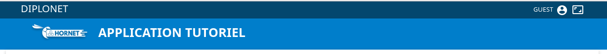

# Le composant HeaderPage

Manuel d'utilisation du Header Hornet.

## Description

Le composant `HeaderPage` est un composant conteneur venant positionner une div avec un identifiant header-container dans laquelle les éléments enfants sont rendus.



## Utilisation

On vient positionner le code HTML et les composants à l'intérieur du composant <Header>
 
```javascript
import { HeaderPage } from "hornet-js-react-components/src/widget/header/header";

<HeaderPage>
    <div id="header">
        <div className="inside" style={{maxWidth : size}}>
            <div className="fl">
                <a className="header-link"
                   title={this.i18n("application.headerTitleText")}
                   href={this.state.headerTitleUrl}>{this.i18n("application.headerTitle")}</a>
            </div>
            <div className="fr" style={{display: "inline-flex"}}>
                <User />
                <LayoutSwitcher />
            </div>
        </div>
    </div>
    <div id="banner">
        <div role="banner" className="inside" style={{maxWidth : size}}>
            <div className="fl menu-main-conteneur ">
                <Menu showIconInfo={true}/>
            </div>
            <div className="fl w10 mls">
                <a className="sub-header-link" href={this.genUrl(Utils.config.getOrDefault("welcomePage", "/"))} title={title}
                   id="img-logo">
                    
                </a>
            </div>
            <div className="fl mls">
                <a className="sub-header-link" href={this.genUrl(Utils.config.getOrDefault("welcomePage", "/"))} title={title}>
                    <h1 id="app-title">{this.i18n("applicationTitle")}</h1>
                </a>
            </div>
        </div>
    </div>
</HeaderPage>
```

Le composant `top-button` utilise le header pour détecter quand s'afficher ou non.

Les attributs du composant `HeaderPage` :

| attribut | obligatoire | description |
| -------- | ----------- | ----------- |
| scrollHeight | |  Hauteur en pixel du header |


Les composants du `HeaderPage` étant customisables par l'application, le style associé est présent dans les thèmes de l'application et non dans ceux de hornet.

## Live coding

`Attention: pour le live coding le header doit être entouré d'une div avec l'identifiant "header-exemple"`

```javascript showroom

	return (
        <div id="header-exemple">
            <HeaderPage>
                <User defaultUserLabel="Exemple" id="user-exemple"/>
            </HeaderPage>
        </div>
    );
```