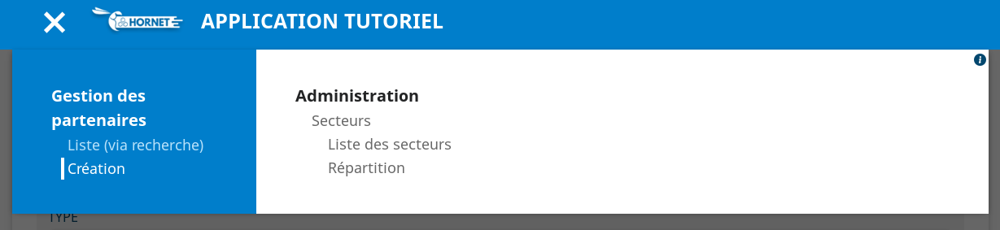
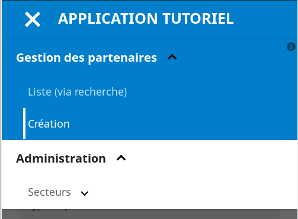
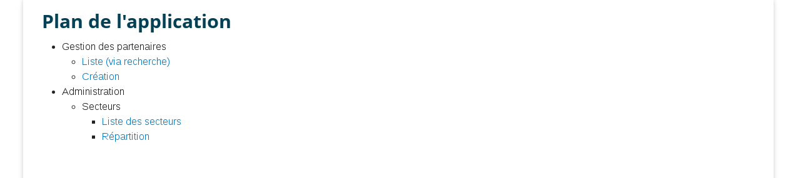
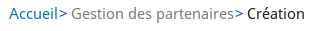

# Les composants de navigation

Ce chapitre décrit les composants de navigation de l'application :

- le menu
- le fil d'Ariane
- le plan du site

Des balises représentant ces éléments génèrent le code html à partir d'une configuration qui contient les données de navigation.

## Principe : navigation.json

Le menu est récupéré par la méthode `getConfigMenu` de la classe `NavigationUtils` renvoyant la configuration des éléments de navigation, issue du fichier navigation.json.


## Configuration des éléments

Des attributs décrivent chaque élément de navigation :

- `id` : Identifiant unique au sein du menu.
- `text` : le libellé de l'élément, ou de préférence la clé de message internationalisé correspondant au libellé.
- `title`: Clé de message internationalisé du texte d'infobulle affiché pour l'élément dans le plan de l'application.
- `url` : route de l'élément de navigation. Ne pas renseigner par exemple pour un élément de menu ayant des sous-menus.(les regexp sont acceptés)
- `visibleDansMenu` true/false : indique si l'élément doit apparaître dans le menu
- `visibleDansPlan` true/false : indique si l'élément doit apparaître dans le plan de l'application
- `submenu` : tableau contenant les éléments fils
- `rolesAutorises` : tableau de nom de rôles. L'utilisateur doit avoir au moins un rôle du tableau pour que l'élément soit visible.

Exemple de fichier de configuration JSON avec deux éléments de menu, dont un contenant un sous-menu :
 
```json
{
  "menu": [
    {
      "text": "navigation.welcome",
      "url": "/accueil",
      "visibleDansMenu": true,
      "visibleDansPlan": true
    },
    {
      "text": "navigation.partenaire.gestionDesPartenaires",
      "visibleDansMenu": true,
      "rolesAutorises": [
        "AppliTuto_USER",
        "AppliTuto_ADMIN"
      ],
      "submenu": [
        {
          "text": "navigation.partenaire.listeViaRecherche",
          "title": "navigation.partenaire.listeViaRecherche",
          "url": "/partenaires",
          "visibleDansMenu": true,
          "visibleDansPlan": true,
          "rolesAutorises": [
            "AppliTuto_USER",
            "AppliTuto_ADMIN"
          ],
          "submenu": [
              {
                "text": "navigation.partenaire.fichePartenaire",
                "url": "/partenaires/consulter/(\\d+)",
                "visibleDansMenu": false,
                "visibleDansPlan": false,
                "rolesAutorises": [
                  "APPLI_TUTO_USER",
                  "APPLI_TUTO_ADMIN"
                ]
              }
          ],
        }
    }
}
```

## Menu

### Principes

Le composant `Menu` parse le flux JSON retourné par la méthode `getConfigMenu` de la classe `NavigationUtils`.

Il génère des balises `ul` et `li` qui seront affichées ou cachées selon des sélecteurs CSS.

Note : si une entrée est masquée, par exemple lorsque l'utilisateur connecté n'a pas les droits suffisants sur une rubrique, toutes ses sous-entrées sont automatiquement masquées.

### Aperçu





### Utilisation

```javascript

import {Menu} from "hornet-js-react-components/src/widget/navigation/menu";

render(): JSX.Element {
    <div>
        <Menu showIconInfo={true}/>
    </div>
}

```

Descriptif des attributs du menu :

| Attribut            | Description                                                           | Obligatoire | Valeur par défaut | Type        |
| ------------------- | --------------------------------------------------------------------- |------------ | ----------------- | ----------- |
| closeOnClickOutside | Indique si le menu doit se fermer lors d'un clic en dehors de la zone | &nbsp;      | true              | boolean     |
| closeOnLinkClick    | Indique si le menu doit se fermer lors d'un clic sur un lien          | &nbsp;      | true              | boolean     |
| closeOnTabOutside   | Indique si le menu doit se fermer lors d'une tabulation en dehors de celui-ci | &nbsp; | true           | boolean     |
| configMenu          | Surcharge de la configuration du menu                                 | &nbsp;      | &nbsp;            | array[MenuItemConfig] |
| dataPassThru        | Indique si les liens ne passent pas par le routeur                    | &nbsp;      | &nbsp;            | boolean     |
| onToggleClick       | Fonction appelée lors du clic sur le toggle du menu                   | &nbsp;      | &nbsp;            | Function    |
| showIconInfo        | Affichage du bouton d'accessibilité                                   | &nbsp;      | &nbsp;            | boolean     |
| vertical            | Affichage du menu de façon verticale                                  | &nbsp;      | &nbsp;            | boolean     |
| workingZoneWidth    | Largeur maximale de la zone de travail en pixel. Utilisé par le composant LayoutSwitcher pour agrandir ou rétrécir la zone de travail | &nbsp; | &nbsp; | string |

### Personnalisation du style

Pour pouvoir personnaliser le menu, des ids sont générés et les sous menu possèdent une classe de la forme suivante:
"menu-" + propriété text présente dans le menu, où les caractères `.` ont été remplacés par des `-`.

Exemple:
```javascript
{
  "text": "navigation.welcome",
  "url": "/accueil",
  "visibleDansMenu": false,
  "visibleDansPlan": true,
  submenu:[
    ...
  ]
}
```

la classe de la balise ul contenant les sous-menu sera: "menu-navigation-welcome"

## Plan de l'application

### Principe

Le composant `Plan` parse le flux JSON retourné par la méthode `getConfigMenu`.

Il génère le code HTML décrivant les pages de l'application.

Note: Si une entrée est masquée, car l'utilisateur actuel n'a pas les droits suffisants, toutes ses sous-entrées sont automatiquement masquées.

### Aperçu



### Utilisation

```javascript
import { Plan } from "hornet-js-react-components/src/widget/navigation/plan";

render(): JSX.Element {
    <div>
        <Plan/>
    </div>
}
```

## Fil d'Ariane

### Principes

Le composant `BreadCrumb` met à jour son affichage selon la page courante. Il se base sur la configuration de la navigation pour déterminer la place de la page courante dans la hiérarchie des éléments de navigation.

### Aperçu



### Utilisation

```javascript
import { BreadCrumb } from "hornet-js-react-components/src/widget/navigation/bread-crumb";

render(): JSX.Element {
    <div>
        <BreadCrumb/>
    </div>
}
```

## Live coding

```javascript showroom

    /* configuration personnalisée du menu */
    let configMenu=[
      {
        "text": "Navigation 1",
        "title": "Navigation 1",
        "url": "#",
        "visibleDansMenu": true,
        "visibleDansPlan": true,
        "submenu": [
            {"text": "Sous Navigation 1",
            "title": "Sous Navigation 1",
            "url": "#",
            "visibleDansMenu": true,
            "visibleDansPlan": true},
             {"text": "Sous Navigation 2",
                "title": "Sous Navigation 2",
                "url": "#",
                "visibleDansMenu": true,
                "visibleDansPlan": true},
        ]
      },
        {
        "text": "Navigation 2",
        "title": "Navigation 2",
        "url": "#",
        "visibleDansMenu": true,
        "visibleDansPlan": true
      }
    ]

    return (
        <Menu showIconInfo={true} configMenu={configMenu}/>
    );

```